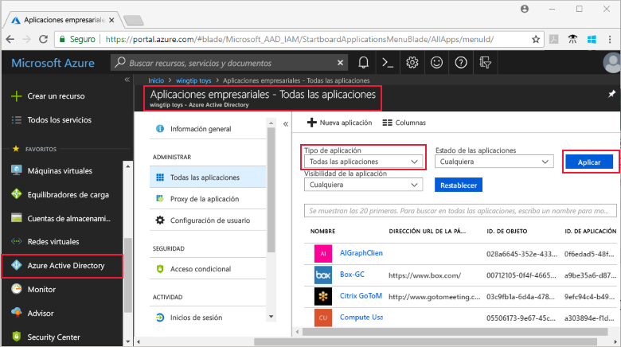

# Visualización de las aplicaciones del inquilino de Azure Active Directory

Esta guía de inicio rápido utiliza Azure Portal para visualizar las aplicaciones del inquilino de Azure Active Directory (Azure AD).

## Antes de empezar

Para ver los resultados, debe tener al menos una aplicación en su inquilino de Azure AD. Para agregar una aplicación, consulte la guía de inicio rápido [Adición de una aplicación](add-application-portal.md).

Inicie sesión en [Azure Portal](https://portal.azure.com) como administrador global del inquilino de Azure AD, administrador de aplicaciones en la nube o administrador de aplicaciones.

## Búsqueda de la lista de aplicaciones del inquilino

Las aplicaciones del inquilino de Azure AD están visibles en la sección **Aplicaciones empresariales** de Azure Portal.

Para buscar las aplicaciones del inquilino:

1. En el panel de navegación izquierdo de **[Azure Portal](https://portal.azure.com)**, haga clic en **Azure Active Directory**. 

2. En la hoja Azure Active Directory, haga clic en **Aplicaciones empresariales**. 

3. Desde el menú desplegable **Tipo de aplicación**, seleccione **Todas las aplicaciones** y haga clic en **Aplicar**. Aparece una muestra aleatoria de las aplicaciones del inquilino.

    
   
4. Para ver más aplicaciones, haga clic en **Mostrar más** en la parte inferior de la lista. En función del número de aplicaciones del inquilino, puede resultar más fácil [buscar una aplicación específica](#search-for-a-tenant-application) en lugar de desplazarse por la lista.

## Selección de las opciones de visualización

En esta sección, seleccione las opciones según lo que esté buscando.

1. Puede ver las aplicaciones en función del **Tipo de aplicación**, **Estado de la aplicación** y **Visibilidad de la aplicación**. 

    

2. En **Tipo de aplicación**, elija una de estas opciones:

    - **Aplicaciones empresariales** muestra las aplicaciones que no son de Microsoft.
    - **Aplicaciones de Microsoft** muestra las aplicaciones de Microsoft.
    - **Todas las aplicaciones** muestra las aplicaciones de Microsoft y las que no son de Microsoft.

3. En **Estado de la aplicación**, elija **Cualquiera**, **Deshabilitada** o **Habilitada**. La opción **Cualquiera** incluye tanto aplicaciones habilitadas como deshabilitadas.

4. En **Visibilidad de la aplicación**, elija **Cualquiera** u **Oculta**. La opción **Oculta** muestra las aplicaciones que están en el inquilino pero no son visibles para los usuarios.

5. Después de elegir las opciones que desee, haga clic en **Aplicar**.
 

## Búsqueda de una aplicación del inquilino

Para buscar una aplicación determinada:

1. En el menú **Tipo de aplicación**, seleccione **Todas las aplicaciones** y haga clic en **Aplicar**.

2. Escriba el nombre de la aplicación que desea buscar. Si la aplicación se ha agregado al inquilino de Azure AD, aparecerá en los resultados de la búsqueda. En este ejemplo, se muestra que GitHub no se ha agregado a las aplicaciones del inquilino.

    

3. Pruebe a escribir las primeras letras del nombre de una aplicación.  En este ejemplo se muestran todas las aplicaciones que empiezan por **Sales**.

    

## Pasos siguientes

En esta guía de inicio rápido, ha aprendido cómo visualizar las aplicaciones del inquilino de Azure AD y cómo filtrar la lista de aplicaciones por tipo de aplicación, estado y visibilidad. También ha aprendido cómo buscar una aplicación determinada.

Ahora que ha encontrado la aplicación que estaba buscando, puede seguir [agregando más aplicaciones al inquilino](add-application-portal.md) o puede hacer clic en la aplicación para ver o editar sus propiedades y opciones de configuración. Por ejemplo, podría configurar el inicio de sesión único. 

> [!div class="nextstepaction"]
> [Configuración del inicio de sesión único](configure-single-sign-on-portal.md)

