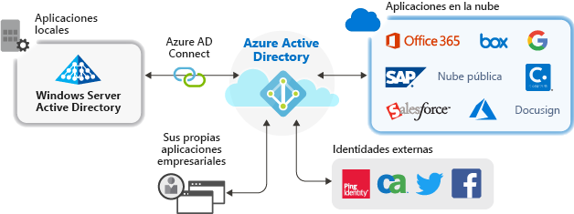

# Administración de aplicaciones con Azure Active Directory

Azure Active Directory (Azure AD) simplifica la manera de administrar las aplicaciones al proporcionar un único sistema de identidad para las aplicaciones en la nube y en el entorno local. Puede agregar a Azure AD las aplicaciones de software como servicio (SaaS), aplicaciones locales y aplicaciones de línea de negocio (LOB). Después, los usuarios inician sesión una vez para acceder de forma segura y sin problemas a estas aplicaciones, junto con Office 365 y otras aplicaciones empresariales de Microsoft. Puede reducir los costos administrativos gracias a la [automatización del aprovisionamiento de usuarios](../app-provisioning/user-provisioning.md). También puede utilizar la autenticación multifactor y las directivas de acceso condicional para proporcionar un acceso seguro a las aplicaciones.

## ¿Por qué administrar aplicaciones con una solución en la nube?

Las organizaciones suelen tener cientos de aplicaciones de las que los usuarios dependen para poder realizar su trabajo. Los usuarios acceden a estas aplicaciones desde muchos dispositivos y ubicaciones. Cada día se agregan, desarrollan y retiran nuevas aplicaciones. Con tantas aplicaciones y puntos de acceso, es más importante que nunca usar una solución basada en la nube para administrar el acceso de los usuarios a todas las aplicaciones.

## ¿Qué tipos de aplicaciones puedo integrar con Azure AD?

Hay cuatro tipos principales de aplicaciones que se pueden agregar a las **aplicaciones empresariales** y administrar con Azure AD:

- **Aplicaciones de la galería de Azure AD**: Azure AD tiene una galería que contiene miles de aplicaciones que se han integrado previamente para el inicio de sesión único con Azure AD. Algunas de las aplicaciones que su organización usa probablemente estén en la galería. [Aprenda sobre cómo planear la integración de la aplicación](plan-an-application-integration.md) u obtenga pasos detallados de la integración para aplicaciones individuales en los [tutoriales de aplicaciones SaaS](https://docs.microsoft.com/azure/active-directory/saas-apps/).

- **Aplicaciones locales con Application Proxy**: con Azure AD Application Proxy, puede integrar las aplicaciones web locales con Azure AD para admitir el inicio de sesión único. Después, los usuarios finales pueden tener acceso a las aplicaciones web locales del mismo modo que tienen acceso a Office 365 y otras aplicaciones SaaS. [Aprenda por qué usar Application Proxy y cómo funciona](what-is-application-proxy.md).

- **Aplicaciones desarrolladas a medida**: al crear sus propias aplicaciones de línea de negocio, puede integrarlas con Azure AD para admitir el inicio de sesión único. Al registrar la aplicación con Azure AD, tendrá el control de la directiva de autenticación de dicha aplicación. Para más información, consulte las [instrucciones para desarrolladores](developer-guidance-for-integrating-applications.md).

- **Aplicaciones que no son de la galería**: traiga sus propias aplicaciones. Admita el inicio de sesión único para otras aplicaciones agregándolas a Azure AD. Puede integrar cualquier vínculo web que quiera, o cualquier aplicación que represente un campo de nombre de usuario y contraseña, admita los protocolos SAML u OpenID Connect, o admita SCIM. Para más información, consulte [Configuración del inicio de sesión único para aplicaciones que no sean de la galería](configure-single-sign-on-non-gallery-applications.md).

## Administración de riesgos con directivas de acceso condicional

El acoplamiento del inicio de sesión único (SSO) de Azure AD con [acceso condicional](https://docs.microsoft.com/azure/active-directory/conditional-access/overview) ofrece niveles altos de seguridad para acceder a las aplicaciones. Las funcionalidades de seguridad incluyen la protección de identidad en la nube, el control de acceso basado en riesgos, la autenticación multifactor nativa y las directivas de acceso condicional. Estas funcionalidades admiten directivas de control detalladas basadas en aplicaciones o en grupos que necesitan niveles más altos de seguridad.

## Mejora de la seguridad con el inicio de sesión único

Habilitar el inicio de sesión único (SSO) en las aplicaciones y Office 365 ofrece una experiencia de inicio de sesión superior para los usuarios existentes con la reducción o eliminación de mensajes de inicio de sesión. El entorno del usuario será más coherente y menos confuso sin tantos mensajes o sin la necesidad de administrar varias contraseñas. El grupo de negocios puede administrar y aprobar el acceso mediante una pertenencia dinámica y de autoservicio. Permitir que las personas correctas de la empresa administren el acceso a una aplicación mejora la seguridad del sistema de identidades.

El inicio de sesión único mejora la seguridad. *Sin el inicio de sesión único*, los administradores necesitan crear y actualizar cuentas de usuario para cada aplicación individual, lo que requiere tiempo. Además, los usuarios deben realizar un seguimiento de varias credenciales para acceder a sus aplicaciones. Como resultado, los usuarios tienden a anotar las contraseñas o usar otras soluciones de administración de contraseñas que presentan riesgos para la seguridad de los datos. [Obtenga más información sobre el inicio de sesión único](what-is-single-sign-on.md).

## Abordar la gobernanza y el cumplimiento

Con Azure AD, puede supervisar los inicios de sesión en la aplicación mediante informes que usan herramientas de supervisión de eventos e incidentes de seguridad (SIEM). Puede acceder a los informes desde el portal o con las API. Audite mediante programación quién accede a sus aplicaciones y retire el acceso a usuarios inactivos mediante revisiones de acceso.

## Administrar costos

Al migrar a Azure AD, puede ahorrar costos y las molestias de administrar la infraestructura local. Azure AD también proporciona acceso de autoservicio a las aplicaciones, lo que ahorra tiempo para los administradores y usuarios. El inicio de sesión único elimina las contraseñas específicas de aplicaciones. Esta posibilidad de iniciar sesión solo una vez ahorra costos relacionados con el restablecimiento de contraseñas para las aplicaciones y la pérdida de productividad al recuperar estas.

## Pasos siguientes

- [¿Qué es Application Proxy?](what-is-application-proxy.md)
- [Inicio rápido: Adición de una aplicación de la galería a su inquilino de Azure AD](add-application-portal.md)
