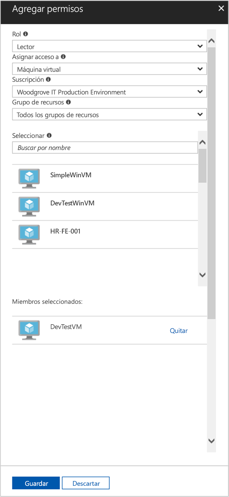

# <a name="use-a-linux-vm-system-assigned-managed-identity-to-access-azure-resource-manager"></a>Uso de las identidades administradas asignadas por el sistema de una máquina virtual Linux para acceder a Azure Resource Manager

[!INCLUDE [preview-notice](../../../includes/active-directory-msi-preview-notice.md)]

En esta guía de inicio rápido, se muestra cómo usar una identidad asignada por el sistema para que una máquina virtual Linux acceda a la API de Azure Resource Manager. Azure administra automáticamente Managed Identities for Azure Resources, que le permiten autenticar los servicios que admiten la autenticación de Azure AD sin necesidad de insertar credenciales en el código. Aprenderá a:

> [!div class="checklist"]
> * Concesión a una máquina virtual de acceso a un grupo de recursos en Azure Resource Manager 
> * Obtención de un token de acceso mediante la identidad de máquina virtual y su uso para llamar a Azure Resource Manager 

## <a name="prerequisites"></a>Requisitos previos

[!INCLUDE [msi-tut-prereqs](../../../includes/active-directory-msi-tut-prereqs.md)]

## <a name="grant-your-vm-access-to-a-resource-group-in-azure-resource-manager"></a>Concesión a una máquina virtual de acceso a un grupo de recursos en Azure Resource Manager 

Mediante Managed Identities for Azure Resources, el código puede obtener tokens de acceso para autenticarse en aquellos recursos que admitan la autenticación de Azure AD. La API de Azure Resource Manager es compatible con la autenticación de Azure AD. En primer lugar, es necesario conceder acceso a la identidad de esta máquina virtual a un recurso en Azure Resource Manager, en este caso, el grupo de recursos que contiene la máquina virtual.  

1. Vaya a la pestaña de **Grupos de recursos**.
2. Seleccione el **grupo de recursos** concreto que creó anteriormente.
3. Vaya a **Control de acceso (IAM)** en el panel izquierdo.
4. Haga clic para **Agregar** una nueva asignación de roles para la máquina virtual. En **Rol**, elija **Lector**.
5. En la lista desplegable siguiente, **Asigne acceso** al recurso **Máquina Virtual**.
6. A continuación, asegúrese de que la suscripción adecuada aparece en la lista desplegable **Suscripción**. Y en **Grupo de recursos**, seleccione **Todos los grupos de recursos**.
7. Por último, en **Seleccionar**, elija la máquina virtual Linux en la lista desplegable y haga clic en **Guardar**.

    

## <a name="get-an-access-token-using-the-vms-system-assigned-managed-identity-and-use-it-to-call-resource-manager"></a>Obtención de un token de acceso mediante una identidad administrada asignada por el sistema de la máquina virtual y su uso para llamar a Resource Manager 

Para completar estos pasos, necesitará un cliente SSH. Si usa Windows, puede usar el cliente SSH en el [Subsistema de Windows para Linux](https://msdn.microsoft.com/commandline/wsl/about). Si necesita ayuda para configurar las claves del cliente de SSH, consulte [Uso de SSH con Windows en Azure](../../virtual-machines/linux/ssh-from-windows.md) o [Creación y uso de un par de claves SSH pública y privada para máquinas virtuales Linux en Azure](../../virtual-machines/linux/mac-create-ssh-keys.md).

1. En el portal, vaya a la máquina virtual Linux y, en **Información general**, haga clic en **Conectar**.  
2. **Conéctese** a la máquina virtual con el cliente SSH que elija. 
3. En la ventana del terminal, use `curl` para realizar una solicitud al punto de conexión local de Managed Identities for Azure Resources para obtener un token de acceso para Azure Resource Manager.  
 
    La solicitud de `curl` para el token de acceso está a continuación.  
    
    ```bash
    curl 'http://169.254.169.254/metadata/identity/oauth2/token?api-version=2018-02-01&resource=https://management.azure.com/' -H Metadata:true   
    ```
    
    > [!NOTE]
    > El valor del parámetro "resource" (parámetro) debe coincidir exactamente con el que Azure AD espera.  En el caso del identificador de recurso de Resource Manager, debe incluir la barra diagonal final en el URI. 
    
    La respuesta incluye el token de acceso que necesita para acceder a Azure Resource Manager. 
    
    Respuesta:  

    ```bash
    {"access_token":"eyJ0eXAiOi...",
    "refresh_token":"",
    "expires_in":"3599",
    "expires_on":"1504130527",
    "not_before":"1504126627",
    "resource":"https://management.azure.com",
    "token_type":"Bearer"} 
    ```
    
    Puede usar este token de acceso para acceder a Azure Resource Manager, por ejemplo, para leer los detalles del grupo de recursos al que previamente concedió acceso a la máquina virtual. Reemplace los valores de \<Identificador de suscripción\>, \<Grupo de recursos\> y \<Token de acceso\> por los que ha creado anteriormente. 
    
    > [!NOTE]
    > La dirección URL distingue mayúsculas de minúsculas, por lo tanto, asegúrese de que usa las mismas mayúsculas y minúsculas que al asignar el nombre al grupo de recursos, así como la "G" mayúscula de "resourceGroups".  
    
    ```bash 
    curl https://management.azure.com/subscriptions/<SUBSCRIPTION ID>/resourceGroups/<RESOURCE GROUP>?api-version=2016-09-01 -H "Authorization: Bearer <ACCESS TOKEN>" 
    ```
    
    La respuesta devuelta con la información específica del grupo de recursos:    
    ```bash
    {"id":"/subscriptions/98f51385-2edc-4b79-bed9-7718de4cb861/resourceGroups/DevTest","name":"DevTest","location":"westus","properties":{"provisioningState":"Succeeded"}} 
    ```

## <a name="next-steps"></a>Pasos siguientes

En esta guía de inicio rápido, ha aprendido a usar una identidad administrada asignada por el sistema para acceder a la API de Azure Resource Manager.  Para obtener más información sobre Azure Resource Manager, vea:

> [!div class="nextstepaction"]
>[Azure Resource Manager](/azure/azure-resource-manager/resource-group-overview)
