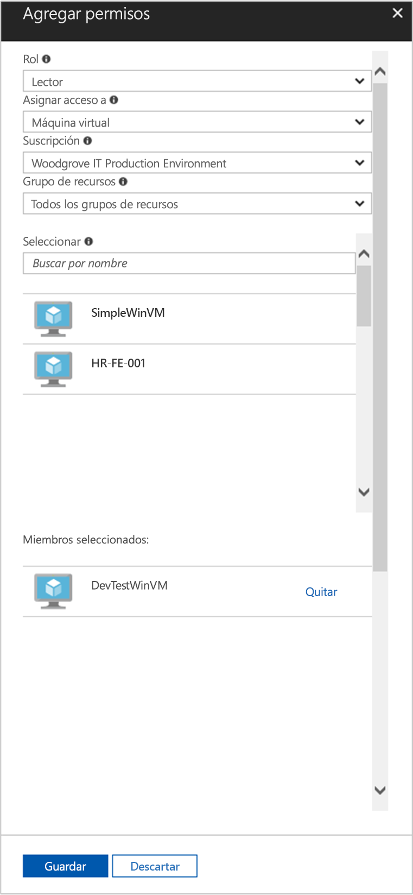

# <a name="use-a-windows-vm-system-assigned-managed-identity-to-access-resource-manager"></a>Uso de las identidades administradas asignadas por el sistema de una máquina virtual Windows para acceder a Resource Manager

[!INCLUDE [preview-notice](../../../includes/active-directory-msi-preview-notice.md)]

En esta guía de inicio rápido, se muestra cómo acceder a la API de Azure Resource Manager mediante una máquina virtual Windows con una identidad administrada habilitada asignada por el sistema. Azure administra automáticamente Managed Identities for Azure Resources, que le permiten autenticar los servicios que admiten la autenticación de Azure AD sin necesidad de insertar credenciales en el código. Aprenderá a:

> [!div class="checklist"] 
> * Concesión a una máquina virtual de acceso a un grupo de recursos en Azure Resource Manager 
> * Obtención de un token de acceso mediante la identidad de máquina virtual y su uso para llamar a Azure Resource Manager

## <a name="prerequisites"></a>Requisitos previos

[!INCLUDE [msi-tut-prereqs](../../../includes/active-directory-msi-tut-prereqs.md)]

## <a name="grant-your-vm-access-to-a-resource-group-in-resource-manager"></a>Concesión de acceso a la máquina virtual a un grupo de recursos en Resource Manager
Mediante Managed Identities for Azure Resources, el código puede obtener tokens de acceso para autenticarse en aquellos recursos que admitan la autenticación de Azure AD.  Azure Resource Manager admite la autenticación de Azure AD.  En primer lugar, es necesario conceder acceso a la identidad administrada asignada por el sistema de esta máquina virtual a un recurso de Resource Manager, en este caso, al grupo de recursos que contiene la máquina virtual.  

1.  Vaya a la pestaña de **Grupos de recursos**. 
2.  Seleccione el **grupo de recursos** específico que creó para su **máquina virtual Windows**. 
3.  Vaya a **Control de acceso (IAM)** en el panel izquierdo. 
4.  A continuación, **agregue** una nueva asignación de rol para su **máquina virtual Windows**.  En **Rol**, elija **Lector**. 
5.  En la lista desplegable siguiente, **asigne acceso** al recurso **Máquina virtual**. 
6.  A continuación, asegúrese de que la suscripción adecuada aparece en la lista desplegable **Suscripción**. Y en **Grupo de recursos**, seleccione **Todos los grupos de recursos**. 
7.  Por último, en **Seleccionar**, elija la máquina virtual Windows en la lista desplegable y haga clic en **Guardar**.

    

## <a name="get-an-access-token-using-the-vms-system-assigned-managed-identity-and-use-it-to-call-azure-resource-manager"></a>Obtención de un token de acceso mediante una identidad administrada asignada por el sistema de la máquina virtual y su uso para llamar a Azure Resource Manager 

Deberá usar **PowerShell** en esta parte.  Si no tiene **PowerShell** instalado, descárguelo [aquí](https://docs.microsoft.com/powershell/azure/overview). 

1.  En el portal, vaya a **Virtual Machines** y diríjase a la máquina virtual Windows. A continuación, en **Introducción**, haga clic en **Conectar**. 
2.  Escriba su **nombre de usuario** y **contraseña** que agregó cuando creó la máquina virtual Windows. 
3.  Ahora que ha creado una **conexión a Escritorio remoto** con la máquina virtual, abra **PowerShell** en la sesión remota. 
4.  Mediante el cmdlet Invoke-WebRequest, realice una solicitud al punto de conexión local de la identidad administrada de recursos de Azure y obtenga un token de acceso para Azure Resource Manager.

    ```powershell
       $response = Invoke-WebRequest -Uri 'http://169.254.169.254/metadata/identity/oauth2/token?api-version=2018-02-01&resource=https://management.azure.com/' -Method GET -Headers @{Metadata="true"}
    ```
    
    > [!NOTE]
    > El valor del parámetro "resource" debe coincidir exactamente con el que Azure AD espera. Al usar el id. de recurso de Azure Resource Manager, debe incluir la barra diagonal final en el URI.
    
    A continuación, extraiga la respuesta completa, que se almacena como una cadena con formato de notación de objetos JavaScript (JSON) en el objeto $response. 
    
    ```powershell
    $content = $response.Content | ConvertFrom-Json
    ```
    Luego, extraiga el token de acceso de la respuesta.
    
    ```powershell
    $ArmToken = $content.access_token
    ```
    
    Por último, llame a Azure Resource Manager mediante el token de acceso. En este ejemplo, también se usará el cmdlet Invoke-WebRequest para realizar la llamada a Azure Resource Manager y se incluirá el token de acceso en el encabezado de autorización.
    
    ```powershell
    (Invoke-WebRequest -Uri https://management.azure.com/subscriptions/<SUBSCRIPTION ID>/resourceGroups/<RESOURCE GROUP>?api-version=2016-06-01 -Method GET -ContentType "application/json" -Headers @{ Authorization ="Bearer $ArmToken"}).content
    ```
    > [!NOTE] 
    > La dirección URL distingue mayúsculas de minúsculas, por lo tanto, asegúrese de que usa las mismas mayúsculas y minúsculas que al asignar el nombre al grupo de recursos, así como la "G" mayúscula de "resourceGroups".
        
    El siguiente comando devuelve los detalles del grupo de recursos:

    ```powershell
    {"id":"/subscriptions/98f51385-2edc-4b79-bed9-7718de4cb861/resourceGroups/DevTest","name":"DevTest","location":"westus","properties":{"provisioningState":"Succeeded"}}
    ```

## <a name="next-steps"></a>Pasos siguientes

En esta guía de inicio rápido, ha aprendido a usar una identidad administrada asignada por el sistema para acceder a la API de Azure Resource Manager.  Para obtener más información sobre Azure Resource Manager, vea:

> [!div class="nextstepaction"]
>[Azure Resource Manager](/azure/azure-resource-manager/resource-group-overview)

