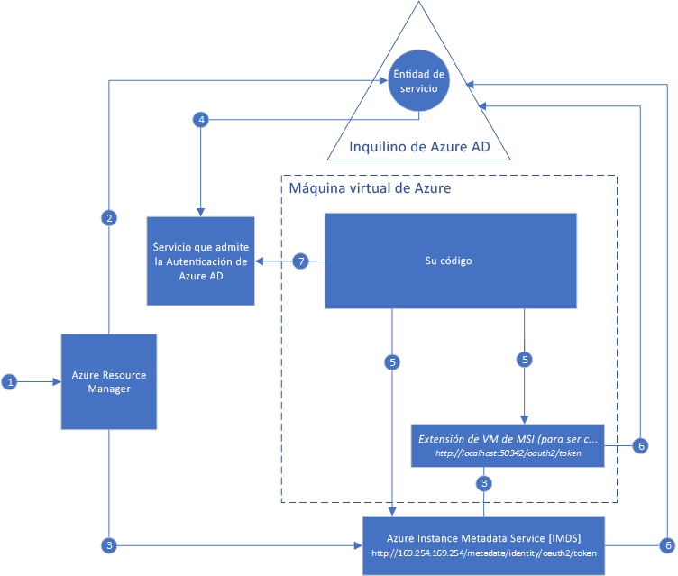

# ¿Qué es Managed Service Identity para recursos de Azure?

[!INCLUDE[preview-notice](../../../includes/active-directory-msi-preview-notice.md)]

Un desafío común al compilar aplicaciones en la nube consiste en el modo de administrar las credenciales del código para autenticar los servicios en la nube. Proteger las credenciales es una tarea esencial. Lo ideal sería que nunca aparecieran en las estaciones de trabajo de los desarrolladores y que no se controlaran en el código fuente. Azure Key Vault proporciona una manera segura de almacenar credenciales, secretos y otras claves pero el código tiene que autenticarse en Key Vault para recuperarlos. 

La característica Managed Service Identity de Azure Active Directory (Azure AD) soluciona este problema. Esta característica proporciona a los servicios de Azure una identidad de sistema administrada automáticamente en Azure AD. Puede usar esta identidad para autenticarse en cualquier servicio que admita la autenticación de Azure AD, incluido Key Vault, sin necesidad de credenciales en el código.

La característica Managed Service Identity viene gratis con Azure AD para suscripciones de Azure. No hay ningún costo adicional.

## ¿Cómo funciona la característica?

Hay dos tipos de identidades administradas:

- Una **identidad asignada por el sistema** se habilita directamente en una instancia de servicio de Azure. Cuando se habilita la identidad, Azure crea una identidad para la instancia del servicio en el inquilino de Azure AD de confianza de la suscripción de la instancia. Una vez creada la identidad, las credenciales se aprovisionan en la instancia. El ciclo de vida de una identidad asignada por el sistema está vinculado directamente a la instancia de servicio de Azure en que está habilitada. Si se elimina la instancia, Azure limpia automáticamente las credenciales y la identidad en Azure AD.
- Se crea una **identidad asignada por el usuario** como recurso de Azure independiente. Mediante un proceso de creación, Azure crea una identidad en el inquilino de Azure AD de confianza para la suscripción que se utiliza. Una vez creada la identidad, esta puede asignarse a una o varias instancias de servicio de Azure. El ciclo de vida de una identidad asignada por el usuario se administra por separado del ciclo de vida de las instancias de servicio de Azure a las que se asigna.

El código puede usar una identidad de servicio administrada para solicitar los tokens de acceso de los servicios que admiten la autenticación de Azure AD. Azure se encarga de rotar las credenciales que usa la instancia del servicio.

En el diagrama siguiente se muestra cómo funcionan las identidades de servicio administradas con máquinas virtuales (VM) de Azure:

### Funcionamiento de una identidad asignada por el sistema con una máquina virtual de Azure

1. Azure Resource Manager recibe una solicitud para habilitar la identidad asignada por el sistema en una máquina virtual.
2. Entonces crea una entidad de servicio en Azure AD para la identidad de la máquina virtual. La entidad de servicio se crea en el inquilino de Azure AD que sea de confianza para la suscripción.
3. Azure Resource Manager configura la identidad en la máquina virtual:
    1. Actualiza el punto de conexión de la identidad de Azure Instance Metadata Service con el identificador de cliente de la entidad de servicio y el certificado.
    1. Aprovisiona la extensión de máquina virtual y agrega el identificador de cliente de la entidad de servicio y el certificado. (Está previsto que este paso se ponga en desuso).
4. Ahora que la máquina virtual tiene una identidad, se usa la información de la entidad de servicio para conceder a la máquina virtual acceso a los recursos de Azure. Para llamar a Azure Resource Manager, use el control de acceso basado en rol (RBAC) de Azure AD para asignar el rol apropiado a la entidad de servicio de la máquina virtual. Para llamar a Key Vault, conceda a su código acceso al secreto o a la clave específicos en Key Vault.
5. El código que se ejecuta en la máquina virtual puede solicitar un token en dos puntos de conexión que solo son accesibles desde la máquina virtual:

    - Punto de conexión de la identidad de Azure Instance Metadata Service (recomendado): `http://169.254.169.254/metadata/identity/oauth2/token`
        - El parámetro del recurso especifica el servicio al que se va a enviar el token. Para autenticarse en Azure Resource Manager, use `resource=https://management.azure.com/`.
        - El parámetro de versión de API especifica la versión de IMDS, use api-version=2018-02-01 o posterior.
    - Punto de conexión de la extensión de máquina virtual (caerá en desuso): `http://localhost:50342/oauth2/token` 
        - El parámetro del recurso especifica el servicio al que se va a enviar el token. Para autenticarse en Azure Resource Manager, use `resource=https://management.azure.com/`.

6. Se realiza una llamada a Azure AD para solicitar un token de acceso, tal y como se especifica en el paso 5, con el identificador de cliente y el certificado configurado en el paso 3. Azure AD devuelve un token de acceso JSON Web Token (JWT).
7. El código envía el token de acceso en una llamada a un servicio que admite la autenticación de Azure AD.

### Funcionamiento de una identidad asignada por el usuario con una máquina virtual de Azure

1. Azure Resource Manager recibe una solicitud para crear una identidad asignada por el usuario.
2. Luego crea una entidad de servicio en Azure AD para la identidad asignada por el usuario. La entidad de servicio se crea en el inquilino de Azure AD que sea de confianza para la suscripción.
3. Azure Resource Manager recibe una solicitud para configurar la identidad asignada por el usuario en una máquina virtual:
    1. Actualiza el punto de conexión de la identidad de Azure Instance Metadata Service con el identificador de cliente de la entidad de servicio asignada por el usuario y el certificado.
    1. Aprovisiona la extensión de máquina virtual y agrega el identificador de cliente de la entidad de servicio de la identidad asignada por el usuario y el certificado. (Está previsto que este paso se ponga en desuso).
4. Una vez que se ha creado la identidad asignada por el usuario, se usa la información de la entidad de servicio para conceder acceso a la identidad a los recursos de Azure. Para llamar a Azure Resource Manager, use el control de acceso basado en rol (RBAC) de Azure AD para asignar el rol apropiado a la entidad de servicio de la identidad asignada por el usuario. Para llamar a Key Vault, conceda a su código acceso al secreto o a la clave específicos en Key Vault.

   > [!Note]
   > También puede realizar este paso antes del paso 3.

5. El código que se ejecuta en la máquina virtual puede solicitar un token en dos puntos de conexión que solo son accesibles desde la máquina virtual:

    - Punto de conexión de la identidad de Azure Instance Metadata Service (recomendado): `http://169.254.169.254/metadata/identity/oauth2/token`
        - El parámetro del recurso especifica el servicio al que se va a enviar el token. Para autenticarse en Azure Resource Manager, use `resource=https://management.azure.com/`.
        - El parámetro de identificador de cliente especifica la identidad para la que se solicita el token. Este valor es necesario para eliminar la ambigüedad cuando más de una de las identidades asignadas por el usuario están en una sola máquina virtual.
        - El parámetro de versión de API especifica la versión de Azure Instance Metadata Service. Use `api-version=2018-02-01` o superior.

    - Punto de conexión de la extensión de máquina virtual (caerá en desuso): `http://localhost:50342/oauth2/token`
        - El parámetro del recurso especifica el servicio al que se va a enviar el token. Para autenticarse en Azure Resource Manager, use `resource=https://management.azure.com/`.
        - El parámetro de identificador de cliente especifica la identidad para la que se solicita el token. Este valor es necesario para eliminar la ambigüedad cuando más de una de las identidades asignadas por el usuario están en una sola máquina virtual.
6. Se realiza una llamada a Azure AD para solicitar un token de acceso, tal y como se especifica en el paso 5, con el identificador de cliente y el certificado configurado en el paso 3. Azure AD devuelve un token de acceso JSON Web Token (JWT).
7. El código envía el token de acceso en una llamada a un servicio que admite la autenticación de Azure AD.

## Uso de las identidades de servicio administradas

Para más información sobre cómo usar las identidades de servicio administradas para acceder a diferentes recursos de Azure, pruebe estos tutoriales.

Aprenda a usar una identidad de Managed Service Identity con una máquina virtual Windows:

* [Acceso a Azure Data Lake Store](tutorial-windows-vm-access-datalake.md)
* [Acceso a Azure Resource Manager](tutorial-windows-vm-access-arm.md)
* [Acceso a Azure SQL](tutorial-windows-vm-access-sql.md)
* [Acceso a Azure Storage mediante una clave de acceso](tutorial-windows-vm-access-storage.md)
* [Acceso a Azure Storage mediante firmas de acceso compartido](tutorial-windows-vm-access-storage-sas.md)
* [Acceso a un recurso que no es de Azure AD con Azure Key Vault](tutorial-windows-vm-access-nonaad.md)

Aprenda a usar una identidad de Managed Service Identity con una máquina virtual Linux:

* [Acceso a Azure Data Lake Store](tutorial-linux-vm-access-datalake.md)
* [Acceso a Azure Resource Manager](tutorial-linux-vm-access-arm.md)
* [Acceso a Azure Storage mediante una clave de acceso](tutorial-linux-vm-access-storage.md)
* [Acceso a Azure Storage mediante firmas de acceso compartido](tutorial-linux-vm-access-storage-sas.md)
* [Acceso a un recurso que no es de Azure AD con Azure Key Vault](tutorial-linux-vm-access-nonaad.md)

Aprenda a usar una identidad de Managed Service Identity con otros servicios de Azure:

* [Azure App Service](/azure/app-service/app-service-managed-service-identity)
* [Azure Functions](/azure/app-service/app-service-managed-service-identity)
* [Azure Service Bus](../../service-bus-messaging/service-bus-managed-service-identity.md)
* [Azure Event Hubs](../../event-hubs/event-hubs-managed-service-identity.md)
* [Azure API Management](../../api-management/api-management-howto-use-managed-service-identity.md)

## ¿Qué servicios de Azure admiten la característica?

Las identidades de Managed Service Identity se pueden usar para autenticarse en servicios que admiten la autenticación de Azure AD. Para obtener una lista de servicios de Azure que admiten la característica de Managed Service Identity, consulte [Servicios que admiten Managed Service Identity](services-support-msi.md).

## Pasos siguientes

Introducción a la característica Managed Service Identity con las guías de inicio rápido siguientes:

* [Uso de la característica Managed Service Identity de una máquina virtual Windows para acceder a Resource Manager](tutorial-windows-vm-access-arm.md)
* [Uso de la característica Managed Service Identity de una máquina virtual Linux para acceder a Resource Manager](tutorial-linux-vm-access-arm.md)
