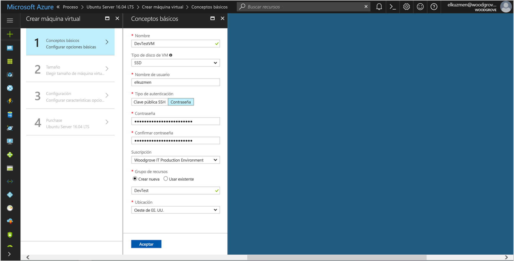

# <a name="tutorial-use-a-linux-vms-managed-identity-to-access-azure-storage"></a>Tutorial: Uso de una identidad administrada en una máquina virtual Linux para acceder a Azure Storage 

[!INCLUDE[preview-notice](../../../includes/active-directory-msi-preview-notice.md)]


Este tutorial muestra cómo crear y usar una identidad administrada en una máquina virtual Linux para acceder a Azure Storage. Aprenderá a:

> [!div class="checklist"]
> * Crear una máquina virtual Linux en un nuevo grupo de recursos
> * Habilitación de una identidad administrada en una máquina virtual Linux
> * Crear un contenedor de blobs en una cuenta de almacenamiento
> * Concesión de acceso a una identidad administrada de una máquina virtual Linux para un contenedor de Azure Storage
> * Obtención de un token de acceso y su uso para llamar a Azure Storage

> [!NOTE]
> La autenticación de Azure Active Directory para Azure Storage está en versión preliminar pública.

## <a name="prerequisites"></a>requisitos previos

Si aún no tiene una cuenta de Azure, [regístrese para una cuenta gratuita](https://azure.microsoft.com) antes de continuar.

[!INCLUDE [msi-tut-prereqs](~/includes/active-directory-msi-tut-prereqs.md)]

Para ejecutar los ejemplos de script de la CLI de este tutorial, tiene dos opciones:

- Use [Azure Cloud Shell](~/articles/cloud-shell/overview.md) desde Azure Portal o mediante el botón **Pruébelo**, situado en la esquina superior derecha de cada bloque de código.
- [Instale la versión más reciente de la CLI 2.0](https://docs.microsoft.com/cli/azure/install-azure-cli) (2.0.23 o posterior), si prefiere usar una consola de la CLI local.

## <a name="sign-in-to-azure"></a>Inicio de sesión en Azure

Inicie sesión en Azure Portal en [https://portal.azure.com](https://portal.azure.com).

## <a name="create-a-linux-virtual-machine-in-a-new-resource-group"></a>Crear una máquina virtual Linux en un nuevo grupo de recursos

En esta sección, creará una máquina virtual Linux a la que más tarde se concederá una identidad administrada.

1. Seleccione el botón **Nuevo** en la esquina superior izquierda de Azure Portal.
2. Seleccione **Compute**y, después, seleccione **Ubuntu Server 16.04 LTS**.
3. Escriba la información de la máquina virtual. En **Tipo de autenticación**, seleccione **Clave pública SSH** o **Contraseña**. Las credenciales creadas le permiten iniciar sesión en la máquina virtual.

   

4. En la lista **Suscripción**, seleccione una suscripción para la máquina virtual.
5. Para seleccionar un nuevo grupo de recursos en el que desea crear la máquina virtual, seleccione **Grupo de recursos** > **Crear nuevo**. Cuando termine, seleccione **Aceptar**.
6. Seleccione el tamaño de la máquina virtual. Para ver más tamaños, seleccione **Ver todo** o cambie el filtro **Supported disk type** (Tipo de disco admitido). En la panel de configuración, mantenga los valores predeterminados y seleccione **Aceptar**.

## <a name="enable-managed-identity-on-your-vm"></a>Habilitación de Managed Identity en la máquina virtual

Una identidad Managed Identity de máquina virtual le permite obtener tokens de acceso desde Azure AD sin la necesidad de incluir credenciales en el código. En un segundo plano, habilitar Managed Identity en una máquina virtual mediante Azure Portal permite hacer dos cosas: registrar la máquina virtual con Azure AD para crear una identidad administrada y configurar la identidad en la máquina virtual.

1. Desplácese hasta el grupo de recursos de la nueva máquina virtual y seleccione la máquina virtual que creó en el paso anterior.
2. En la categoría **Configuración**, haga clic en **Configuración**.
3. Para habilitar Managed Identity, seleccione **Sí**.
4. Haga clic en **Guardar** para aplicar la configuración. 

## <a name="create-a-storage-account"></a>Crear una cuenta de almacenamiento 

En esta sección se creará una cuenta de almacenamiento. 

1. Haga clic en el botón **+Crear un recurso** de la esquina superior izquierda de Azure Portal.
2. Haga clic en **Storage** (Almacenamiento) y, luego, en **Storage account - blob, file, table, queue** (Cuenta de almacenamiento: blob, archivo, tabla, cola).
3. En **Name** (Nombre), escriba un nombre para la cuenta de almacenamiento.  
4. **Deployment model** (Modelo de implementación) y **Account kind** (Clase de cuenta) se deben establecer en **Resource Manager** y **Storage (general purpose v1)** (Almacenamiento [de uso general v1]). 
5. Asegúrese de que **Suscripción** y **Grupo de recursos** coinciden con los que especificó cuando creó la máquina virtual en el paso anterior.
6. Haga clic en **Create**(Crear).

    

## <a name="create-a-blob-container-and-upload-a-file-to-the-storage-account"></a>Creación de un contenedor de blobs y carga de un archivo a la cuenta de almacenamiento

Los archivos requieren almacenamiento de blobs, por lo que es necesario crear un contenedor de blobs donde se almacenará el archivo. Luego cargará un archivo en el contenedor de blobs de la cuenta de almacenamiento nueva.

1. Vuelva a la cuenta de almacenamiento recién creada.
2. En **Blob service**, haga clic en **Contenedores**.
3. Haga clic en **+ Contenedor** en la parte superior de la página.
4. En **Nuevo contenedor**, escriba un nombre para el contenedor, y mantenga el valor predeterminado en **Nivel de acceso público**.

    

5. Elija un editor de su preferencia y cree un archivo denominado *hello world.txt* en la máquina local.  Abra el archivo y agregue el texto (sin comillas) "Hola mundo :)" y guárdelo. 

6. Para cargar el archivo en el contenedor recién creado, haga clic en el nombre del contenedor y en **Cargar**.
7. En el panel **Carga de blob**, en **Archivos**, haga clic en el icono de carpeta y vaya al archivo **hello_world.txt** en la máquina virtual, selecciónelo y haga clic en **Cargar**.

    

## <a name="grant-your-vm-access-to-an-azure-storage-container"></a>Concesión de acceso a un contenedor de Azure Storage para la máquina virtual 

Puede usar la identidad Managed Identity de la máquina virtual para recuperar los datos en Azure Storage Blob.   

1. Vuelva a la cuenta de almacenamiento recién creada.  
2. Haga clic en el vínculo **Control de acceso (IAM)** en el panel izquierdo.  
3. Haga clic en **+ Agregar** en la parte superior de la página para agregar una asignación de roles nueva para la máquina virtual.
4. En la lista desplegable de **Rol**, seleccione **Lector de datos de blobs de almacenamiento (versión preliminar)**. 
5. En la lista desplegable siguiente, en **Asignar acceso a**, elija **Máquina virtual**.  
6. A continuación, asegúrese de que la suscripción adecuada aparece en el menú desplegable **Suscripción** y establezca **Grupo de recursos** en **Todos los grupos de recursos**.  
7. En **Seleccionar**, elija la máquina virtual y haga clic en **Guardar**.

    

## <a name="get-an-access-token-and-use-it-to-call-azure-storage"></a>Obtención de un token de acceso y su uso para llamar a Azure Storage

Azure Storage admite de manera nativa la autenticación de Azure AD, por lo que puede aceptar directamente los tokens de acceso obtenidos mediante una identidad Managed Identity. Forma parte de la integración de Azure Storage con Azure AD y es diferente de proporcionar las credenciales en la cadena de conexión.

Para completar los pasos siguientes, deberá trabajar desde la máquina virtual que creó anteriormente y necesitará un cliente SSH para conectarse a ella. Si usa Windows, puede usar el cliente SSH en el [Subsistema de Windows para Linux](https://msdn.microsoft.com/commandline/wsl/about). Si necesita ayuda para configurar las claves del cliente de SSH, consulte [Uso de SSH con Windows en Azure](~/articles/virtual-machines/linux/ssh-from-windows.md) o [Creación y uso de un par de claves SSH pública y privada para máquinas virtuales Linux en Azure](~/articles/virtual-machines/linux/mac-create-ssh-keys.md).

1. En Azure Portal, vaya a **Máquinas virtuales**, vaya a la máquina virtual Linux y, a continuación, desde la página **Información general**, haga clic en **Conectar**. Copie la cadena para conectarse a la máquina virtual.
2. **Conéctese** a la máquina virtual con el cliente SSH que elija. 
3. En la ventana del terminal, con CURL, realice una solicitud al punto de conexión local de la identidad administrada local para obtener un token de acceso para Azure Storage.
    
    ```bash
    curl 'http://169.254.169.254/metadata/identity/oauth2/token?api-version=2018-02-01&resource=https%3A%2F%2Fstorage.azure.com%2F' -H Metadata:true
    ```
4. Ahora utilice el token de acceso para acceder a Azure Storage, por ejemplo para leer el contenido del archivo de muestra que ha cargado previamente en el contenedor. Reemplace los valores `<STORAGE ACCOUNT>`, `<CONTAINER NAME>` y `<FILE NAME>` por los valores especificados anteriormente, y `<ACCESS TOKEN>` por el token devuelto en el paso anterior.

   ```bash
   curl https://<STORAGE ACCOUNT>.blob.core.windows.net/<CONTAINER NAME>/<FILE NAME> -H "x-ms-version: 2017-11-09" -H "Authorization: Bearer <ACCESS TOKEN>"
   ```

   La respuesta incluye el contenido del archivo:

   ```bash
   Hello world! :)
   ```

## <a name="next-steps"></a>Pasos siguientes

En este tutorial, aprendió a habilitar una identidad administrada en una máquina virtual Linux para obtener acceso a Azure Storage.  Para más información sobre Azure Storage, consulte:

> [!div class="nextstepaction"]
> [Azure Storage](/azure/storage/common/storage-introduction)
