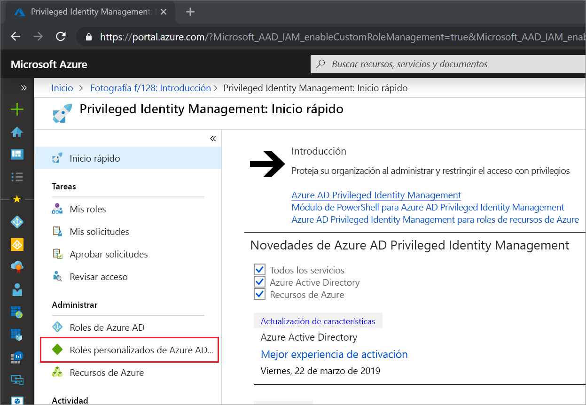
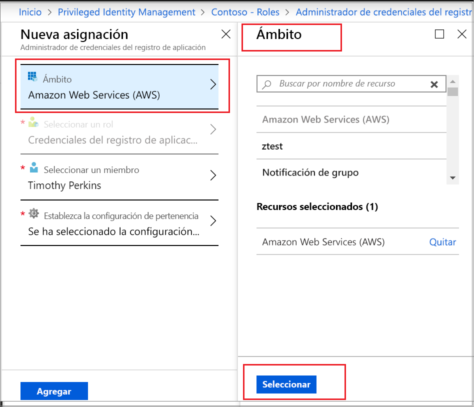

# Activación de un rol personalizado de Azure AD en Privileged Identity Management

Privileged Identity Management en Azure Active Directory (Azure AD) ahora admite la asignación Just-In-Time y de duración limitada a los roles personalizados creados para la administración de aplicaciones en la experiencia administrativa de Administración de identidad y acceso. Para obtener más información sobre cómo crear roles personalizados para delegar la administración de aplicaciones en Azure AD, vea [Roles de administrador personalizados en Azure Active Directory (versión preliminar)](../users-groups-roles/roles-custom-overview.md).

> [!NOTE]
> Los roles personalizados de Azure AD no se integran con los roles de directorio integrados durante la versión preliminar. Una vez que la funcionalidad esté disponible con carácter general, la administración de roles tendrá lugar en la experiencia de roles integrados. Si ve el banner siguiente, estos roles deben administrarse [en la experiencia de roles integrados](pim-how-to-activate-role.md) y este artículo no se aplica:
>
> 

## Activación de un rol

Cuando necesite activar un rol personalizado de Azure AD, seleccione la opción de navegación Mis roles de Privileged Identity Management para solicitar la activación.

1. Inicie sesión en [Azure Portal](https://portal.azure.com).
1. Abra Azure AD [Privileged Identity Management](https://portal.azure.com/?Microsoft_AAD_IAM_enableCustomRoleManagement=true&Microsoft_AAD_IAM_enableCustomRoleAssignment=true&feature.rbacv2roles=true&feature.rbacv2=true&Microsoft_AAD_RegisteredApps=demo#blade/Microsoft_Azure_PIMCommon/CommonMenuBlade/quickStart).

1. Seleccione **Roles personalizados de Azure AD** para ver una lista de las asignaciones de roles personalizados de Azure AD válidas.

   

> [!Note] 
>  Antes de asignar un rol, debe crearlo o configurarlo. Para más información sobre la configuración de roles personalizados de AAD, consulte [aquí] (https://docs.microsoft.com/azure/active-directory/privileged-identity-management/azure-ad-custom-roles-configure)

1. En la página **Roles personalizados de Azure AD (versión preliminar)** , busque la asignación que necesite.
1. Seleccione **Activar el rol** para abrir la página **Activar**.
1. Si el rol requiere la autenticación multifactor, seleccione **Compruebe su identidad antes de proceder**. Se le requiere que se autentique solo una vez por sesión.
1. Seleccione **Comprobar mi identidad** y siga las instrucciones para realizar cualquier comprobación de seguridad adicional.
1. Para especificar un ámbito de aplicación personalizado, seleccione **Ámbito** para abrir el panel de filtro. Debe solicitar acceso a un rol en el ámbito mínimo necesario. Si la asignación está en un ámbito de aplicación, solo la puede activar en ese ámbito.

   

1. Si es necesario, especifique una hora de inicio de activación personalizada. Cuando se usa, el miembro del rol se activa en el momento especificado.
1. En el campo **Razón**, escriba el motivo de la solicitud de activación. Se pueden hacer obligatorios o no en la configuración del rol.
1. Seleccione **Activar**.

Si el rol no requiere aprobación, se activa según la configuración y se agrega a la lista de roles activos. Si quiere usar el rol activado, comience con los pasos que se describen en [Asignación de un rol personalizado de Azure AD en Privileged Identity Management](azure-ad-custom-roles-assign.md).

Si el rol requiere aprobación para activarse, recibirá una notificación de Azure en la que se le informará de que la solicitud está pendiente de aprobación.

## Pasos siguientes

- [Asignación de un rol personalizado de Azure AD](azure-ad-custom-roles-assign.md)
- [Eliminación o actualización de una asignación de roles personalizados de Azure AD](azure-ad-custom-roles-update-remove.md)
- [Configuración de una asignación de roles personalizados de Azure AD](azure-ad-custom-roles-configure.md)
- [Definiciones de roles en Azure AD](../users-groups-roles/directory-assign-admin-roles.md)
