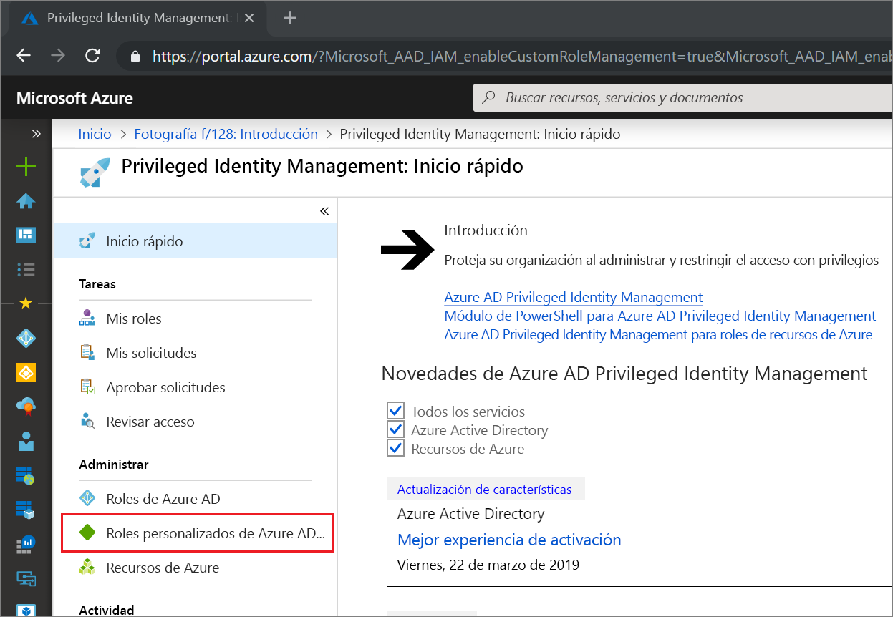
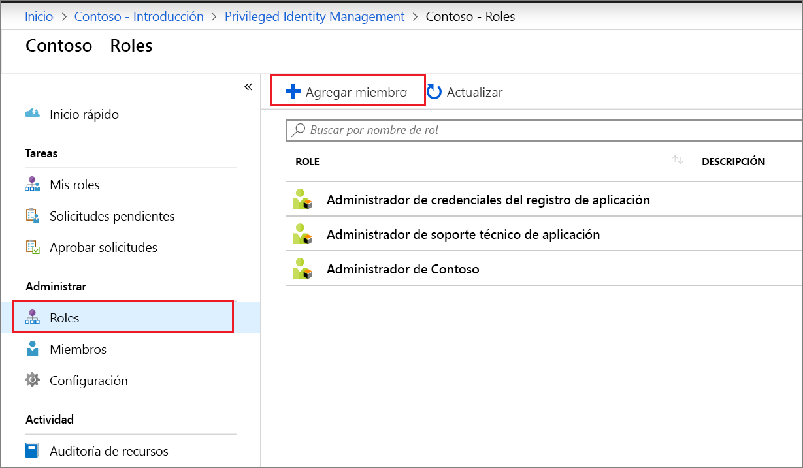
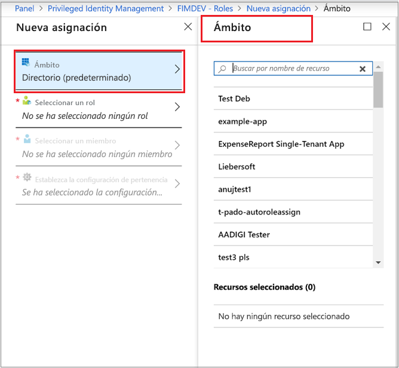
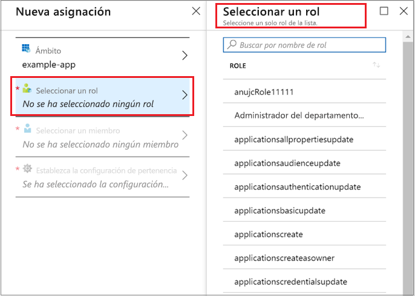
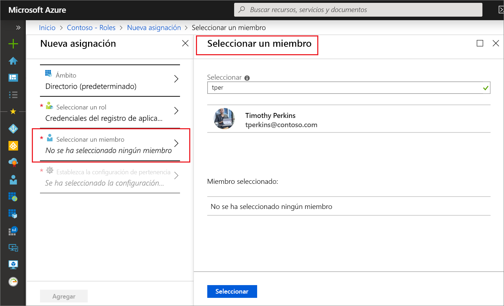
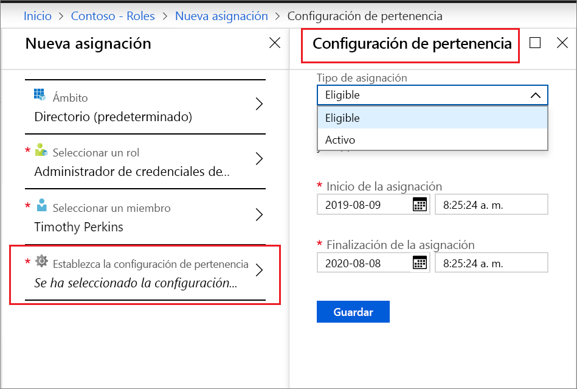
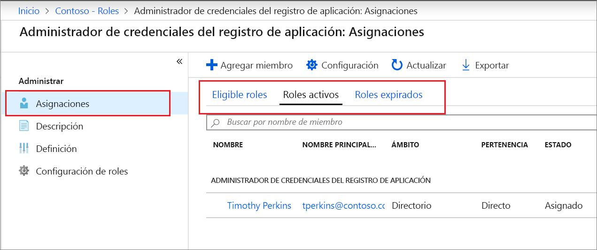

# Asignación de un rol personalizado de Azure AD en Privileged Identity Management

En este artículo se explica cómo usar Privileged Identity Management (PIM) para crear la asignación Just-In-Time y de duración limitada a los roles personalizados creados para administrar aplicaciones en la experiencia administrativa de Azure Active Directory (Azure AD).

- Para obtener más información sobre cómo crear roles personalizados para delegar la administración de aplicaciones en Azure AD, vea [Roles de administrador personalizados en Azure Active Directory (versión preliminar)](../users-groups-roles/roles-custom-overview.md).
- Si aún no ha usado Privileged Identity Management, obtenga más información en [Primer uso de Privileged Identity Management](pim-getting-started.md).
- Para información sobre cómo conceder acceso a otro administrador para gestionar Privileged Identity Management, consulte [Concesión de acceso a otros administradores para administrar Privileged Identity Management](pim-how-to-give-access-to-pim.md).

> [!NOTE]
> Los roles personalizados de Azure AD no se integran con los roles de directorio integrados durante la versión preliminar. Una vez que la funcionalidad esté disponible con carácter general, la administración de roles tendrá lugar en la experiencia de roles integrados.

## Asignar un rol

Privileged Identity Management puede administrar roles personalizados que se pueden crear en la administración de aplicaciones de Azure Active Directory (Azure AD).  En los pasos siguientes se realiza una asignación válida a un rol de directorio personalizado.

1. Inicie sesión en [Privileged Identity Management](https://portal.azure.com/?Microsoft_AAD_IAM_enableCustomRoleManagement=true&Microsoft_AAD_IAM_enableCustomRoleAssignment=true&feature.rbacv2roles=true&feature.rbacv2=true&Microsoft_AAD_RegisteredApps=demo#blade/Microsoft_Azure_PIMCommon/CommonMenuBlade/quickStart) en Azure Portal con una cuenta de usuario asignada al rol Administrador de roles con privilegios.
1. Seleccione **Roles personalizados de Azure AD (versión preliminar)** .

    

1. Seleccione **Roles** para ver una lista de roles personalizados para las aplicaciones de Azure AD.

    

1. Seleccione **Agregar miembro** para abrir la página de asignaciones.
1. Para restringir el ámbito de la asignación de roles a una sola aplicación, seleccione **Ámbito** para especificar un ámbito de aplicación.

    

1. Elija **Seleccionar un rol** para abrir la lista **Seleccionar un rol**.

    

1. Seleccione el rol que quiera asignar y luego haga clic en **Seleccionar**. Se abre la lista **Seleccionar un miembro**.

    

1. Seleccione el usuario que quiera asignar al rol y luego haga clic en **Seleccionar**. Se abre la lista **Configuración de pertenencia**.

    

1. En la página **Configuración de pertenencia**, seleccione **Válido** o **Activo**:

    - Las asignaciones tipo **Válido** requieren que el usuario asignado al rol realice una acción para poder usar el rol. Estas acciones pueden incluir pasar una comprobación de autenticación multifactor, proporcionar una justificación comercial o solicitar la aprobación de los aprobadores designados.
    - Las asignaciones tipo **Activo** no requieren que el usuario asignado realice ninguna acción para usar el rol. Los usuarios activos tienen siempre los privilegios asignados al rol.

1. Si la casilla **Permanente** está presente y disponible (en función de la configuración del rol), puede especificar si la asignación es permanente. Active la casilla para que la asignación sea permanentemente válida o esté permanentemente asignada. Desactive la casilla para especificar una duración para la asignación.
1. Para crear la asignación de roles, haga clic en **Guardar** y luego en **Agregar**. Se muestra una notificación del estado del proceso de asignación.

Para comprobar la asignación de roles, en un rol abierto, seleccione **Asignaciones** > **Asignar** y compruebe que la asignación de roles se identifique correctamente como válida o activa.

 

## Pasos siguientes

- [Activación de un rol personalizado de Azure AD](azure-ad-custom-roles-assign.md)
- [Eliminación o actualización de una asignación de roles personalizados de Azure AD](azure-ad-custom-roles-update-remove.md)
- [Configuración de una asignación de roles personalizados de Azure AD](azure-ad-custom-roles-configure.md)
- [Definiciones de roles en Azure AD](../users-groups-roles/directory-assign-admin-roles.md)
