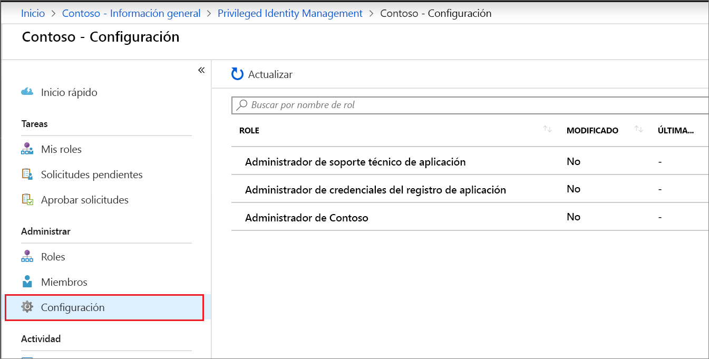
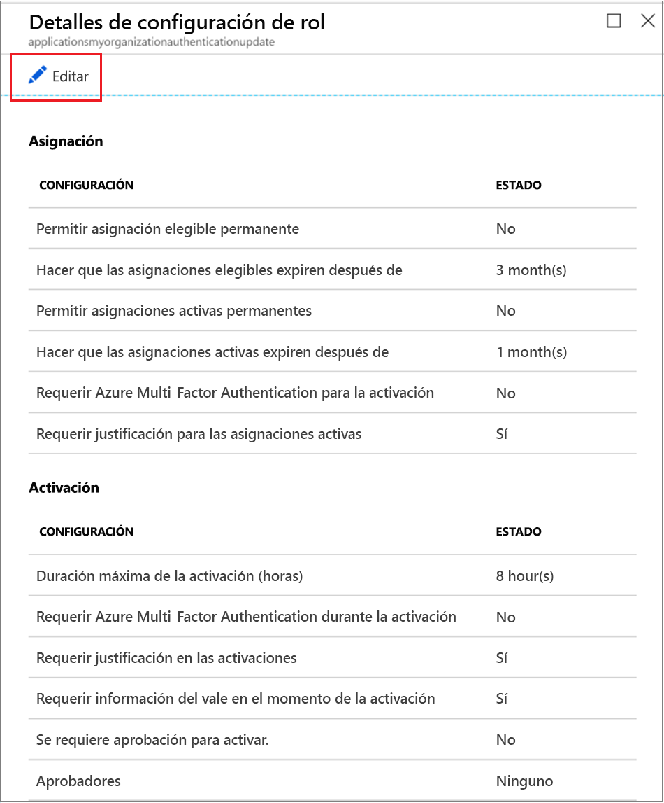
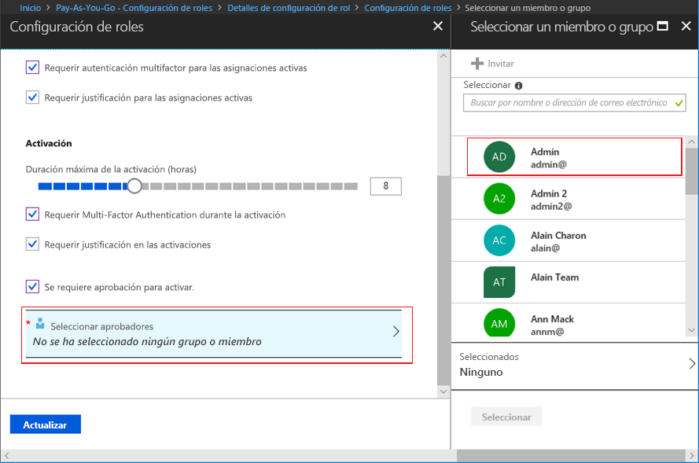

# Configuración de roles personalizados de Azure AD en Privileged Identity Management

Un administrador de roles con privilegios puede cambiar la configuración de los roles que se aplica a un usuario cuando activa su asignación a un rol personalizado y a otros administradores de aplicaciones que asignan roles personalizados.

## Apertura de la configuración de roles

Siga estos pasos para abrir la configuración de un rol de Azure AD.

1. Inicie sesión en [Privileged Identity Management](https://portal.azure.com/?Microsoft_AAD_IAM_enableCustomRoleManagement=true&Microsoft_AAD_IAM_enableCustomRoleAssignment=true&feature.rbacv2roles=true&feature.rbacv2=true&Microsoft_AAD_RegisteredApps=demo#blade/Microsoft_Azure_PIMCommon/CommonMenuBlade/quickStart) en Azure Portal con una cuenta de usuario asignada al rol Administrador de roles con privilegios.
1. Seleccione **Roles personalizados de Azure AD (versión preliminar)** .

    

1. Seleccione **Configuración** para abrir la página **Configuración**. Seleccione el rol cuya configuración quiera configurar.
1. Seleccione **Editar** para abrir la página **Configuración de roles**.

    

## Configuración de roles

Hay varias opciones que puede configurar.

### Duración de la asignación

Puede elegir entre dos opciones de duración de asignación para cada tipo de asignación (Válido o Activo) cuando se configuran las opciones de un rol. Estas opciones se convierten en la duración máxima predeterminada cuando se asigna un miembro al rol en Privileged Identity Management.

Puede elegir una de estas opciones de duración de asignación de tipo *Válido*.

- **Permitir asignación elegible permanente**: los administradores pueden asignar una pertenencia elegible permanente.
- **Hacer que las asignaciones elegibles expiren después de**: los administradores pueden requerir que todas las asignaciones elegibles tengan una fecha de inicio y finalización especificada.

Además, puede elegir una de estas opciones de duración de asignación de tipo *Activo*:

- **Permitir asignaciones activas permanentes**: los administradores pueden asignar una pertenencia activa permanente.
- **Hacer que las asignaciones activas expiren después de**: los administradores pueden requerir que todas las asignaciones activas tengan una fecha de inicio y finalización especificada.

### Requerir Azure Multi-Factor Authentication

Privileged Identity Management proporciona la aplicación opcional de Azure Multi-Factor Authentication para dos escenarios distintos.

- **Requerir autenticación multifactor para las asignaciones activas**

  Si solo quiere asignar un miembro a un rol durante un breve período (por ejemplo, un día), podría llevar demasiado tiempo requerir que los miembros asignados soliciten la activación. En este escenario, Privileged Identity Management no puede aplicar la autenticación multifactor cuando el usuario activa su asignación de roles porque ya está activo en el rol desde el momento de su asignación. Para garantizar que el administrador que cumple la asignación sea quien dice ser, seleccione el cuadro **Requerir autenticación multifactor para las asignaciones activas**.

- **Requerir Multi-Factor Authentication durante la activación**

  Puede requerir que los usuarios válidos asignados a un rol se inscriban en Azure Multi-Factor Authentication para que puedan realizar la activación. Este proceso garantiza que el usuario que solicita la activación sea quien dice ser con una exactitud razonable. Aplicar esta opción protege los roles críticos en situaciones en las que es posible que la cuenta de usuario se haya puesto en peligro. Para requerir que un miembro válido ejecute Azure Multi-Factor Authentication antes de la activación, seleccione el cuadro **Requerir Multi-Factor Authentication durante la activación**.

Para obtener más información, consulte [Autenticación multifactor y Privileged Identity Management](pim-how-to-require-mfa.md).

### Duración máxima de la activación

Use control deslizante **Duración máxima de la activación (horas)** para establecer el tiempo máximo, en horas, que un rol permanece activo antes de expirar. Este valor puede oscilar entre 1 y 24 horas.

### Requerir justificación

Puede requerir que los miembros especifiquen una justificación para las asignaciones activas o cuando se activen. Para requerir justificación, active la casilla **Requerir justificación para las asignaciones activas** o la casilla **Requerir justificación en las activaciones**.

### Solicitud de aprobación para activar

Si desea solicitar aprobación para activar un rol, siga estos pasos.

1. Active la casilla **Se requiere aprobación para activar**.
1. Elija **Seleccionar aprobadores** para abrir la lista **Seleccionar un miembro o grupo**.

    

1. Seleccione al menos un miembro o un grupo y luego haga clic en **Seleccionar**. Debe seleccionar al menos un aprobador. No hay aprobadores predeterminados. Su elección aparecerá en la lista de aprobadores seleccionados.
1. Una vez que haya especificado la configuración del rol, seleccione **Actualizar** para guardar los cambios.

## Pasos siguientes

- [Activación de un rol personalizado de Azure AD](azure-ad-custom-roles-assign.md)
- [Asignación de un rol personalizado de Azure AD](azure-ad-custom-roles-assign.md)
- [Eliminación o actualización de una asignación de roles personalizados de Azure AD](azure-ad-custom-roles-update-remove.md)
- [Definiciones de roles en Azure AD](../users-groups-roles/directory-assign-admin-roles.md)
