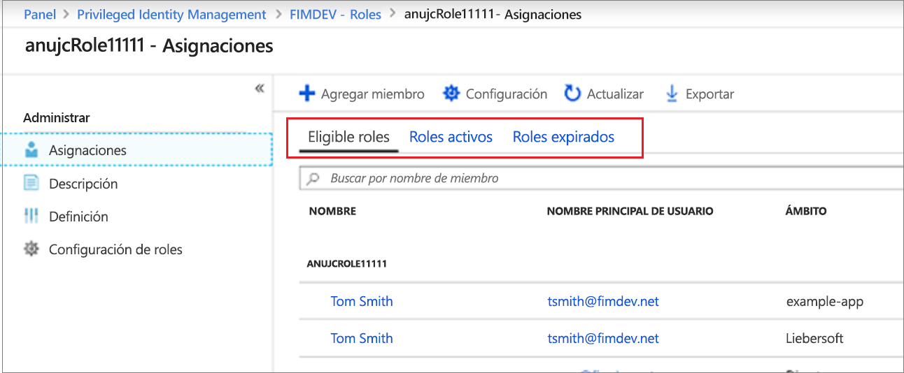
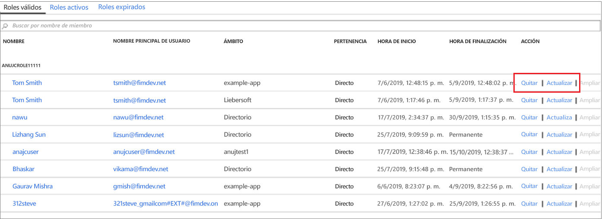

# Actualización o eliminación de un rol personalizado de Azure AD asignado en Privileged Identity Management

En este artículo se explica cómo usar Privileged Identity Management (PIM) para actualizar o eliminar la asignación Just-In-Time y de duración limitada a los roles personalizados creados para la administración de aplicaciones en la experiencia administrativa de Azure Active Directory (Azure AD). 

- Para obtener más información sobre cómo crear roles personalizados para delegar la administración de aplicaciones en Azure AD, vea [Roles de administrador personalizados en Azure Active Directory (versión preliminar)](../users-groups-roles/roles-custom-overview.md). 
- Si aún no ha usado Privileged Identity Management, obtenga más información en [Primer uso de Privileged Identity Management](pim-getting-started.md).

> [!NOTE]
> Los roles personalizados de Azure AD no se integran con los roles de directorio integrados durante la versión preliminar. Una vez que la funcionalidad esté disponible con carácter general, la administración de roles tendrá lugar en la experiencia de roles integrados.

## Actualización o eliminación de una asignación

Siga estos pasos para actualizar o eliminar una asignación de roles personalizados existente.

1. Inicie sesión en [Privileged Identity Management](https://portal.azure.com/?Microsoft_AAD_IAM_enableCustomRoleManagement=true&Microsoft_AAD_IAM_enableCustomRoleAssignment=true&feature.rbacv2roles=true&feature.rbacv2=true&Microsoft_AAD_RegisteredApps=demo#blade/Microsoft_Azure_PIMCommon/CommonMenuBlade/quickStart) en Azure Portal con una cuenta de usuario asignada al rol Administrador de roles con privilegios.
1. Seleccione **Roles personalizados de Azure AD (versión preliminar)** .

    

1. Seleccione **Roles** para ver la lista **Asignaciones** de los roles personalizados para las aplicaciones de Azure AD.

    

1. Seleccione el rol que quiera actualizar o quitar.
1. Busque la asignación de roles en las pestañas **Roles elegibles** o **Roles activos**.
1. Seleccione **Actualizar** o **Quitar** para actualizar o quitar la asignación de roles.

    

## Pasos siguientes

- [Activación de un rol personalizado de Azure AD](azure-ad-custom-roles-assign.md)
- [Asignación de un rol personalizado de Azure AD](azure-ad-custom-roles-assign.md)
- [Configuración de una asignación de roles personalizados de Azure AD](azure-ad-custom-roles-configure.md)
