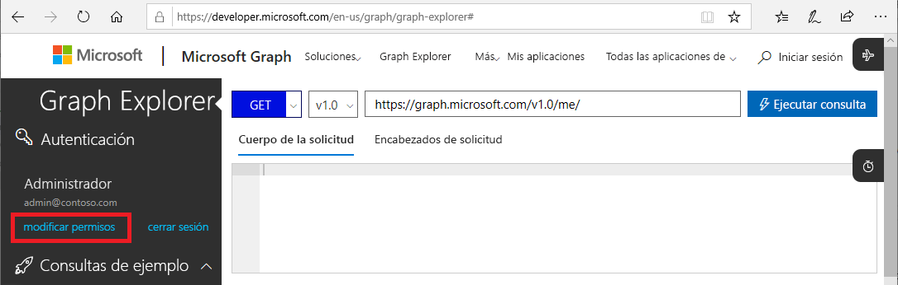

# Instancias de Microsoft Graph API para PIM (versión preliminar)

La mayoría de las tareas que se pueden realizar en Azure Active Directory (Azure AD) Privileged Identity Management (PIM) desde Azure Portal también puede realizar mediante instancias de [Microsoft Graph API](https://developer.microsoft.com/graph/docs/concepts/overview). En este artículo se describen varios conceptos importantes que se deben tener en cuenta cuando se usan instancias de Microsoft Graph API para PIM. Para más información acerca de las instancias de Microsoft Graph API, consulte la [referencia de las API de Azure AD Privileged Identity Management](https://developer.microsoft.com/graph/docs/api-reference/beta/resources/privilegedidentitymanagement_root).

> [!IMPORTANT]
> Las API de la versión /beta de Microsoft Graph están en versión preliminar y sujetas a cambios. No se admite su uso en aplicaciones de producción.

## Permisos necesarios

Para llamar a las instancias de Microsoft Graph API para PIM, debe tener **uno o varios** de los siguientes permisos:

- `Directory.AccessAsUser.All`
- `Directory.Read.All`
- `Directory.ReadWrite.All`
- `PrivilegedAccess.ReadWrite.AzureAD`

### Establecer permisos

Para que las aplicaciones llamen a la instancias de Microsoft Graph API para PIM, deben tener los permisos necesarios. La forma más fácil de especificar los permisos necesarios es usar el [marco de consentimiento de Azure AD](../develop/consent-framework.md).

### Establecimiento de permisos en el Probador de Graph

Si utiliza el Probador de Graph para probar las llamadas, puede especificar los permisos en dicha herramienta.

1. Inicie sesión en [Probador de Graph](https://developer.microsoft.com/graph/graph-explorer) como administrador global.

1. Haga clic en **modificar permisos**.

    

1. Agregue marcas de verificación junto a los permisos que desea incluir. `PrivilegedAccess.ReadWrite.AzureAD` aún no está disponible en el Probador de Graph.

    

1. Haga clic en **Modificar permisos** para aplicar los cambios de permisos.

## Pasos siguientes

- [Referencia de las API de Azure AD Privileged Identity Management](https://developer.microsoft.com/graph/docs/api-reference/beta/resources/privilegedidentitymanagement_root)
