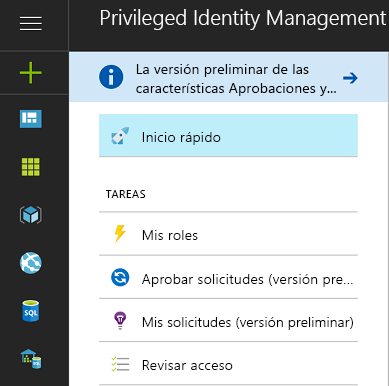
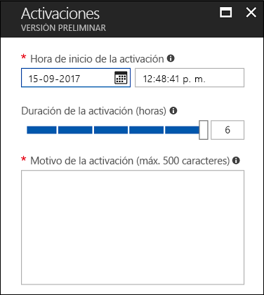
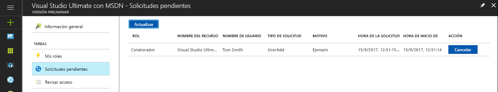
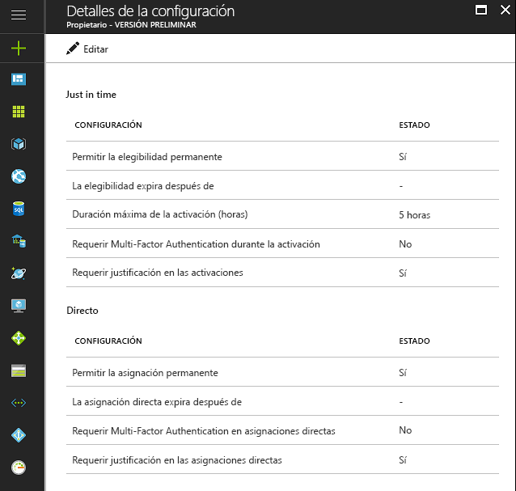

# ¿Qué es Azure AD Privileged Identity Management?

Con Azure Active Directory (Azure AD) Privileged Identity Management, puede administrar, controlar y supervisar el acceso dentro de la organización. Esto incluye el acceso a los recursos de Azure AD, de los recursos de Azure y de otros servicios de Microsoft Online Services, como Office 365 o Microsoft Intune.

> [!NOTE]
> Cuando se habilita Privileged Identity Management para un inquilino, se requiere una licencia de prueba o pago de Azure AD Premium P2 o Enterprise Mobility + Security E5 para cada usuario que interactúa con el servicio o que recibe un beneficio de él. Los ejemplos incluyen los usuarios de un grupo que:
>
>- Están asignados al rol de administrador de roles con privilegios. 
>- Están asignados como aptos para otros roles de directorio que se pueden administrar a través de PIM. 
>- Tienen la capacidad de aprobar o rechazar solicitudes en PIM. 
>- Están asignados a un rol de recursos de Azure con asignaciones Just-In-Time o directas (basadas en tiempo).  
>- Están asignados a una revisión de acceso.
>
>Para obtener más información, consulte [Ediciones de Azure Active Directory](../fundamentals/active-directory-whatis.md).

Las organizaciones buscan reducir el número de personas que tienen acceso a información segura o a recursos, ya que de esta manera se reduce la posibilidad de que usuarios malintencionados obtengan acceso a ellos o de que algún usuario autorizado haga algo involuntariamente que pueda afectar a recursos sensibles.  Sin embargo, los usuarios siguen teniendo la necesidad de llevar a cabo operaciones con privilegios en aplicaciones de Azure AD, Azure, Office 365 o SaaS. Las organizaciones pueden permitir a usuarios con privilegios acceder a los recursos de Azure como Suscripciones y Azure AD. Hay una necesidad de supervisión sobre lo que hacen estos usuarios con sus privilegios de administración. Azure AD Privileged Identity Management ayuda a mitigar el riesgo de unos derechos de acceso excesivos, innecesarios o mal utilizados.

Azure AD Privileged Identity Management ayuda a su organización a:

- Ver los usuarios a los que se les ha asignado roles con privilegios para administrar los recursos de Azure, así como los usuarios a los que se les ha asignado roles administrativos en Azure AD
- Habilitar acceso administrativo a petición y "Just-In-Time" a Microsoft Online Services como, por ejemplo, Office 365 e Intune, y a recursos de Azure de suscripciones, grupos de recursos y recursos individuales, como Virtual Machines 
- Ver un historial de activación de administrador, incluidos los cambios que han hecho los administradores en los recursos de Azure
- Obtener alertas sobre los cambios en las asignaciones de administrador.
- Solicitar aprobación para activar los roles de administrador con privilegios de Azure AD
- Revisar la pertenencia de roles administrativos y exigir que los usuarios proporcionen una justificación para una pertenencia continua.

En Azure AD, Azure AD Privileged Identity Management puede administrar los usuarios asignados a los roles de organización integrados de Azure AD, como el de administrador global. En Azure, Azure AD Privileged Identity Management puede administrar los usuarios y grupos asignados mediante roles RBAC de Azure, incluido el de propietario o colaborador.

## Acceso de administrador justo a tiempo

Históricamente, podía asignar un usuario a un rol de administrador mediante Azure Portal, otros portales de Microsoft Online Services o los cmdlets de Azure AD de Windows PowerShell. Por lo tanto, ese usuario se convierte en **administrador permanente**, siempre activo en su rol asignado. Privileged Identity Management de Azure AD presenta el concepto de **administrador apto**. Los administradores aptos deben ser usuarios que necesiten acceso con privilegios de vez en cuando, pero no todo el día cada día. El rol está inactivo hasta que el usuario necesita acceso, luego realiza un proceso de activación y se convierte en un administrador activo durante una cantidad de tiempo predeterminada. Cada vez hay más organizaciones que se deciden a usar este enfoque para reducir o eliminar un "acceso de administración permanente" para roles con privilegios.

## Terminología

*Usuario de rol apto*: es un usuario de la organización que se ha asignado a un rol de Azure AD como apto (el rol requiere activación).

*Aprobador delegado*: se trata de una o varias personas o grupos de Azure AD responsables de la aprobación de las solicitudes para activar roles.

## Escenarios

Privileged Identity Management admite los siguientes escenarios:

**Como administrador de rol con privilegios, puede:**

- Habilitar la aprobación de roles específicos
- Especificar usuarios y grupos de aprobadores para la aprobación de solicitudes
- Ver el historial de solicitudes y aprobaciones de todos los roles con privilegios

**Como un aprobador designado, puede:**

- Ver aprobaciones o solicitudes pendientes
- Aprobar o rechazar solicitudes de elevación de rol (de forma individual o masiva)
- Proporcionar una justificación de la aprobación o el rechazo 

**Como usuario de rol apto, puede:**

- Solicitar la activación de un rol que requiere aprobación
- Ver el estado de la solicitud de activación
- Completar la tarea en Azure AD si la activación se ha aprobado

## Quién puede realizar cada tarea en PIM

Si es la primera persona que usa PIM, se le asignarán automáticamente los roles de [Administrador de seguridad](../users-groups-roles/directory-assign-admin-roles.md#security-administrator) y [Administrador de roles con privilegios](../users-groups-roles/directory-assign-admin-roles.md#privileged-role-administrator) del directorio.

En el caso de los roles de Azure AD, los usuarios que estén en el rol Administrador de rol con privilegios son los únicos que pueden administrar asignaciones para los demás administradores de PIM. Puede [conceder acceso a otros administradores para administrar PIM](pim-how-to-give-access-to-pim.md). Los administradores globales, administradores de seguridad y lectores de seguridad pueden ver las asignaciones a roles de Azure AD en PIM.

En el caso de los roles de los recursos de Azure, los únicos que pueden administrar asignaciones para los demás administradores de PIM son los administrador de suscripciones, los propietarios de los recursos o los administradores de acceso de usuario de los recursos. De forma predeterminada, los usuarios que son administradores de roles con privilegios, administradores de seguridad o lectores de seguridad no tienen acceso para ver asignaciones a roles de recursos de Azure en PIM.

## Introducción a Privileged Identity Management (punto de entrada)

Azure AD Privileged Identity Management admite la administración de roles y roles de directorio de Azure AD para los recursos de Azure. La función de los roles para los recursos de Azure difiere de las funciones administrativas de Azure AD. Los roles de los recursos de Azure proporcionan permisos granulares para el recurso en el que se asignan y todos los recursos subordinados en la jerarquía de recursos (conocidos como herencia). [Más información sobre RBAC, la jerarquía de recursos y herencia](../../role-based-access-control/role-assignments-portal.md). Se puede administrar PIM tanto para roles de directorio de Azure AD como para los recursos de Azure mediante el acceso al vínculo apropiado en la sección Administrar del menú de navegación izquierdo del punto de entrada de Información general de PIM.

PIM ofrece un acceso cómodo para activar los roles, y ver las activaciones/solicitudes pendientes, las aprobaciones pendientes (para los roles de directorio de Azure AD) y las revisiones pendientes de respuesta en la sección Tareas del menú de navegación izquierdo.

Cuando se accede a cualquiera de los elementos del menú Tareas del punto de entrada de Información general, la vista resultante contiene los resultados de los roles de directorio de Azure AD y los roles de los recursos de Azure.

Mis roles contiene una lista de las asignaciones de rol activas y aptas para los roles de directorio de Azure AD, así como roles de los recursos de Azure. [Más información sobre la activación de asignaciones de rol aptas](pim-how-to-activate-role.md).

La activación de rol para los recursos de Azure presenta una nueva experiencia que permite a los miembros aptos de un rol programar la activación de fechas y horas futuras, y seleccionar una duración de activación específica dentro de los límites máximos permitidos por los administradores.

En caso de que ya no se requiera una activación programada, los usuarios pueden cancelar su solicitud pendiente desplazándose a las solicitudes pendientes en el menú de navegación izquierdo y haciendo clic en el botón Cancelar junto a esa solicitud.

## Panel del administrador de Privileged Identity Management

Azure AD Privileged Identity Manager proporciona un panel de administrador que ofrece información importante, por ejemplo:

* Alertas que destacan oportunidades para mejorar la seguridad
* El número de usuarios que están asignados a cada rol con privilegios  
* El número de administradores aptos y permanentes
* Un gráfico de activaciones de rol con privilegios en su directorio
* Número de asignaciones Just-In-Time, limitadas en tiempo y permanentes para roles de recursos de Azure
* Usuarios y grupos con nuevas asignaciones de rol en los últimos 30 días (roles de recursos de Azure)

## Administración de roles con privilegios

Con Azure AD Privileged Identity Management, puede administrar los administradores agregando o quitando administradores permanentes o aptos en cada rol para los roles de directorio de Azure AD. Con PIM para recursos de Azure, los propietarios, administradores de acceso de los usuarios y administradores globales que habilitan la administración de suscripciones en su inquilino pueden asignar usuarios o grupos a los roles de recursos de Azure como acceso apto (acceso Just-In-Time) o limitado en tiempo (activación no obligatoria) con una fecha/hora de inicio y finalización o permanente (si está habilitado en la configuración de roles).

## Configuración de las opciones de activación de rol

Mediante la [configuración de roles](pim-how-to-change-default-settings.md) puede establecer las propiedades de activación de rol apto para los roles de directorio de Azure AD como:

* La duración del período de activación del rol
* La notificación de activación del rol
* La información que un usuario debe proporcionar durante el proceso de activación del rol
* Número de incidente o vale de servicio
* [Requisitos de flujo de trabajo de aprobación](./azure-ad-pim-approval-workflow.md)

Tenga en cuenta que en la imagen, los botones de **Multi-Factor Authentication** están deshabilitados. Para algunos roles con privilegios elevados, se requiere MFA para aumentar la protección.

La configuración de roles para los roles de recursos de Azure permite a los administradores configurar valores de asignaciones Just-In-Time y directas, incluidos:

- La capacidad para asignar usuarios o grupos a roles sin una fecha/hora de finalización (asignación permanente).
- La duración predeterminada de una asignación (cuando no es permanente).
- La duración máxima de activación (cuando se activa un miembro de rol apto).
- La información que debe proporcionar un usuario durante la activación de roles (asignaciones Just-In-Time) o el proceso de asignación (asignaciones directas).

## Activación de rol

Para [activar un rol](pim-how-to-activate-role.md), un administrador apto solicita una "activación" limitada en tiempo para el rol. Se puede solicitar la activación mediante la opción **Activar mi rol** en Administración de identidades con privilegios de Azure AD.

Un administrador que quiera activar un rol necesita inicializar Privileged Identity Management de Azure AD en el Portal de Azure.

La activación del rol es personalizable. En la configuración de PIM, se puede determinar la duración de la activación, así como la información que el administrador debe proporcionar para activar el rol.

## Revisión de la actividad de un rol

Hay dos maneras de realizar un seguimiento de la forma en que tanto empleados como administradores usan los roles con privilegios. La primera opción es utilizar el [historial de auditoría de roles de directorio](pim-how-to-use-audit-log.md). Los registros del historial de auditoría realizan el seguimiento de los cambios en las asignaciones de roles con privilegios, el historial de activación de roles y los cambios en la configuración de roles de recursos de Azure. 

La segunda opción consiste en configurar [revisiones de acceso](pim-how-to-start-security-review.md)regulares. Estas revisiones de acceso las puede realizar un revisor asignado (por ejemplo, un jefe de grupo), o bien los propios empleados. Esta es la mejor forma de supervisar quién requiere acceso aún, y quién no.

## PIM de Azure AD en la caducidad de la suscripción

Un inquilino debe tener una suscripción de prueba o de pago de Azure AD Premium P2 (o EMS E5) en su inquilino antes de usar PIM de Azure AD.  Además, deben asignarse licencias a los administradores del inquilino.  En concreto, deben asignarse licencias a los administradores en roles de Azure AD que se administran a través de PIM de Azure AD, administradores en roles RBAC de Azure que se administran a través de PIM de Azure AD y usuarios sin privilegios de administrador que realizan revisiones de acceso.
Si su organización no renueva Azure AD Premium P2 o expira el período de prueba, las características de PIM de Azure AD ya no estarán disponibles en el inquilino, se quitarán las asignaciones de roles aptos y los usuarios ya no podrán activar los roles. Encontrará más información en [requisitos de la suscripción de PIM de Azure AD](./subscription-requirements.md)

## Pasos siguientes

- [Primer uso de PIM](pim-getting-started.md)
- [Requisitos de suscripción de Azure Active Directory Privileged Identity Management](subscription-requirements.md)
- [Protección del acceso con privilegios para las implementaciones híbridas y en la nube en Azure AD](../users-groups-roles/directory-admin-roles-secure.md?toc=%2fazure%2factive-directory%2fprivileged-identity-management%2ftoc.json)
