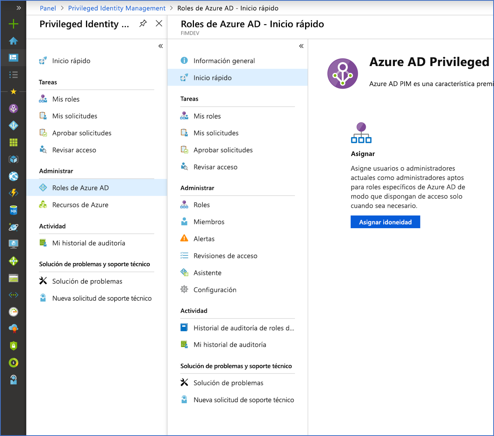

# ¿Qué es Azure AD Privileged Identity Management?

Azure Active Directory (Azure AD) Privileged Identity Management (PIM) es un servicio que permite administrar, controlar y supervisar el acceso a recursos importantes dentro de la organización. Esto incluye el acceso a los recursos de Azure AD, de los recursos de Azure y de otros servicios de Microsoft Online Services, como Office 365 o Microsoft Intune.

## ¿Por qué debo usar PIM?

Las organizaciones buscan reducir el número de personas que tienen acceso a información segura o a recursos, ya que de esta manera se reduce la posibilidad de que personas malintencionadas obtengan acceso a ellos o de que algún usuario autorizado haga algo involuntariamente que pueda afectar a recursos sensibles. Sin embargo, los usuarios siguen teniendo la necesidad de llevar a cabo operaciones con privilegios en aplicaciones de Azure AD, Azure, Office 365 o SaaS. Las organizaciones pueden conceder a los usuarios privilegios de acceso Just-In-Time (JIT) a los recursos de Azure y a Azure AD. Es necesario supervisar lo que los usuarios hacen con los privilegios de administrador. PIM ayuda a mitigar el riesgo de derechos de acceso excesivos, innecesarios o mal utilizados.

## ¿Qué puedo hacer con PIM?

Básicamente, PIM ayuda a administrar quién accede a los recursos que le importan, y a saber a cuáles, dónde, cuándo y por qué. Estas son algunas de las principales características de PIM:

- Conceda privilegios de acceso **Just-In-Time** a Azure AD y a los recursos de Azure
- Asigne acceso **limitado** a los recursos con fechas de inicio y fin
- Requiera **aprobación** para activar los roles con privilegios
- Aplique la **autenticación multifactor** para activar cualquier rol
- Use la **justificación** para comprender por qué se activan los usuarios
- Obtenga **notificaciones** cuando se activan los roles con privilegios
- Lleve a cabo **revisiones de acceso** para asegurarse de que los usuarios siguen necesitando roles
- Descargue el **historial de auditoría** para la auditoría interna o externa

## Requisitos previos

Para usar PIM, debe tener una de las siguientes licencias de pago o de evaluación. Para más información, consulte [¿Qué es Azure Active Directory?](../fundamentals/active-directory-whatis.md)

- Azure AD Premium P2
- Enterprise Mobility + Security (EMS) E5

Para información sobre las licencias para los usuarios, consulte [License requirements to use PIM](subscription-requirements.md) (Requisitos de licencia para usar PIM).

## Terminología

Para conocer mejor PIM y su documentación, debe revisar los términos siguientes.

| Término o concepto | Categoría de asignación de roles | DESCRIPCIÓN |
| --- | --- | --- |
| Apto | Escriba | Asignación de roles que requiere que un usuario realice una o varias acciones para usar el rol. Si un usuario es apto para un rol, eso significa que puede activarlo cuando necesite para realizar tareas con privilegios. No hay ninguna diferencia en el acceso proporcionado de forma permanente a una persona o una asignación de roles aptos. La única diferencia es que algunas personas no necesitan ese acceso todo el tiempo. |
| active | Escriba | Asignación de roles que no requiere que el usuario realice ninguna acción para usar el rol. Los usuarios asignados como activos tienen privilegios asignados al rol. |
| activar |  | Proceso de realizar una o más acciones para usar el rol para el cual es apto un usuario. Entre las acciones se puede incluir realizar una comprobación de autenticación multifactor (MFA), proporcionar una justificación de negocios o solicitar la aprobación de los aprobadores designados. |
| asignado | Estado | Usuario que tiene una asignación de roles activa. |
| activado | Estado | Usuario con una asignación de roles apta, que ha realizado las acciones necesarias para activar el rol y ahora está activo. |
| apto permanente | Duration | Asignación de roles en la que un usuario siempre es apto para activar el rol. |
| activo permanente | Duration | Asignación de roles en la que un usuario siempre puede usar el rol, sin realizar ninguna acción. |
| apto con expiración | Duration | Asignación de roles en la que un usuario es apto para activar el rol en un plazo específico de tiempo, con principio y fin. |
| activo con expiración | Duration | Asignación de roles en la que un usuario puede usar el rol sin realizar ninguna acción en un plazo determinado con principio y fin. |

## ¿Qué aspecto tiene PIM?

Una vez PIM se haya configurado, verá las opciones **Tareas**, **Administrar**, y **Actividad** en el menú de navegación izquierdo. Como administrador, podrá elegir entre la administración de **Roles de Azure AD** y de **Roles de recursos de Azure**. Al elegir el tipo de roles que administrar, verá un conjunto similar de opciones para ese tipo de rol.

## ¿Quién puede realizar cada tarea en PIM?

Si es la primera persona que usa PIM, se le asignarán automáticamente los roles de [Administrador de seguridad](../users-groups-roles/directory-assign-admin-roles.md#security-administrator) y [Administrador de roles con privilegios](../users-groups-roles/directory-assign-admin-roles.md#privileged-role-administrator) del directorio.

En el caso de los roles de Azure AD, los usuarios que estén en el rol Administrador de rol con privilegios son los únicos que pueden administrar asignaciones para los demás administradores de PIM. Puede [conceder acceso a otros administradores para administrar PIM](pim-how-to-give-access-to-pim.md). Los administradores globales, administradores de seguridad y lectores de seguridad pueden ver las asignaciones de roles de Azure AD en PIM.

En el caso de los roles de los recursos de Azure, los únicos que pueden administrar asignaciones para los demás administradores de PIM son los administrador de suscripciones, los propietarios de los recursos o los administradores de acceso de usuario de los recursos. De forma predeterminada, los usuarios que son administradores de roles con privilegios, administradores de seguridad o lectores de seguridad no tienen acceso para ver asignaciones a roles de recursos de Azure en PIM.

## Escenarios

PIM admite los siguientes escenarios:

**Como administrador de rol con privilegios, puede:**

- Habilitar la aprobación de roles específicos
- Especificar usuarios y grupos de aprobadores para la aprobación de solicitudes
- Ver el historial de solicitudes y aprobaciones de todos los roles con privilegios

**Como aprobador, puede:**

- Ver aprobaciones o solicitudes pendientes
- Aprobar o rechazar solicitudes de elevación de rol (de forma individual o masiva)
- Proporcionar una justificación de la aprobación o el rechazo 

**Como usuario de rol apto, puede:**

- Solicitar la activación de un rol que requiere aprobación
- Ver el estado de la solicitud de activación
- Completar la tarea en Azure AD si la activación se ha aprobado

## Pasos siguientes

- [Primer uso de PIM](pim-getting-started.md)
- [Requisitos de licencia para usar PIM](subscription-requirements.md)
- [Protección del acceso con privilegios para las implementaciones híbridas y en la nube en Azure AD](../users-groups-roles/directory-admin-roles-secure.md?toc=%2fazure%2factive-directory%2fprivileged-identity-management%2ftoc.json)
