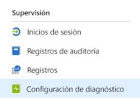
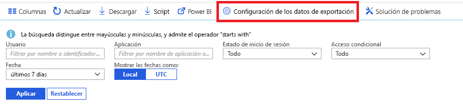

# ¿Qué es la supervisión de Azure Active Directory? (versión preliminar)

Con la supervisión de Azure Active Directory (Azure AD), ahora puede enrutar los registros de actividad de Azure AD a diferentes puntos de conexión. A continuación, puede conservarlo para su uso a largo plazo o integrarlo con herramientas de Administración de eventos e información de seguridad (SIEM) de terceros para obtener información sobre su entorno.

Actualmente, puede enrutar los registros a:

- Una cuenta de almacenamiento de Azure.
- Un centro de eventos de Azure, para que pueda integrarlo con sus instancias de Splunk y Sumologic.
- Un área de trabajo de Azure Log Analytics, donde puede analizar los datos, crear un panel y alertar sobre eventos específicos.

> [!VIDEO https://www.youtube.com/embed/syT-9KNfug8]

## Configuración de opciones de diagnóstico

Para configurar los valores de supervisión de los registros de actividad de Azure AD, primero inicie sesión en [Azure Portal](https://portal.azure.com) y, después, seleccione **Azure Active Directory**. Desde aquí, puede acceder a la página de configuración de los ajustes de diagnóstico de dos maneras:

* Seleccione **Configuración de diagnóstico** en la sección **Supervisión**.

    
    
* Seleccione **Registros de auditoría** o **Inicios de sesión** y, después, seleccione **Exportar configuración**. 

    

## Enrutamiento de registros a la cuenta de almacenamiento

Al enrutar los registros a una cuenta de almacenamiento de Azure, puede retenerlos durante más tiempo que el período de retención predeterminado que se describe en las [directivas de retención](reference-reports-data-retention.md). Obtenga información sobre cómo [enrutar datos a la cuenta de almacenamiento](quickstart-azure-monitor-route-logs-to-storage-account.md).

## Transmisión en secuencias de registros a un centro de eventos

Enrutar los registros a un centro de eventos de Azure le permite integrarse con herramientas SIEM de terceros como Sumologic y Splunk. Esta integración le permite combinar los datos de registro de actividad de Azure AD con otros datos administrados por el SIEM, a fin de proporcionar una mejor comprensión del entorno. Aprenda cómo [transmitir registros a un centro de eventos](tutorial-azure-monitor-stream-logs-to-event-hub.md).

## Envío de registros a Log Analytics

[Log Analytics](https://docs.microsoft.com/azure/log-analytics/log-analytics-overview) es una solución que consolida la supervisión de los datos de diferentes orígenes y proporciona un lenguaje de consulta y un motor de análisis que ofrece información sobre el funcionamiento de las aplicaciones y los recursos. Al enviar los registros de actividad de Azure AD a Log Analytics, puede recuperar, supervisar y alertar rápidamente sobre los datos recopilados. Más información sobre cómo [enviar datos a Log Analytics](howto-integrate-activity-logs-with-log-analytics.md).

También puede instalar las vistas pregeneradas de los registros de actividad de Azure AD para supervisar escenarios comunes que incluyen inicios de sesión y eventos de auditoría. Aprenda a [instalar y utilizar las vistas de Log Analytics para los registros de actividad de Azure AD](howto-install-use-log-analytics-views.md).

## Pasos siguientes

* [Registros de actividad en Azure Monitor](concept-activity-logs-azure-monitor.md)
* [Transmisión en secuencias de registros a un centro de eventos](tutorial-azure-monitor-stream-logs-to-event-hub.md)
* [Envío de registros a Log Analytics](howto-integrate-activity-logs-with-log-analytics.md)
