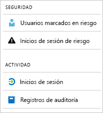

# ¿Qué son los informes de Azure Active Directory?

Los informes de Azure Active Directory (Azure AD) proporcionan una vista completa de la actividad en su entorno. Los datos proporcionados le permiten:

- Determinar cómo utilizan los usuarios las aplicaciones y servicios
- Detectar posibles riesgos que afectan al estado de su entorno
- Solucionar problemas que impiden a los usuarios finalizar su trabajo  

La arquitectura de informes se basa en dos pilares principales:

- [Informes de seguridad](#security-reports)
- [Informes de actividad](#activity-reports)

## Informes de seguridad

Los informes de seguridad ayudan a proteger las identidades de su organización. Hay dos tipos de informes de seguridad:

- **Usuarios marcados en riesgo**: en el [informe de seguridad de usuarios marcados en riesgo](concept-user-at-risk.md) puede obtener una visión general de las cuentas de usuario que pueden haber estado en peligro.

- **Inicios de sesión de riesgo**: en el [informe de seguridad de inicios de sesión de riesgo](concept-risky-sign-ins.md) puede obtener un indicador de un intento de inicio de sesión que puede haber realizado alguien que no es el propietario legítimo de una cuenta de usuario. 

### ¿Qué licencia de Azure AD se necesita para acceder a un informe de seguridad?  

Todas las ediciones de Azure AD le proporcionan informes de usuarios marcados en riesgo e informes de inicios de sesión de riesgo. Sin embargo, el nivel de granularidad del informe varía según la edición: 

- En las **ediciones gratuita y básica de Azure Active Directory**, puede obtener una lista de usuarios marcados en riesgo y de inicios de sesión de riesgo. 

- En la edición **Azure Active Directory Premium 1** se extiende este modelo, con lo que también puede examinar algunos de los eventos de riesgo subyacentes que se han detectado para cada informe. 

- La edición **Azure Active Directory Premium 2** le proporciona la información más detallada acerca de los eventos de riesgo subyacentes y también le permite configurar directivas de seguridad que responden automáticamente a los niveles de riesgo configurados.

## Informes de actividad

Los informes de actividad le ayudan a comprender el comportamiento de los usuarios de su organización. Hay dos tipos de informes de actividad en Azure AD:

- **Registros de auditoría**: el [informe de actividad de registros de auditoría](concept-audit-logs.md) le proporciona acceso al historial de todas las tareas llevadas a cabo en el inquilino.

- **Inicios de sesión**: con el [informe de actividad de inicios de sesión](concept-sign-ins.md), puede determinar quién ha realizado las tareas notificadas en el informe de registros de auditoría.

### Informe de registros de auditoría 

Los [informes de registros de auditoría](concept-audit-logs.md) le proporcionan registros de las actividades del sistema en relación con el cumplimiento normativo. Estos datos le permiten abordar cuestiones comunes como:

- Algún usuario de mi inquilino obtuvo acceso a un grupo de administración. ¿Quién les dio acceso? 

- Quiero conocer la lista de usuarios que inician sesión en una aplicación específica ya que la puse en marcha recientemente y quiero conocer si está funcionando correctamente.

- Quiero saber cuántos restablecimientos de contraseña se producen en mi inquilino

#### ¿Qué licencia de Azure AD se necesita para acceder al informe de registros de auditoría?  

El informe de registros de auditoría está disponible para aquellas características para las que dispone de licencia. Si tiene una licencia para una característica determinada, también tiene acceso a la información del registro de auditoría de dicha característica. Para más información, consulte [Características y funcionalidades de Azure Active Directory](https://www.microsoft.com/cloud-platform/azure-active-directory-features).   

### Informe de inicios de sesión

El [informe de inicios de sesión](concept-sign-ins.md) le permite encontrar respuestas a preguntas como:

- ¿Cuál es el patrón de inicio de sesión de un usuario?
- ¿Cuántos usuarios tienen usuarios que han iniciado sesión durante una semana?
- ¿Cuál es el estado de estos inicios de sesión?

#### ¿Qué licencia de Azure AD se necesita para acceder a los informes de actividades de inicio de sesión?  

El inquilino debe tener una licencia de Azure AD Premium asociada para acceder al informe de actividades de inicio de sesión.

## Acceso mediante programación

Además de la interfaz de usuario, Azure AD también proporciona [acceso mediante programación](concept-reporting-api.md) a los datos de informes, mediante un conjunto de API basadas en REST. Estas API pueden llamarse desde una variedad de lenguajes de programación y herramientas. 

## Pasos siguientes

- [Informe de inicios de sesión de riesgo](concept-risky-sign-ins.md)
- [Informe de registros de auditoría](concept-audit-logs.md)
- [Informe de registros de inicios de sesión](concept-sign-ins.md)