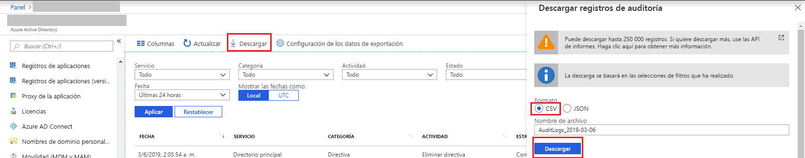

# Inicio rápido: Descarga de un informe de auditoría mediante Azure Portal

En esta guía de inicio rápido, obtendrá información sobre cómo descargar registros de auditoría para el inquilino durante las 24 últimas horas. Puede descargar hasta 5000 registros de Azure Portal. Los registros se ordenan a partir de los más recientes, así que, de forma predeterminada, se obtienen los últimos 5000 registros. 

## Requisitos previos

Necesita:

* Un inquilino de Azure Active Directory. 
* Un usuario, que tenga el rol **Administrador de seguridad**, **Lector de seguridad** o **Administrador global** del inquilino. Además, cualquier usuario del inquilino puede acceder a sus propios registros de auditoría.

## Inicio rápido: Descarga de un informe de auditoría

1. Acceda a [Azure Portal](https://portal.azure.com).
2. Seleccione **Azure Active Directory** desde el panel de navegación izquierdo y use el botón **Cambiar directorio** para seleccionar su directorio activo.
3. En el panel, seleccione **Azure Active Directory** y luego **Registros de auditoría**. 
4. Elija **Últimas 24 horas** en el menú desplegable de filtro **Intervalo de fechas** y seleccione **Aplicar** para ver los registros de auditoría de las 24 últimas horas. 
5. Seleccione el botón **Descargar** para descargar un archivo CSV que contiene los registros filtrados. 

## Pasos siguientes

* [Informes de actividad de inicio de sesión en el portal de Azure Active Directory](concept-sign-ins.md)
* [Retención de informes de Azure Active Directory](reference-reports-data-retention.md)
* [Latencias de informes de Azure Active Directory](reference-reports-latencies.md)
