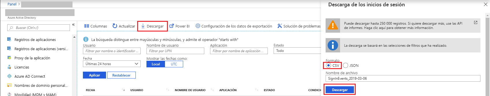

# Inicio rápido: Descarga de un informe de inicio de sesión mediante Azure Portal

En esta guía de inicio rápido, obtendrá información sobre cómo descargar los datos de inicio de sesión para el inquilino durante las 24 últimas horas. Puede descargar hasta 250 000 registros de Azure Portal. Los registros se ordenan a partir de los más recientes, así que, de forma predeterminada, se obtienen los 250 000 últimos registros. 

## Requisitos previos

Necesita:

* Un inquilino de Azure Active Directory, con una licencia Premium para ver el informe actividad de inicio de sesión. Consulte [Introducción a Azure Active Directory Premium](../fundamentals/active-directory-get-started-premium.md) para actualizar la edición de Azure Active Directory. Tenga en cuenta que si no tuvo ningún dato de actividades antes de la actualización, los datos tardarán un par de días en mostrarse en los informes después de actualizar a una licencia premium.
* Un usuario, que tenga el rol **Administrador de seguridad**, **Lector de seguridad**, **Lector de informes** o **Administrador global** del inquilino. Además, cualquier usuario del inquilino puede acceder a sus propios inicios de sesión.

## Inicio rápido: Descarga de un informe de inicio de sesión

1. Acceda a [Azure Portal](https://portal.azure.com).
2. Seleccione **Azure Active Directory** desde el panel de navegación izquierdo y use el botón **Cambiar directorio** para seleccionar su directorio activo.
3. En el panel, seleccione **Azure Active Directory** y luego **Inicios de sesión**. 
4. Elija **Últimas 24 horas** en el menú desplegable de filtro **Fecha** y seleccione **Aplicar** para ver los inicios de sesión de las 24 últimas horas. 
5. Seleccione el botón **Descargar**, elija **CSV** como el formato de archivo y especifique un nombre de archivo para descargar un archivo CSV que contiene los registros filtrados. 

## Pasos siguientes

* [Informes de actividad de inicio de sesión en el portal de Azure Active Directory](concept-sign-ins.md)
* [Retención de informes de Azure Active Directory](reference-reports-data-retention.md)
* [Latencias de informes de Azure Active Directory](reference-reports-latencies.md)
