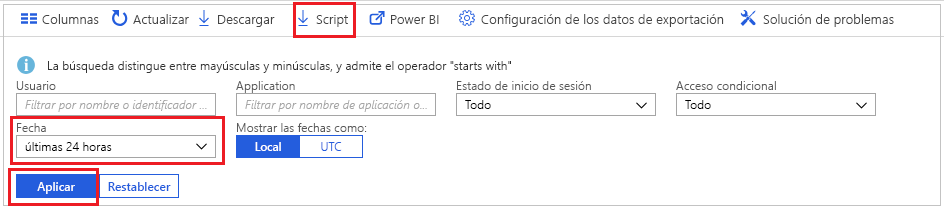
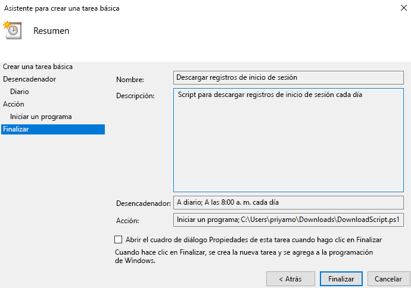

# Tutorial: Descarga y uso de un script para acceder a los registros de inicio de sesión

Puede descargar los datos de las actividades de inicio de sesión si desea trabajar con ellos fuera de Azure Portal. La opción **Descargar** de Azure Portal crea un archivo CSV con los 5000 registros más recientes. Si necesita mayor flexibilidad, por ejemplo, para descargar más de 5000 registros a la vez, o para descargar los registros según intervalos programados, puede usar el botón **Script** para generar un script de PowerShell para descargar los datos.

En este tutorial, aprenderá a generar un script para descargar todos los registros de inicio de sesión de las últimas 24 horas y programarlo para que se ejecute cada día. 

## Requisitos previos

Necesita:

* Un inquilino de Azure Active Directory con una licencia premium (P1 y P2). 
* Un usuario con el rol **Administrador global**, **Administrador de seguridad**, **Lector de seguridad** o **Lector de informes** en el inquilino. Además, cualquier usuario puede acceder a sus propios inicios de sesión. 
* Si quiere ejecutar el script descargado en la máquina de Windows 10, [configure el módulo AzureRM y establezca la directiva de ejecución](concept-sign-ins.md#running-the-script-on-a-windows-10-machine).

## Tutorial

1. Vaya a [Azure Portal](https://portal.azure.com) y seleccione su directorio.
2. Seleccione **Azure Active Directory** y elija **Inicios de sesión** en la sección **Supervisión**. 
3. Use la lista desplegable de filtros **Intervalo de fechas** y seleccione **24 horas** para obtener datos de las últimas 24 horas. 
4. Seleccione **Aplicar** y compruebe que el filtro se aplica según lo previsto. 
5. Seleccione **Script** en el menú superior para descargar el script de PowerShell con los filtros aplicados.

     
     
6. Abra la aplicación **Programador de tareas** en la máquina Windows y seleccione **Crear tarea básica**.
7. Escriba un nombre y una descripción para la tarea y haga clic en **Siguiente**.
8. Seleccione el botón de radio **Diario** para permitir que la tarea se ejecute a diario y escriba la fecha de inicio y la hora.
9. En el menú Acción, haga clic en **Iniciar un programa**, seleccione el script descargado y haga clic en **Siguiente**. 
10. Revise la tarea programada y haga clic en **Finalizar** para crear la tarea.

     

Ahora, la tarea se ejecute cada día y guarda los registros de inicio de sesión de las últimas 24 horas en un archivo con el formato **AAD_SignInReport_YYYYMMDD_HHMMSS.csv**. También puede editar el script de PowerShell descargado para guardarlo con otro nombre de archivo, o para modificar el número de registros descargados. 

## Pasos siguientes

* [Directivas de retención de informes de Azure Active Directory](reference-reports-data-retention.md)
* [Introducción a la API de generación de informes de Azure Active Directory](concept-reporting-api.md)
* [Acceso a la API de informes con certificados](tutorial-access-api-with-certificates.md)
