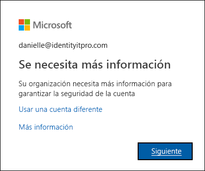

# ¿Qué es la página Comprobación adicional?

Ha recibido un correo electrónico de alguien del departamento de TI o de su jefe que le informa de que la organización ha agregado una comprobación de seguridad adicional a su cuenta. ¿Qué significa? Significa que su organización está llevando a cabo pasos adicionales para asegurarse de que usted es quien pretende al iniciar sesión. Esta comprobación adicional, también conocida como verificación en dos fases, se realiza a través de una combinación de su nombre de usuario, la contraseña y un dispositivo móvil o teléfono.

La verificación en dos fases es más segura que solo una contraseña, porque se basa en dos formas de autenticación: algo que usted sabe y algo que usted tiene. Lo que sabe es la contraseña. Lo que tiene con usted es un teléfono o un dispositivo del que suele disponer. La verificación en dos fases ayuda a impedir que hackers malintencionados finjan ser usted, ya que, incluso si conocen su contraseña, lo más probable es que no tengan también su dispositivo.

>[!Important]
>Este artículo está destinado a los usuarios que quieren usar la verificación en dos fases con una cuenta profesional o educativa (por ejemplo, alain@contoso.com). Si es un administrador que busca información acerca de cómo activar la verificación en dos fases para los empleados u otros usuarios, consulte la [documentación de autenticación de Azure Active Directory](https://docs.microsoft.com/azure/active-directory/authentication/).

## ¿Quién decide si usa esta característica?

En función del tipo de cuenta, la organización puede decidir que se debe usar una comprobación en dos fases o el usuario puede decidir por sí mismo si se usa o no.

- **Cuenta profesional o educativa.** Si se usa una cuenta profesional o educativa (por ejemplo, alain@contoso.com), la organización es la que decide si se debe usar una comprobación en dos fases, junto con los métodos de comprobación concretos. Si este es el caso, no hay ninguna manera de desactivarla individualmente.

- **Cuenta personal de Microsoft.** Se puede elegir configurar una comprobación en dos fases para las cuentas personales de Microsoft (por ejemplo, alain@outlook.com). Si tiene problemas con la verificación en dos fases y su cuenta personal de Microsoft, consulte [Activar o desactivar la verificación en dos pasos para la cuenta de Microsoft](https://support.microsoft.com/help/4028586/microsoft-account-turning-two-step-verification-on-or-off). Dado que usted decide si usar esta característica, puede activarla y desactivarla siempre que lo desee.

    >[!Note]
    >Si tiene problemas con la verificación en dos fases y una de sus cuentas de Microsoft personales (por ejemplo, danielle@outlook.com), puede probar las sugerencias que se indican en el artículo [Cómo usar la verificación en dos pasos con la cuenta de Microsoft](https://support.microsoft.com/help/12408/microsoft-account-how-to-use-two-step-verification).

## Acceso a la página Comprobación de seguridad adicional

Una vez que la organización se active y configure la verificación en dos fases, recibirá un mensaje que le indicará que proporcione más información para ayudar a mantener su cuenta segura.

### Para acceder a la página Comprobación de seguridad adicional

1. Seleccione **Siguiente** en el mensaje de **Más información necesaria**.

    Aparece la página **Comprobación de seguridad adicional**.

2. En la página **Comprobación de seguridad adicional**, debe decidir qué método de verificación en dos fases se va a usar para verificar que es quien pretende ser, después de iniciar sesión en su cuenta profesional o educativa. Puede seleccionar:

    | Método de contacto | Descripción |
    | --- | --- |
    | Aplicación móvil | <ul><li>**Recibir notificaciones de comprobación.** Esta opción inserta una notificación en la aplicación del autenticador en su smartphone o tableta. Vea la notificación y, si es legítima, seleccione **Autenticar** en la aplicación. Puede que su trabajo o escuela requiera que escriba un PIN para autenticarse.</li><li>**Usar el código de verificación.** En este modo, la aplicación del autenticador genera un código de verificación que se actualiza cada 30 segundos. Escriba el código de verificación más reciente en la pantalla de inicio de sesión. La aplicación Microsoft Authenticator está disponible para [Android](https://go.microsoft.com/fwlink/?linkid=866594) e [iOS](https://go.microsoft.com/fwlink/?linkid=866594).</li></ul> |
    | Teléfono de autenticación | <ul><li>**Llamada de teléfono** realiza una llamada de voz automatizada al número de teléfono que proporcione. El usuario responde a la llamada y pulsa la tecla de almohadilla (#) en el teclado del teléfono para autenticarse.</li><li>**Mensaje de texto** envía un mensaje de texto que contiene un código de verificación. Según la solicitud en el texto, responda al mensaje de texto o escriba el código de comprobación proporcionado en la interfaz de inicio de sesión.</li></ul> |
    | Teléfono del trabajo | Realiza una llamada de voz automatizada al número de teléfono que proporcione. El usuario responde a la llamada y pulsa la tecla de almohadilla (#) en el teclado del teléfono para autenticarse. |

## Pasos siguientes

Después de acceder a la página de **Comprobación de seguridad adicional**, debe seleccionar y configurar el método de verificación en dos fases:

- [Configuración de un dispositivo móvil como método de comprobación](multi-factor-authentication-setup-phone-number.md)

- [Configuración de un teléfono como método de comprobación](multi-factor-authentication-setup-office-phone.md)

- [Configuración de la aplicación Microsoft Authenticator como método de comprobación](multi-factor-authentication-setup-auth-app.md)

## Recursos relacionados

- [Administración de la configuración del método de verificación en dos fases](multi-factor-authentication-end-user-manage-settings.md)

- [Administración de las contraseñas de aplicación](multi-factor-authentication-end-user-app-passwords.md)

- [Inicio de sesión con la verificación en dos pasos](multi-factor-authentication-end-user-signin.md)

- [Obtención de ayuda con la verificación en dos fases](multi-factor-authentication-end-user-troubleshoot.md) 
