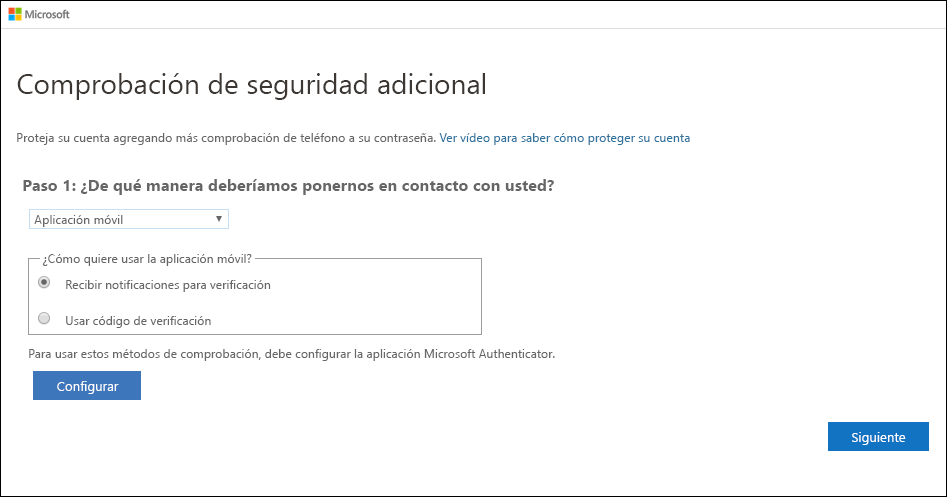
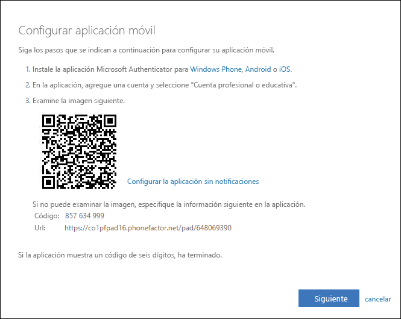
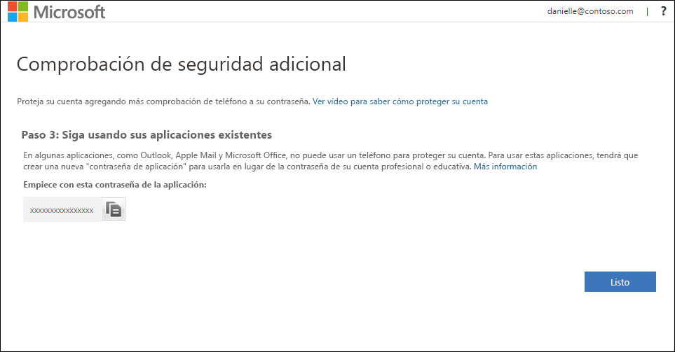
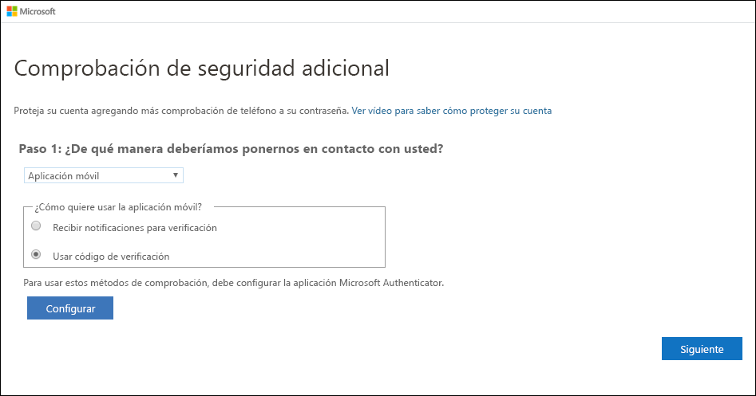
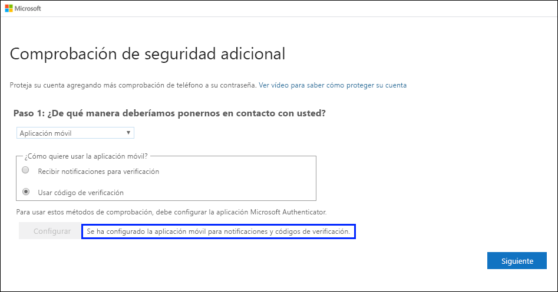
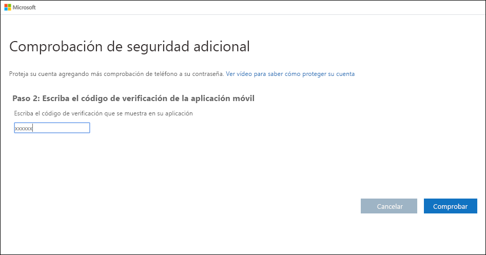

# Configuración de una aplicación de autenticación como método de verificación en dos fases

Se puede configurar una aplicación de autenticación para que envíe una notificación a su dispositivo móvil o para que envíe un código de verificación como método de verificación de seguridad. Si no necesita usar la aplicación Microsoft Authenticator, puede seleccionar otra aplicación diferente durante el proceso de configuración. Sin embargo, en este artículo se usa la aplicación Microsoft Authenticator.

>[!Important]
>Antes de agregar su cuenta, debe descargar e instalar la aplicación Microsoft Authenticator. Si no lo ha hecho aún, siga los pasos descritos en el artículo para [descargar e instalar la aplicación](user-help-auth-app-download-install.md).

>[!Note]
> Si la opción de aplicación móvil está atenuada, es posible que su organización no le permita usar una aplicación de autenticación para la verificación. En este caso, tendrá que seleccionar otro método o ponerse en contacto con su administrador para obtener más ayuda.

## Configuración de la aplicación Microsoft Authenticator para enviar notificaciones

1. En la página **Comprobación de seguridad adicional**, seleccione **Aplicación móvil** en el área **Paso 1: ¿De qué manera deberíamos ponernos en contacto con usted?**

2. Seleccione **Recibir notificaciones para verificación** en el área **¿Cómo quiere usar la aplicación móvil?** y, a continuación, seleccione **Configurar**.

    

    Aparece la página **Configurar aplicación móvil**.

    

3. Abra la aplicación Microsoft Authenticator, seleccione **Agregar cuenta** en el icono **Personalizar y controlar** en la esquina superior derecha y, a continuación, seleccione **Cuenta profesional o educativa**.

    >[!Note]
    >Si es la primera vez que configura la aplicación Microsoft Authenticator, es posible que reciba un mensaje en el que se le pregunta si quiere permitir que la aplicación acceda a la cámara (iOS) o permitir que la aplicación tome fotografías y grabe vídeo (Android). Debe seleccionar **Permitir** para que la aplicación de autenticación pueda acceder a la cámara y tomar una fotografía del código QR en el paso siguiente. Aunque no otorgue permiso a la cámara, podrá configurar la aplicación de autenticación, pero tendrá que agregar la información de código manualmente. Para más información sobre cómo agregar manualmente código, consulte [Agregar manualmente una cuenta a la aplicación](user-help-auth-app-add-account-manual.md).

4. Use la cámara del dispositivo para digitalizar el código QR desde la pantalla **Configurar aplicación móvil** del equipo y, después, elija **Siguiente**.

5. Vuelva al equipo, asegúrese de que en la página **Comprobación de seguridad adicional** aparece el mensaje que indica que la configuración se realizó correctamente y, después, seleccione **Siguiente**.

    

    La aplicación de autenticación enviará una notificación al dispositivo móvil como prueba.

6. En el dispositivo móvil, seleccione **Aprobar**.

7. En el equipo, agregue el número de teléfono del dispositivo móvil en el área **Paso 3: En el caso de que haya perdido el acceso a la aplicación móvil** y, después, seleccione **Siguiente**.

    Le recomendamos encarecidamente que agregue el número de teléfono del dispositivo móvil para que actúe como copia de seguridad si no puede acceder a la aplicación móvil ni usarla por cualquier motivo.

8. En el área **Paso 4: Siga usando sus aplicaciones existentes** se indicará una contraseña de aplicación; cópiela y péguela en un lugar seguro.

    

    >[!Note]
    >Para obtener información sobre el uso de la contraseña de aplicación con las aplicaciones antiguas, consulte [Administración de las contraseñas de aplicaciones](multi-factor-authentication-end-user-app-passwords.md). Solo tiene que usar contraseñas de aplicación si va a seguir usando aplicaciones antiguas que no admiten la verificación en dos fases.

9. Seleccione **Listo**.

## Configuración de la aplicación Microsoft Authenticator para usar códigos de verificación

1. En la página **Comprobación de seguridad adicional**, seleccione **Aplicación móvil** en el área **Paso 1: ¿De qué manera deberíamos ponernos en contacto con usted?**

2. Seleccione **Usar código de verificación** en el área **¿Cómo quiere usar la aplicación móvil?** y, a continuación, elija **Configurar**.

    

    Aparece la página **Configurar aplicación móvil**.

    

3. Abra la aplicación Microsoft Authenticator, seleccione **Agregar cuenta** en el icono **Personalizar y controlar** en la esquina superior derecha y, a continuación, seleccione **Cuenta profesional o educativa**.

    >[!Note]
    >Si es la primera vez que configura la aplicación Microsoft Authenticator, es posible que reciba un mensaje en el que se le pregunta si quiere permitir que la aplicación acceda a la cámara (iOS) o permitir que la aplicación tome fotografías y grabe vídeo (Android). Debe seleccionar **Permitir** para que la aplicación de autenticación pueda acceder a la cámara y tomar una fotografía del código QR en el paso siguiente. Aunque no otorgue permiso a la cámara, podrá configurar la aplicación de autenticación, pero tendrá que agregar la información de código manualmente. Para más información sobre cómo agregar manualmente código, consulte [Agregar manualmente una cuenta a la aplicación](user-help-auth-app-add-account-manual.md).

4. Use la cámara del dispositivo para digitalizar el código QR desde la pantalla **Configurar aplicación móvil** del equipo y, después, elija **Siguiente**.

5. Vuelva al equipo, asegúrese de que en la página **Comprobación de seguridad adicional** aparece el mensaje que indica que la configuración se realizó correctamente y, después, seleccione **Siguiente**.

    

    La aplicación de autenticación solicitará un código de verificación como prueba.

6. En la aplicación Microsoft Authenticator, desplácese hacia abajo hasta su cuenta profesional o educativa, copie y pegue el código de 6 dígitos de la aplicación en el cuadro **Paso 2: Escriba el código de verificación de la aplicación móvil** del equipo y, después, seleccione **Verificar**.

    

7. En el equipo, agregue el número de teléfono del dispositivo móvil en el área **Paso 3: En el caso de que haya perdido el acceso a la aplicación móvil** y, después, seleccione **Siguiente**.

    Le recomendamos encarecidamente que agregue el número de teléfono del dispositivo móvil para que actúe como copia de seguridad si no puede acceder a la aplicación móvil ni usarla por cualquier motivo.

8. En el área **Paso 4: Siga usando sus aplicaciones existentes** se indicará una contraseña de aplicación; cópiela y péguela en un lugar seguro.

    

    >[!Note]
    >Para obtener información sobre el uso de la contraseña de aplicación con las aplicaciones antiguas, consulte [Administración de las contraseñas de aplicaciones](multi-factor-authentication-end-user-app-passwords.md). Solo tiene que usar contraseñas de aplicación si va a seguir usando aplicaciones antiguas que no admiten la verificación en dos fases.

9. Seleccione **Listo**.

## Pasos siguientes

Después de configurar el método de verificación en dos fases, puede agregar otros métodos, administrar la configuración y las contraseñas de aplicación, iniciar sesión u obtener ayuda con algunos problemas comunes relacionados con la verificación en dos fases.

- [Administración de la configuración del método de verificación en dos fases](multi-factor-authentication-end-user-manage-settings.md)

- [Administración de las contraseñas de aplicación](multi-factor-authentication-end-user-app-passwords.md)

- [Inicio de sesión con la verificación en dos pasos](multi-factor-authentication-end-user-signin.md)

- [Obtención de ayuda con la verificación en dos fases](multi-factor-authentication-end-user-troubleshoot.md)
