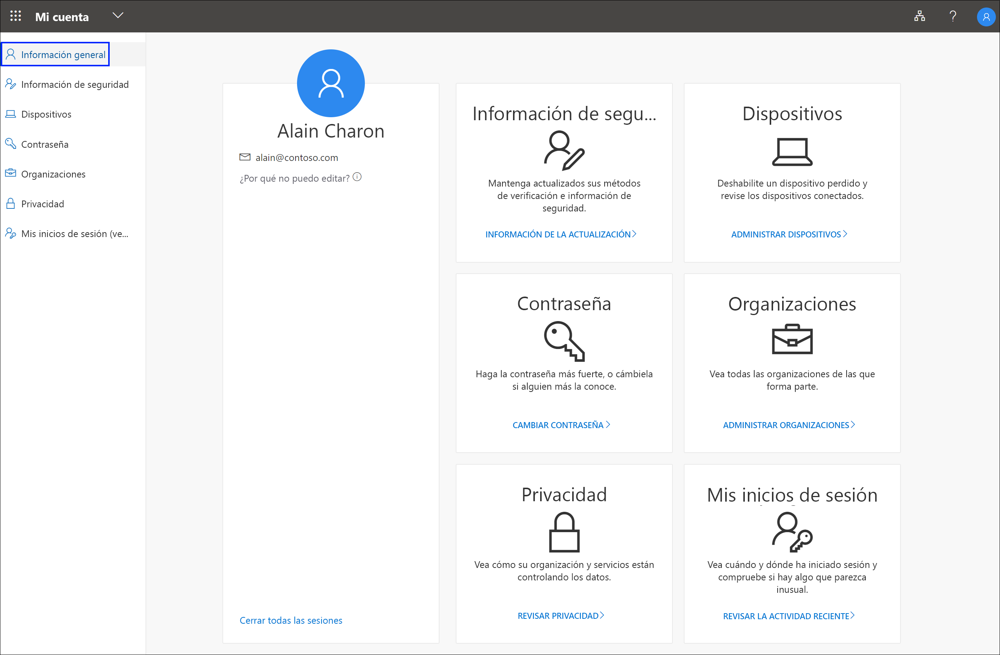

# ¿Qué es el portal Mi cuenta?

El portal **Mi cuenta** le ayuda administrar su cuenta profesional o educativa, ya que le permite configurar y administrar la información de seguridad, administrar las organizaciones y dispositivos conectados y ver cómo usa sus datos la organización.

Se puede acceder al portal **Mi cuenta** (https://myprofile.microsoft.com) desde la versión actual de cualquiera de los siguientes exploradores:

- Chrome
- Microsoft Edge
- Safari
- Firefox
- Internet Explorer 11

>[!Important]
>Este artículo está destinado a los usuarios que intentan acceder al portal Mi cuenta para actualizar su información de seguridad, la información del dispositivo, la contraseña, las organizaciones conectadas, la privacidad o la información de inicio de sesión anterior. Si es un administrador que busca información acerca de cómo activar la autenticación y otras características de Azure Active Directory (Azure AD) para los empleados y otros usos, consulte la [documentación de Azure AD para administradores](https://docs.microsoft.com/azure/active-directory/).

## Pasos siguientes

- Elija ver o administrar la [información de seguridad](user-help-security-info-overview.md).

- Vea o administre los dispositivos [conectados](my-account-portal-devices-page.md).

- Vea y administrar las [organizaciones](my-account-portal-organizations-page.md).

- Vea la [actividad del inicio de sesión](my-account-portal-sign-ins-page.md).

- Vea cómo se [usan los datos relacionados con la privacidad](my-account-portal-privacy-page.md) en la organización.

## Contenido de Microsoft Office relacionado

- [Iniciar sesión para administrar el producto de Office](https://support.office.com/article/sign-in-to-manage-your-office-product-959ac957-8d37-4ae4-b1b6-d6e4874e013f)

- [Vaya a la página de Office **Mi cuenta**](https://portal.office.com/account/)

- [Vaya a la página de Office **Mis instalaciones**](https://portal.office.com/account/#installs)

- [Vaya a la página de Office **Suscripciones**](https://portal.office.com/account/#subscriptions)