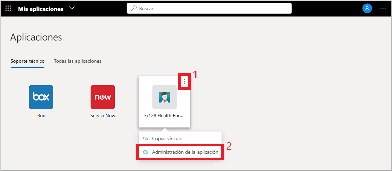
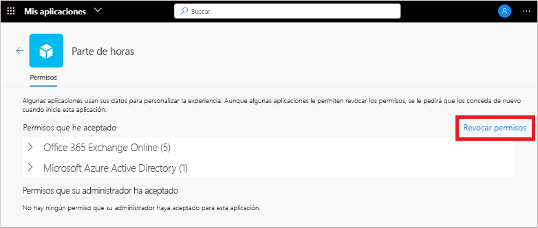

# Edición o revocación de permisos de aplicación en el portal Aplicaciones (versión preliminar)

Cuando se usan aplicaciones organizativas en el portal **Aplicaciones** (versión preliminar), a menudo se conceden permisos y se guarda la información de la cuenta. Para mantener los datos seguros, es posible que desee revisar y revocar los permisos o borrar las credenciales de cuenta guardadas. La eliminación de los permisos o las cuentas puede interrumpir alguna funcionalidad de la aplicación. Si tiene problemas después de quitar permisos o cuentas, póngase en contacto con el departamento de soporte técnico de su organización para obtener ayuda adicional.

[!INCLUDE [preview-notice](../../../includes/active-directory-end-user-my-apps-and-workspaces.md)]

>[!Important]
>Este contenido está diseñado para usuarios. Si es administrador, puede encontrar más información acerca de cómo configurar y administrar aplicaciones basadas en la nube en la [Documentación sobre la administración de aplicaciones](https://docs.microsoft.com/azure/active-directory/manage-apps/access-panel-workspaces).

## Administración de permisos de aplicación

Para ver los permisos que ha consentido usted o el administrador, seleccione **...** al mantener el puntero sobre una aplicación en el portal de **Aplicaciones** y, después, seleccione **Manage your application** (Administrar su aplicación):

La parte superior de la ventana de permisos muestra lo que ha consentido personalmente. Algunos ejemplos de permisos de aplicación son la capacidad de acceder al calendario, los contactos o la cámara.

Puede revocar cualquiera de los permisos que ha consentido seleccionando **Revocar permisos**. Sin embargo, quitar un permiso puede romper algunas de las funcionalidades de la aplicación. Si tiene problemas después de quitar permisos o cuentas, póngase en contacto con el departamento de soporte técnico de su organización para obtener ayuda adicional.

En la parte inferior de la ventana de permisos se muestra lo que el administrador consiente en su nombre. Esta sección no se muestra si no hay permisos consentidos por el administrador. No puede revocar estos permisos porque el administrador los ha consentido y suelen ser necesarios para la directiva de su organización.

## Pasos siguientes

Después de administrar los permisos de la aplicación y las cuentas guardadas en el portal **Aplicaciones**, puede:

- Organizar las aplicaciones en las distintas categorías creadas y proporcionadas por la organización. Para más información, vea [Acceso a las áreas de trabajo y uso de las mismas en el portal Aplicaciones (versión preliminar)](my-applications-portal-workspaces.md).

## Artículos relacionados

- [Actualización de la información del perfil y de la cuenta](my-account-portal-overview.md). Instrucciones sobre cómo actualizar la información personal que aparece en el portal **Mi perfil** (versión preliminar).

- [Administración de organizaciones](my-account-portal-organizations-page.md). Instrucciones sobre cómo ver y administrar la información relacionada con la organización en la página **Organizaciones** del portal **Mi perfil**.

- [Administración de los dispositivos conectados](my-account-portal-devices-page.md). Instrucciones sobre cómo administrar los dispositivos a los que está conectado con la cuenta profesional o educativa, en la página **Dispositivos** del portal **Mi perfil**.