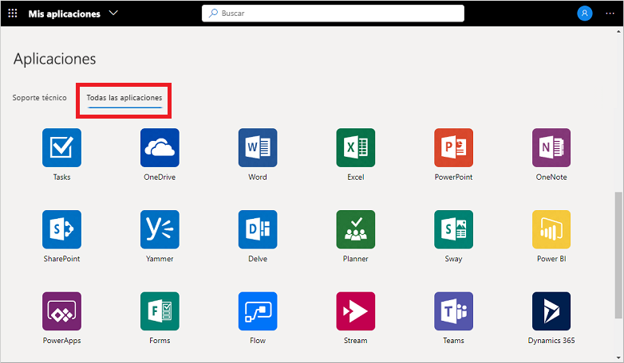
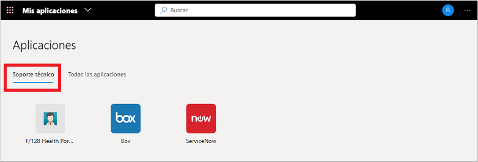

# Uso de colecciones en el portal Aplicaciones

Las áreas de trabajo son diferentes vistas de las aplicaciones que se muestran en el portal **Aplicaciones**. Las aplicaciones se pueden agrupar en colecciones según la función de departamento o el rol de usuario, por ejemplo. Si no ve ninguna colección o categoría disponible, significa que el administrador no ha configurado ni compartido ninguna con usted. Póngase en contacto con el departamento de soporte técnico de la organización para obtener ayuda adicional o permisos para ver las colecciones compartidas.

[!INCLUDE [preview-notice](../../../includes/active-directory-end-user-my-apps-and-workspaces.md)]

>[!Important]
>Este contenido está pensado para usuarios de **Aplicaciones**. Si es administrador, puede encontrar más información acerca de cómo configurar y administrar aplicaciones basadas en la nube en la [Documentación sobre la administración de aplicaciones](https://docs.microsoft.com/azure/active-directory/manage-apps/access-panel-workspaces).

## Acceso a las aplicaciones mediante las colecciones

De forma predeterminada, la lista de colecciones del portal **Aplicaciones** muestra una lista denominada **Todas las aplicaciones**, que incluye todas las aplicaciones a las que tiene acceso:

Cualquier otra colección que vea en esta lista la creó el administrador y la compartió con usted. Puede elegir una de esas colecciones para ver un conjunto de aplicaciones más amplio, como *Compatibilidad* en el ejemplo siguiente:

Al seleccionar y ver una colección, solo verá las aplicaciones predeterminadas a las que tiene acceso.

## Pasos siguientes

Después de organizar las aplicaciones en las distintas categorías del portal **Aplicaciones**, puede:

- Revisar, actualizar o revocar los permisos concedidos a las aplicaciones. Para más información, consulte [Edición o revocación de permisos de aplicación en el portal Aplicaciones](my-applications-portal-permissions-saved-accounts.md).

## Artículos relacionados

- [Actualización de la información del perfil y de la cuenta](my-account-portal-overview.md). Instrucciones sobre cómo actualizar la información personal que aparece en el portal **Mi perfil**.

- [Administración de organizaciones](my-account-portal-organizations-page.md). Instrucciones sobre cómo ver y administrar la información relacionada con la organización en la página **Organizaciones** del portal **Mi perfil**.

- [Administración de los dispositivos conectados](my-account-portal-devices-page.md). Instrucciones sobre cómo administrar los dispositivos a los que está conectado con la cuenta profesional o educativa, en la página **Dispositivos** del portal **Mi perfil**.