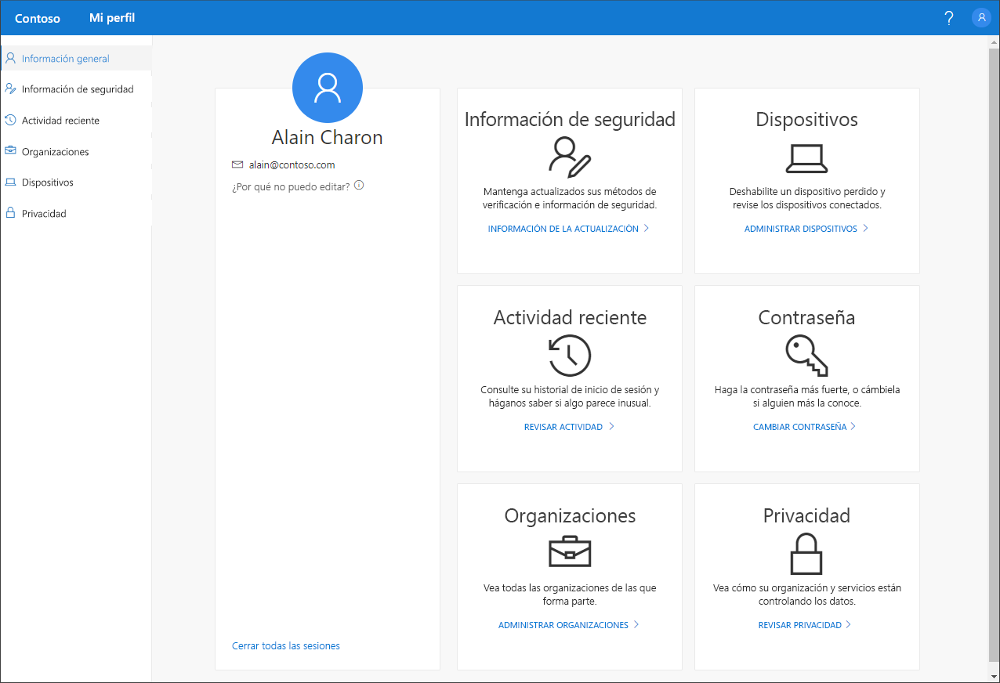

# Introducción al portal Mi perfil (versión preliminar)

[!INCLUDE [preview-notice](../../../includes/active-directory-end-user-preview-notice-myprofile.md)]

El portal **Mi perfil** (versión preliminar) se puede usar para administrar una cuenta profesional o educativa para:

- Configurar y administrar la información de seguridad para la verificación en dos pasos y el restablecimiento de la contraseña.

- Ver la actividad del inicio de sesión.

- Administrar las organizaciones y los dispositivos conectados.

- Ver cómo usa su organización los datos.

>[!Important]
>Este contenido está diseñado para usuarios. Si es un administrador, puede encontrar más información acerca de cómo configurar y administrar su entorno de Azure Active Directory (Azure AD) en la [documentación de Azure Active Directory](https://docs.microsoft.com/azure/active-directory).

## Acceso al portal Mi perfil
Para acceder al portal **Mi perfil**, diríjase a https://myprofile.microsoft.com desde la versión actual de cualquiera de los siguientes exploradores:

- Chrome
- Microsoft Edge
- Safari
- Firefox
- Internet Explorer 11

    

## En esta sección
Puede encontrar más información acerca del portal **Mi perfil** y sus páginas en los siguientes artículos.

|Artículo |Descripción |
|------|------------|
|[Administración de la información de seguridad (versión preliminar)](user-help-security-info-overview.md)|Describe cómo configurar y administrar la información de seguridad.|
|[Visualización de las actividades de inicio de sesión recientes](myprofile-portal-recent-activity-page.md)|Describe cómo ver las últimas actividades de inicio de sesión de su cuenta profesional o educativa.|
|[Administración de organizaciones](myprofile-portal-organizations-page.md)|Describe cómo administrar las organizaciones conectadas a su cuenta profesional o educativa.|
|[Administración de los dispositivos conectados](myprofile-portal-devices-page.md)| Describe cómo administrar los dispositivos que ha conectado a su cuenta profesional o educativa.|
|[Ver la información de privacidad](myprofile-portal-privacy-page.md)|Describe cómo ver lo que su organización hace con sus datos.|