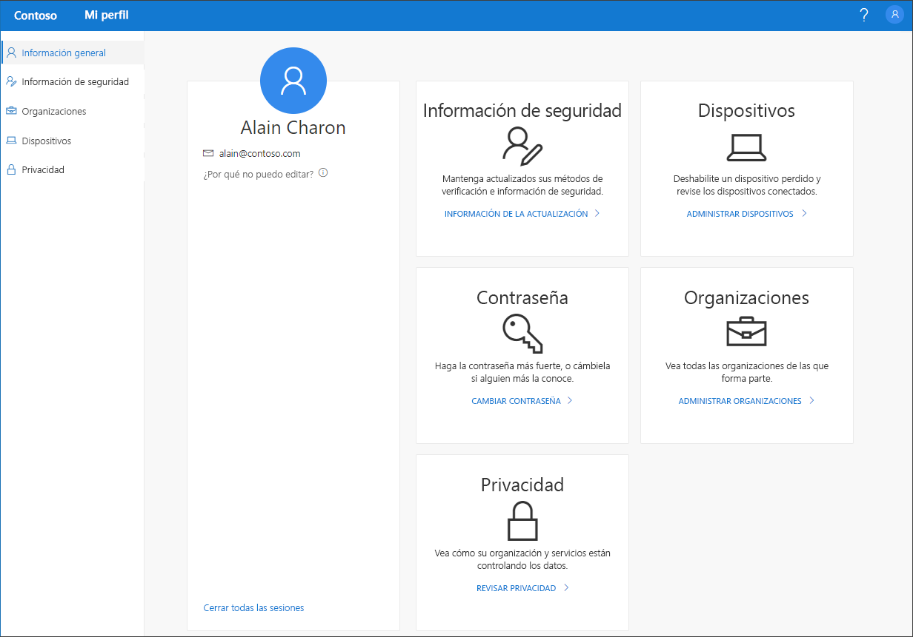

# Introducción al portal Mi perfil (versión preliminar)

[!INCLUDE [preview-notice](../../../includes/active-directory-end-user-preview-notice-myprofile.md)]

El portal **Mi perfil** (versión preliminar) le ayuda administrar su cuenta profesional o educativa, para lo que debe configurar y administrar la información de seguridad, administrar las organizaciones y dispositivos conectados, y ver la forma en que su organización usa los datos.

>[!Important]
>Este contenido está diseñado para usuarios. Si es un administrador, puede encontrar más información acerca de cómo configurar y administrar su entorno de Azure Active Directory (Azure AD) en la [documentación de Azure Active Directory](https://docs.microsoft.com/azure/active-directory).

## Ir al portal Mi perfil

Se puede acceder al portal **Mi perfil**, (https://myprofile.microsoft.com) desde la versión actual de cualquiera de los siguientes exploradores:

- Chrome
- Microsoft Edge
- Safari
- Firefox
- Internet Explorer 11

## Artículos acerca del portal Mi perfil

Para obtener información detallada e instrucciones acerca de los elementos a los que se puede acceder desde el portal **Mi perfil**, consulte los artículos siguientes:

|Artículo |DESCRIPCIÓN |
|------|------------|
|[Adición de información de seguridad](user-help-security-info-overview.md)| Varios artículos con instrucciones acerca de cómo configurar la aplicación Microsoft Authenticator, la mensajería de texto o las llamadas de teléfono como método de verificación. También incluye artículos acerca de cómo agregar una dirección de correo electrónico o preguntas de seguridad predefinidas para restablecer una contraseña, en caso de que se haya olvidado.|
|[Visualización o conservación de organizaciones conectadas](myprofile-portal-organizations-page.md)| Instrucciones para ver y dejar las organizaciones conectadas a su cuenta profesional o educativa.|
|[Visualización o habilitación de dispositivos conectados](myprofile-portal-devices-page.md)| Instrucciones para ver o deshabilitar todos los dispositivos conectados a su cuenta profesional o educativa.|
|[Ver la información de privacidad](myprofile-portal-privacy-page.md)| Instrucciones para ver qué servicios en línea están conectados a su cuenta profesional o educativa, junto con el extracto de las condiciones de uso de su organización.|