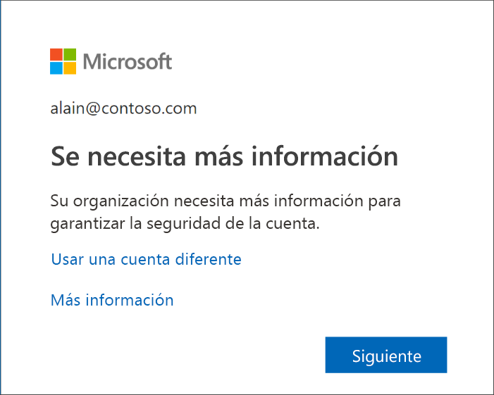
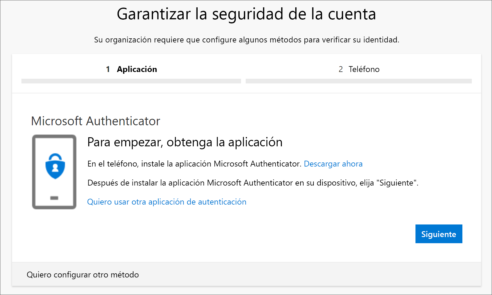
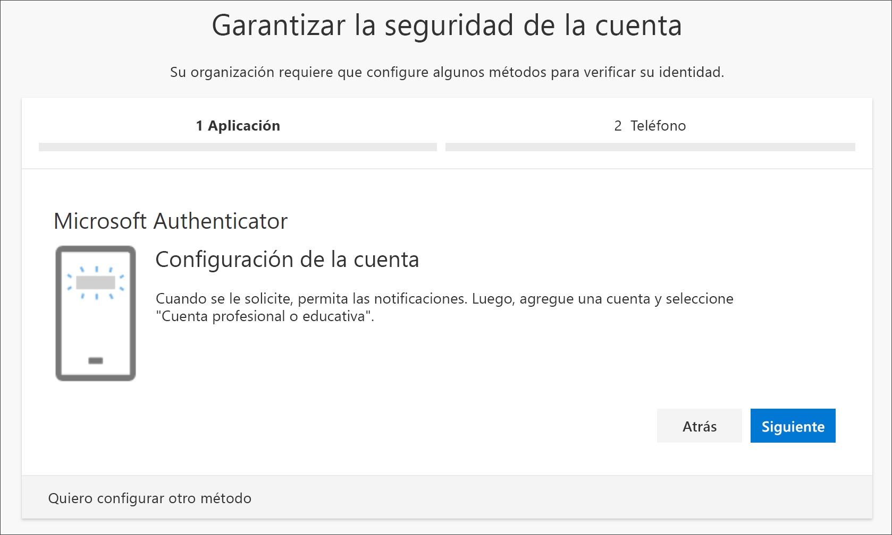
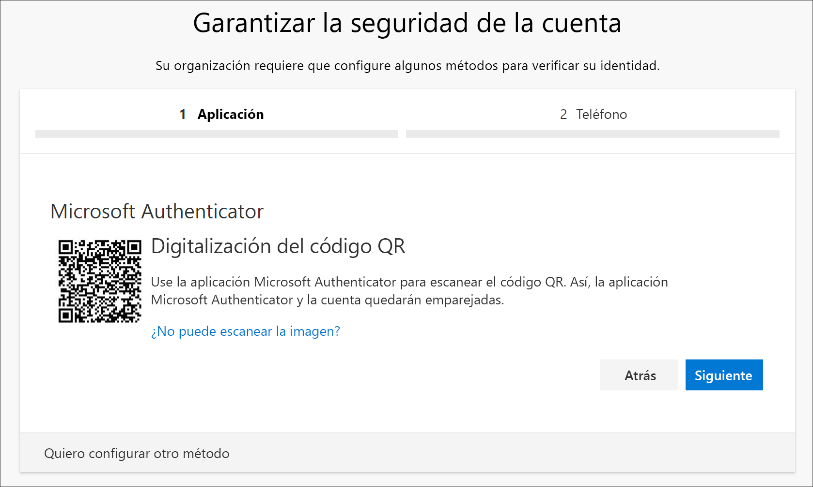
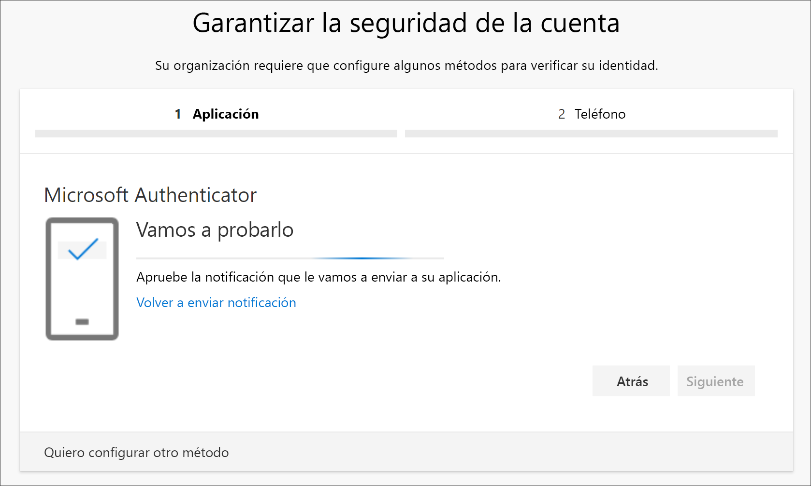
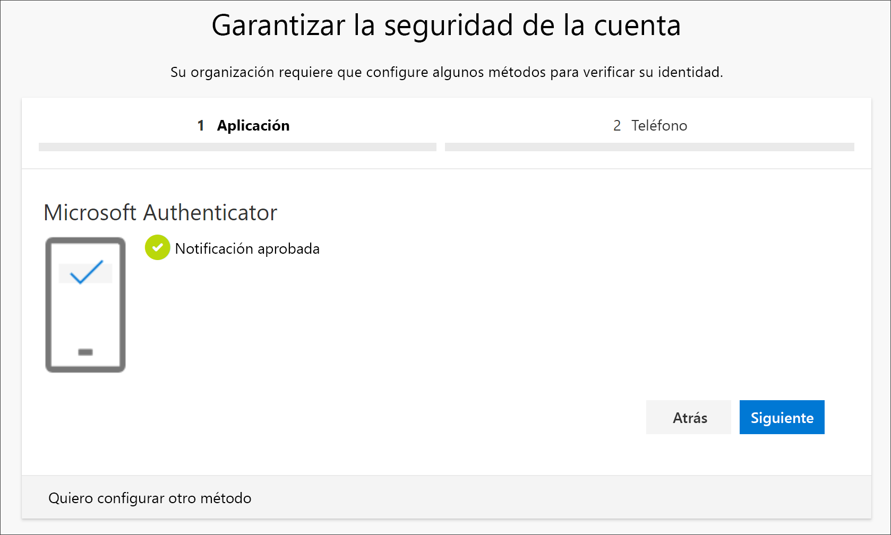
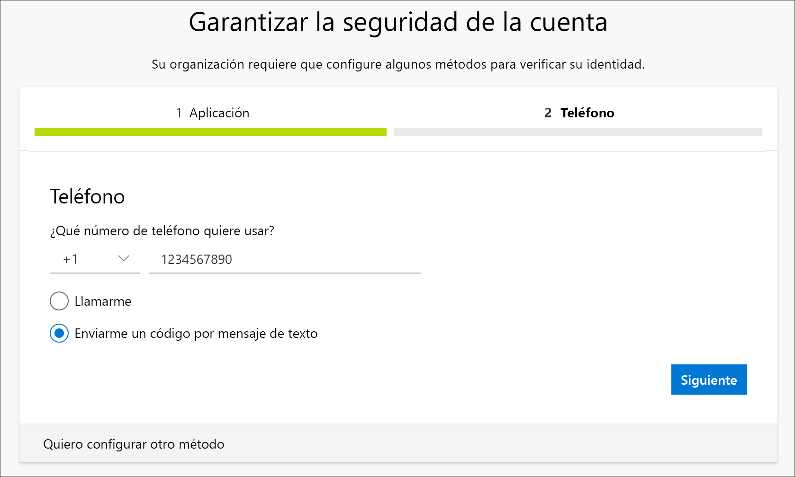
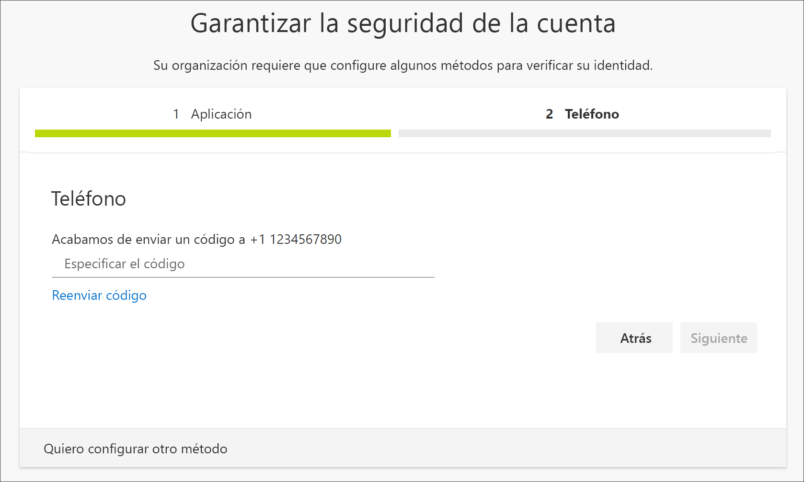
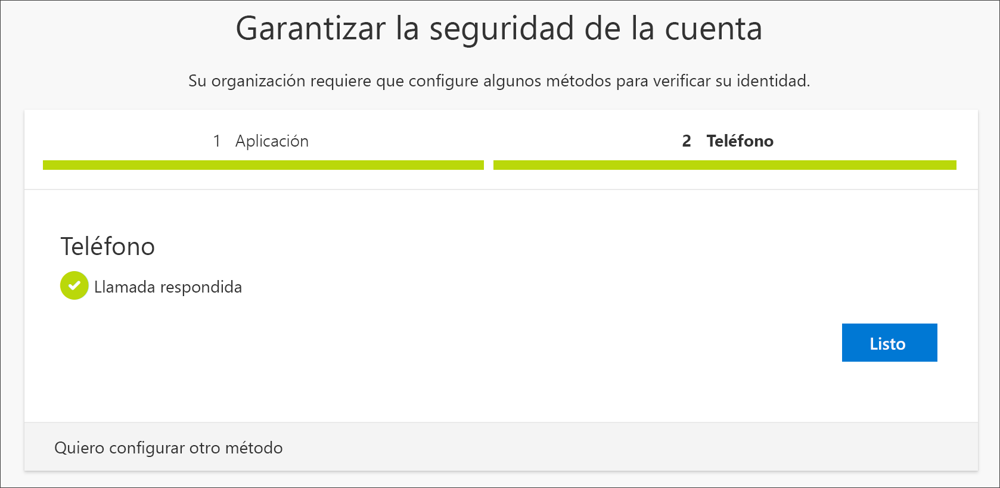
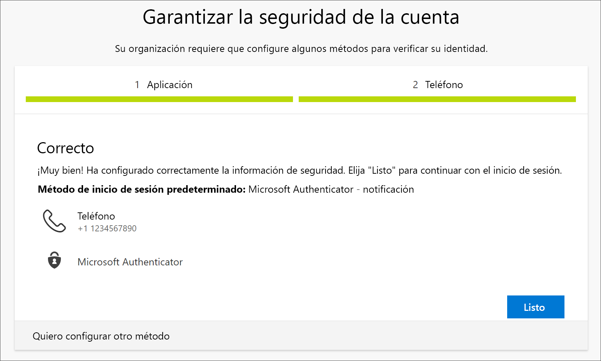

# Configuración de la información de seguridad (versión preliminar) desde el mensaje de la página de inicio de sesión
Puede seguir estos pasos si se le pide que configure la información de seguridad inmediatamente después de que iniciar sesión con su cuenta profesional o educativa.

Solo verá este mensaje si no ha configurado la información de seguridad que requiere su organización. Si ya ha configurado la información de seguridad, pero desea realizar cualquier cambio, puede seguir los pasos descritos en los distintos artículos de procedimientos basados en métodos. Para más información, consulte [Add or update your security info overview](security-info-add-update-methods-overview.md) (Introducción a la adición o actualización de la información de seguridad).

[!INCLUDE [preview-notice](../../../includes/active-directory-end-user-preview-notice-security-info.md)]

## Inicio de sesión con una cuenta profesional o educativa
Después de iniciar sesión con su cuenta profesional o educativa, verá un mensaje en el que se le pide que proporcione más información para que se le permita acceder a su cuenta.

## Configuración de la información de seguridad mediante el asistente
Siga estos pasos para configurar la información de seguridad de su cuenta profesional o educativa desde el mensaje.

>[!Important]
>Esto es solo un ejemplo del proceso. En función de los requisitos de la organización, el administrador puede haber instalado distintos métodos de comprobación que necesitará configurar durante este proceso. Para este ejemplo, se requieren dos métodos, la aplicación Microsoft Authenticator y un número de teléfono móvil para realizar una llamada o enviar un mensaje de texto de comprobación.

1. Después de seleccionar **Siguiente** en el mensaje, aparece el **Asistente para mantener la cuenta segura**, en el que se muestra el primer método que tanto el administrador como la organización requieren que configure. En este ejemplo, es la aplicación Microsoft Authenticator.

    >[!Note]
    >Si desea usar una aplicación de autenticación que no sea Microsoft Authenticator, seleccione el vínculo **Quiero usar otra aplicación de autenticación**.
    
    >Si su organización le permite elegir un método que no sea la aplicación de autenticación, puede seleccionar el vínculo **I want to set up a different method** (Quiero configurar otro método).

    

2. Seleccione **Descargar ahora** para descargar e instalar la aplicación Microsoft Authenticator en un dispositivo móvil y, después, seleccione **Siguiente**. Para más información acerca de cómo descargar e instalar la aplicación, consulte [Download and install the Microsoft Authenticator app](user-help-auth-app-download-install.md) (Descargar e instalar la aplicación Microsoft Authenticator).

    

3. Permanezca en la página **Configuración de la cuenta** mientras configura la aplicación Microsoft Authenticator en el dispositivo móvil.

4. Abra la aplicación Microsoft Authenticator, seleccione que permita las notificaciones (si se le solicita), **Agregar cuenta** en el icono **Customize and control** (Personalizar y controlar) de la esquina superior derecha y, después, seleccione **Cuenta profesional o educativa**.

5. Vuelva a la página **Configuración de la cuenta** en el equipo y seleccione **Siguiente**.

    Aparece la página **Digitalización del código QR** .

    

6. Lea el código que se proporciona, para lo que debe usar el lector de códigos QR de la aplicación Microsoft Authenticator, que apareció en el dispositivo móvil tras crear la cuenta profesional o educativa en el paso 5.

    La aplicación de autenticación debería agregar correctamente la cuenta profesional o educativa sin solicitarle más información. No obstante, si el lector de códigos QR no lee este, puede seleccionar el vínculo **Can't scan the QR code** (No se puede leer el código QR) y especificar manualmente la dirección URL y el código en la aplicación Microsoft Authenticator. Para más información acerca de cómo agregar manualmente un código, consulte [Agregar manualmente una cuenta a la aplicación](user-help-auth-app-add-account-manual.md).

7. Seleccione **Siguiente** en la página **Digitalización del código QR** del equipo.

    Se envía una notificación a la aplicación Microsoft Authenticator del dispositivo móvil para que pruebe la cuenta.

    

8. Apruebe la notificación en la aplicación Microsoft Authenticator y seleccione **Siguiente**.

    .

    La información de seguridad se actualiza para usar la aplicación Microsoft Authenticator de forma predeterminada para comprobar su identidad cuando se usan la verificación en dos pasos o el restablecimiento de contraseña.

9. En la página de configuración del **teléfono**, elija si desea recibir un mensaje de texto o una llamada de teléfono y seleccione **Siguiente**. En este ejemplo vamos a usar mensajes de texto, por lo que debe usar el número de teléfono de un dispositivo que pueda aceptar mensajes de texto.

    

    Se envía un mensaje de texto al número de teléfono. Si prefiere recibir una llamada telefónica, el proceso es el mismo. Sin embargo, recibirá una llamada telefónica con instrucciones, en lugar de un mensaje de texto.

10. Especifique el código que proporciona el mensaje de texto que se ha enviado al dispositivo móvil y, después, seleccione **Siguiente**.

    

11. Revise que la notificación sea correcta y seleccione **Listo**.

    

    La información de seguridad se actualiza para usar mensajes de texto como método de seguridad para comprobar su identidad al usar la verificación en dos pasos o el restablecimiento de contraseña.

12. Revise la página **Success** (Correcto) para comprobar que ha configurado correctamente tanto la aplicación Microsoft Authenticator como el método del teléfono (llamada de teléfono o mensaje de texto) para la información de seguridad y, después, seleccione **Listo**.

    

## Pasos siguientes

- Para cambiar, eliminar o actualizar los métodos predeterminados de la información de seguridad, consulte:

    - [Configuración de la información de seguridad de una aplicación de autenticación](security-info-setup-auth-app.md).

    - [Configuración de la información de seguridad para usar la mensajería de texto](security-info-setup-text-msg.md).

    - [Configuración de la información de seguridad para usar las llamadas de teléfono](security-info-setup-phone-number.md).

    - [Configuración de la información de seguridad para usar el correo electrónico](security-info-setup-email.md).

    - [Configuración de la información de seguridad para usar las preguntas de seguridad predefinidas](security-info-setup-questions.md).

- Para obtener información acerca de cómo iniciar sesión mediante el método especificado, consulte [Inicio de sesión con la información de seguridad o la verificación en dos pasos](user-help-sign-in.md).

- Restablezca la contraseña si ha perdido u olvidado la que tenía acudiendo al [portal de restablecimiento de contraseña](https://passwordreset.microsoftonline.com/) o siga los pasos descritos en el artículo [Restablecimiento de la contraseña profesional o educativa](user-help-reset-password.md).

- Obtenga soluciones de problemas, sugerencias y ayuda para los problemas de inicio de sesión en el artículo [Cuando no puedes iniciar sesión en tu cuenta de Microsoft](https://support.microsoft.com/help/12429/microsoft-account-sign-in-cant).