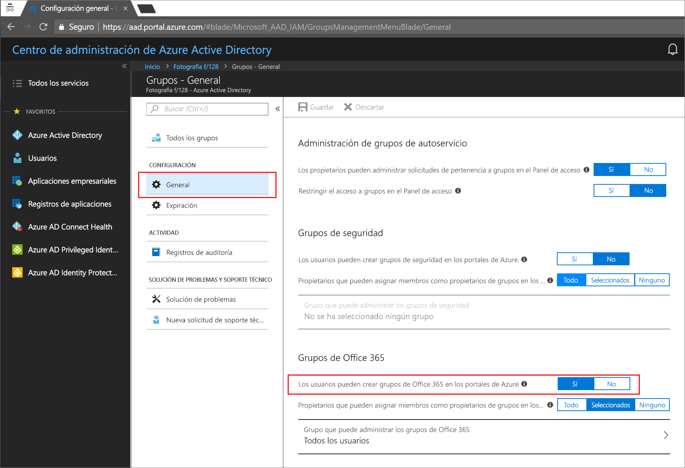
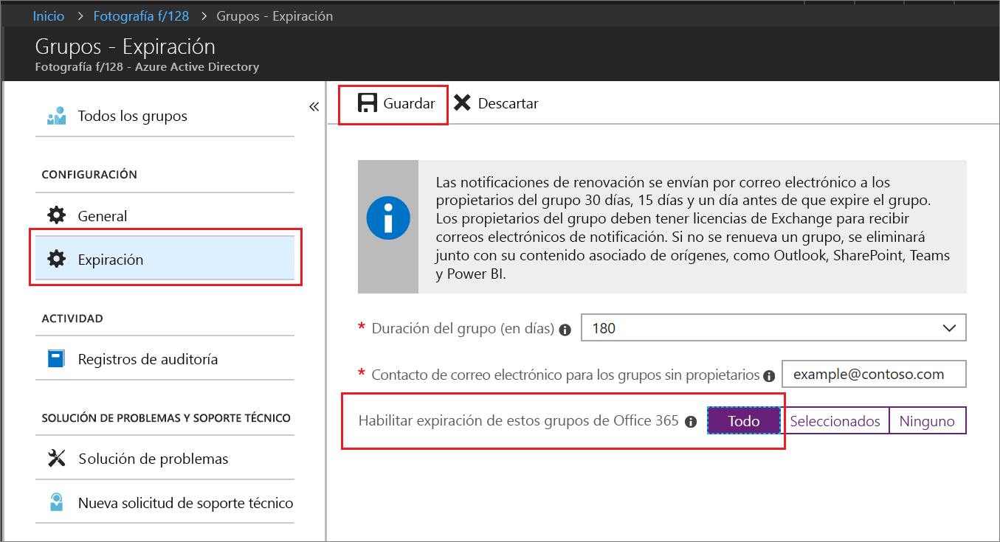

# Inicio rápido: Establecimiento de los grupos de Office 365 que expiran en Azure Active Directory

En esta guía de inicio rápido, puede establecer la directiva de expiración para los grupos de Office 365. Cuando los usuarios pueden configurar sus propios grupos, el número de grupos sin uso se puede multiplicar. Una manera de administrar los grupos sin uso es establecer la expiración de dichos grupos, para reducir el mantenimiento de la eliminación manual de grupos.

La directiva de expiración es sencilla:

* Los propietarios del grupo reciben una notificación para renovar un grupo que va a expirar.
* Se eliminará cualquier grupo que no se renueve.
* El propietario de un grupo o un administrador de Azure AD pueden restaurar un grupo de Office 365 eliminado en 30 días.

Si no tiene una suscripción a Azure, cree una [cuenta gratuita](https://azure.microsoft.com/free/) antes de empezar.

## Requisito previo

Debe ser un administrador global o un administrador de cuenta de usuario del inquilino para configurar la expiración de grupos.

## Activación de la creación de grupos por el usuario

1. Inicie sesión en [Azure Portal](https://portal.azure.com) con una cuenta que sea administrador global o administrador de cuentas de usuario del directorio.

2. Seleccione **Grupos** y, a continuación, seleccione **General**.
  
  

3. Establezca **Los usuarios pueden crear grupos de Office 365** en **Sí**.

4. Seleccione **Guardar** para guardar la configuración de grupos cuando haya terminado.

## Establecimiento de la expiración de grupo

1. Inicie sesión en [Azure Portal](https://portal.azure.com), seleccione **Azure Active Directory** > **Grupos** > **Expiración** para abrir la configuración de expiración.
  
  

2. Establezca el intervalo de expiración. Seleccione un valor preestablecido o escriba un valor personalizado superior a 31 días. 

3. Especifique una dirección de correo electrónico a la que deben enviarse las notificaciones de expiración cuando un grupo no tiene propietario.

4. Para esta guía de inicio rápido, establezca **Habilitar expiración de estos grupos de Office 365** en **Todos**.

5. Seleccione **Guardar** para guardar la configuración de expiración cuando haya terminado.

Eso es todo. En esta guía de inicio rápido, ha establecido correctamente la directiva de expiración para los grupos de Office 365 seleccionados.

## Limpieza de recursos

**Para eliminar la directiva de expiración**

1. Asegúrese de que ha iniciado sesión en [Azure Portal](https://portal.azure.com) con una cuenta que sea el administrador global del inquilino.
2. Seleccione **Azure Active Directory** > **Grupos** > **Expiración**.
3. Establezca **Habilitar expiración de estos grupos de Office 365** en **Ninguno**.

**Para desactivar la creación de grupos por el usuario**

1. Seleccione **Azure Active Directory** > **Grupos** > **General**. 
2. En Azure Portal, establezca **Los usuarios pueden crear grupos de Office 365** en **No**.

## Pasos siguientes

Para más información sobre la expiración, incluidas las limitaciones técnicas, la adición de una lista de palabras bloqueadas personalizadas y las experiencias de usuario final en las aplicaciones de Office 365, consulte el siguiente artículo que contiene los detalles de dichas directivas de expiración:

> [!div class="nextstepaction"]
> [Todos los detalles de las directivas de expiración](groups-lifecycle.md)
