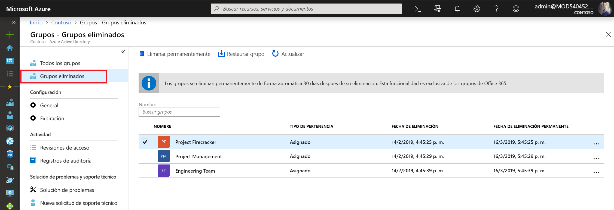

# <a name="restore-a-deleted-office-365-group-in-azure-active-directory"></a>Restauración de un grupo eliminado de Office 365 en Azure Active Directory

Cuando se elimina un grupo de Office 365 en Azure Active Directory (Azure AD), el grupo eliminado queda retenido y deja de estar visible durante 30 días a contar desde la fecha de eliminación. Este comportamiento es tal para que el grupo y su contenido se puedan restaurar en caso necesario. Esta funcionalidad está restringida exclusivamente a los grupos de Office 365 en Azure AD. No está disponible para los grupos de seguridad ni los grupos de distribución. Tenga en cuenta que el período de 30 días de restauración del grupo no es personalizable.

> [!NOTE]
> No utilice `Remove-MsolGroup` porque purga el grupo de forma permanente. Utilice siempre `Remove-AzureADMSGroup` para eliminar un grupo de Office 365.

Los permisos necesarios para restaurar un grupo pueden ser cualquiera de los siguientes:

Rol | Permisos
--------- | ---------
Administrador de empresa, soporte técnico de nivel 2 para asociados y administrador de Intune | Puede restaurar cualquier grupo eliminado de Office 365
Administrador de usuarios y soporte técnico de nivel 1 para asociados | Puede restaurar cualquier grupo eliminado de Office 365, excepto los asignados al rol Administrador de la compañía
Usuario | Puede restaurar cualquier grupo de Office 365 eliminado de su propiedad

## <a name="view-and-manage-the-deleted-office-365-groups-that-are-available-to-restore"></a>Visualización y administración de los grupos eliminados de Office 365 disponibles para restauración

1. Inicie sesión en el [Centro de administración de Azure AD](https://aad.portal.azure.com) con una cuenta de administrador de usuarios.

2. Seleccione **Grupos** y, a continuación, seleccione **Grupos eliminados** para ver los grupos eliminados que están disponibles para restaurar.

    

3. En la hoja **Grupos eliminados**, puede:

   - Seleccionar **Restaurar grupo** para restaurar el grupo eliminado y su contenido.
   - Quite de forma permanente el grupo eliminado mediante la selección de **Eliminar permanentemente**. Para quitar de forma definitiva un grupo, debe ser un administrador.

## <a name="view-the-deleted-office-365-groups-that-are-available-to-restore-using-powershell"></a>Visualización de los grupos eliminados de Office 365 disponibles para restaurar con PowerShell

Los cmdlets siguientes se pueden usar para ver los grupos eliminados y comprobar que todavía no se purgaron los que le interesan. Estos cmdlets son parte del [módulo de Azure AD PowerShell](https://www.powershellgallery.com/packages/AzureAD/). Puede encontrar más información sobre este módulo en el artículo sobre la [versión 2 de Azure Active Directory PowerShell](/powershell/azure/install-adv2?view=azureadps-2.0).

1.  Ejecute el cmdlet siguiente para mostrar todos los grupos eliminados de Office 365 existentes en el inquilino que todavía se pueden restaurar.
   

    ```powershell
    Get-AzureADMSDeletedGroup
    ```

2.  Como alternativa, si conoce el id. de objeto de un grupo específico (y puede obtenerlo del cmdlet del paso 1), ejecute el cmdlet siguiente para comprobar que el grupo eliminado específico todavía no se purgó de forma permanente.

    ```
    Get-AzureADMSDeletedGroup –Id <objectId>
    ```

## <a name="how-to-restore-your-deleted-office-365-group-using-powershell"></a>Procedimiento para restaurar grupos eliminados de Office 365 con PowerShell

Una vez que haya comprobado que el grupo todavía se puede restaurar, siga uno de los pasos siguientes para restaurar el grupo eliminado. Si el grupo contiene documentos, sitios de SP u otros objetos persistentes, el proceso completo de restauración de un grupo y su contenido podría demorar hasta 24 horas.

1. Ejecute el cmdlet siguiente para restaurar el grupo y su contenido.
 

   ```
    Restore-AzureADMSDeletedDirectoryObject –Id <objectId>
    ``` 

2. Como alternativa, puede ejecutar el cmdlet siguiente para quitar el grupo eliminado de forma permanente.
    

    ```
    Remove-AzureADMSDeletedDirectoryObject –Id <objectId>
    ```

## <a name="how-do-you-know-this-worked"></a>¿Cómo se puede saber si funcionó?

Para comprobar que restauró correctamente un grupo de Office 365, ejecute el cmdlet `Get-AzureADGroup –ObjectId <objectId>` para mostrar información sobre el grupo. Una vez que la solicitud de restauración se complete:

- El grupo aparece en la barra de navegación izquierda de Exchange
- El plan del grupo aparecerá en Planner
- Los sitios de SharePoint y su contenido estarán disponibles
- Se podrá tener acceso al grupo desde cualquiera de los puntos de conexión de Exchange y otras cargas de trabajo de Office 365 compatibles con los grupos de Office 365

## <a name="next-steps"></a>Pasos siguientes

En estos artículos se proporciona información adicional sobre los grupos de Azure Active Directory.

* [Consulta de los grupos existentes](../fundamentals/active-directory-groups-view-azure-portal.md)
* [Administración de la configuración de un grupo](../fundamentals/active-directory-groups-settings-azure-portal.md)
* [Administrar miembros de un grupo](../fundamentals/active-directory-groups-members-azure-portal.md)
* [Administrar la pertenencia a grupos](../fundamentals/active-directory-groups-membership-azure-portal.md)
* [Administrar reglas dinámicas de los usuarios de un grupo](groups-dynamic-membership.md)