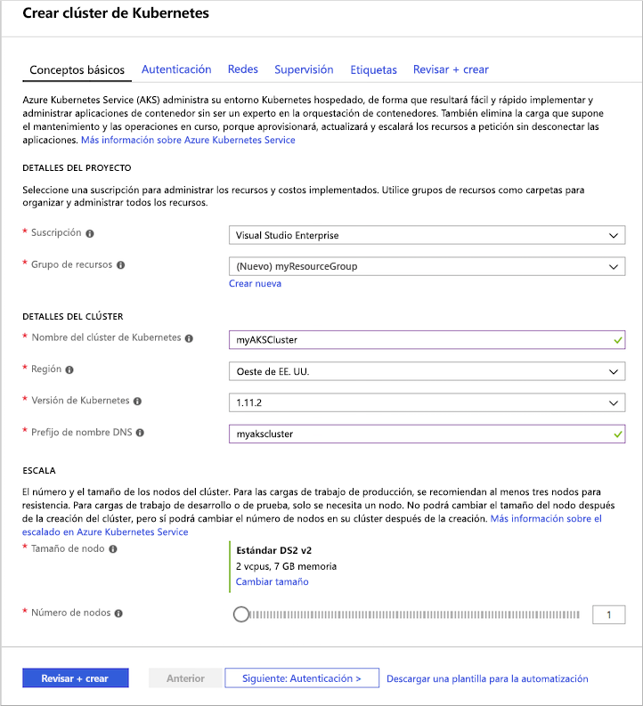
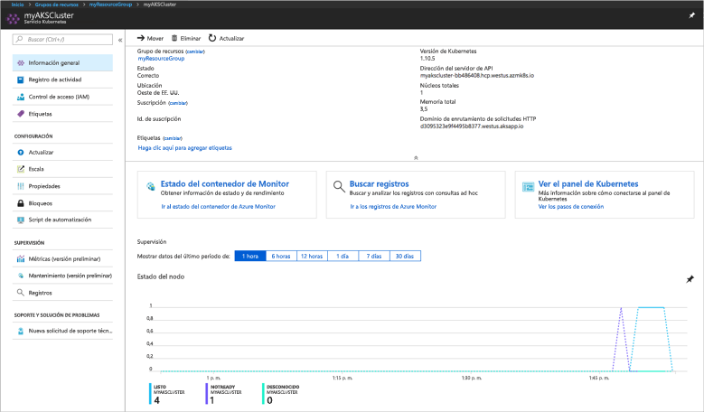
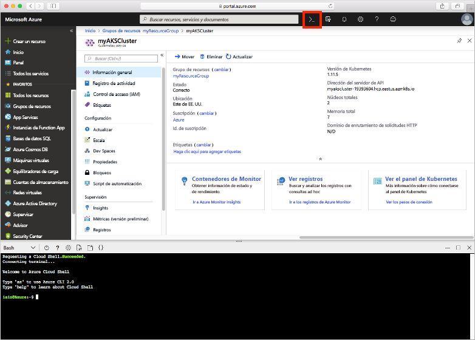
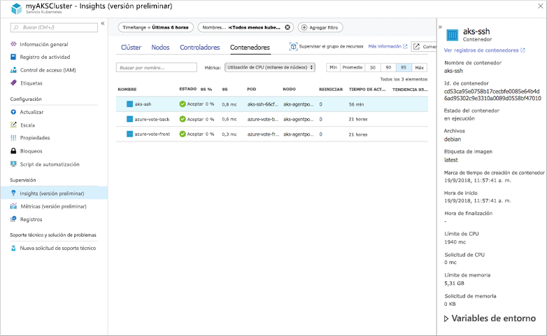
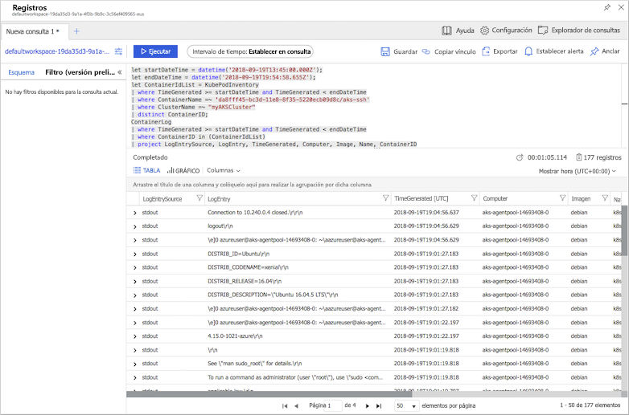

# <a name="quickstart-deploy-an-azure-kubernetes-service-aks-cluster-using-the-azure-portal"></a>Inicio rápido: Implementación de un clúster de Azure Kubernetes Service (AKS) mediante Azure Portal

Azure Kubernetes Service (AKS) es un servicio de Kubernetes administrado que le permite implementar y administrar clústeres rápidamente. En esta guía rápida, implementará un clúster de AKS mediante Azure Portal. En el clúster se ejecuta una aplicación de varios contenedores que incluye un front-end web y una instancia de Redis. A continuación, verá cómo supervisar el mantenimiento del clúster y los pods que ejecutan la aplicación.


En esta guía rápida se presupone un conocimiento básico de los conceptos de Kubernetes. Para más información, consulte [Conceptos básicos de Kubernetes de Azure Kubernetes Service (AKS)][kubernetes-concepts].

Si no tiene una suscripción a Azure, cree una [cuenta gratuita](https://azure.microsoft.com/free/?WT.mc_id=A261C142F) antes de empezar.

## <a name="sign-in-to-azure"></a>Inicio de sesión en Azure

Inicie sesión en Azure Portal en [https://portal.azure.com](https://portal.azure.com).

## <a name="create-an-aks-cluster"></a>Creación de un clúster de AKS

Para crear un clúster de AKS, realice los siguientes pasos:

1. En el menú de Azure Portal o en la **página principal**, seleccione **Crear un recurso**.

2. Seleccione **Containers** >  **Kubernetes Service**.

3. En la página **Datos básicos**, configure las siguientes opciones:
    - **Detalles del proyecto**: seleccione una **suscripción** de Azure y, a continuación, seleccione o cree un **grupo de recursos** de Azure, como *myResourceGroup*.
    - **Detalles del clúster**: Escriba un **Nombre del clúster de Kubernetes**, como *myAKSCluster*. seleccione la **región**, la **versión de Kubernetes** y el **prefijo del nombre DNS** para el clúster de AKS.
    - **Grupo de nodos principal**: seleccione un **tamaño de nodo** de máquina virtual para los nodos de AKS. El tamaño de máquina virtual *no puede* cambiarse una vez que se ha implementado un clúster de AKS. 
            Seleccione el número de nodos que se van a implementar en el clúster. En esta guía de inicio rápido, establezca **Número de nodos** en *1*. El número de nodos *puede* ajustarse después de implementar el clúster.
    
    

    Seleccione **Siguiente: Escala** cuando haya terminado.

4. En la página **Escala**, deje las opciones predeterminadas. En la parte inferior de la pantalla, haga clic en **Siguiente: Autenticación**.
    > [!CAUTION]
    > La creación de entidades de servicio de AAD puede tardar varios minutos en propagarse y estar disponible, lo que provoca errores de "no encontrado" en la entidad de servicio y de validación en Azure Portal. Si es el caso, visite [este artículo](troubleshooting.md#im-receiving-errors-that-my-service-principal-was-not-found-when-i-try-to-create-a-new-cluster-without-passing-in-an-existing-one) para conocer mitigaciones.

5. En la página **Autenticación**, configure las siguientes opciones:
    - Cree una entidad de servicio; para ello, deje el campo **Entidad de servicio** con **Entidad de servicio predeterminada (nueva)** . También puede elegir *Configurar la entidad de servicio* para usar una existente. Si usa una existente, deberá proporcionar el identificador de cliente y el secreto de SPN.
    - Habilite la opción para los controles de acceso basado en roles (RBAC) de Kubernetes. Esta opción proporciona un control más pormenorizado sobre el acceso a los recursos de Kubernetes implementado en el clúster de AKS.

De forma predeterminada, se usa la red *Básica* y está habilitado Azure Monitor para contenedores. Haga clic en **Revisar y crear** y, luego, en **Crear** cuando finalice la validación.

El clúster de AKS tarda unos minutos en crearse. Una vez finalizada la implementación, haga clic en **Ir al recurso**, o busque el grupo de recursos del clúster de AKS, como *myResourceGroup* y seleccione el recurso de AKS, por ejemplo, *myAKSCluster*. Se muestra el panel del clúster de AKS, como en este ejemplo:



## <a name="connect-to-the-cluster"></a>Conectarse al clúster

Para administrar un clúster de Kubernetes, usará [kubectl][kubectl], el cliente de línea de comandos de Kubernetes. El cliente `kubectl` viene preinstalado en Azure Cloud Shell.

Abra Cloud Shell mediante el botón `>_` de la parte superior de Azure Portal.



Para configurar `kubectl` para conectarse a su clúster de Kubernetes, use el comando [az aks get-credentials][az-aks-get-credentials]. Con este comando se descargan las credenciales y se configura la CLI de Kubernetes para usarlas. En el ejemplo siguiente se obtienen credenciales para el nombre de clúster *myAKSCluster* del grupo de recursos denominado *myResourceGroup*:

```azurecli-interactive
az aks get-credentials --resource-group myResourceGroup --name myAKSCluster
```

Para comprobar la conexión al clúster, use el comando [kubectl get][kubectl-get] para devolver una lista de los nodos del clúster.

```azurecli-interactive
kubectl get nodes
```

La salida del ejemplo siguiente muestra el nodo único creado en los pasos anteriores. Asegúrese de que el estado del nodo es *Listo*:

```
NAME                       STATUS    ROLES     AGE       VERSION
aks-agentpool-14693408-0   Ready     agent     15m       v1.11.5
```

## <a name="run-the-application"></a>Ejecución de la aplicación

Un archivo de manifiesto de Kubernetes define un estado deseado del clúster, por ejemplo, qué imágenes de contenedor se van a ejecutar. En esta guía de inicio rápido, se usa un manifiesto para crear todos los objetos necesarios para ejecutar la aplicación Azure Vote. Este manifiesto incluye dos [implementaciones de Kubernetes][kubernetes-deployment], una para las aplicaciones Python de Azure Vote de ejemplo y otra para una instancia de Redis. También se crean dos [servicios de Kubernetes][kubernetes-service], uno interno para la instancia de Redis y otro externo para acceder a la aplicación Azure Vote desde Internet.

> [!TIP]
> En esta guía de inicio rápido, se crean e implementan manualmente los manifiestos de aplicación en el clúster de AKS. En escenarios más reales, puede usar [Azure Dev Spaces][azure-dev-spaces] para iterar rápidamente y depurar el código directamente en el clúster de AKS. Puede usar Dev Spaces entre plataformas de sistemas operativos y entornos de desarrollo, y trabajar junto con otras personas de su equipo.

En Cloud Shell, use el comando `nano azure-vote.yaml` o `vi azure-vote.yaml` para crear un archivo denominado `azure-vote.yaml`. Después, copie la siguiente definición de código YAML:

```yaml
apiVersion: apps/v1
kind: Deployment
metadata:
  name: azure-vote-back
spec:
  replicas: 1
  selector:
    matchLabels:
      app: azure-vote-back
  template:
    metadata:
      labels:
        app: azure-vote-back
    spec:
      nodeSelector:
        "beta.kubernetes.io/os": linux
      containers:
      - name: azure-vote-back
        image: redis
        resources:
          requests:
            cpu: 100m
            memory: 128Mi
          limits:
            cpu: 250m
            memory: 256Mi
        ports:
        - containerPort: 6379
          name: redis
---
apiVersion: v1
kind: Service
metadata:
  name: azure-vote-back
spec:
  ports:
  - port: 6379
  selector:
    app: azure-vote-back
---
apiVersion: apps/v1
kind: Deployment
metadata:
  name: azure-vote-front
spec:
  replicas: 1
  selector:
    matchLabels:
      app: azure-vote-front
  template:
    metadata:
      labels:
        app: azure-vote-front
    spec:
      nodeSelector:
        "beta.kubernetes.io/os": linux
      containers:
      - name: azure-vote-front
        image: microsoft/azure-vote-front:v1
        resources:
          requests:
            cpu: 100m
            memory: 128Mi
          limits:
            cpu: 250m
            memory: 256Mi
        ports:
        - containerPort: 80
        env:
        - name: REDIS
          value: "azure-vote-back"
---
apiVersion: v1
kind: Service
metadata:
  name: azure-vote-front
spec:
  type: LoadBalancer
  ports:
  - port: 80
  selector:
    app: azure-vote-front
```

Implemente la aplicación mediante el comando [kubectl apply][kubectl-apply] y especifique el nombre del manifiesto de YAML:

```azurecli-interactive
kubectl apply -f azure-vote.yaml
```

En la salida de ejemplo siguiente se muestran las implementaciones y los servicios creados correctamente:

```
deployment "azure-vote-back" created
service "azure-vote-back" created
deployment "azure-vote-front" created
service "azure-vote-front" created
```

## <a name="test-the-application"></a>Prueba de la aplicación

Cuando se ejecuta la aplicación, un servicio de Kubernetes expone el front-end de la aplicación a Internet. Este proceso puede tardar unos minutos en completarse.

Para supervisar el progreso, utilice el comando [kubectl get service][kubectl-get] con el argumento `--watch`.

```azurecli-interactive
kubectl get service azure-vote-front --watch
```

En un primer momento, el parámetro *EXTERNAL-IP* del servicio *azure-vote-front* se muestra como *pendiente*.

```
NAME               TYPE           CLUSTER-IP   EXTERNAL-IP   PORT(S)        AGE
azure-vote-front   LoadBalancer   10.0.37.27   <pending>     80:30572/TCP   6s
```

Cuando la dirección *EXTERNAL-IP* cambie de *pendiente* a una dirección IP pública real, use `CTRL-C` para detener el proceso de inspección de `kubectl`. En la salida del ejemplo siguiente se muestra una dirección IP pública válida asignada al servicio:

```
azure-vote-front   LoadBalancer   10.0.37.27   52.179.23.131   80:30572/TCP   2m
```

Para ver la aplicación Azure Vote en acción, abra un explorador web en la dirección IP externa del servicio.


## <a name="monitor-health-and-logs"></a>Supervisión de estado y registros

Cuando se creó el clúster, se habilitó Azure Monitor para contenedores. Esta característica de supervisión proporciona métricas de estado para el clúster de AKS y los pods que se ejecutan en el clúster.

Estos datos pueden tardar unos minutos en rellenarse en Azure Portal. Para ver el estado actual, el tiempo de actividad y el uso de recursos para los pods de Voto de Azure, vaya al recurso de AKS en Azure Portal, como *myAKSCluster*. Luego puede acceder al estado de mantenimiento como se indica a continuación:

1. En la opción **Supervisión** de la izquierda, elija **Insights**.
1. En la parte superior, elija **+ Agregar filtro**
1. Seleccione *Namespace* como propiedad y, después, elija *\<All but kube-system\>*
1. Elija ver los **contenedores**.

Se muestran los contenedores *azure-vote-back* y *azure-vote-front*, como aparece en el ejemplo siguiente:



Para ver los registros del pod `azure-vote-front`, seleccione el vínculo **Ver registros del contenedor** en el menú desplegable de la lista de contenedores. Estos registros incluyen los flujos *stdout* y *stderr* del contenedor.



## <a name="delete-cluster"></a>Eliminación de clúster

Cuando el clúster ya no sea necesario, elimine el recurso del clúster, lo que elimina todos los recursos asociados. Esta operación se puede realizar en Azure Portal; para ello, seleccione el botón **Eliminar** en el panel de clústeres de AKS. Como alternativa, se puede usar el comando [az aks delete][az-aks-delete] en Cloud Shell:

```azurecli-interactive
az aks delete --resource-group myResourceGroup --name myAKSCluster --no-wait
```

> [!NOTE]
> Cuando elimina el clúster, la entidad de servicio Azure Active Directory que utiliza el clúster de AKS no se quita. Para conocer los pasos que hay que realizar para quitar la entidad de servicio, consulte [Consideraciones principales y eliminación de AKS][sp-delete].

## <a name="get-the-code"></a>Obtención del código

En este inicio rápido, se han usado imágenes de un contenedor creado previamente para crear una implementación de Kubernetes. El código de la aplicación relacionada, Dockerfile, y el archivo de manifiesto de Kubernetes están disponibles en GitHub.

[https://github.com/Azure-Samples/azure-voting-app-redis][azure-vote-app]

## <a name="next-steps"></a>Pasos siguientes

En esta guía de inicio rápido, ha implementado un clúster de Kubernetes y una aplicación de varios contenedores en él.

Para obtener más información sobre AKS y un ejemplo completo desde el código hasta la implementación, continúe con el tutorial del clúster de Kubernetes.

> [!div class="nextstepaction"]
> [Tutorial de AKS][aks-tutorial]

<!-- LINKS - external -->
[azure-vote-app]: https://github.com/Azure-Samples/azure-voting-app-redis.git
[kubectl]: https://kubernetes.io/docs/user-guide/kubectl/
[kubectl-apply]: https://kubernetes.io/docs/reference/generated/kubectl/kubectl-commands#apply
[kubectl-get]: https://kubernetes.io/docs/reference/generated/kubectl/kubectl-commands#get
[kubernetes-documentation]: https://kubernetes.io/docs/home/

<!-- LINKS - internal -->
[kubernetes-concepts]: concepts-clusters-workloads.md
[az-aks-get-credentials]: /cli/azure/aks?view=azure-cli-latest#az-aks-get-credentials
[az-aks-delete]: /cli/azure/aks#az-aks-delete
[aks-monitor]: ../monitoring/monitoring-container-health.md
[aks-network]: ./concepts-network.md
[aks-tutorial]: ./tutorial-kubernetes-prepare-app.md
[http-routing]: ./http-application-routing.md
[sp-delete]: kubernetes-service-principal.md#additional-considerations
[azure-dev-spaces]: https://docs.microsoft.com/azure/dev-spaces/
[kubernetes-deployment]: concepts-clusters-workloads.md#deployments-and-yaml-manifests
[kubernetes-service]: concepts-network.md#services
