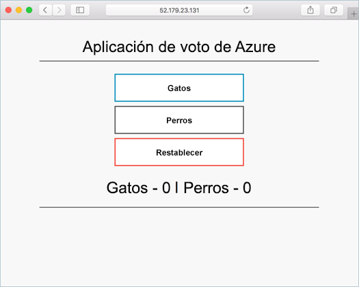
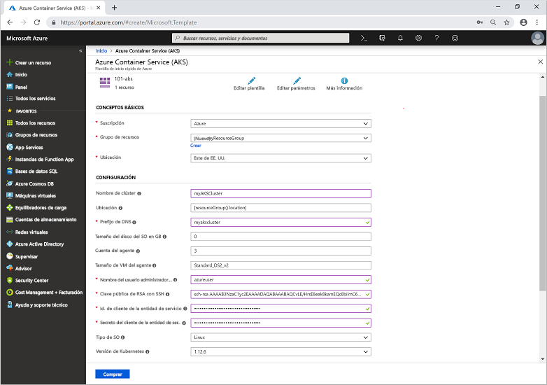

# <a name="quickstart-deploy-an-azure-kubernetes-service-aks-cluster-using-an-azure-resource-manager-template"></a>Inicio rápido: Implementación de un clúster de Azure Kubernetes Service (AKS) con una plantilla de Azure Resource Manager

Azure Kubernetes Service (AKS) es un servicio de Kubernetes administrado que le permite implementar y administrar clústeres rápidamente. En este inicio rápido implementará un clúster de AKS con una plantilla de Azure Resource Manager. En el clúster se ejecuta una aplicación de varios contenedores que incluye un front-end web y una instancia de Redis.



En esta guía rápida se presupone un conocimiento básico de los conceptos de Kubernetes. Para más información, consulte [Conceptos básicos de Kubernetes de Azure Kubernetes Service (AKS)][kubernetes-concepts].

Si no tiene una suscripción a Azure, cree una [cuenta gratuita](https://azure.microsoft.com/free/?WT.mc_id=A261C142F) antes de empezar.

[!INCLUDE [cloud-shell-try-it.md](../../includes/cloud-shell-try-it.md)]

Si decide instalar y usar la CLI localmente, para este inicio rápido es preciso ejecutar la CLI de Azure versión 2.0.61 o posterior. Ejecute `az --version` para encontrar la versión. Si necesita instalarla o actualizarla, vea [Instalación de la CLI de Azure][azure-cli-install].

## <a name="prerequisites"></a>Prerrequisitos

Para crear un clúster de AKS con una plantilla de Resource Manager, proporcione una clave pública SSH y la entidad de servicio de Azure Active Directory. Si necesita cualquiera de estos recursos, consulte la siguiente sección; de lo contrario, vaya a la sección [Create an AKS cluster](#create-an-aks-cluster) (Creación de un clúster de AKS).

### <a name="create-an-ssh-key-pair"></a>Creación de un par de claves SSH

Para acceder a los nodos de AKS, conéctese mediante un par de claves SSH. Use el comando `ssh-keygen` para generar archivos de clave pública y privada SSH. De forma predeterminada, estos archivos se crean en el directorio *~/.ssh*. Si existe un par de claves SSH con el mismo nombre en la ubicación escogida, estos archivos se sobrescriben.

Vaya a [https://shell.azure.com](https://shell.azure.com) para abrir Cloud Shell en el explorador.

El siguiente comando crea un par de claves SSH utilizando el cifrado RSA y una longitud en bits de 2048:

```console
ssh-keygen -t rsa -b 2048
```

Para más información sobre cómo crear claves SSH, consulte el artículo sobre [Creación y administración de claves SSH para la autenticación en Azure][ssh-keys].

### <a name="create-a-service-principal"></a>Creación de una entidad de servicio

Para permitir que un clúster de AKS interactúe con otros recursos de Azure, se usa una entidad de servicio de Azure Active Directory. Cree una entidad de servicio mediante el comando [az ad sp create-for-rbac][az-ad-sp-create-for-rbac]. El parámetro `--skip-assignment` impide que se asignen permisos adicionales. De forma predeterminada, esta entidad de servicio es válida durante un año.

```azurecli-interactive
az ad sp create-for-rbac --skip-assignment
```

La salida es similar a la del ejemplo siguiente:

```json
{
  "appId": "8b1ede42-d407-46c2-a1bc-6b213b04295f",
  "displayName": "azure-cli-2019-04-19-21-42-11",
  "name": "http://azure-cli-2019-04-19-21-42-11",
  "password": "27e5ac58-81b0-46c1-bd87-85b4ef622682",
  "tenant": "73f978cf-87f2-41bf-92ab-2e7ce012db57"
}
```

Anote el valor de *appId* y *password*. Estos valores se usan en los pasos siguientes.

## <a name="create-an-aks-cluster"></a>Creación de un clúster de AKS

La plantilla que se usa en este inicio rápido es para [implementar un clúster de Azure Kubernetes Service](https://azure.microsoft.com/resources/templates/101-aks/). Para más ejemplos de AKS, consulte el sitio de [plantillas de inicio rápido de AKS][aks-quickstart-templates].

1. Seleccione la imagen siguiente para iniciar sesión en Azure y abrir una plantilla.

    [](https://portal.azure.com/#create/Microsoft.Template/uri/https%3A%2F%2Fraw.githubusercontent.com%2FAzure%2Fazure-quickstart-templates%2Fmaster%2F101-aks%2Fazuredeploy.json)

2. Seleccione o escriba los siguientes valores.  

    Para este inicio rápido, deje los valores predeterminados de *Tamaño del disco del SO GB*, *Número de agentes*, *Tamaño de VM del agente*, *Tipo de SO* y *Versión de Kubernetes*. Proporcione sus propios valores para los siguientes parámetros de plantilla:

    * **Suscripción**: Seleccione una suscripción de Azure.
    * **Grupo de recursos**: Seleccione **Crear nuevo**. Escriba un nombre único para el grupo de recursos, como *myResourceGroup*, y elija **Aceptar**.
    * **Ubicación**: seleccione una ubicación, como **Este de EE. UU**.
    * **Nombre del clúster**: escriba un nombre único para el clúster de AKS, como *myAKSCluster*.
    * **Prefijo de DNS**: escriba un prefijo DNS único para el clúster, como *myakscluster*.
    * **Linux Admin Username** (Nombre de usuario administrador de Linux): escriba un nombre de usuario para conectarse mediante SSH, como *azureuser*.
    * **SSH RSA Public Key** (Clave pública SSH RSA): copie y pegue la parte *pública* del par de claves SSH (de forma predeterminada, el contenido de *~/.ssh/id_rsa.pub*).
    * **Identificador de cliente de la entidad de servicio**: copie y pegue el valor de *appId* del servicio en la entidad de seguridad desde el comando `az ad sp create-for-rbac`.
    * **Secreto de cliente de la entidad de servicio**: copie y pegue el valor de *password* del servicio en la entidad de seguridad desde el comando `az ad sp create-for-rbac`.
    * **Acepto los términos y condiciones anteriores**: active esta casilla para indicar su conformidad.

    

3. Seleccione **Comprar**.

El clúster de AKS tarda unos minutos en crearse. Espere a que el clúster se implemente correctamente para pasar al siguiente paso.

## <a name="connect-to-the-cluster"></a>Conectarse al clúster

Para administrar un clúster de Kubernetes, usará [kubectl][kubectl], el cliente de línea de comandos de Kubernetes. Si usa Azure Cloud Shell, `kubectl` ya está instalado. Para instalar `kubectl` localmente, use el comando [az aks install-cli][az-aks-install-cli]:

```azurecli
az aks install-cli
```

Para configurar `kubectl` para conectarse a su clúster de Kubernetes, use el comando [az aks get-credentials][az-aks-get-credentials]. Con este comando se descargan las credenciales y se configura la CLI de Kubernetes para usarlas.

```azurecli-interactive
az aks get-credentials --resource-group myResourceGroup --name myAKSCluster
```

Para comprobar la conexión al clúster, use el comando [kubectl get][kubectl-get] para devolver una lista de los nodos del clúster.

```console
kubectl get nodes
```

La salida del siguiente ejemplo muestra los nodos creados en los pasos anteriores. Asegúrese de que el estado de los nodos sea *Listo*:

```output
NAME                       STATUS   ROLES   AGE     VERSION
aks-agentpool-41324942-0   Ready    agent   6m44s   v1.12.6
aks-agentpool-41324942-1   Ready    agent   6m46s   v1.12.6
aks-agentpool-41324942-2   Ready    agent   6m45s   v1.12.6
```

## <a name="run-the-application"></a>Ejecución de la aplicación

Un archivo de manifiesto de Kubernetes define un estado deseado del clúster, por ejemplo, qué imágenes de contenedor se van a ejecutar. En esta guía de inicio rápido, se usa un manifiesto para crear todos los objetos necesarios para ejecutar la aplicación Azure Vote. Este manifiesto incluye dos [implementaciones de Kubernetes][kubernetes-deployment], una para las aplicaciones Python de Azure Vote de ejemplo y otra para una instancia de Redis. También se crean dos [servicios de Kubernetes][kubernetes-service], uno interno para la instancia de Redis y otro externo para acceder a la aplicación Azure Vote desde Internet.

> [!TIP]
> En esta guía de inicio rápido, se crean e implementan manualmente los manifiestos de aplicación en el clúster de AKS. En escenarios más reales, puede usar [Azure Dev Spaces][azure-dev-spaces] para iterar rápidamente y depurar el código directamente en el clúster de AKS. Puede usar Dev Spaces entre plataformas de sistemas operativos y entornos de desarrollo, y trabajar junto con otras personas de su equipo.

Cree un archivo denominado `azure-vote.yaml` y cópielo en la siguiente definición de código YAML. Si usa Azure Cloud Shell, este archivo se puede crear mediante `vi` o `nano` como si funcionara en un sistema físico o virtual:

```yaml
apiVersion: apps/v1
kind: Deployment
metadata:
  name: azure-vote-back
spec:
  replicas: 1
  selector:
    matchLabels:
      app: azure-vote-back
  template:
    metadata:
      labels:
        app: azure-vote-back
    spec:
      nodeSelector:
        "beta.kubernetes.io/os": linux
      containers:
      - name: azure-vote-back
        image: redis
        resources:
          requests:
            cpu: 100m
            memory: 128Mi
          limits:
            cpu: 250m
            memory: 256Mi
        ports:
        - containerPort: 6379
          name: redis
---
apiVersion: v1
kind: Service
metadata:
  name: azure-vote-back
spec:
  ports:
  - port: 6379
  selector:
    app: azure-vote-back
---
apiVersion: apps/v1
kind: Deployment
metadata:
  name: azure-vote-front
spec:
  replicas: 1
  selector:
    matchLabels:
      app: azure-vote-front
  template:
    metadata:
      labels:
        app: azure-vote-front
    spec:
      nodeSelector:
        "beta.kubernetes.io/os": linux
      containers:
      - name: azure-vote-front
        image: microsoft/azure-vote-front:v1
        resources:
          requests:
            cpu: 100m
            memory: 128Mi
          limits:
            cpu: 250m
            memory: 256Mi
        ports:
        - containerPort: 80
        env:
        - name: REDIS
          value: "azure-vote-back"
---
apiVersion: v1
kind: Service
metadata:
  name: azure-vote-front
spec:
  type: LoadBalancer
  ports:
  - port: 80
  selector:
    app: azure-vote-front
```

Implemente la aplicación mediante el comando [kubectl apply][kubectl-apply] y especifique el nombre del manifiesto de YAML:

```console
kubectl apply -f azure-vote.yaml
```

En la salida de ejemplo siguiente se muestran las implementaciones y los servicios creados correctamente:

```output
deployment "azure-vote-back" created
service "azure-vote-back" created
deployment "azure-vote-front" created
service "azure-vote-front" created
```

## <a name="test-the-application"></a>Prueba de la aplicación

Cuando se ejecuta la aplicación, un servicio de Kubernetes expone el front-end de la aplicación a Internet. Este proceso puede tardar unos minutos en completarse.

Para supervisar el progreso, utilice el comando [kubectl get service][kubectl-get] con el argumento `--watch`.

```console
kubectl get service azure-vote-front --watch
```

En un primer momento, el parámetro *EXTERNAL-IP* del servicio *azure-vote-front* se muestra como *pendiente*.

```output
NAME               TYPE           CLUSTER-IP   EXTERNAL-IP   PORT(S)        AGE
azure-vote-front   LoadBalancer   10.0.37.27   <pending>     80:30572/TCP   6s
```

Cuando la dirección *EXTERNAL-IP* cambie de *pendiente* a una dirección IP pública real, use `CTRL-C` para detener el proceso de inspección de `kubectl`. En la salida del ejemplo siguiente se muestra una dirección IP pública válida asignada al servicio:

```output
azure-vote-front   LoadBalancer   10.0.37.27   52.179.23.131   80:30572/TCP   2m
```

Para ver la aplicación Azure Vote en acción, abra un explorador web en la dirección IP externa del servicio.


## <a name="delete-cluster"></a>Eliminación de clúster

Cuando el clúster ya no se necesite, puede usar el comando [az group delete][az-group-delete] para eliminar el grupo de recursos, el servicio de contenedor y todos los recursos relacionados.

```azurecli-interactive
az group delete --name myResourceGroup --yes --no-wait
```

> [!NOTE]
> Cuando elimina el clúster, la entidad de servicio Azure Active Directory que utiliza el clúster de AKS no se quita. Para conocer los pasos que hay que realizar para quitar la entidad de servicio, consulte [Consideraciones principales y eliminación de AKS][sp-delete].

## <a name="get-the-code"></a>Obtención del código

En este inicio rápido, se han usado imágenes de un contenedor creado previamente para crear una implementación de Kubernetes. El código de la aplicación relacionada, Dockerfile, y el archivo de manifiesto de Kubernetes están disponibles en GitHub.

[https://github.com/Azure-Samples/azure-voting-app-redis][azure-vote-app]

## <a name="next-steps"></a>Pasos siguientes

En esta guía de inicio rápido, ha implementado un clúster de Kubernetes y una aplicación de varios contenedores en él. [Acceda al panel web de Kubernetes][kubernetes-dashboard] del clúster que ha creado.

Para obtener más información sobre AKS y un ejemplo completo desde el código hasta la implementación, continúe con el tutorial del clúster de Kubernetes.

> [!div class="nextstepaction"]
> [Tutorial de AKS][aks-tutorial]

<!-- LINKS - external -->
[azure-vote-app]: https://github.com/Azure-Samples/azure-voting-app-redis.git
[kubectl]: https://kubernetes.io/docs/user-guide/kubectl/
[kubectl-apply]: https://kubernetes.io/docs/reference/generated/kubectl/kubectl-commands#apply
[kubectl-get]: https://kubernetes.io/docs/reference/generated/kubectl/kubectl-commands#get
[azure-dev-spaces]: https://docs.microsoft.com/azure/dev-spaces/
[aks-quickstart-templates]: https://azure.microsoft.com/resources/templates/?term=Azure+Kubernetes+Service

<!-- LINKS - internal -->
[kubernetes-concepts]: concepts-clusters-workloads.md
[aks-monitor]: https://aka.ms/coingfonboarding
[aks-tutorial]: ./tutorial-kubernetes-prepare-app.md
[az-aks-browse]: /cli/azure/aks?view=azure-cli-latest#az-aks-browse
[az-aks-create]: /cli/azure/aks?view=azure-cli-latest#az-aks-create
[az-aks-get-credentials]: /cli/azure/aks?view=azure-cli-latest#az-aks-get-credentials
[az-aks-install-cli]: /cli/azure/aks?view=azure-cli-latest#az-aks-install-cli
[az-group-create]: /cli/azure/group#az-group-create
[az-group-delete]: /cli/azure/group#az-group-delete
[azure-cli-install]: /cli/azure/install-azure-cli
[sp-delete]: kubernetes-service-principal.md#additional-considerations
[azure-portal]: https://portal.azure.com
[kubernetes-deployment]: concepts-clusters-workloads.md#deployments-and-yaml-manifests
[kubernetes-service]: concepts-network.md#services
[kubernetes-dashboard]: kubernetes-dashboard.md
[ssh-keys]: ../virtual-machines/linux/create-ssh-keys-detailed.md
[az-ad-sp-create-for-rbac]: /cli/azure/ad/sp#az-ad-sp-create-for-rbac
