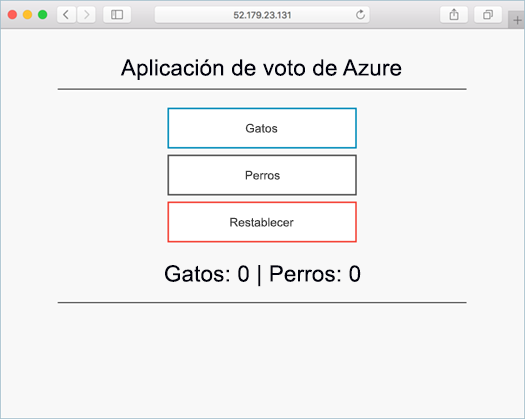
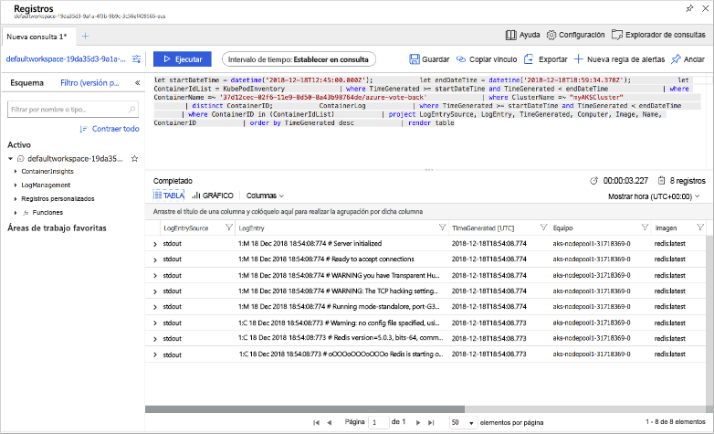

# <a name="quickstart-deploy-an-azure-kubernetes-service-aks-cluster-using-the-azure-cli"></a>Inicio rápido: Implementación de un clúster de Azure Kubernetes Service (AKS) mediante la CLI de Azure

Azure Kubernetes Service (AKS) es un servicio de Kubernetes administrado que le permite implementar y administrar clústeres rápidamente. En este inicio rápido, implementará un clúster de AKS mediante la CLI de Azure. En el clúster se ejecuta una aplicación de varios contenedores que incluye un front-end web y una instancia de Redis. A continuación, verá cómo supervisar el mantenimiento del clúster y los pods que ejecutan la aplicación.

Si quiere usar contenedores de Windows Server (actualmente en versión preliminar en AKS), consulte [Creación de un clúster de AKS compatible con los contenedores de Windows Server][windows-container-cli].



En esta guía rápida se presupone un conocimiento básico de los conceptos de Kubernetes. Para más información, consulte [Conceptos básicos de Kubernetes de Azure Kubernetes Service (AKS)][kubernetes-concepts].

Si no tiene una suscripción a Azure, cree una [cuenta gratuita](https://azure.microsoft.com/free/?WT.mc_id=A261C142F) antes de empezar.

[!INCLUDE [cloud-shell-try-it.md](../../includes/cloud-shell-try-it.md)]

Si decide instalar y usar la CLI localmente, para este inicio rápido es preciso ejecutar la CLI de Azure, versión 2.0.64 o posterior. Ejecute `az --version` para encontrar la versión. Si necesita instalarla o actualizarla, vea [Instalación de la CLI de Azure][azure-cli-install].

## <a name="create-a-resource-group"></a>Crear un grupo de recursos

Un grupo de recursos de Azure es un grupo lógico en el que se implementan y se administran los recursos de Azure. Cuando se crea un grupo de recursos, se le pide que especifique una ubicación. Dicha ubicación es donde se almacenan los metadatos del grupo de recursos, así como el lugar en el que los recursos se ejecutan en Azure si no se especifica otra región al crear los recursos. Cree un grupo de recursos con el comando [az group create][az-group-create].

En el ejemplo siguiente, se crea un grupo de recursos denominado *myResourceGroup* en la ubicación *eastus*.

```azurecli-interactive
az group create --name myResourceGroup --location eastus
```

En la siguiente salida de ejemplo se muestra que los recursos se crearon correctamente:

```json
{
  "id": "/subscriptions/<guid>/resourceGroups/myResourceGroup",
  "location": "eastus",
  "managedBy": null,
  "name": "myResourceGroup",
  "properties": {
    "provisioningState": "Succeeded"
  },
  "tags": null
}
```

## <a name="create-aks-cluster"></a>Creación de un clúster de AKS

Use el comando [az aks create][az-aks-create] para crear un clúster de AKS. En el siguiente ejemplo se crea un clúster denominado *myAKSCluster* con un nodo. Azure Monitor para contenedores también se habilita usando el parámetro *--enable-addons monitoring*.

```azurecli-interactive
az aks create \
    --resource-group myResourceGroup \
    --name myAKSCluster \
    --node-count 1 \
    --enable-addons monitoring \
    --generate-ssh-keys
```

Transcurridos unos minutos, el comando se completa y devuelve información en formato JSON sobre el clúster.

## <a name="connect-to-the-cluster"></a>Conexión al clúster

Para administrar un clúster de Kubernetes, usará [kubectl][kubectl], el cliente de línea de comandos de Kubernetes. Si usa Azure Cloud Shell, `kubectl` ya está instalado. Para instalar `kubectl` localmente, use el comando [az aks install-cli][az-aks-install-cli]:

```azurecli
az aks install-cli
```

Para configurar `kubectl` para conectarse a su clúster de Kubernetes, use el comando [az aks get-credentials][az-aks-get-credentials]. Con este comando se descargan las credenciales y se configura la CLI de Kubernetes para usarlas.

```azurecli-interactive
az aks get-credentials --resource-group myResourceGroup --name myAKSCluster
```

Para comprobar la conexión con el clúster, use el comando [kubectl get][kubectl-get] para que devuelva una lista de los nodos del clúster.

```azurecli-interactive
kubectl get nodes
```

La salida del ejemplo siguiente muestra el nodo único creado en los pasos anteriores. Asegúrese de que el estado del nodo es *Listo*:

```output
NAME                       STATUS   ROLES   AGE     VERSION
aks-nodepool1-31718369-0   Ready    agent   6m44s   v1.12.8
```

## <a name="run-the-application"></a>Ejecución de la aplicación

Un archivo de manifiesto de Kubernetes define un estado deseado del clúster, por ejemplo, qué imágenes de contenedor se van a ejecutar. En esta guía de inicio rápido, se usa un manifiesto para crear todos los objetos necesarios para ejecutar la aplicación Azure Vote. Este manifiesto incluye dos [implementaciones de Kubernetes][kubernetes-deployment] - one for the sample Azure Vote Python applications, and the other for a Redis instance. Two [Kubernetes Services][kubernetes-service] también se crean, uno interno para la instancia de Redis y otro externo para acceder a la aplicación Azure Vote desde Internet. En esta guía de inicio rápido, se crean e implementan manualmente los manifiestos de aplicación en el clúster de AKS.

> [!TIP]
> En escenarios más reales, puede usar [Azure Dev Spaces][azure-dev-spaces] para iterar rápidamente y depurar el código directamente en el clúster de AKS. Puede usar Dev Spaces entre plataformas de sistemas operativos y entornos de desarrollo, y trabajar junto con otras personas de su equipo. Cree un archivo denominado `azure-vote.yaml` y cópielo en la siguiente definición de código YAML.

Si usa Azure Cloud Shell, este archivo se puede crear mediante `vi` o `nano` como si funcionara en un sistema físico o virtual: Implemente la aplicación mediante el comando [kubectl apply][kubectl-apply] y especifique el nombre del manifiesto de YAML:

```yaml
apiVersion: apps/v1
kind: Deployment
metadata:
  name: azure-vote-back
spec:
  replicas: 1
  selector:
    matchLabels:
      app: azure-vote-back
  template:
    metadata:
      labels:
        app: azure-vote-back
    spec:
      nodeSelector:
        "beta.kubernetes.io/os": linux
      containers:
      - name: azure-vote-back
        image: redis
        resources:
          requests:
            cpu: 100m
            memory: 128Mi
          limits:
            cpu: 250m
            memory: 256Mi
        ports:
        - containerPort: 6379
          name: redis
---
apiVersion: v1
kind: Service
metadata:
  name: azure-vote-back
spec:
  ports:
  - port: 6379
  selector:
    app: azure-vote-back
---
apiVersion: apps/v1
kind: Deployment
metadata:
  name: azure-vote-front
spec:
  replicas: 1
  selector:
    matchLabels:
      app: azure-vote-front
  template:
    metadata:
      labels:
        app: azure-vote-front
    spec:
      nodeSelector:
        "beta.kubernetes.io/os": linux
      containers:
      - name: azure-vote-front
        image: microsoft/azure-vote-front:v1
        resources:
          requests:
            cpu: 100m
            memory: 128Mi
          limits:
            cpu: 250m
            memory: 256Mi
        ports:
        - containerPort: 80
        env:
        - name: REDIS
          value: "azure-vote-back"
---
apiVersion: v1
kind: Service
metadata:
  name: azure-vote-front
spec:
  type: LoadBalancer
  ports:
  - port: 80
  selector:
    app: azure-vote-front
```

En la salida de ejemplo siguiente se muestran las implementaciones y los servicios creados correctamente:

```azurecli-interactive
kubectl apply -f azure-vote.yaml
```

Prueba de la aplicación

```output
deployment "azure-vote-back" created
service "azure-vote-back" created
deployment "azure-vote-front" created
service "azure-vote-front" created
```

## <a name="test-the-application"></a>Cuando se ejecuta la aplicación, un servicio de Kubernetes expone el front-end de la aplicación a Internet.

Este proceso puede tardar unos minutos en completarse. Para supervisar el progreso, utilice el comando [kubectl get service][kubectl-get] con el argumento `--watch`.

En un primer momento, el parámetro *EXTERNAL-IP* del servicio *azure-vote-front* se muestra como *pendiente*.

```azurecli-interactive
kubectl get service azure-vote-front --watch
```

Cuando la dirección *EXTERNAL-IP* cambie de *pendiente* a una dirección IP pública real, use `CTRL-C` pata detener el proceso de inspección de `kubectl`.

```output
NAME               TYPE           CLUSTER-IP   EXTERNAL-IP   PORT(S)        AGE
azure-vote-front   LoadBalancer   10.0.37.27   <pending>     80:30572/TCP   6s
```

En la salida del ejemplo siguiente se muestra una dirección IP pública válida asignada al servicio: Para ver la aplicación Azure Vote en acción, abra un explorador web en la dirección IP externa del servicio.

```output
azure-vote-front   LoadBalancer   10.0.37.27   52.179.23.131   80:30572/TCP   2m
```

Imagen de la exploración hasta Azure Vote


## <a name="monitor-health-and-logs"></a>Cuando se creó el clúster de AKS, se habilitó Azure Monitor para los contenedores a fin de capturar métricas de mantenimiento para los nodos de clúster y los pods.

Estas métricas de mantenimiento están disponibles en Azure Portal. Para ver el estado actual, el tiempo de actividad y el uso de recursos para los pods de Azure Vote, haga lo siguiente:

En un explorador web, vaya a Azure Portal[https://portal.azure.com][azure-portal].

1. Seleccione el grupo de recursos, como *myResourceGroup*, a continuación, seleccione el clúster de AKS, como *myAKSCluster*.
1. En la opción **Supervisión** de la izquierda, elija **Insights**.
1. En la parte superior, elija **+ Agregar filtro**
1. Seleccione *Namespace* como propiedad y, después, elija *\<All but kube-system\>*
1. Elija ver los **contenedores**.
1. Se muestran los contenedores *azure-vote-back* y *azure-vote-front*, como aparece en el ejemplo siguiente:

Visualización del estado de ejecución de contenedores en AKS


Estos registros incluyen los flujos *stdout* y *stderr* del contenedor. Visualización de los registros de contenedores en AKS



## <a name="delete-the-cluster"></a>Cuando el clúster ya no se necesite, puede usar el comando [az group delete][az-group-delete] para eliminar el grupo de recursos, el servicio de contenedor y todos los recursos relacionados.

Cuando elimina el clúster, la entidad de servicio Azure Active Directory que utiliza el clúster de AKS no se quita.

```azurecli-interactive
az group delete --name myResourceGroup --yes --no-wait
```

> [!NOTE]
> Para conocer los pasos que hay que realizar para quitar la entidad de servicio, consulte [Consideraciones principales y eliminación de AKS][sp-delete]. Obtención del código

## <a name="get-the-code"></a>En este inicio rápido, se han usado imágenes de un contenedor creado previamente para crear una implementación de Kubernetes.

El código de la aplicación relacionada, Dockerfile, y el archivo de manifiesto de Kubernetes están disponibles en GitHub. Pasos siguientes

[https://github.com/Azure-Samples/azure-voting-app-redis][azure-vote-app]

## <a name="next-steps"></a>En esta guía de inicio rápido, ha implementado un clúster de Kubernetes y una aplicación de varios contenedores en él.

También puede [acceder al panel web de Kubernetes][kubernetes-dashboard] del clúster de AKS. Para obtener más información sobre AKS y un ejemplo completo desde el código hasta la implementación, continúe con el tutorial del clúster de Kubernetes.

[Tutorial de AKS][aks-tutorial]

> [!div class="nextstepaction"]
> <bpt id="p1">[</bpt>AKS tutorial<ept id="p1">][aks-tutorial]</ept>

<!-- LINKS - external -->
[azure-vote-app]: https://github.com/Azure-Samples/azure-voting-app-redis.git
[kubectl]: https://kubernetes.io/docs/user-guide/kubectl/
[kubectl-apply]: https://kubernetes.io/docs/reference/generated/kubectl/kubectl-commands#apply
[kubectl-get]: https://kubernetes.io/docs/reference/generated/kubectl/kubectl-commands#get
[azure-dev-spaces]: https://docs.microsoft.com/azure/dev-spaces/

<!-- LINKS - internal -->
[kubernetes-concepts]: concepts-clusters-workloads.md
[aks-monitor]: https://aka.ms/coingfonboarding
[aks-tutorial]: ./tutorial-kubernetes-prepare-app.md
[az-aks-browse]: /cli/azure/aks?view=azure-cli-latest#az-aks-browse
[az-aks-create]: /cli/azure/aks?view=azure-cli-latest#az-aks-create
[az-aks-get-credentials]: /cli/azure/aks?view=azure-cli-latest#az-aks-get-credentials
[az-aks-install-cli]: /cli/azure/aks?view=azure-cli-latest#az-aks-install-cli
[az-group-create]: /cli/azure/group#az-group-create
[az-group-delete]: /cli/azure/group#az-group-delete
[azure-cli-install]: /cli/azure/install-azure-cli
[sp-delete]: kubernetes-service-principal.md#additional-considerations
[azure-portal]: https://portal.azure.com
[kubernetes-deployment]: concepts-clusters-workloads.md#deployments-and-yaml-manifests
[kubernetes-service]: concepts-network.md#services
[kubernetes-dashboard]: kubernetes-dashboard.md
[windows-container-cli]: windows-container-cli.md