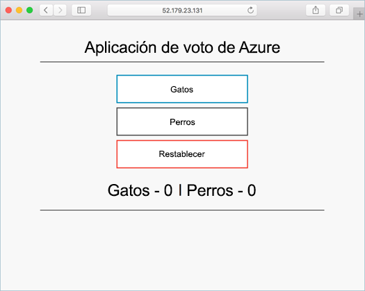

# <a name="tutorial-prepare-an-application-for-azure-kubernetes-service-aks"></a>Tutorial: Preparación de una aplicación para Azure Kubernetes Service (AKS)

En este tutorial, la primera parte de siete, se prepara una aplicación con varios contenedores para usarla en Kubernetes. Las herramientas de desarrollo existentes como Docker Compose se usan para compilar y probar una aplicación localmente. Aprenderá a:

> [!div class="checklist"]
> * Clonar el origen de una aplicación de ejemplo desde GitHub
> * Crear una imagen de contenedor a partir del origen de la aplicación de ejemplo
> * Probar la aplicación con varios contenedores en un entorno local de Docker

Tras finalizar, la siguiente aplicación se ejecuta en su entorno de desarrollo local:



En tutoriales adicionales, la imagen de contenedor se carga en una instancia de Azure Container Registry y después se implementa en un clúster de AKS.

## <a name="before-you-begin"></a>Antes de empezar

En este tutorial se asume que el usuario tiene un conocimiento básico de los principales conceptos de Docker, como los contenedores, las imágenes de contenedor y los comandos de `docker`. Si es necesario, consulte la [introducción a Docker][docker-get-started], donde encontrará datos básicos acerca de los contenedores.

Para completar este tutorial, se necesita un entorno de desarrollo de Docker local en el que se ejecuten contenedores Linux. Docker proporciona paquetes que lo configuran en cualquier sistema [Mac][docker-for-mac], [Windows][docker-for-windows] o [Linux][docker-for-linux].

Azure Cloud Shell no incluye los componentes de Docker necesarios para completar todos los pasos de este tutorial. Por lo tanto, se recomienda usar un entorno completo de desarrollo de Docker.

## <a name="get-application-code"></a>Obtención del código de la aplicación

La aplicación de ejemplo que se usa en este tutorial es una aplicación básica para votar. La aplicación consta de un componente web front-end y de una instancia back-end de Redis. El componente web se empaqueta en una imagen de contenedor personalizada. La instancia de Redis usa una imagen sin modificar de Docker Hub.

Use [git][] para clonar la aplicación en su entorno de desarrollo:

```console
git clone https://github.com/Azure-Samples/azure-voting-app-redis.git
```

Cambie al directorio clonado.

```console
cd azure-voting-app-redis
```

En el directorio se encuentra el código fuente de la aplicación, un archivo de Docker Compose creado previamente y un archivo de manifiesto de Kubernetes. Estos archivos se usan en todo el conjunto del tutorial.

## <a name="create-container-images"></a>Creación de imágenes de contenedor

[Docker Compose][docker-compose] se puede utilizar para automatizar la creación de imágenes de contenedor y la implementación de aplicaciones con varios contenedores.

Use el archivo `docker-compose.yaml` de ejemplo para crear la imagen de contenedor, descargar la imagen de Redis e iniciar la aplicación:

```console
docker-compose up -d
```

Cuando haya finalizado, use el comando [docker images][docker-images] para ver las imágenes creadas. Se han descargado o creado tres imágenes. La imagen *azure-vote-front* contiene la aplicación de front-end y usa la imagen `nginx-flask` como base. La imagen `redis` se usa para iniciar una instancia de Redis.

```
$ docker images

REPOSITORY                   TAG        IMAGE ID            CREATED             SIZE
azure-vote-front             latest     9cc914e25834        40 seconds ago      694MB
redis                        latest     a1b99da73d05        7 days ago          106MB
tiangolo/uwsgi-nginx-flask   flask      788ca94b2313        9 months ago        694MB
```

Ejecute el comando [docker ps][docker-ps] para ver los contenedores en ejecución:

```
$ docker ps

CONTAINER ID        IMAGE             COMMAND                  CREATED             STATUS              PORTS                           NAMES
82411933e8f9        azure-vote-front  "/usr/bin/supervisord"   57 seconds ago      Up 30 seconds       443/tcp, 0.0.0.0:8080->80/tcp   azure-vote-front
b68fed4b66b6        redis             "docker-entrypoint..."   57 seconds ago      Up 30 seconds       0.0.0.0:6379->6379/tcp          azure-vote-back
```

## <a name="test-application-locally"></a>Prueba local de la aplicación

Para ver la aplicación en ejecución, escriba `http://localhost:8080` en un explorador web local. Se carga la aplicación de ejemplo, como se muestra en el ejemplo siguiente:


## <a name="clean-up-resources"></a>Limpieza de recursos

Ahora que la funcionalidad de la aplicación se ha validado, los contenedores en ejecución se pueden detener y eliminar. No elimine las imágenes de contenedor (en el siguiente tutorial, la imagen *azure-vote-front* se carga en una instancia de Azure Container Registry).

Detenga y quite las instancias de contenedor y los recursos con el comando [docker-compose down][docker-compose-down]:

```console
docker-compose down
```

Cuando se haya quitado la aplicación local, tendrá una imagen de Docker con la aplicación Azure Vote, *azure-vote-front*, que podrá usar en el siguiente tutorial.

## <a name="next-steps"></a>Pasos siguientes

En este tutorial, se ha probado una aplicación y se han creado imágenes del contenedor para la aplicación. Ha aprendido a:

> [!div class="checklist"]
> * Clonar el origen de una aplicación de ejemplo desde GitHub
> * Crear una imagen de contenedor a partir del origen de la aplicación de ejemplo
> * Probar la aplicación con varios contenedores en un entorno local de Docker

Pase al siguiente tutorial para aprender a almacenar imágenes de contenedor en Azure Container Registry.

> [!div class="nextstepaction"]
> [Insertar imágenes en Azure Container Registry][aks-tutorial-prepare-acr]

<!-- LINKS - external -->
[docker-compose]: https://docs.docker.com/compose/
[docker-for-linux]: https://docs.docker.com/engine/installation/#supported-platforms
[docker-for-mac]: https://docs.docker.com/docker-for-mac/
[docker-for-windows]: https://docs.docker.com/docker-for-windows/
[docker-get-started]: https://docs.docker.com/get-started/
[docker-images]: https://docs.docker.com/engine/reference/commandline/images/
[docker-ps]: https://docs.docker.com/engine/reference/commandline/ps/
[docker-compose-down]: https://docs.docker.com/compose/reference/down
[git]: https://git-scm.com/downloads

<!-- LINKS - internal -->
[aks-tutorial-prepare-acr]: ./tutorial-kubernetes-prepare-acr.md
