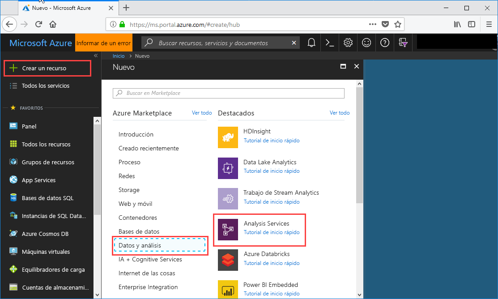
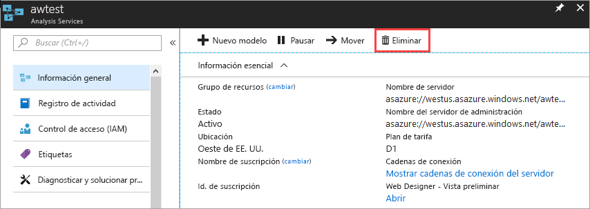

# Inicio rápido: Creación de un servidor: Portal

En este inicio rápido se describe cómo crear un recurso de servidor de Analysis Services en la suscripción de Azure mediante el portal.

## Prerequisites 

* **Suscripción de Azure**: visite [Evaluación gratuita de Azure](https://azure.microsoft.com/offers/ms-azr-0044p/) para crear una cuenta.
* **Azure Active Directory**: la suscripción debe estar asociada a un inquilino de Azure Active Directory. Además, debe estar conectado en Azure con una cuenta en ese Azure Active Directory. Para más información, consulte [Permisos de usuario y autenticación](analysis-services-manage-users.md).

## Inicio de sesión en Azure Portal 

[Iniciar sesión en el portal](https://portal.azure.com)

## Creación de un servidor

1. Haga clic en **+ Crear un recurso** > **Análisis** > **Analysis Services**.

    

2. En **Analysis Services**, rellene los campos obligatorios y, a continuación, presione **Crear**.
   
   * **Nombre del servidor**: escriba un nombre único que se pueda utilizar para hacer referencia al servidor. El nombre del servidor debe comenzar con un carácter en minúscula y contener entre 3 y 128 caracteres en minúsculas y números. No se permiten espacios en blanco ni caracteres especiales.
   * **Suscripción**: seleccione la suscripción a la que este servidor se asociará.
   * **Grupo de recursos**: cree un nuevo grupo de recursos o, si ya tiene uno, selecciónelo. Los grupos de recursos están diseñados para ayudarlo a administrar una colección de recursos de Azure. Para más información, consulte [grupos de recursos](../azure-resource-manager/management/overview.md).
   * **Ubicación**: esta ubicación del centro de datos de Azure hospeda el servidor. Elija una ubicación más cercana a su base de usuarios más grande.
   * **Plan de tarifa**: Seleccione un plan de tarifa. Si está probando y va a instalar la base de datos modelo de ejemplo, seleccione el nivel **D1** gratuito. Para más información, consulte los [precios de Azure Analysis Services](https://azure.microsoft.com/pricing/details/analysis-services/). 
   * **Administrator**: de forma predeterminada, se trata de la cuenta en que ha iniciado sesión. Puede elegir otra cuenta de Azure Active Directory.
   * **Configuración de almacenamiento de copia de seguridad**: Opcional. Si ya tiene una [cuenta de almacenamiento](../storage/common/storage-introduction.md), puede especificarla como valor predeterminado para la copia de seguridad de la base de datos modelo. También puede especificar la configuración de [copia de seguridad y restauración](analysis-services-backup.md) más adelante.
   * **Expiración de la clave de almacenamiento**: Opcional. Especifique un período de caducidad de la clave de almacenamiento.

Por lo general, el proceso de crear el servidor toma menos de un minuto. Si seleccionó **Add to Portal** (Agregar al portal), desplácese hasta el portal para ver el nuevo servidor. O bien, vaya a **Todos los servicios** > **Analysis Services** para ver si el servidor está listo. Los servidores admiten modelos tabulares en el nivel de compatibilidad 1200 y superiores. El nivel de compatibilidad del modelo se especifica en Visual Studio o SSMS.

## Limpieza de recursos

Cuando ya no lo necesite, elimine el servidor. En la **Información general** del servidor, haga clic en **Eliminar**. 

 

## Pasos siguientes
En esta guía de inicio rápido aprendió a crear un servidor en la suscripción de Azure. Ahora que tiene un servidor, puede protegerlo si configura un firewall de servidor (opcional). También puede agregar un modelo de datos de ejemplo básico al servidor directamente desde el portal. Tener un modelo de ejemplo es útil al aprender cómo configurar los roles de la base de datos del modelo y probar las conexiones de cliente. Para más información, puede seguir el tutorial para agregar un modelo de ejemplo.

> [!div class="nextstepaction"]
> [Inicio rápido: Configuración del firewall del servidor: Portal](analysis-services-qs-firewall.md)   
> [!div class="nextstepaction"]
> [Tutorial: Incorporación de un modelo de ejemplo al servidor](analysis-services-create-sample-model.md)
