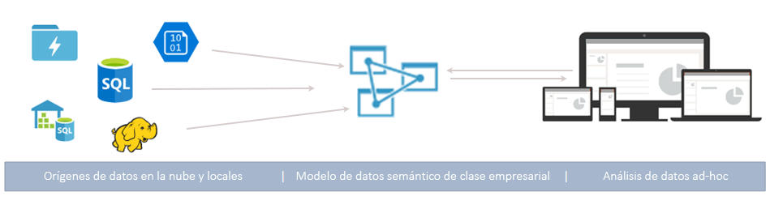
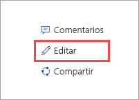

# ¿Qué es Azure Analysis Services?

Azure Analysis Services es una plataforma como un servicio (PaaS) completamente administrada que proporciona modelos de datos en la nube de nivel empresarial. Use las características avanzadas de mashup y modelado para combinar datos de diversos orígenes de datos, definir métricas y proteger los datos en un modelo de datos semántico tabular único y de confianza. El modelo de datos proporciona a los usuarios una forma más fácil y rápida de examinar grandes cantidades de datos para el análisis de datos ad hoc.

**Vídeo:** vea [Azure Analysis Services Overview](https://sec.ch9.ms/ch9/d6dd/a1cda46b-ef03-4cea-8f11-68da23c5d6dd/AzureASoverview_high.mp4) (Introducción a Azure Analysis Services) para obtener información acerca de cómo se ajusta Azure Analysis Services a las funcionalidades de BI globales de Microsoft.

## Póngase rápidamente a pleno funcionamiento

Con Azure Portal, puede [crear un servidor](analysis-services-create-server.md) en minutos. Además, con las [plantillas](../azure-resource-manager/resource-manager-create-first-template.md) de Azure Resource Manager y PowerShell, puede crear servidores mediante una plantilla declarativa. Con una única plantilla puede implementar recursos del servidor junto con otros componentes de Azure como las cuentas de almacenamiento y Azure Functions. 

**Vídeo:** vea [Automating deployment](https://channel9.msdn.com/series/Azure-Analysis-Services/AzureAnalysisServicesAutomation) (Implementación automática) para aprender a usar Azure Automation para agilizar la creación de servidores.

Azure Analysis Services se integra con muchos servicios de Azure lo que le permite compilar soluciones de análisis sofisticadas. La integración con [Azure Active Directory](../active-directory/fundamentals/active-directory-whatis.md) proporciona acceso seguro, basado en roles, a los datos críticos. Se integra en las canalizaciones de [Azure Data Factory](../data-factory/introduction.md) mediante la inclusión de una actividad que carga los datos en el modelo. [Azure Automation](../automation/automation-intro.md) y [Azure Functions](../azure-functions/functions-overview.md) se pueden usar para realizar una orquestación ligera de modelos mediante código personalizado. 

## El nivel correcto cuando lo necesite

Azure Analysis Services está disponible en los niveles **Developer**, **Basic** y **Standard**. Dentro de cada nivel, los costos del plan varían según la potencia de procesamiento, las unidades de procesamiento de consultas (QPU) y el tamaño de la memoria. Cuando cree un servidor, seleccione un plan dentro de un nivel. Puede subir o bajar de plan dentro del mismo nivel o realizar la actualización a un nivel superior, pero no se puede cambiar de un nivel superior a uno inferior.

### Nivel Developer

Este nivel se recomienda para fines de evaluación, desarrollo y prueba. Un plan individual incluye la misma funcionalidad que el nivel Standard, pero tiene limitaciones en cuanto a la potencia de procesamiento, las QPU y el tamaño de la memoria. El escalado horizontal de la réplica de consultas *no está disponible* para este nivel. Este nivel no ofrece ningún Acuerdo de Nivel de Servicio.

|Plan  |QPU  |Memoria (GB)  |
|---------|---------|---------|
|D1    |    20     |    3     |

### Nivel Basic

El nivel se recomienda para soluciones de producción con modelos tabulares más pequeños, concurrencia de usuarios limitada y requisitos sencillos de actualización de datos. El escalado horizontal de la réplica de consultas *no está disponible* para este nivel. En este nivel *no se admiten* perspectivas, varias particiones y características de modelo tabular de DirectQuery.  

|Plan  |QPU  |Memoria (GB)  |
|---------|---------|---------|
|B1    |    40     |    10     |
|B2    |    80     |    16     |

### Nivel Standard

Este nivel es para aplicaciones de producción críticas que requieren concurrencia de usuarios elástica y tienen modelos de datos que crecen con rapidez. Admite la actualización de datos avanzada para realización de actualizaciones de modelos de datos casi en tiempo real y admite todas las características del modelado tabular.

|Plan  |QPU  |Memoria (GB)  |
|---------|---------|---------|
|S0    |    40     |    10     |
|S1    |    100     |    25     |
|S2    |    200     |    50     |
|S4    |    400     |    100     |
|S8*    |    320     |    200     |
|S9*    |    640    |    400     |
|S8v2*    |    640     |    200     |
|S9v2*    |    1280    |    400     |

\* No está disponible en todas las regiones.  

## Disponibilidad por región

Azure Analysis Services se admite en regiones de todo el mundo. Los planes admitidos y la disponibilidad de las réplicas de consultas dependen de la región que elija. La disponibilidad de planes y réplicas de consultas puede variar en función de la necesidad y los recursos disponibles en cada región. 

### América

|Region  | Planes admitidos | Réplicas de consultas (solo planes Estándar) |
|---------|---------|:---------:|
|Sur de Brasil     |    B1, B2, S0, S1, S2, S4, D1     |     1    |
|Centro de Canadá    |     B1, B2, S0, S1, S2, S4, D1    |     1    |
|Este de EE. UU.     |     B1, B2, S0, S1, S2, S4, D1    |    1     |
|Este de EE. UU. 2     |     B1, B2, S0, S1, S2, S4, D1   |    7    |
|Este de EE. UU. 2     |     S8, S9, S8v2, S9v2   |    1    |
|Centro-Norte de EE. UU     |     B1, B2, S0, S1, S2, S4, D1     |    1     |
|Centro de EE. UU.     |    B1, B2, S0, S1, S2, S4, D1     |    1     |
|Centro-sur de EE. UU.     |    B1, B2, S0, S1, S2, S4, D1     |    1     |
|Centro-Oeste de EE. UU.   |     B1, B2, S0, S1, S2, S4, D1    |    3     |
|Oeste de EE. UU.     |    B1, B2, S0, S1, S2, S4, D1    |    7   |
|Oeste de EE. UU.     |    S8, S9, S8v2, S9v2   |    2  |
|Oeste de EE. UU. 2    |    B1, B2, S0, S1, S2, S4, D1    |    3   |
|Oeste de EE. UU. 2    |    S8, S9, S8v2, S9v2  |    1     |

### Europa

|Region  | Planes admitidos | Réplicas de consultas (solo planes Estándar) |
|---------|---------|:---------:|
|Norte de Europa     |    B1, B2, S0, S1, S2, S4, D1      |    7     |
|Norte de Europa     |    S8v2, S9v2      |    3     |
|Sur de Reino Unido 2     |    B1, B2, S0, S1, S2, S4, D1      |     1    |
|Oeste de Europa     |    B1, B2, S0, S1, S2, S4, D1   |    7    |
|Oeste de Europa    |   S8, S9, S8v2, S9v2  |  1  |

### Asia Pacífico 

|Region  | Planes admitidos | Réplicas de consultas (solo planes Estándar) |
|---------|---------|:---------:|
|Este de Australia     |    B1, B2, S0, S1, S2, S4     |    3     |
|Este de Australia     |    S8, S9, S8v2, S9v2    |    1     |
|Sudeste de Australia     | B1, B2, S0, S1, S2, S4, D1       |    1     |
|Japón Oriental     |   B1, B2, S0, S1, S2, S4, D1       |    1     |
|Sudeste de Asia     |     B1, B2, S0, S1, S2, S4, S8, S9, S8v2, S9v2, D1     |   1      |
|Oeste de la India     |    B1, B2, S0, S1, S2, S4, D1     |    1     |

## Adaptación a sus necesidades

### Escalado vertical y reducción vertical, pausa y reanudación

Suba o baje de nivel o realice una pausa en el servidor. Use Azure Portal o tenga un control total al instante mediante PowerShell. Pague solo por lo que usa.  

### Escalado horizontal de los recursos para agilizar las respuestas a las consultas

Con el escalado horizontal, las consultas del cliente se distribuyen entre varias *réplicas de consultas* de un grupo de consultas. Las réplicas de consulta tienen copias sincronizadas de los modelos tabulares. Al repartir la carga de trabajo de consulta, se pueden reducir los tiempos de respuesta durante las cargas de trabajo de consulta elevadas. Las operaciones de procesamiento de modelos se pueden separar del grupo de consultas, lo que garantiza que las consultas de cliente no resultan afectadas negativamente por las operaciones de procesamiento. 

Puede crear un grupo de consultas con hasta siete réplicas de consulta adicionales (ocho en total, incluido el servidor). El número de réplicas de consultas que puede tener en el grupo depende del plan y la región que haya elegido. Las réplicas de consultas no se pueden propagar fuera de la región de su servidor. Las réplicas de consultas se facturan a la misma tarifa que el servidor.

Al igual que sucede con los cambios de nivel, las réplicas de consultas se pueden escalar horizontalmente en función de sus necesidades. Configure el escalado horizontal en el portal o mediante las API REST. Para más información, consulte [Escalabilidad horizontal de Azure Analysis Services](analysis-services-scale-out.md).

## Precios

El costo total depende de varios factores, como por ejemplo, la región que se elija, el nivel, las réplicas de consultas y la pausa y reanudación. Use la calculadora de [precios de Azure Analysis Services](https://azure.microsoft.com/pricing/details/analysis-services/) para determinar los precios habituales para su región. Esta herramienta calcula el precio de una instancia de servidor único para una sola región. Tenga en cuenta que las réplicas de consultas se facturan a la misma tarifa que el servidor. 

## Basado en SQL Server Analysis Services

Azure Analysis Services es compatible con muchas de las estupendas características que ya se encuentran en SQL Server Analysis Services Enterprise Edition. Azure Analysis Services admite modelos tabulares en el [nivel de compatibilidad](analysis-services-compat-level.md) 1200, y en los superiores. Los modelos tabulares son construcciones de modelado relacional (modelo, tablas, columnas), que se articulan en las definiciones de objetos de metadatos tabulares en el código de Tabular Model Scripting Language (TMSL) y Modelo de objetos tabulares (TOM). Se admiten todas las traducciones, particiones, perspectivas, la seguridad de nivel de fila y las relaciones bidireccionales\*. Los modelos y PowerPivot para SharePoint *no son* compatibles con Azure Analysis Services.

Se admiten los modelos tabulares en los modos en memoria como DirectQuery. Los modelos tabulares del modo en memoria (predeterminado) admiten varios orígenes de datos. Dado que los datos del modelo están muy comprimidos y almacenados en la memoria caché, este modo proporciona la respuesta más rápida a las consultas en grandes cantidades de datos. También proporciona la máxima flexibilidad a las consultas y conjuntos de datos complejos. La creación de particiones permite las cargas incrementales, aumenta la paralelización y reduce el consumo de memoria. Se admiten otras características de modelado de datos avanzadas, como las tablas calculadas, y todas las funciones de DAX. Los modelos en memoria se deben actualizar (procesar) para actualizar los datos almacenados en caché de orígenes de datos. Gracias a la compatibilidad con la entidad de servicio de Azure, las operaciones de actualización desatendidas que usan PowerShell, TOM, TMSL y REST ofrecen flexibilidad a la hora de asegurar que los datos del modelo están siempre actualizados. 

El modo de DirectQuery * aprovecha la base de datos relacional de back-end para el almacenamiento y la ejecución de consultas. Se admiten conjuntos de datos extremadamente grandes en orígenes de datos de SQL Server, SQL Server Data Warehouse, Azure SQL Database, Azure Synapse Analytics (SQL Data Warehouse), Oracle y Teradata individuales. Los conjuntos de datos de back-end pueden superar la memoria disponible de los recursos del servidor. No se necesitan escenarios de actualización de modelos de datos complejos. También hay algunas restricciones, como la limitación en los tipos de orígenes de datos o en las fórmulas de DAX y que no se admiten algunas características de modelado de datos avanzadas. Antes de determinar el modo más apropiado para usted, consulte [Modo DirectQuery](https://docs.microsoft.com/analysis-services/tabular-models/directquery-mode-ssas-tabular).

\* La disponibilidad de las características depende de la capa.

## Orígenes de datos admitidos

Los modelos tabulares de Azure Analysis Services admiten una amplia variedad de orígenes de datos, desde archivos de texto simples a macrodatos, en Azure Data Lake Store. Para más información, consulte [Orígenes de datos admitidos en Azure Analysis Services](analysis-services-datasource.md).

## Nivel de compatibilidad

Nivel de compatibilidad hace referencia a los comportamientos específicos de la versión del motor de Analysis Services. Azure Analysis Services admite modelos tabulares tanto en el nivel de compatibilidad 1200 como en los superiores. Para más información, consulte [Nivel de compatibilidad para modelos tabulares](https://docs.microsoft.com/analysis-services/tabular-models/compatibility-level-for-tabular-models-in-analysis-services).

## Los datos están seguros

Azure Analysis Services proporciona seguridad a los datos confidenciales a varios niveles. Como servicio de Azure, Analysis Services proporciona un nivel **Básico**de ataques de denegación de servicio distribuido (DDoS) habilitados automáticamente como parte de la plataforma Azure. Para más información, consulte [Introducción a Azure DDoS Protection estándar](../virtual-network/ddos-protection-overview.md). 

En el nivel de servidor, Analysis Services proporciona firewall, autenticación de Azure, roles del administrador de servidor y cifrado del lado del servidor. En el nivel de modelo de datos, los roles de usuario y la seguridad a nivel de fila y a nivel de objeto garantizan que los datos están seguros y los ver solo los usuarios que deben verlos.

### Firewall

El firewall de Azure Analysis Services bloquea todas las conexiones de cliente, a excepción de las direcciones IP especificadas en las reglas. De forma predeterminada, la protección del firewall no está habilitada para los servidores nuevos. Se recomienda habilitar la protección del firewall y configurar las reglas como parte de un script de aprovisionamiento del servidor o en el portal inmediatamente después de crear el servidor. Configure reglas mediante la especificación de las direcciones IP permitidas por direcciones IP de cliente individuales o por intervalo. También se pueden permitir o bloquear las conexiones de Power BI (servicio). Configure el firewall y las reglas en el portal o mediante PowerShell. Para más información, consulte [Configure a server firewall](analysis-services-qs-firewall.md) (Configuración de un firewall del servidor).

### Authentication

La autenticación de usuarios la controla [Azure Active Directory (AAD)](../active-directory/fundamentals/active-directory-whatis.md). Al iniciar sesión, los usuarios utilizan una identidad de cuenta de organización con acceso basado en rol a la base de datos. Las identidades de los usuarios deben ser miembros del directorio predeterminado de Azure Active Directory para la suscripción en que está el servidor. Para más información, consulte [Permisos de usuario y autenticación](analysis-services-manage-users.md).

### Seguridad de los datos

Azure Analysis Services usa Azure Blob Storage para conservar el almacenamiento y los metadatos de las bases de datos de Analysis Services. Los archivos de datos en Blob se cifran mediante [cifrado de lado servidor (SSE) de Azure Blob](../storage/common/storage-service-encryption.md). Cuando se usa el modo de consulta directa, se almacenan solo metadatos. A los datos reales se accede a través de un protocolo cifrado desde el origen de datos en el momento de la consulta.

El acceso seguro a los orígenes de datos locales de la organización se logra mediante la instalación y configuración de una [puerta de enlace de datos local](analysis-services-gateway.md). Las puertas de enlace proporcionan acceso a los datos tanto en el modo DirectQuery como en el modo en memoria.

### Roles

Analysis Services usa la [autorización basada en roles](https://docs.microsoft.com/analysis-services/tabular-models/roles-ssas-tabular) que concede acceso a las operaciones, los objetos y los datos del servidor y de la base de datos de modelos. Todos los usuarios que acceden a un servidor o una base de datos lo hacen con su cuenta de usuario de Azure AD dentro de un rol asignado. El rol de administrador del servidor está en el nivel de recursos de servidor. De forma predeterminada, la cuenta que se utiliza al crear un servidor se incluye automáticamente en el rol Administrador de servidor. Para agregar cuentas de usuario y de grupo adicionales se utilizan el portal, SSMS o PowerShell.
  
A los usuarios finales que no sean administradores se les concede acceso a través de los roles de base de datos. Un rol de base de datos se crea como objeto independiente en la base de datos y solo se aplica a la base de datos en que se crea ese rol. Los roles de base datos los definen los permisos de administrador (base de datos), lectura y lectura y procesamiento. Las cuentas de usuario y de grupo se agregan mediante SSMS o PowerShell.

### Seguridad de nivel de fila

Los modelos tabulares de todos los niveles de compatibilidad admiten la seguridad a nivel de fila. La seguridad a nivel de fila se configura en el modelo mediante el uso de expresiones de DAX que definen las filas de una tabla, así como las filas en las distintas direcciones de una tabla relacionada que un usuario puede consultar. Para los permisos de lectura y de lectura y procesamiento se definen filtros de fila mediante expresiones de DAX. 

### Seguridad de nivel de objeto 

Los modelos tabulares del nivel de compatibilidad 1400 admiten la seguridad de nivel de objeto, que incluye seguridad de nivel de tabla y seguridad de nivel de columna. La seguridad de nivel de objeto se establece en los metadatos basados en JSON del archivo Model.bim mediante TMSL o TOM. Para más información, consulte [Seguridad de nivel de objeto](https://docs.microsoft.com/analysis-services/tabular-models/object-level-security).

### Automatización mediante entidades de servicio

Las entidades de servicio son un recurso de aplicación de Azure Active Directory que se crean en el inquilino para realizar operaciones desatendidas de recursos y a nivel de servicio. Las entidades de servicio se usan con Azure Automation, el modo desatendido de PowerShell, las aplicaciones cliente personalizadas y las aplicaciones web para automatizar tareas comunes, como la actualización de datos, el escalado vertical/horizontal, y pausa/reanudación. Los permisos se asignan a las entidades de servicio con la pertenencia a roles. Para más información, consulte [Automation con entidades de servicio](analysis-services-service-principal.md).

### Gobernanza de Azure

Azure Analysis Services se rige por los [términos de los servicios en línea de Microsoft](https://www.microsoftvolumelicensing.com/DocumentSearch.aspx?Mode=3&DocumentTypeId=31) y la [declaración de privacidad de Microsoft](https://privacy.microsoft.com/privacystatement).
Para más información sobre la seguridad de Azure, consulte [Microsoft Trust Center](https://www.microsoft.com/trustcenter).

## Use las herramientas que ya conoce

### Visual Studio

Desarrolle e implemente modelos con Visual Studio con proyectos de Analysis Services. La extensión de proyectos de Analysis Services incluye plantillas y asistentes que le permiten ponerse en marcha rápidamente. El entorno de creación de modelos en Visual Studio ahora incluye la nueva consulta de origen de datos Obtener datos y la funcionalidad de mashup para los modelos tabulares 1400 y posteriores. Si está familiarizado con esta funcionalidad en Power BI Desktop y Excel 2016, ya sabe lo fácil que es crear consultas de orígenes de datos altamente personalizadas. 

Microsoft Analysis Services Projects está disponible como un paquete VSIX que se puede instalar de manera gratuita. [Descargar de Marketplace](https://marketplace.visualstudio.com/items?itemName=ProBITools.MicrosoftAnalysisServicesModelingProjects). La extensión funciona con cualquier versión de Visual Studio 2017 y versiones posteriores, incluida la edición Community gratuita.

### SQL Server Management Studio

Administrar los servidores y las bases de datos modelo mediante el uso de [SQL Server Management Studio (SSMS)](https://docs.microsoft.com/sql/ssms/download-sql-server-management-studio-ssms). Conéctese a los servidores en la nube. Ejecute scripts de TMSL directamente desde la ventana de consultas XMLA y automatice las tareas mediante los scripts de TMSL y PowerShell. Surgen nuevas características y funcionalidades con gran rapidez: SSMS se actualiza mensualmente.

### PowerShell

Las tareas de administración de los recursos del servidor como crear los recursos del servidor, suspender o reanudar las operaciones del servidor o cambiar el nivel de servicio, usan cmdlets de Azure PowerShell. Las demás tareas de administración de bases de datos, como agregar o quitar miembros de rol, procesar o ejecutar scripts de TMSL, usan los cmdlets del módulo SqlServer. Para más información, consulte [Administración de Azure Analysis Services con PowerShell](analysis-services-powershell.md).

### Modelo de objetos y scripting

Los modelos tabulares ofrecen un desarrollo rápido y son altamente personalizables. Los modelos tabulares incluyen el [Modelo de objetos tabulares](https://docs.microsoft.com/analysis-services/tom/introduction-to-the-tabular-object-model-tom-in-analysis-services-amo) (TOM) para describir los objetos del modelo. El modelo de objetos tabulares se expone en JSON por medio del [lenguaje de scripting de modelos tabulares (TMSL)](https://docs.microsoft.com/analysis-services/tmsl/tabular-model-scripting-language-tmsl-reference) y el lenguaje de definición de datos AMO mediante el espacio de nombres [Microsoft.AnalysisServices.Tabular](/dotnet/api/microsoft.analysisservices.tabular). 

## Compatibilidad con las herramientas de cliente más recientes

Las modernas herramientas de exploración y visualización de datos como Power BI, Excel, Reporting Services y otras de terceros, proporcionan a los usuarios información detallada muy interactiva y visual sobre los datos del modelo. 

## Supervisión y diagnóstico

Azure Analysis Services se integra con las métricas de Azure, lo que proporciona un elevado número de métricas específicas de recursos para ayudarle a supervisar el rendimiento y el estado de los servidores. Para más información, vea [Supervisión de las métricas del servidor](analysis-services-monitor.md). Registre métricas con los [registros de diagnóstico de recursos de Azure](../azure-monitor/platform/platform-logs-overview.md). Supervise y envíe registros a [Azure Storage](https://azure.microsoft.com/services/storage/), transmítalos a [Azure Event Hubs](https://azure.microsoft.com/services/event-hubs/) y expórtelos a [registros de Azure Monitor](https://azure.microsoft.com/services/log-analytics/), un servicio de [Azure](https://www.microsoft.com/cloud-platform/operations-management-suite). Para más información, consulte [Configuración del registro de diagnóstico](analysis-services-logging.md).

Azure Analysis Services también admite el uso de [vistas de administración dinámica (DMV)](https://docs.microsoft.com/analysis-services/instances/use-dynamic-management-views-dmvs-to-monitor-analysis-services). En función de la sintaxis SQL, las DMV hacen de interfaz de los conjuntos de filas del esquema que devuelven metadatos e información de supervisión acerca de la instancia del servidor.

## Documentación

Aquí se incluye documentación específica de Azure Analysis Services. Utilice la tabla de contenido del lado izquierdo de la pantalla del explorador para buscar artículos. 

Dado que los modelos tabulares de Azure Analysis Services son muy parecidos a los de SQL Server Analysis Services, hay una amplia biblioteca de tutoriales de modelado de datos compartidos, artículos de referencia sobre desarrollo, conceptos y procedimientos en la [documentación de SQL Server Analysis Services](https://docs.microsoft.com/analysis-services/analysis-services-overview). Los artículos de la documentación de SQL Server Analysis Services muestran si también se aplican a Azure Analysis Services con un banner APPLIES TO debajo del título.

### Contribuciones

La documentación de Analysis Services, como este artículo, es de código abierto. Si tiene una cuenta de GitHub, puede editar cualquier artículo haciendo clic en Editar (lápiz) en la esquina superior derecha de la pantalla del explorador. Use el editor del explorador y, después, haga clic en Propose file change (Proponer cambio en archivo). 

Su contribución la revisará al equipo de documentación y, si se aprueba, el nombre de su cuenta de GitHub aparecerá como colaborador. Para más información, consulte la [Guía para colaboradores de Microsoft Docs](https://docs.microsoft.com/contribute/).

La documentación de Azure Analysis Services también utiliza [Problemas de GitHub](https://docs.microsoft.com/teamblog/a-new-feedback-system-is-coming-to-docs). Puede proporcionar comentarios acerca del producto o la documentación. Use la opción **Feedback** (Comentarios) de la parte inferior de un artículo. Problemas de GitHub aún no están habilitados para la documentación de SQL Server Analysis Services. 

## Blogs

Las cosas cambian rápidamente. Obtenga la información más reciente en el [blog de Power BI](https://powerbi.microsoft.com/blog/category/analysis-services/) y en el [blog de Azure](https://azure.microsoft.com/blog/).

## Comunidad

Analysis Services cuenta con una dinámica comunidad de usuarios. Únase a la conversación en el [foro de Azure Analysis Services](https://aka.ms/azureanalysisservicesforum).

## Pasos siguientes

> [!div class="nextstepaction"]
> [Registrarse para obtener una evaluación gratuita de Azure](https://azure.microsoft.com/offers/ms-azr-0044p/)   

> [!div class="nextstepaction"]
> [Inicio rápido: Creación de un servidor: Portal](analysis-services-create-server.md)   

> [!div class="nextstepaction"]
> [Inicio rápido: Creación de un servidor: PowerShell](analysis-services-create-powershell.md)  
