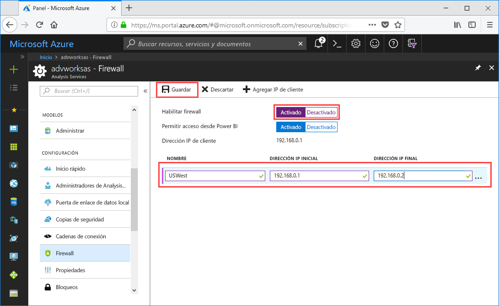

# Guía de inicio rápido: Configuración del firewall del servidor: Portal

Esta guía de inicio rápido le ayudará a configurar un firewall para el servidor de Azure Analysis Services. La habilitación de un firewall y la configuración de los intervalos de direcciones IP solo para los equipos que tienen acceso al servidor son una parte importante de la protección del servidor y los datos.

## Requisitos previos

- Un servidor de Analysis Services en la suscripción. Para más información, consulte [Guía de inicio rápido: Creación de un servidor: Portal](analysis-services-create-server.md) o [Guía de inicio rápido: Creación de un servidor: PowerShell](analysis-services-create-powershell.md)
- Uno o más intervalos de direcciones IP para los equipos cliente (si es necesario).

## Iniciar sesión en Azure Portal 

[Inicie sesión en el portal](https://portal.azure.com)

## Configuración de un firewall

1. Haga clic en el servidor para abrir la página Información general. 
2. En **Configuración** > **Firewall** > **Habilitar firewall**, haga clic en **Activar**.
3. Para permitir el acceso de DirectQuery desde el servicio Power BI, en **Permitir el acceso desde Power BI**, haga clic en **Activar**.  
4. (Opcional) Especifique uno o más intervalos de direcciones IP. Escriba un nombre y una dirección IP inicial y final para cada intervalo. 
5. Haga clic en **Save**(Guardar).

     

## Limpieza de recursos

Cuando ya no los necesite, elimine intervalos de direcciones IP o deshabilite el firewall.

## Pasos siguientes
En esta guía de inicio rápido, ha aprendido a configurar un firewall para el servidor. Ahora que tiene el servidor y está protegido con un firewall, puede agregar un modelo de datos de ejemplo básico desde el portal. Tener un modelo de ejemplo es útil para aprender cómo configurar los roles de la base de datos del modelo y probar las conexiones de cliente. Para más información, puede seguir el tutorial para agregar un modelo de ejemplo.

> [!div class="nextstepaction"]
> [Tutorial: Incorporación de un modelo de ejemplo al servidor](analysis-services-create-sample-model.md)
