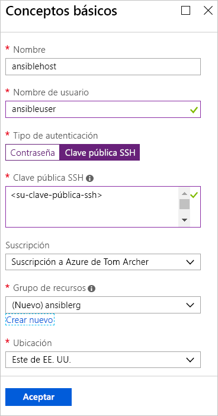
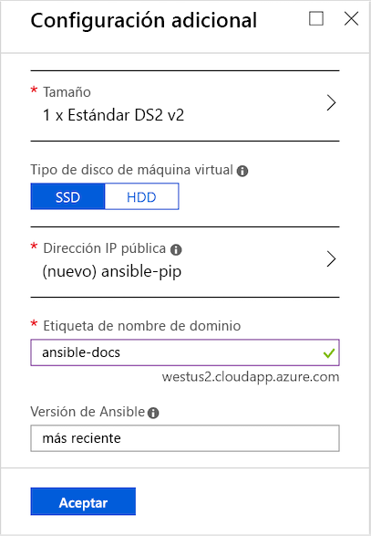
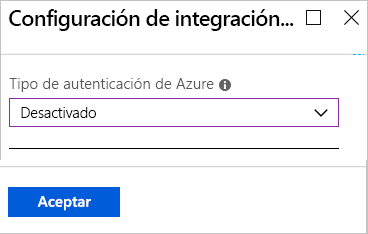
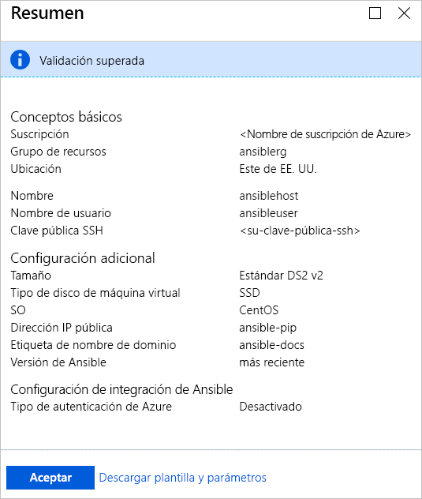
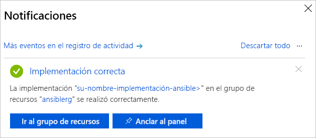

# Inicio rápido: Implementación de la plantilla de solución de Ansible para Azure en CentOS

La plantilla de solución de Ansible para Azure está diseñada para configurar una instancia de Ansible en una máquina virtual CentOS junto con Ansible y un conjunto de herramientas configuradas para funcionar con Azure. Estas herramientas son:

- **Módulos de Ansible para Azure**: los [módulos de Ansible para Azure](./ansible-matrix.md) son un conjunto de módulos que le permiten crear y administrar la infraestructura en Azure. De forma predeterminada, se implementa la versión más reciente de estos módulos. Sin embargo, durante el proceso de implementación de la plantilla de soluciones, puede especificar un número de versión que sea apropiado para su entorno.
- **Interfaz de la línea de comandos (CLI) de Azure 2.0**: la [CLI de Azure 2.0](/cli/azure/?view=azure-cli-latest) es una experiencia de línea de comandos multiplataforma de Microsoft para administrar los recursos de Azure. 
- **Identidades administradas de recursos de Azure**: la característica [Identidades administradas de recursos de Azure](/azure/active-directory/managed-identities-azure-resources/overview) aborda la cuestión de mantener seguras las credenciales de las aplicaciones en la nube.

## Prerrequisitos

[!INCLUDE [open-source-devops-prereqs-azure-subscription.md](../../includes/open-source-devops-prereqs-azure-subscription.md)]

## Implementación de la plantilla de solución de Ansible

1. Vaya a la [plantilla de solución de Ansible en Azure Marketplace](https://azuremarketplace.microsoft.com/en-%20%20us/marketplace/apps/azure-oss.ansible?tab=Overview).

1. Seleccionar **Obtenerla ahora**.

1. Aparece una ventana que detalla los términos de uso, la directiva de privacidad y las condiciones de uso de Azure Marketplace. Seleccione **Continuar**.

1. Aparece Azure Portal y muestra la página de Ansible que describe la plantilla de solución. Seleccione **Crear**.

1. En la página **Create Ansible** (Crear Ansible), verá varias pestañas. En la pestaña **Basics** (Aspectos básicos), introduzca la información necesaria:

   - **Name** (Nombre): especifique el nombre de la instancia de Ansible. Con fines de demostración, se utiliza el nombre `ansiblehost`.
   - **User name** (Nombre de usuario): especifique el nombre de usuario que tendrá acceso a la instancia de Ansible. Con fines de demostración, se utiliza el nombre `ansibleuser`.
   - **Authentication type** (Tipo de autenticación): seleccione **Password** (Contraseña) o **SSH public key** (Clave pública SSH). Con fines de demostración, está seleccionada **SSH public key** (Clave pública SSH).
   - **Password** (Contraseña) y **Confirm password** (Confirmar contraseña): si selecciona **Password** (Contraseña) en **Authentication type** (Tipo de autenticación), escriba la contraseña para estos valores.
   - **SSH public key** (Clave pública SSH): si selecciona **SSH public key** (Clave pública SSH) para **Authentication type** (Tipo de autenticación), escriba la clave pública RSA en el formato de una sola línea, comenzando con `ssh-rsa`.
   - **Subscription** (Suscripción): seleccione la suscripción de Azure en la lista desplegable.
   - **Resource group** (Grupo de recursos): seleccione un grupo de recursos existente en la lista desplegable o la opción **Create new** (Crear nuevo) y especifique un nombre para un nuevo grupo de recursos. Con fines de demostración, se utiliza un nuevo grupo de recursos llamado `ansiblerg`.
   - **Location** (Ubicación): seleccione en la lista desplegable la ubicación que sea adecuada para su escenario.

     

1. Seleccione **Aceptar**.

1. En la pestaña **Additional Settings** (Configuración adicional), escriba la información necesaria:

   - **Size** (Tamaño): Azure Portal tiene de manera predeterminada un tamaño estándar. Para especificar un tamaño diferente que se ajuste a su escenario específico, seleccione la flecha para visualizar una lista de tamaños diferentes.
   - **VM disk type** (Tipo de disco de máquina virtual): seleccione **SSD** (unidad de estado sólido Premium) o **HDD** (unidad de disco duro). Con fines de demostración, se selecciona **SSD** por sus ventajas de rendimiento. Para más información sobre estos tipos de almacenamiento en disco, consulte los siguientes artículos:
       - [Discos administrados y Premium Storage de alto rendimiento para máquinas virtuales](/azure/virtual-machines/windows/premium-storage)
       - [Discos administrados SSD estándar para cargas de trabajo de máquinas virtuales de Azure](/azure/virtual-machines/windows/disks-standard-ssd)
   - **Public IP Address** (Dirección IP pública): especifique esta opción si desea comunicarse con la máquina virtual desde fuera de ella. El valor predeterminado es una nueva dirección IP pública que tiene el nombre `ansible-pip`. Para especificar una dirección IP diferente, seleccione la flecha y especifique los atributos (tales como nombre, SKU y asignación) de esa dirección IP. 
   - **Domain name label** (Etiqueta de nombre de dominio): escriba el nombre de dominio público de la máquina virtual. El nombre debe ser único y cumplir con los requisitos de nomenclatura. Para más información sobre cómo especificar un nombre para la máquina virtual, consulte [Convenciones de nomenclatura para los recursos de Azure](/azure/architecture/best-practices/resource-naming).
   - **Ansible versión** (Versión de Ansible): especifique un número de versión o el valor `latest` para implementar la versión más reciente. Seleccione el icono de información junto a **Ansible versión** (Versión de Ansible) para obtener más información sobre las versiones disponibles.

     

1. Seleccione **Aceptar**.

1. En la pestaña **Ansible Integration Settings** (Configuración de integración de Ansible), especifique el tipo de autenticación. Para más información sobre la protección de recursos de Azure, consulte [¿Qué es Managed Identities for Azure Resources?](/azure/active-directory/managed-identities-azure-resources/overview).

    

1. Seleccione **Aceptar**.

1. La página **Summary** (Resumen) muestra el proceso de validación y enumera los criterios especificados para la implementación de Ansible. Un vínculo en la parte inferior de la pestaña le permite **descargar la plantilla y los parámetros** para su uso con plataformas y lenguajes admitidos de Azure. 

     

1. Seleccione **Aceptar**.

1. Cuando la pestaña **Create** (Crear) aparece, seleccione **OK** (Aceptar) para implementar Ansible.

1. Seleccione el icono **Notifications** (Notificaciones) situado en la parte superior de la página del portal para realizar el seguimiento de la implementación de Ansible. Cuando se completa la implementación, seleccione **Go to resource group** (Ir al grupo de recursos). 

     

1. En la página del grupo de recursos, obtenga la dirección IP del host de Ansible e inicie sesión para administrar los recursos de Azure con Ansible.

## Pasos siguientes

> [!div class="nextstepaction"] 
> [Inicio rápido: Configuración de una máquina virtual Linux en Azure con Ansible](./ansible-create-vm.md)