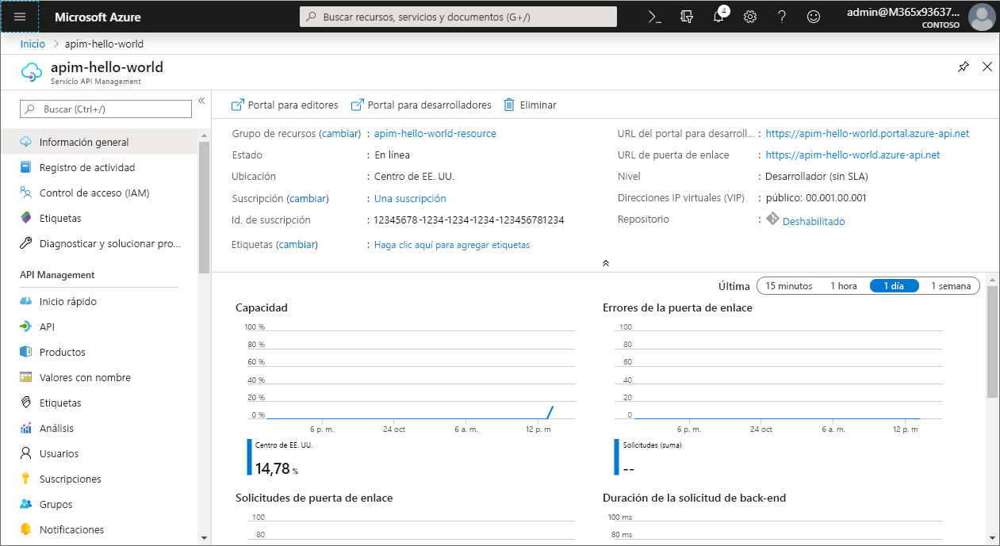
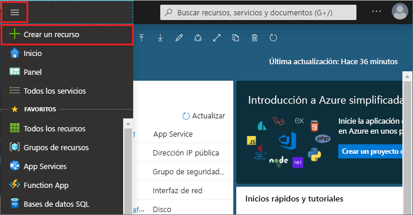
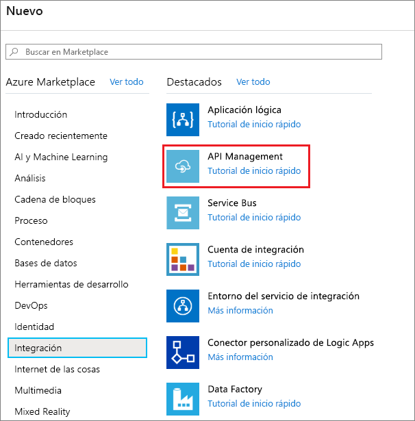
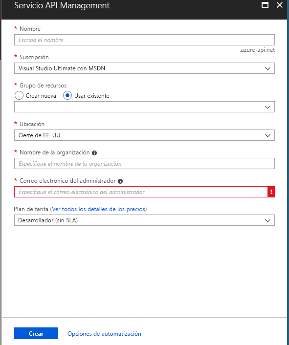
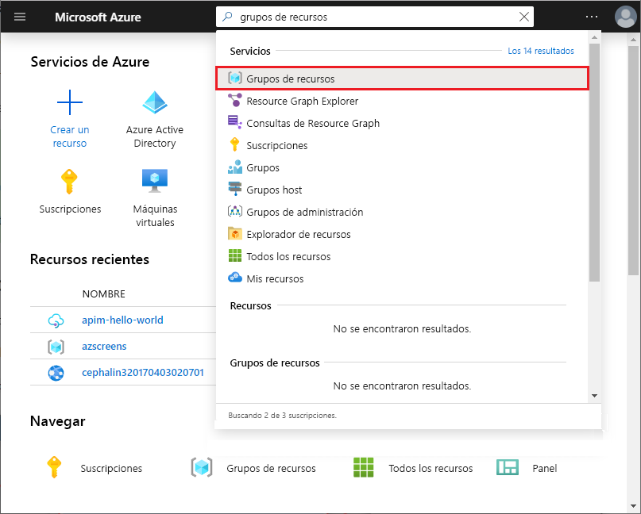
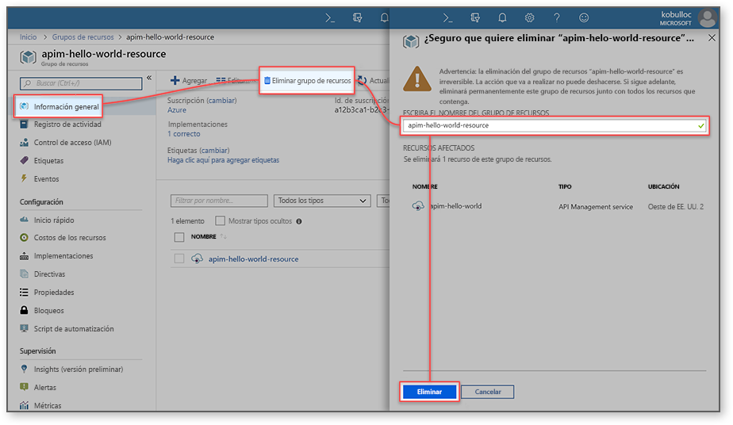

# Creación de una nueva instancia del servicio Azure API Management

Azure API Management (APIM) ayuda a las organizaciones a publicar API para desarrolladores externos, asociados e internos a fin de desbloquear el potencial de sus datos y servicios. API Management proporciona las competencias esenciales para garantizar un programa de API de éxito mediante compromisos con desarrolladores, información detallada empresarial, análisis, seguridad y protección. APIM le permite crear y administrar modernas puertas de enlace de API para los servicios back-end existentes hospedados en cualquier lugar. Para más información, consulte el tema de [introducción](api-management-key-concepts.md).

Esta guía de inicio rápido describe los pasos que deben seguirse para crear una nueva instancia de API Management mediante Azure Portal.

[!INCLUDE [quickstarts-free-trial-note](../../includes/quickstarts-free-trial-note.md)]

## Inicio de sesión en Azure

Inicie sesión en el [Azure Portal](https://portal.azure.com).

## Creación de un nuevo servicio

1. En el menú de Azure Portal, seleccione **Crear un recurso**. También puede seleccionar **Crear un recurso** en la página **principal** de Azure. 
   
   
   
1. En la pantalla **Nuevo**, seleccione **Integración** y, a continuación, seleccione **API Management**.
   
   
   
1. En la pantalla **servicio API Management**, escriba los valores.
   
   
   
   | Configuración                 | Valor sugerido                               | Descripción                                                                                                                                                                                                                                                                                                                         |
|-------------------------|-----------------------------------------------|-------------------------------------------------------------------------------------------------------------------------------------------------------------------------------------------------------------------------------------------------------------------------------------------------------------------------------------|
| **Nombre**                | Un nombre único para el servicio API Management | Este nombre no se podrá modificar más adelante. El nombre del servicio se usa para generar un nombre de dominio predeterminado con el formato *{nombre}.azure-api.net.* Si desea utilizar un nombre de dominio personalizado, consulte [Configure a custom domain](configure-custom-domain.md) (Configuración de un dominio personalizado).   El nombre del servicio se utiliza para hacer referencia al servicio y al recurso de Azure correspondiente. |
| **Suscripción**        | Su suscripción                             | La suscripción en que se creará esta nueva instancia de servicio. Seleccione una suscripción entre las diferentes suscripciones de Azure a las que tiene acceso.                                                                                                                                                            |
| **Grupo de recursos**      | *apimResourceGroup*                           | Seleccione un nuevo recurso o uno ya existente. Un grupo de recursos es una colección de recursos que comparten ciclos de vida, permisos y directivas. Obtenga más información [aquí](../azure-resource-manager/resource-group-overview.md#resource-groups).                                                                                                  |
| **Ubicación**            | *Oeste de EE. UU.*                                    | Seleccione la región geográfica más próxima. En el cuadro de lista desplegable, solo aparecerán las regiones del servicio API Management.                                                                                                                                                                                                          |
| **Nombre de la organización**   | El nombre de su organización                 | Este nombre se usa en varios lugares, incluido el título del portal para desarrolladores y el remitente de correos electrónicos de notificación.                                                                                                                                                                                                             |
| **Correo electrónico del administrador** | *admin\@org.com*                               | Especifique la dirección de correo electrónico a la que se enviarán todas las notificaciones de **API Management**.                                                                                                                                                                                                                                              |
| **Plan de tarifa**        | *Developer*                                   | Especifique el nivel de **Desarrollador** para evaluar el servicio. Este nivel no puede utilizarse en producción. Para más información sobre el escalado de los niveles de API Management, consulte [Actualización y escalado](upgrade-and-scale.md).                                                                                                                                    |

3. Seleccione **Create**.

    > [!TIP]
    > Normalmente, se tarda entre 20 y 30 minutos en crear el servicio API Management. Si selecciona **Anclar al panel**, podrá encontrar el servicio que acaba de crear con más facilidad.

[!INCLUDE [api-management-navigate-to-instance](../../includes/api-management-navigate-to-instance.md)]

## Limpieza de recursos

Cuando ya no los necesite, puede quitar el grupo de recursos y todos los recursos relacionados siguiendo los pasos a continuación:

1. En Azure Portal, busque y seleccione **Grupos de recursos**. También puede seleccionar **Grupos de recursos** en la página **principal**. 

   

1. En la página **Grupos de recursos**, seleccione el grupo de recursos.

   

1. En la página del grupo de recursos, seleccione **Eliminar grupo de recursos**. 
   
1. Escriba el nombre del grupo de recursos y, después, seleccione **Eliminar**.

   

## Pasos siguientes

> [!div class="nextstepaction"]
> [Importación y publicación de la primera API](import-and-publish.md)
