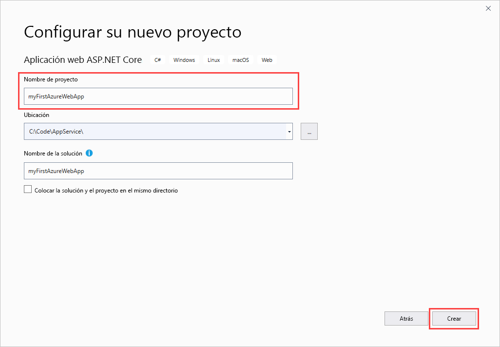
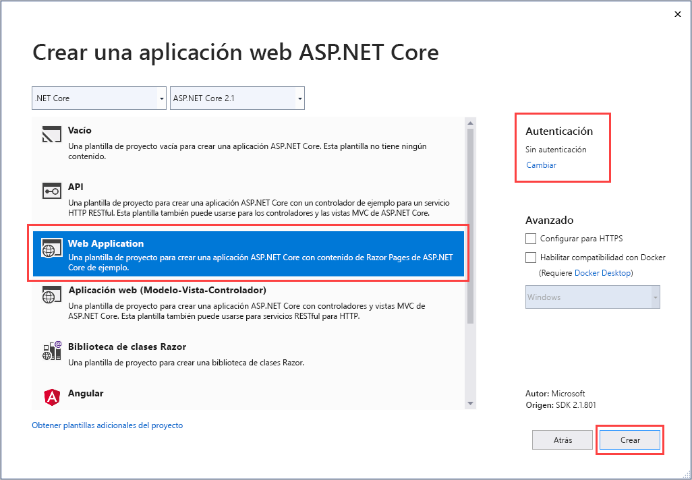
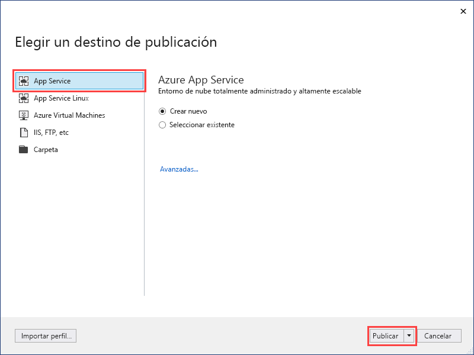
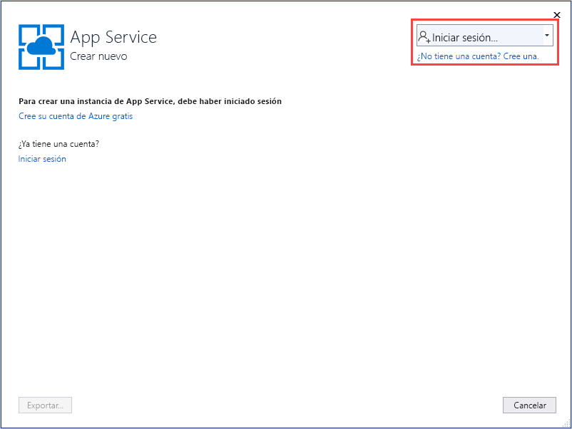
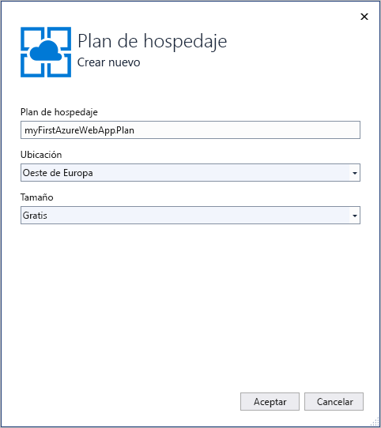
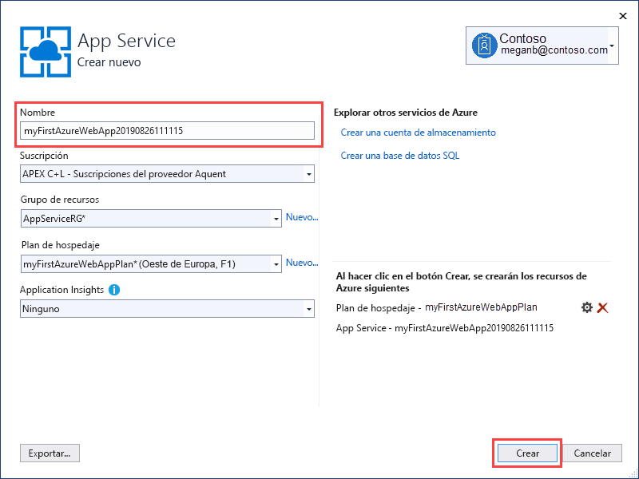
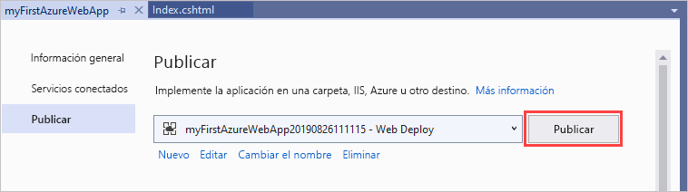
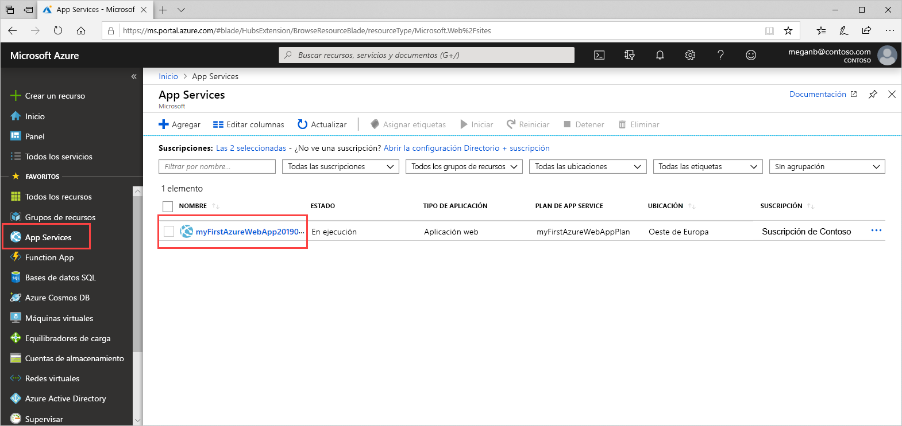
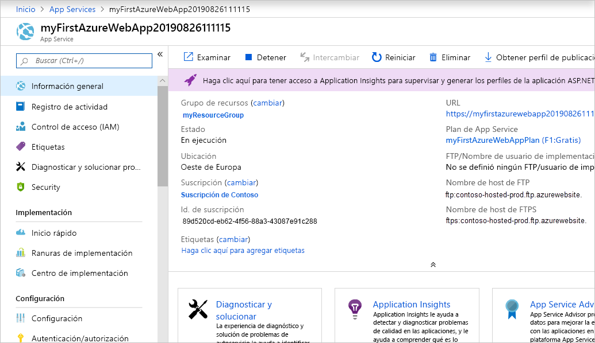

# <a name="create-an-aspnet-core-web-app-in-azure"></a>Creación de una aplicación web ASP.NET Core en Azure

> [!NOTE]
> En este artículo se implementa una aplicación en App Service en Windows. Para realizar implementaciones en App Service en _Linux_, consulte [Creación de una aplicación web de .NET Core en App Service en Linux](./containers/quickstart-dotnetcore.md).
>

[Azure App Service](overview.md) proporciona un servicio de hospedaje web muy escalable y con aplicación de revisiones de un modo automático.

En este inicio rápido se muestra cómo implementar su primera aplicación web ASP.NET Core en Azure App Service. Cuando haya terminado, tendrá un grupo de recursos que consta de un plan de App Service y una aplicación de App Service con una aplicación web implementada.

[!INCLUDE [quickstarts-free-trial-note](../../includes/quickstarts-free-trial-note.md)]

## <a name="prerequisites"></a>Requisitos previos

Para completar este tutorial, instale <a href="https://www.visualstudio.com/downloads/" target="_blank">Visual Studio 2019</a> con la carga de trabajo de **ASP.NET y desarrollo web**.

Si ya ha instalado Visual Studio 2019:

- Para instalar las actualizaciones más recientes de Visual Studio, seleccione **Ayuda** > **Buscar actualizaciones**.
- Para agregar la carga de trabajo, seleccione **Herramientas** > **Obtener herramientas y características**.

## <a name="create-an-aspnet-core-web-app"></a>Cree una aplicación web ASP.NET Core

Cree una aplicación web ASP.NET Core siguiendo estos pasos:

1. Abra Visual Studio y seleccione **Crear un proyecto**.

1. En **Crear un proyecto**, busque y elija **Aplicación web ASP.NET Core** para C# y, a continuación, seleccione **Siguiente**.

1. En **Configurar el nuevo proyecto**, asigne al proyecto el nombre _myFirstAzureWebApp_ y luego seleccione **Crear**.

   

1. Para este inicio rápido, elija la plantilla **Aplicación web**. Asegúrese de establecer la autenticación en **Sin autenticación** y que no hay ninguna otra opción seleccionada. Seleccione **Crear**.

   

    Puede implementar cualquier tipo de aplicación web ASP.NET Core en Azure.

1. En el menú de Visual Studio, seleccione **Depurar** > **Iniciar sin depurar** para ejecutar la aplicación web localmente.

   

## <a name="publish-your-web-app"></a>Publicación de la aplicación web

1. En **Explorador de soluciones**, haga clic con el botón derecho en el proyecto **myFirstAzureWebApp** y seleccione **Publicar**.

1. Elija **App Service** y seleccione **Publicar**.

   

1. En **App Service Create new** (App Service - Crear nuevo), las opciones dependen de si ya ha iniciado sesión en Azure y de si tiene una cuenta de Visual Studio vinculada a una cuenta de Azure. Seleccione **Agregar una cuenta** o **Iniciar sesión** para iniciar sesión en la suscripción de Azure. Si ya ha iniciado sesión, seleccione la cuenta que desee.

   > [!NOTE]
   > Si ya ha iniciado sesión, no seleccione **Crear** todavía.
   >

   

   [!INCLUDE [resource group intro text](../../includes/resource-group.md)]

1. En **Grupo de recursos**, seleccione **Nuevo**.

1. En **Nuevo nombre de grupo de recursos**, escriba *myResourceGroup* y seleccione **Aceptar**.

   [!INCLUDE [app-service-plan](../../includes/app-service-plan.md)]

1. En **Plan de hospedaje**, seleccione **Nuevo**.

1. En el cuadro de diálogo **Configurar un plan de hospedaje**, escriba los valores en la tabla siguiente y, después, seleccione **Aceptar**.

   | Configuración | Valor sugerido | DESCRIPCIÓN |
   |-|-|-|
   |Plan de App Service| myAppServicePlan | Nombre del plan de App Service. |
   | Location | Europa occidental | El centro de datos donde se hospeda la aplicación web. |
   | Size | Gratuito | [Plan de tarifa](https://azure.microsoft.com/pricing/details/app-service/?ref=microsoft.com&utm_source=microsoft.com&utm_medium=docs&utm_campaign=visualstudio) determina las características de hospedaje. |

   

1. En **Nombre**, escriba un nombre de aplicación único que incluya solo los caracteres válidos, que son `a-z`, `A-Z`, `0-9` y `-`. Puede aceptar el nombre único generado automáticamente. La dirección URL de la aplicación web es `http://<app_name>.azurewebsites.net`, donde `<app_name>` es el nombre de la aplicación.

   

1. Seleccione **Crear** para comenzar a crear los recursos de Azure.

Una vez completado el asistente, publica la aplicación web ASP.NET Core en Azure e inicia la aplicación en el explorador predeterminado.


El nombre de aplicación especificado en la página **App Service Create new** (App Service - Crear nuevo) se usa como el prefijo de dirección URL en el formato `http://<app_name>.azurewebsites.net`.

**¡Enhorabuena!** La aplicación web de ASP.NET Core se está ejecutando en Azure App Service.

## <a name="update-the-app-and-redeploy"></a>Actualización de la aplicación y nueva implementación

1. En **Explorador de soluciones**, en el proyecto, abra **Pages** > **Index.cshtml**.

1. Reemplace las dos etiquetas `<div>` por el código siguiente:

   ```HTML
   <div class="jumbotron">
       <h1>ASP.NET in Azure!</h1>
       <p class="lead">This is a simple app that we’ve built that demonstrates how to deploy a .NET app to Azure App Service.</p>
   </div>
   ```

1. Para volver a implementar en Azure, haga clic con el botón derecho en el proyecto **myFirstAzureWebApp**, en el **Explorador de soluciones** y seleccione **Publicar**.

1. En la página de resumen **Publicar**, seleccione **Publicar**.

   

Cuando se completa la publicación, Visual Studio inicia un explorador en la dirección URL de la aplicación web.


## <a name="manage-the-azure-app"></a>Administración de la aplicación de Azure

1. Vaya a <a href="https://portal.azure.com" target="_blank">Azure Portal</a> para administrar la aplicación web.

1. En el menú izquierdo, seleccione **App Services** y, después, el nombre de la aplicación de Azure.

   

   Podrá ver la página de información general de la aplicación web. En ella, puede realizar una administración básica como examinar, detener, iniciar, reiniciar y eliminar.

   

   El menú izquierdo proporciona distintas páginas para configurar la aplicación.

[!INCLUDE [Clean-up section](../../includes/clean-up-section-portal.md)]

## <a name="next-steps"></a>Pasos siguientes

> [!div class="nextstepaction"]
> [ASP.NET Core con SQL Database](app-service-web-tutorial-dotnetcore-sqldb.md)
