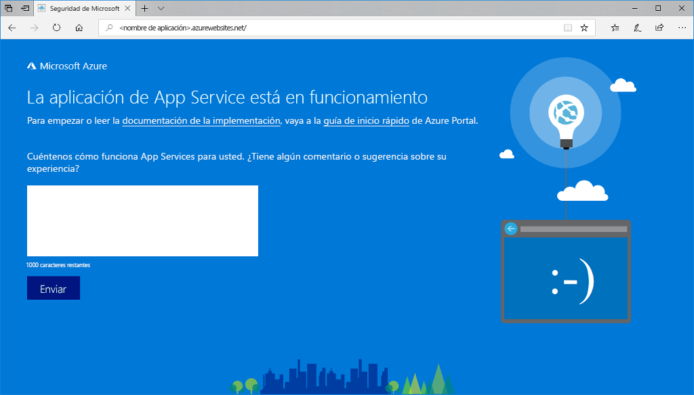

# <a name="create-a-nodejs-web-app-in-azure"></a>Creación de una aplicación web de Node.js en Azure

> [!NOTE]
> En este artículo se implementa una aplicación en App Service en Windows. Para realizar implementaciones en App Service en _Linux_, consulte [Creación de una aplicación web de Node.js en Azure App Service en Linux](./containers/quickstart-nodejs.md).
>

[Azure App Service](overview.md) proporciona un servicio de hospedaje web muy escalable y con aplicación de revisiones de un modo automático.  En este tutorial rápido se explica cómo se implementa una aplicación de Node.js en Azure App Service. Creará la aplicación web con [Cloud Shell](https://docs.microsoft.com/azure/cloud-shell/overview), pero también puede ejecutar estos comandos localmente con la [CLI de Azure](/cli/azure/install-azure-cli). Implementará el código de Node.js de muestra en la aplicación web mediante el comando [az webapp deployment source config-zip](/cli/azure/webapp/deployment/source?view=azure-cli-latest#az-webapp-deployment-source-config-zip).  


Estos pasos se pueden realizar en este caso con una máquina Mac, Windows o Linux. En completar los pasos se tardan unos tres minutos.

[!INCLUDE [quickstarts-free-trial-note](../../includes/quickstarts-free-trial-note.md)]

[!INCLUDE [cloud-shell-try-it.md](../../includes/cloud-shell-try-it.md)]

## <a name="download-the-sample"></a>Descarga del ejemplo

En Cloud Shell, cree un directorio de inicio rápido y luego cambie a él.

```console
mkdir quickstart

cd $HOME/quickstart
```

A continuación, ejecute el comando siguiente para clonar el repositorio de la aplicación de ejemplo en el directorio de inicio rápido.

```console
git clone https://github.com/Azure-Samples/nodejs-docs-hello-world
```

Durante la ejecución, muestra información similar a la del ejemplo siguiente:

```output
Cloning into 'nodejs-docs-hello-world'...
remote: Counting objects: 40, done.
remote: Total 40 (delta 0), reused 0 (delta 0), pack-reused 40
Unpacking objects: 100% (40/40), done.
Checking connectivity... done.
```

> [!NOTE]
> El archivo index.js de ejemplo establece el puerto de escucha en process.env.PORT. App Service asigna esta variable de entorno.
>

[!INCLUDE [Create resource group](../../includes/app-service-web-create-resource-group-scus.md)]

[!INCLUDE [Create app service plan](../../includes/app-service-web-create-app-service-plan-scus.md)]

## <a name="create-a-web-app"></a>Creación de una aplicación web

En Cloud Shell, cree una aplicación web en el plan de App Service `myAppServicePlan` con el comando [`az webapp create`](/cli/azure/webapp?view=azure-cli-latest#az-webapp-create).

En el siguiente ejemplo, reemplace `<app_name>` por un nombre único global de aplicación (los caracteres válidos son `a-z`, `0-9` y `-`).

```azurecli-interactive
# Bash and Powershell
az webapp create --resource-group myResourceGroup --plan myAppServicePlan --name <app_name>
```

Cuando se haya creado la aplicación web, la CLI de Azure mostrará información similar a la del ejemplo siguiente:

```json
{
  "availabilityState": "Normal",
  "clientAffinityEnabled": true,
  "clientCertEnabled": false,
  "cloningInfo": null,
  "containerSize": 0,
  "dailyMemoryTimeQuota": 0,
  "defaultHostName": "<app_name>.azurewebsites.net",
  "enabled": true,
  < JSON data removed for brevity. >
}
```

### <a name="set-nodejs-runtime"></a>Tiempo de ejecución de Node.js

Establezca el entorno de ejecución de Node en 10.14.1. Para ver todos los entornos en tiempo de ejecución admitidos, ejecute [`az webapp list-runtimes`](/cli/azure/webapp?view=azure-cli-latest#az-webapp-list-runtimes).

```azurecli-interactive
# Bash and Powershell
az webapp config appsettings set --resource-group myResourceGroup --name <app_name> --settings WEBSITE_NODE_DEFAULT_VERSION=10.14.1
```

Vaya a la aplicación web recién creada. Reemplace `<app_name>` por un nombre de aplicación único.

```http
http://<app_name>.azurewebsites.net
```

Este es el aspecto que debería tener su nueva aplicación web: 

## <a name="deploy-zip-file"></a>Implementación de un archivo ZIP

En Cloud Shell, desplácese al directorio raíz de la aplicación y cree un nuevo archivo ZIP para el proyecto de muestra.

```console
cd nodejs-docs-hello-world  

zip -r myUpdatedAppFiles.zip *.*
```

Implemente el archivo ZIP en la aplicación web mediante el comando [az webapp deployment source config-zip](/cli/azure/webapp/deployment/source?view=azure-cli-latest#az-webapp-deployment-source-config-zip).  

```azurecli-interactive
az webapp deployment source config-zip --resource-group myResourceGroup --name <app_name> --src myUpdatedAppFiles.zip
```

Este comando implementa los archivos y directorios del archivo ZIP en la carpeta predeterminada de la aplicación App Service (`\home\site\wwwroot`) y reinicia la aplicación. Si se configura algún proceso de compilación personalizado adicional, se ejecuta también. Para obtener más información, consulte la [documentación de Kudu](https://github.com/projectkudu/kudu/wiki/Deploying-from-a-zip-file).

## <a name="browse-to-the-app"></a>Navegación hasta la aplicación

Vaya a la aplicación implementada mediante el explorador web.

```http
http://<app_name>.azurewebsites.net
```

El código de ejemplo de Node.js se está ejecutando en una aplicación web de Azure App Service.


> [!NOTE]
> En Azure App Service, la aplicación se ejecuta en IIS mediante [iisnode](https://github.com/Azure/iisnode). Para habilitar que la aplicación se ejecute con iisnode, el directorio de la aplicación raíz contiene el archivo web.config. IIS puede leer dicho archivo y la configuración de iisnode se documenta en [el repositorio de GitHub de iisnode](https://github.com/Azure/iisnode/blob/master/src/samples/configuration/web.config).

**¡Enhorabuena!** Ha implementado la primera aplicación de Node.js en App Service.

## <a name="update-and-redeploy-the-code"></a>Actualización del código y nueva implementación

En Cloud Shell, escriba `code index.js` para abrir el editor de Cloud Shell.


Realice un pequeño cambio en el texto en la llamada a `response.end`:

```javascript
response.end("Hello Azure!");
```

Guarde los cambios y salga del editor. Use el comando `^S` para guardar y `^Q` para salir.

Cree un archivo ZIP e impleméntelo mediante el comando [az webapp deployment source config-zip](/cli/azure/webapp/deployment/source?view=azure-cli-latest#az-webapp-deployment-source-config-zip).  

```azurecli-interactive
# Bash
zip -r myUpdatedAppFiles.zip *.*

az webapp deployment source config-zip --resource-group myResourceGroup --name <app_name> --src myUpdatedAppFiles.zip
```

Vuelva a la ventana del explorador que se abrió en el paso **Navegación hasta la aplicación** y actualice la página.


## <a name="manage-your-new-azure-app"></a>Administración de la nueva aplicación de Azure

Vaya a <a href="https://portal.azure.com" target="_blank">Azure Portal</a> para administrar la aplicación web que ha creado.

En el menú izquierdo, haga clic en **App Services** y, luego, en el nombre de la aplicación de Azure.


Podrá ver la página de información general de la aplicación web. En este caso, puede realizar tareas de administración básicas como examinar, detener, iniciar, reiniciar y eliminar.


El menú izquierdo proporciona distintas páginas para configurar la aplicación.

[!INCLUDE [cli-samples-clean-up](../../includes/cli-samples-clean-up.md)]

## <a name="next-steps"></a>Pasos siguientes

> [!div class="nextstepaction"]
> [Node.js con MongoDB](app-service-web-tutorial-nodejs-mongodb-app.md)
