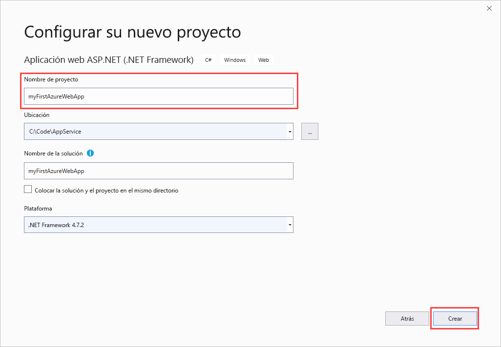
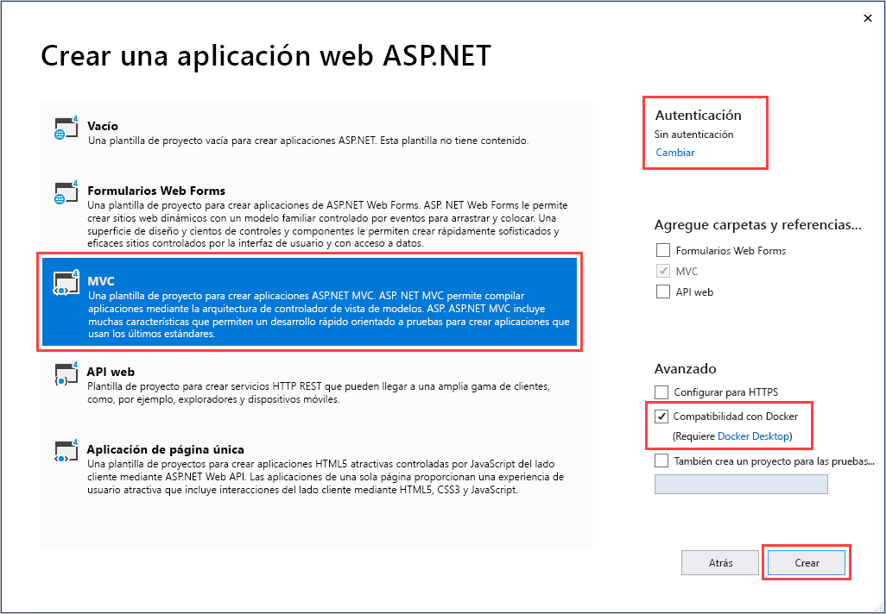
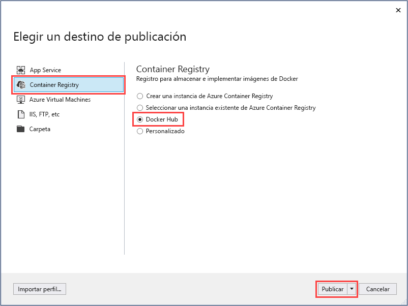
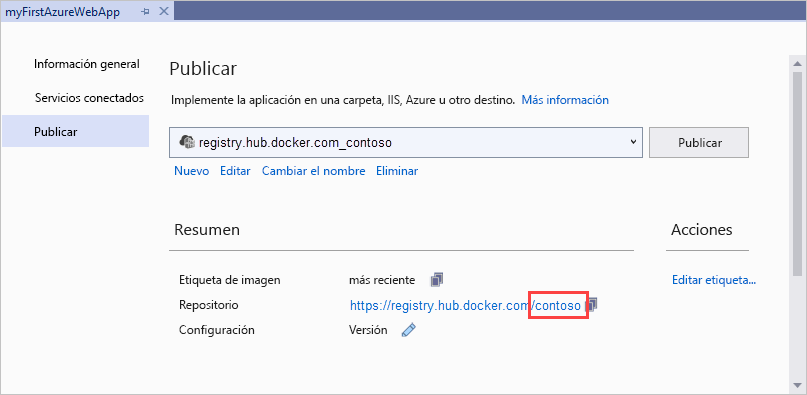
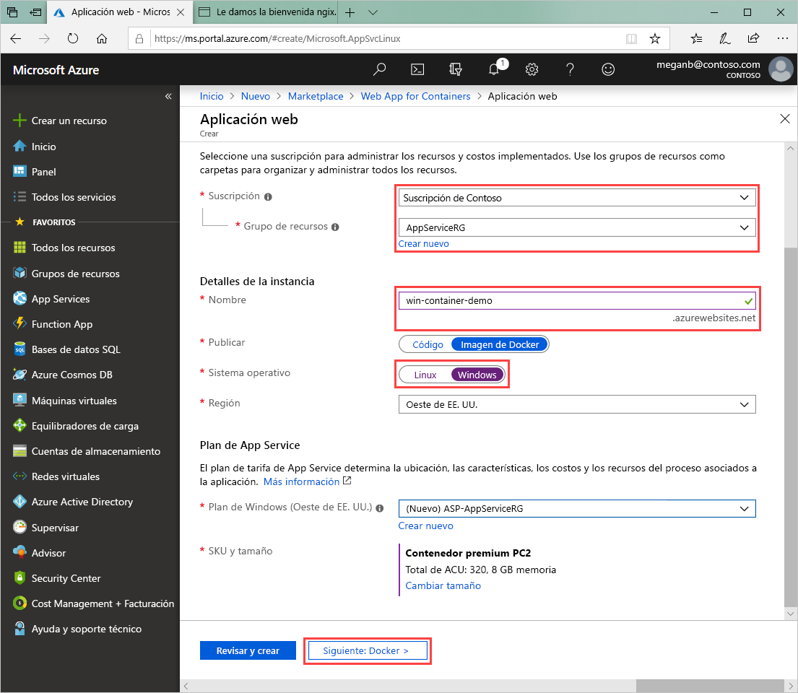
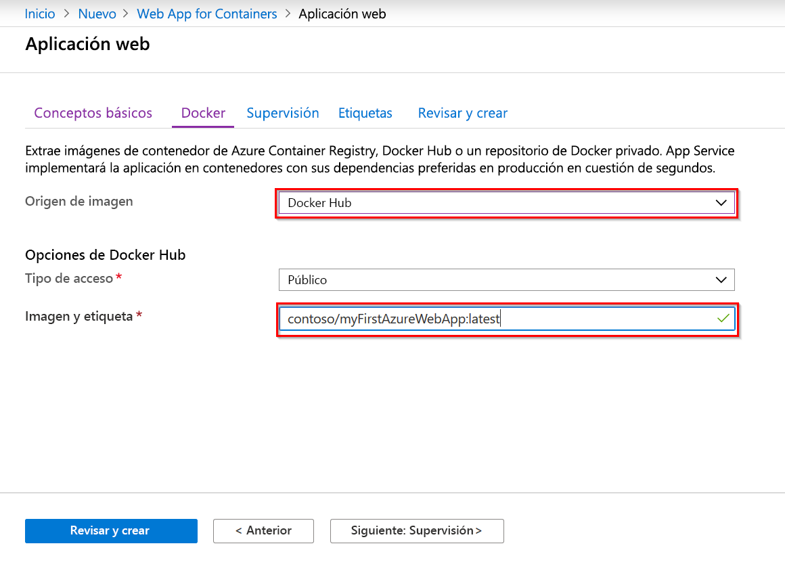

# <a name="run-a-custom-windows-container-in-azure-preview"></a>Ejecución de un contenedor de Windows personalizado en Azure (versión preliminar)

[Azure App Service](overview.md) proporciona las pilas de aplicaciones predefinidas en Windows, como ASP.NET o Node.js, que se ejecutan en IIS. El entorno preconfigurado de Windows bloquea el acceso administrativo, las instalaciones de software, los cambios en la caché global de ensamblados, etc. en el sistema operativo. Para más información, consulte [Funcionalidad del sistema operativo en Azure App Service](operating-system-functionality.md). Si la aplicación requiere más acceso que el que permite el entorno preconfigurado, puede implementar un contenedor de Windows personalizado en su lugar.

En este inicio rápido se muestra cómo implementar una aplicación ASP.NET, que está en una imagen de Windows, en [Docker Hub](https://hub.docker.com/) desde Visual Studio. La aplicación se ejecuta en un contenedor personalizado en Azure App Service.

## <a name="prerequisites"></a>Prerequisites

Para completar este tutorial:

- <a href="https://hub.docker.com/" target="_blank">Registrarse para obtener una cuenta de Docker Hub</a>
- Instalar <a href="https://docs.docker.com/docker-for-windows/install/" target="_blank">Docker para Windows</a>.
- <a href="https://docs.microsoft.com/virtualization/windowscontainers/quick-start/quick-start-windows-10" target="_blank">Cambiar Docker para ejecutar contenedores de Windows</a>.
- <a href="https://www.visualstudio.com/downloads/" target="_blank">Instalar Visual Studio 2019</a> con las cargas de trabajo **ASP.NET y desarrollo web** y **desarrollo de Azure**. Si ya ha instalado Visual Studio 2019:

    - Para instalar las actualizaciones más recientes de Visual Studio, seleccione **Ayuda** > **Buscar actualizaciones**.
    - Para agregar las cargas de trabajo en Visual Studio, seleccione **Herramientas** > **Obtener herramientas y características**.

## <a name="create-an-aspnet-web-app"></a>Creación de una aplicación web de ASP.NET

Cree una aplicación web ASP.NET siguiendo estos pasos:

1. Abra Visual Studio y seleccione **Crear un proyecto**.

1. En **Crear un proyecto**, busque y elija **Aplicación web ASP.NET Core (.NET Framework)** para C# y, a continuación, seleccione **Siguiente**.

1. En **Configurar el nuevo proyecto**, asigne al proyecto el nombre _myFirstAzureWebApp_ y luego seleccione **Crear**.

   

1. Puede implementar cualquier tipo de aplicación web de ASP.NET en Azure. Para este inicio rápido, elija la plantilla **MVC**.

1. Seleccione **Compatibilidad con Docker**  y asegúrese de que la autenticación se establece en **Sin autenticación**. Seleccione **Crear**.

   

1. Si el archivo _Dockerfile_ no se abre automáticamente, ábralo desde el **Explorador de soluciones**.

1. Necesita una [imagen principal compatible](#use-a-different-parent-image). Cambie la imagen primaria reemplazando la línea `FROM` con el código siguiente y guarde el archivo:

   ```Dockerfile
   FROM mcr.microsoft.com/dotnet/framework/aspnet:4.7.2-windowsservercore-ltsc2019
   ```

1. En el menú de Visual Studio, seleccione **Depurar** > **Iniciar sin depurar** para ejecutar la aplicación web localmente.

   

## <a name="publish-to-docker-hub"></a>Publicación en Docker Hub

1. En **Explorador de soluciones**, haga clic con el botón derecho en el proyecto **myFirstAzureWebApp** y seleccione **Publicar**.

1. Elija **App Service** y seleccione **Publicar**.

1. En **Elegir un destino de publicación**, seleccione **Container Registry** y **Docker Hub**y, haga clic en **Publicar**.

   

1. Escriba las credenciales de su cuenta de Docker Hub y seleccione **Guardar**.

   Espere a que la implementación se complete. La página **Publicar** muestra ahora el nombre del repositorio que se va a usar más adelante.

   

1. Copie este nombre de repositorio para su uso posterior.

## <a name="create-a-windows-container-app"></a>Creación de una aplicación de contenedor de Windows

1. Inicie sesión en [Azure Portal]( https://portal.azure.com).

1. Elija **Crear un recurso** en la esquina superior izquierda de Azure Portal.

1. En el cuadro de búsqueda que está encima de la lista de recursos de Azure Marketplace, busque **Web App for Containers** y seleccione **Crear**.

1. En  **Web App Create** (Creación de aplicación web), elija su suscripción y un **grupo de recursos**. Si es necesario, puede crear un grupo de recursos.

1. Especifique un nombre de aplicación, como *win-container-demo* y elija **Windows** en **Sistema operativo**. Seleccione **Siguiente: Docker** para continuar.

   

1. En **Origen de imagen**, elija **Docker Hub** y en **Imagen y etiqueta**, escriba el nombre del repositorio que copió en [Publicar en Docker Hub](#publish-to-docker-hub).

   

    Si tiene una imagen personalizada de la aplicación web en otra parte como, por ejemplo, en [Azure Container Registry](/azure/container-registry/) o en cualquier otro repositorio privado, puede configurarla aquí.

1. Seleccione **Revisar y crear** y, después, **Crear** y espere que Azure cree los recursos necesarios.

## <a name="browse-to-the-container-app"></a>Desplazamiento a la aplicación de contenedor

Una vez completada la operación de Azure, se muestra un cuadro de notificación.


1. Haga clic en **Ir al recurso**.

1. En la información general de este recurso, siga el vínculo situado junto a **URL**.

Se abre una nueva página del explorador en la página siguiente:


Espere unos minutos e inténtelo de nuevo, hasta que llegue a la página principal predeterminada de ASP.NET:


**¡Enhorabuena!** Ya está ejecutando el primer contenedor de Windows personalizado en Azure App Service.

## <a name="see-container-start-up-logs"></a>Consulta de los registros de inicio del contenedor

El contenedor de Windows puede tardar un tiempo en cargarse. Para ver el progreso, vaya a la siguiente dirección URL sustituyendo *\<app_name >* por el nombre de la aplicación.
```
https://<app_name>.scm.azurewebsites.net/api/logstream
```

Los registros transmitidos tienen este aspecto:

```
2018-07-27T12:03:11  Welcome, you are now connected to log-streaming service.
27/07/2018 12:04:10.978 INFO - Site: win-container-demo - Start container succeeded. Container: facbf6cb214de86e58557a6d073396f640bbe2fdec88f8368695c8d1331fc94b
27/07/2018 12:04:16.767 INFO - Site: win-container-demo - Container start complete
27/07/2018 12:05:05.017 INFO - Site: win-container-demo - Container start complete
27/07/2018 12:05:05.020 INFO - Site: win-container-demo - Container started successfully
```

## <a name="update-locally-and-redeploy"></a>Actualización local y nueva implementación

1. En Visual Studio, en el **Explorador de soluciones**, abra **Vistas** > **Inicio** > **Index.cshtml**.

1. Busque la etiqueta HTML `<div class="jumbotron">` en la parte superior y reemplace el elemento entero por el código siguiente:

   ```HTML
   <div class="jumbotron">
       <h1>ASP.NET in Azure!</h1>
       <p class="lead">This is a simple app that we’ve built that demonstrates how to deploy a .NET app to Azure App Service.</p>
   </div>
   ```

1. Para volver a realizar la implementación en Azure, haga clic con el botón derecho en el proyecto **myFirstAzureWebApp**, en el **Explorador de soluciones** y elija **Publicar**.

1. En la página de publicación, seleccione **Publicar** y espere hasta que la publicación se complete.

1. Para indicar a App Service que extraiga la nueva imagen de Docker Hub, reinicie la aplicación. Volviendo a la página de aplicación en el portal, haga clic en **Reiniciar** > **Sí**.

   

Vuelva a [desplazarse a la aplicación de contenedor](#browse-to-the-container-app). Al actualizar la página web, la aplicación debe volver a la página "Iniciando" al principio y luego volver a mostrar la página web actualizada transcurridos unos minutos.


## <a name="use-a-different-parent-image"></a>Uso de una imagen primaria diferente

Puede usar otra imagen personalizada de Docker para ejecutar la aplicación. Sin embargo, debe elegir la [imagen primaria (imagen base)](https://docs.docker.com/develop/develop-images/baseimages/) correcta para la plataforma que desee:

- Para implementar aplicaciones de .NET Framework, use una imagen primaria basada en la versión del [canal de mantenimiento a largo plazo (LTSC)](https://docs.microsoft.com/windows-server/get-started-19/servicing-channels-19#long-term-servicing-channel-ltsc) de Windows Server Core 2019. 
- Para implementar aplicaciones de .NET Core, use una imagen primaria basada en la versión del [canal de servicio semianual (SAC)](https://docs.microsoft.com/windows-server/get-started-19/servicing-channels-19#semi-annual-channel) de Windows Server Nano 1809. 

La descarga de una imagen primaria tarda un tiempo en completarse durante el inicio de la aplicación. Sin embargo, puede reducir el tiempo de inicio mediante una de las siguientes imágenes primarias que ya están almacenadas en caché en Azure App Service:

- [mcr.microsoft.com/dotnet/framework/aspnet](https://hub.docker.com/_/microsoft-dotnet-framework-aspnet/):4.7.2-windowsservercore-ltsc2019
- [mcr.microsoft.com/windows/nanoserver](https://hub.docker.com/_/microsoft-windows-nanoserver/):1809 (esta imagen es el contenedor base que se usa en las imágenes de Microsoft Windows Nano Server de Microsoft [ASP.NET Core](https://hub.docker.com/_/microsoft-dotnet-core-aspnet/)).

## <a name="next-steps"></a>Pasos siguientes

> [!div class="nextstepaction"]
> [Migrar al contenedor de Windows en Azure](app-service-web-tutorial-windows-containers-custom-fonts.md)
