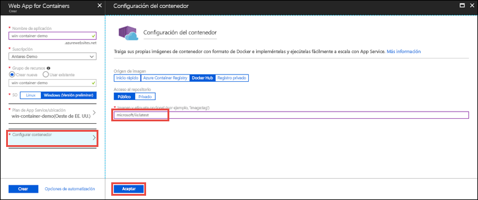

# <a name="run-a-custom-windows-container-in-azure-preview"></a>Ejecución de un contenedor de Windows personalizado en Azure (versión preliminar)

[Azure App Service](app-service-web-overview.md) proporciona las pilas de aplicaciones predefinidas en Windows, como ASP.NET o Node.js, que se ejecutan en IIS. El entorno preconfigurado de Windows bloquea el sistema operativo desde el acceso administrativo, las instalaciones de software, cambios en la caché global de ensamblados, etc (consulte [Funcionalidad del sistema operativo en Azure App Service](web-sites-available-operating-system-functionality.md)). Si la aplicación requiere más acceso que el que permite el entorno preconfigurado, puede implementar un contenedor de Windows personalizado en su lugar. Esta guía de inicio rápido le muestra cómo implementar una imagen de IIS personalizada en Azure App Service desde [Docker Hub](https://hub.docker.com/).


## <a name="sign-in-to-azure"></a>Inicio de sesión en Azure

Inicie sesión en Azure Portal en https://portal.azure.com.

## <a name="create-a-windows-container-app"></a>Creación de una aplicación de contenedor de Windows

1. Elija **Crear un recurso** en la esquina superior izquierda de Azure Portal.

2. En el cuadro de búsqueda que está encima de la lista de recursos de Azure Marketplace, busque y seleccione **Web App for Containers**.

3. Proporcione un nombre de aplicación como, por ejemplo, *mywebapp*, acepte los valores predeterminados para crear un nuevo grupo de recursos y haga clic en **Windows (versión preliminar)** en el cuadro **SO**.

    

4. Para crear un plan de App Service, haga clic en **Plan de App Service/Ubicación** > **Crear nuevo**. Asigne un nombre al nuevo plan, acepte los valores predeterminados y haga clic en **Aceptar**.

    

5. Haga clic en **Configurar contenedor**, escriba _microsoft/iis:latest_ en **Imagen y etiqueta opcional** y haga clic en **Aceptar**.

    

    En este artículo, puede usar la imagen de Docker Hub pública [microsoft/iis:latest](https://hub.docker.com/r/microsoft/iis/). Si tiene una imagen personalizada de la aplicación web en otra parte como, por ejemplo, en [Azure Container Registry](/azure/container-registry/) o en cualquier otro repositorio privado, puede configurarla aquí.

6. Haga clic en **Crear** y espere que Azure cree los recursos necesarios.

## <a name="browse-to-the-container-app"></a>Desplazamiento a la aplicación de contenedor

Una vez completada la operación de Azure, se muestra un cuadro de notificación.


1. Haga clic en **Ir al recurso**.

2. En la página de la aplicación, haga clic en el vínculo situado bajo **URL**.

Se abre una nueva página del explorador en la página siguiente:


Espere unos minutos e inténtelo de nuevo, hasta que llegue a la página de bienvenida de IIS:


**¡Enhorabuena!** Ya está ejecutando el primer contenedor de Windows personalizado en Azure App Service.

## <a name="see-container-start-up-logs"></a>Consulta de los registros de inicio del contenedor

El contenedor de Windows puede tardar un tiempo en cargarse. Para ver el progreso, vaya a la siguiente dirección URL sustituyendo *\<app_name >* por el nombre de la aplicación.
```
https://<app_name>.scm.azurewebsites.net/api/logstream
```

Los registros transmitidos tienen este aspecto:

```
2018-07-27T12:03:11  Welcome, you are now connected to log-streaming service.
27/07/2018 12:04:10.978 INFO - Site: win-container-demo - Start container succeeded. Container: facbf6cb214de86e58557a6d073396f640bbe2fdec88f8368695c8d1331fc94b
27/07/2018 12:04:16.767 INFO - Site: win-container-demo - Container start complete
27/07/2018 12:05:05.017 INFO - Site: win-container-demo - Container start complete
27/07/2018 12:05:05.020 INFO - Site: win-container-demo - Container started successfully
```

## <a name="use-a-different-docker-image"></a>Uso de una imagen de Docker diferente

Puede usar una imagen personalizada de Docker distinta para ejecutar la aplicación. Sin embargo, debe elegir la [imagen primaria](https://docs.docker.com/develop/develop-images/baseimages/) correcta para la plataforma que desee: 

- Para implementar aplicaciones de .NET Framework, use una imagen primaria basada en la versión del [canal de servicio a largo plazo (LTSC)](https://docs.microsoft.com/windows-server/get-started/semi-annual-channel-overview#long-term-servicing-channel-ltsc) de Windows Server Core 2016. 
- Para implementar aplicaciones de .NET Core, use una imagen primaria basada en la versión del [canal de servicio a largo plazo (LTSC)](https://docs.microsoft.com/windows-server/get-started/semi-annual-channel-overview#long-term-servicing-channel-ltsc) de Windows Server Nano 2016. 

La descarga de una imagen primaria tarda un tiempo en completarse durante el inicio de la aplicación. Sin embargo, puede reducir el tiempo de inicio mediante una de las siguientes imágenes primarias que ya están almacenadas en caché en Azure App Service:

- [microsoft/iis](https://hub.docker.com/r/microsoft/iis/):windowsservercore-ltsc2016, latest
- [microsoft/iis](https://hub.docker.com/r/microsoft/iis/):nanoserver-sac2016
- [microsoft/aspnet](https://hub.docker.com/r/microsoft/aspnet/):4.7.2-windowsservercore-ltsc2016, 4.7.2, latest
- [microsoft/dotnet](https://hub.docker.com/r/microsoft/dotnet/):2.1-aspnetcore-runtime
- [microsoft/dotnet](https://hub.docker.com/r/microsoft/dotnet/):2.1-sdk
