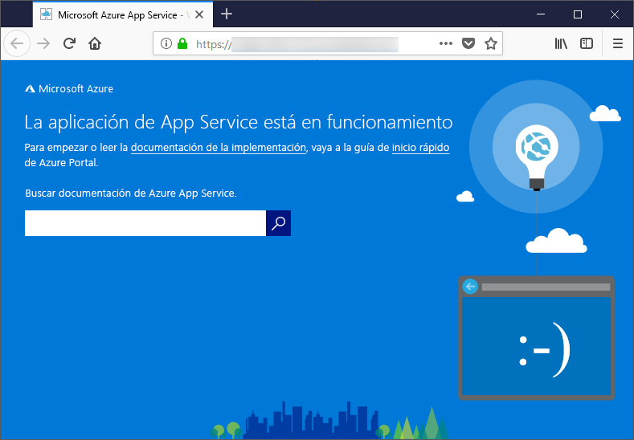

# <a name="configure-a-linux-python-app-for-azure-app-service"></a>Configuración de una aplicación de Python en Linux para Azure App Service

En este artículo se describe la forma en que [Azure App Service](app-service-linux-intro.md) ejecuta aplicaciones de Python y cómo se puede personalizar el comportamiento de App Service cuando es necesario. Las aplicaciones de Python deben implementarse con todos los módulos [pip](https://pypi.org/project/pip/) requeridos.

El motor de implementación de App Service activa automáticamente un entorno virtual y se ejecuta `pip install -r requirements.txt` automáticamente cuando se implementa un [repositorio de Git](../deploy-local-git.md?toc=%2fazure%2fapp-service%2fcontainers%2ftoc.json) o un [paquete Zip](../deploy-zip.md?toc=%2fazure%2fapp-service%2fcontainers%2ftoc.json) con los procesos de compilación activos.

En esta guía se incluyen conceptos clave e instrucciones para los desarrolladores de Python que usan un contenedor Linux integrado en App Service. Si nunca ha usado Azure App Service, debe seguir primero el [inicio rápido de Python](quickstart-python.md) y el [tutorial de Python con PostgreSQL](tutorial-python-postgresql-app.md).

> [!NOTE]
> Linux es actualmente la opción recomendada para ejecutar aplicaciones de Python en App Service. Para obtener información acerca de la opción de Windows, consulte [Configuración de un entorno de Python en Azure App Service (Windows)](https://docs.microsoft.com/visualstudio/python/managing-python-on-azure-app-service).
>

## <a name="show-python-version"></a>Mostrar la versión de Python

Para mostrar la versión actual de Python, ejecute el siguiente comando en [Cloud Shell](https://shell.azure.com):

```azurecli-interactive
az webapp config show --resource-group <resource-group-name> --name <app-name> --query linuxFxVersion
```

Para mostrar todas las versiones de Python compatibles, ejecute el siguiente comando en [Cloud Shell](https://shell.azure.com):

```azurecli-interactive
az webapp list-runtimes --linux | grep PYTHON
```

Para ejecutar una versión no compatible de Python, cree una imagen de su propio imagen de contenedor. Para más información, consulte [Uso de una imagen personalizada de Docker](tutorial-custom-docker-image.md).

## <a name="set-python-version"></a>Establecimiento de la versión de Python

Ejecute el siguiente comando en [Cloud Shell](https://shell.azure.com) para usar la versión 3.7 de Python:

```azurecli-interactive
az webapp config set --resource-group <resource-group-name> --name <app-name> --linux-fx-version "PYTHON|3.7"
```

## <a name="customize-build-automation"></a>Personalización de la automatización de compilaciones

Si implementa la aplicación mediante el uso de paquetes Git o zip con la automatización de compilaciones activada, App Service genera pasos de automatización a través de la siguiente secuencia:

1. Ejecute el script personalizado si lo especifica `PRE_BUILD_SCRIPT_PATH`.
1. Ejecute `pip install -r requirements.txt`.
1. Si *manage.py* se encuentra en la raíz del repositorio, ejecute *manage.py collectstatic*. Sin embargo, si `DISABLE_COLLECTSTATIC` está establecido en `true`, se omite este paso.
1. Ejecute el script personalizado si lo especifica `POST_BUILD_SCRIPT_PATH`.

`PRE_BUILD_COMMAND`, `POST_BUILD_COMMAND`y `DISABLE_COLLECTSTATIC` son variables de entorno que están vacías de forma predeterminada. Para ejecutar comandos anteriores a la compilación, defina `PRE_BUILD_COMMAND`. Para ejecutar comandos posteriores a la compilación, defina `POST_BUILD_COMMAND`. Para deshabilitar la ejecución de collectstatic al compilar aplicaciones de Django, establezca `DISABLE_COLLECTSTATIC=true`.

En el ejemplo siguiente se especifican las dos variables para una serie de comandos, separados por comas.

```azurecli-interactive
az webapp config appsettings set --name <app-name> --resource-group <resource-group-name> --settings PRE_BUILD_COMMAND="echo foo, scripts/prebuild.sh"
az webapp config appsettings set --name <app-name> --resource-group <resource-group-name> --settings POST_BUILD_COMMAND="echo foo, scripts/postbuild.sh"
```

Para obtener más variables de entorno para personalizar la automatización de compilaciones, consulte [configuración de Oryx](https://github.com/microsoft/Oryx/blob/master/doc/configuration.md).

Para más información sobre cómo se ejecuta App Service y se compilan aplicaciones de Python en Linux, consulte la [documentación de Oryx sobre cómo se detectan y se compilan las aplicaciones de Python](https://github.com/microsoft/Oryx/blob/master/doc/runtimes/python.md).

## <a name="container-characteristics"></a>Características del contenedor

Las aplicaciones de Python que se implementan en App Service en Linux se ejecutan dentro de un contenedor de Docker que se define en el [repositorio de GitHub sobre Python para App Service](https://github.com/Azure-App-Service/python). Puede encontrar las configuraciones de imagen dentro de los directorios específicos de la versión.

Este contenedor tiene las siguientes características:

- Las aplicaciones se ejecutan mediante el [servidor HTTP de WSGI de Gunicorn](https://gunicorn.org/), mediante los argumentos adicionales `--bind=0.0.0.0 --timeout 600`.

- De forma predeterminada, la imagen base incluye la plataforma web Flask, pero el contenedor admite otras plataformas que cumplen con WSGI y son compatibles con Python 3.7, como Django.

- Para instalar paquetes adicionales, como Django, cree un archivo [*requirements.txt*](https://pip.pypa.io/en/stable/user_guide/#requirements-files) en la raíz del proyecto mediante `pip freeze > requirements.txt`. A continuación, publique el proyecto en App Service mediante la implementación de Git, que ejecutará automáticamente `pip install -r requirements.txt` en el contenedor para instalar las dependencias de la aplicación.

## <a name="container-startup-process"></a>Proceso de inicio del contenedor

Durante el inicio, la instancia de App Service en el contenedor de Linux ejecuta los siguientes pasos:

1. Use un [comando de inicio personalizado](#customize-startup-command), si se proporciona.
2. Compruebe la existencia de una [aplicación de Django](#django-app) e inicie Gunicorn para ella si se detecta.
3. Compruebe la existencia de una [aplicación de Flask](#flask-app) e inicie Gunicorn para ella si se detecta.
4. Si no se encuentra ninguna otra aplicación, inicia una aplicación predeterminada que está integrada en el contenedor.

En las secciones siguientes se proporcionan detalles adicionales para cada opción.

### <a name="django-app"></a>Aplicación de Django

Para las aplicaciones de Django, App Service busca un archivo denominado `wsgi.py` en el código de la aplicación y, a continuación, ejecuta Gunicorn mediante el comando siguiente:

```bash
# <module> is the path to the folder that contains wsgi.py
gunicorn --bind=0.0.0.0 --timeout 600 <module>.wsgi
```

Si desea un control más específico sobre el comando de inicio, utilice un [comando de inicio personalizado](#customize-startup-command) y reemplace `<module>` por el nombre del módulo que contiene el archivo *wsgi.py*.

### <a name="flask-app"></a>Aplicación de Flask

En el caso de Flask, App Service busca un archivo denominado *application.py* o *app.py* e inicia Gunicorn como se indica a continuación:

```bash
# If application.py
gunicorn --bind=0.0.0.0 --timeout 600 application:app
# If app.py
gunicorn --bind=0.0.0.0 --timeout 600 app:app
```

Si el módulo de la aplicación principal está contenido en un archivo diferente, use un nombre diferente para el objeto de la aplicación, o si desea proporcionar argumentos adicionales para Gunicorn, use un [comando de inicio personalizado](#customize-startup-command).

### <a name="default-behavior"></a>Comportamiento predeterminado

Si el servicio de aplicación no encuentra un comando personalizado, una aplicación de Django o una aplicación de Flask, se ejecutará una aplicación predeterminada de solo lectura, ubicada en la carpeta _opt/defaultsite_. La aplicación predeterminada aparece como sigue:



## <a name="customize-startup-command"></a>Personalización del comando de inicio

Puede controlar el comportamiento de inicio del contenedor proporcionando un comando de inicio de Gunicorn personalizado. Para ello, ejecute el siguiente comando en [Cloud Shell](https://shell.azure.com):

```azurecli-interactive
az webapp config set --resource-group <resource-group-name> --name <app-name> --startup-file "<custom-command>"
```

Por ejemplo, si tiene una aplicación de Flask cuyo módulo principal es *hello.py* y el objeto de aplicación de Flask de dicho archivo se denomina `myapp`, *\<<comando-personalizado>* es así:

```bash
gunicorn --bind=0.0.0.0 --timeout 600 hello:myapp
```

Si el módulo principal está en una subcarpeta como, por ejemplo, `website` especifique esa carpeta con el argumento `--chdir`:

```bash
gunicorn --bind=0.0.0.0 --timeout 600 --chdir website hello:myapp
```

También puede agregar argumentos adicionales para Gunicorn a *\<comando personalizado>* , como `--workers=4`. Para más información, consulte [Running Gunicorn](https://docs.gunicorn.org/en/stable/run.html) (Ejecución de Gunicorn) (docs.gunicorn.org).

Para usar un servidor que no sea de Gunicorn, como [aiohttp](https://aiohttp.readthedocs.io/en/stable/web_quickstart.html), puede reemplazar *\<comando personalizado>* por algo similar a lo siguiente:

```bash
python3.7 -m aiohttp.web -H localhost -P 8080 package.module:init_func
```

> [!Note]
> App Service ignora los errores que se producen al procesar un archivo de comandos personalizados y continúa su proceso de inicio buscando aplicaciones de Django y Flask. Si no observa el comportamiento previsto, compruebe que el archivo de inicio se ha implementado en App Service y que no contiene errores.

## <a name="access-environment-variables"></a>Acceso a variables de entorno

En App Service, puede [establecer la configuración de la aplicación](../configure-common.md?toc=%2fazure%2fapp-service%2fcontainers%2ftoc.json#configure-app-settings) fuera del código de la aplicación. Luego puede acceder a ellos mediante el patrón [os.environ](https://docs.python.org/3/library/os.html#os.environ) estándar. Por ejemplo, para acceder a una configuración de una aplicación denominada `WEBSITE_SITE_NAME`, use el código siguiente:

```python
os.environ['WEBSITE_SITE_NAME']
```

## <a name="detect-https-session"></a>Detección de sesión de HTTPS

En App Service, la [terminación de SSL](https://wikipedia.org/wiki/TLS_termination_proxy) se produce en los equilibradores de carga de red, por lo que todas las solicitudes HTTPS llegan a su aplicación en forma de solicitudes HTTP sin cifrar. Si su aplicación lógica necesita comprobar si las solicitudes de usuario están cifradas, inspeccione el encabezado `X-Forwarded-Proto`.

```python
if 'X-Forwarded-Proto' in request.headers and request.headers['X-Forwarded-Proto'] == 'https':
# Do something when HTTPS is used
```

Los marcos web más usados le permiten acceder a la información de `X-Forwarded-*` en el patrón de aplicación estándar. En [CodeIgniter](https://codeigniter.com/), [is_https()](https://github.com/bcit-ci/CodeIgniter/blob/master/system/core/Common.php#L338-L365) comprueba el valor de `X_FORWARDED_PROTO` de forma predeterminada.

## <a name="access-diagnostic-logs"></a>Acceso a los registros de diagnóstico

[!INCLUDE [Access diagnostic logs](../../../includes/app-service-web-logs-access-no-h.md)]

## <a name="open-ssh-session-in-browser"></a>Abrir sesión SSH en el explorador

[!INCLUDE [Open SSH session in browser](../../../includes/app-service-web-ssh-connect-builtin-no-h.md)]

## <a name="troubleshooting"></a>Solución de problemas

- **Ve la aplicación predeterminada después de implementar su propio código de aplicación.** La aplicación predeterminada aparece porque no ha implementado el código de la aplicación en App Service o porque este no ha encontrado el código de la aplicación y ha ejecutado la aplicación predeterminada en su lugar.
- Reinicie App Service, espere 15-20 segundos y vuelva a comprobar la aplicación.
- Asegúrese de que está utilizando App Service para Linux en lugar de una instancia basada en Windows. Desde la CLI de Azure, ejecute el comando `az webapp show --resource-group <resource_group_name> --name <app_service_name> --query kind`, reemplazando `<resource_group_name>` y `<app_service_name>` en consecuencia. Debería ver `app,linux` como salida; en caso contrario, vuelva a crear la instancia de App Service y elija Linux.
- Use SSH o la consola de Kudu para conectarse directamente con App Service y compruebe que los archivos existen en *site/wwwroot*. Si no existen los archivos, revise el proceso de implementación y vuelva a implementar la aplicación.
- Si existen los archivos, App Service no fue capaz de identificar el archivo de inicio específico. Compruebe que la aplicación está estructurada como espera App Service para [Django](#django-app) o [Flask](#flask-app), o use un [comando de inicio personalizado](#customize-startup-command).
- **Ve el mensaje "Servicio no disponible" en el explorador.** El explorador ha superado el tiempo de espera mientras esperaba una respuesta de App Service, lo cual indica que App Service ha iniciado el servidor Gunicorn, pero los argumentos que especifica el código de la aplicación son incorrectos.
- Actualice el explorador, especialmente si usa los planes de tarifa más bajos en su plan de App Service. Por ejemplo, la aplicación puede tardar más en iniciarse si usa niveles gratis, por ejemplo, y comienza a tener capacidad de respuesta después de actualizar el explorador.
- Compruebe que la aplicación está estructurada como espera App Service para [Django](#django-app) o [Flask](#flask-app), o use un [comando de inicio personalizado](#customize-startup-command).
- [Acceso a la secuencia de registros](#access-diagnostic-logs).

## <a name="next-steps"></a>Pasos siguientes

> [!div class="nextstepaction"]
> [Tutorial: Aplicación de Python con PostgreSQL](tutorial-python-postgresql-app.md)

> [!div class="nextstepaction"]
> [Tutorial: Implementar desde el repositorio de contenedor privado](tutorial-custom-docker-image.md)

> [!div class="nextstepaction"]
> [P+F sobre App Service en Linux](app-service-linux-faq.md)
