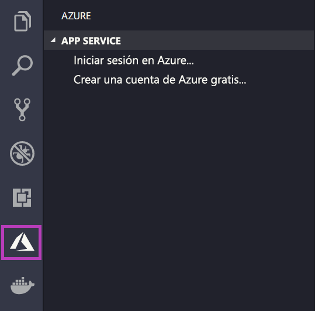
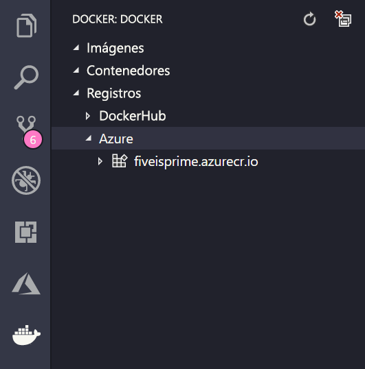

# <a name="deploy-to-azure-using-docker"></a>Implementación en Azure con Docker

App Service en Linux proporciona pilas de aplicaciones predefinidas en Linux con compatibilidad con lenguajes como .NET, PHP o Node.js entre otros. También puede usar una imagen personalizada de Docker para ejecutar la aplicación web en una pila de aplicaciones aún sin definir en Azure. En este inicio rápido se muestra cómo implementar una imagen desde [Azure Container Registry](/azure/container-registry) (ACR) en App Service.

## <a name="prerequisites"></a>Requisitos previos

* Una [cuenta de Azure](https://azure.microsoft.com/free/?utm_source=campaign&utm_campaign=vscode-tutorial-docker-extension&mktingSource=vscode-tutorial-docker-extension)
* [Docker](https://www.docker.com/community-edition)
* [Visual Studio Code](https://code.visualstudio.com/)
* La [extensión de Azure App Service para VS Code](vscode:extension/ms-azuretools.vscode-azureappservice). Puede usar esta extensión para crear, administrar e implementar Web Apps de Linux en la Plataforma como servicio (PaaS) de Azure.
* La [extensión de Docker para VS Code](vscode:extension/ms-azuretools.vscode-docker). Puede usar esta extensión para simplificar la administración de imágenes y comandos locales de Docker e implementar imágenes de aplicaciones compiladas en Azure.

## <a name="create-an-image"></a>Crear una imagen

Para completar este inicio rápido, necesitará una imagen de aplicación web adecuada almacenada en [Azure Container Registry](/azure/container-registry). Siga las instrucciones del artículo [Guía de inicio rápido: Creación de un registro de contenedor privado con Azure Portal](/azure/container-registry/container-registry-get-started-portal), pero use la imagen `mcr.microsoft.com/azuredocs/go` en lugar de `hello-world`.

> [!IMPORTANT]
> Asegúrese de establecer la opción **Usuario administrador** en **Habilitar** al crear el registro de contenedor. También puede establecerla en la sección **Claves de acceso** de la página de registro en Azure Portal. Esta opción de configuración es necesaria para el acceso a App Service.

## <a name="sign-in"></a>Iniciar sesión

A continuación, inicie VS Code e inicie sesión en su cuenta de Azure con la extensión App Service. Para ello, seleccione el logotipo de Azure en la barra de actividades, vaya al explorador **APP SERVICE**, después, seleccione **Iniciar sesión en Azure** y siga las instrucciones.



## <a name="check-prerequisites"></a>Comprobación de los requisitos previos

Ahora puede comprobar si ha instalado y configurado todos los requisitos previos.

En VS Code, verá su dirección de correo electrónico de Azure en la barra de estado y la suscripción en el explorador de **APP SERVICE**.

A continuación, compruebe que tiene Docker instalado y en ejecución. El siguiente comando mostrará la versión de Docker si se está ejecutando.

```bash
docker --version
```

Por último, asegúrese de que Azure Container Registry está conectado. Para ello, seleccione el logotipo de Docker en la barra de actividad y, a continuación, vaya a **REGISTRIES** (Registros).



## <a name="deploy-the-image-to-azure-app-service"></a>Implementación de la imagen en Azure App Service

Ahora que todo está configurado, puede implementar la imagen en [Azure App Service](https://azure.microsoft.com/services/app-service/) directamente desde el explorador de extensiones de Docker.

Busque la imagen debajo del nodo **Registries** en el Explorador de **DOCKER** y expándalo para mostrar sus etiquetas. Haga clic con el botón derecho en una etiqueta y, después, seleccione **Implementar imagen en Azure App Service**.

Desde aquí, siga las indicaciones para elegir una suscripción, un nombre de aplicación único global, un grupo de recursos y un plan de App Service. Elija **B1 básico** como plan de tarifa y una región.

Después de la implementación, la aplicación está disponible en `http://<app name>.azurewebsites.net`.

Un **grupo de recursos** es una colección con nombre de todos los recursos de la aplicación en Azure. Por ejemplo, un grupo de recursos puede contener una referencia a un sitio web, una base de datos y una función de Azure.

Un **plan de App Service** define los recursos físicos que se van a usar para hospedar el sitio web. Este inicio rápido usa un plan de hospedaje **básico** en la infraestructura de **Linux**, lo que significa que el sitio se hospedará en una máquina Linux junto con otros sitios web. Si empieza con el plan **básico**, puede usar Azure Portal para escalar verticalmente de modo que el suyo sea el único sitio que se ejecute en una máquina.

## <a name="browse-the-website"></a>Exploración del sitio web

El panel **Salida** se abrirá durante la implementación para indicar el estado de la operación. Cuando se complete la operación, busque la aplicación que creó en el explorador de **APP SERVICE**, haga clic con el botón derecho en ella y, después, seleccione **Examinar sitio web** para abrir el sitio en el explorador.

> [!div class="nextstepaction"]
> [He tenido un problema](https://www.research.net/r/PWZWZ52?tutorial=quickstart-docker&step=deploy-app)

## <a name="next-steps"></a>Pasos siguientes

Ha completado correctamente este inicio rápido.

A continuación, vea otras extensiones de Azure.

* [Cosmos DB](https://marketplace.visualstudio.com/items?itemName=ms-azuretools.vscode-cosmosdb)
* [Azure Functions](https://marketplace.visualstudio.com/items?itemName=ms-azuretools.vscode-azurefunctions)
* [Herramientas de la CLI de Azure](https://marketplace.visualstudio.com/items?itemName=ms-vscode.azurecli)
* [Herramientas de Azure Resource Manager](https://marketplace.visualstudio.com/items?itemName=msazurermtools.azurerm-vscode-tools)

O bien, puede conseguirlas todas si instala el paquete de extensiones [Azure Tools](https://marketplace.visualstudio.com/items?itemName=ms-vscode.vscode-node-azure-pack).
