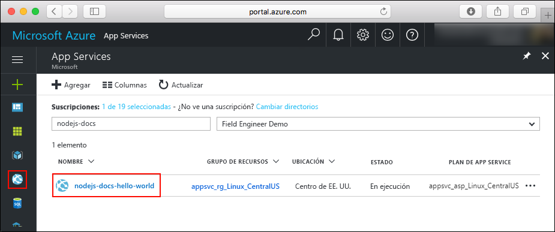
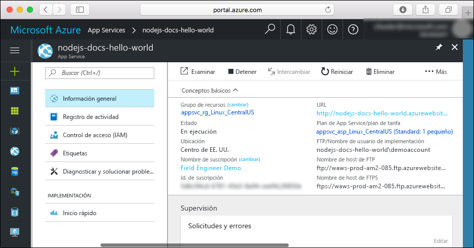

# <a name="create-a-nodejs-app-in-azure-app-service-on-linux"></a>Creación de una aplicación de Node.js en Azure App Service en Linux

> [!NOTE]
> En este artículo se implementa una aplicación en App Service en Linux. Para realizar implementaciones en App Service en _Windows_, consulte [Creación de una aplicación de Node.js en Azure](../app-service-web-get-started-nodejs.md).
>

[App Service en Linux](app-service-linux-intro.md) proporciona un servicio de hospedaje web muy escalable y con aplicación automática de revisiones utilizando el sistema operativo Linux. En esta guía de inicio rápido se explica cómo se implementa una aplicación de Node.js en App Service en Linux utilizando [Cloud Shell](https://docs.microsoft.com/azure/cloud-shell/overview).

Completará esta guía de inicio rápido en Cloud Shell, pero también puede ejecutar estos comandos localmente con la [CLI de Azure](/cli/azure/install-azure-cli).


[!INCLUDE [quickstarts-free-trial-note](../../../includes/quickstarts-free-trial-note.md)]

[!INCLUDE [cloud-shell-try-it.md](../../../includes/cloud-shell-try-it.md)]

## <a name="download-the-sample"></a>Descarga del ejemplo

En Cloud Shell, cree un directorio de inicio rápido y luego cambie a él.

```bash
mkdir quickstart

cd quickstart
```

A continuación, ejecute el comando siguiente para clonar el repositorio de la aplicación de ejemplo en el directorio de inicio rápido.

```bash
git clone https://github.com/Azure-Samples/nodejs-docs-hello-world
```

Durante la ejecución, muestra información similar a la del ejemplo siguiente:

```bash
Cloning into 'nodejs-docs-hello-world'...
remote: Counting objects: 40, done.
remote: Total 40 (delta 0), reused 0 (delta 0), pack-reused 40
Unpacking objects: 100% (40/40), done.
Checking connectivity... done.
````

## <a name="create-a-web-app"></a>Creación de una aplicación web

Cambie al directorio que contiene el código de ejemplo y ejecute el comando `az webapp up`.

En el siguiente ejemplo, reemplace <app_name > por un nombre único.

```bash
cd nodejs-docs-hello-world

az webapp up -n <app_name>
```

Este comando puede tardar varios minutos en ejecutarse. Durante la ejecución, muestra información similar a la del ejemplo siguiente:

```json
Creating Resource group 'appsvc_rg_Linux_CentralUS' ...
Resource group creation complete
Creating App service plan 'appsvc_asp_Linux_CentralUS' ...
App service plan creation complete
Creating app '<app_name>' ....
Webapp creation complete
Updating app settings to enable build after deployment
Creating zip with contents of dir /home/username/quickstart/nodejs-docs-hello-world ...
Preparing to deploy and build contents to app.
Fetching changes.

Generating deployment script.
Generating deployment script.
Generating deployment script.
Running deployment command...
Running deployment command...
Running deployment command...
Deployment successful.
All done.
{
  "app_url": "https://<app_name>.azurewebsites.net",
  "location": "Central US",
  "name": "<app_name>",
  "os": "Linux",
  "resourcegroup": "appsvc_rg_Linux_CentralUS ",
  "serverfarm": "appsvc_asp_Linux_CentralUS",
  "sku": "STANDARD",
  "src_path": "/home/username/quickstart/nodejs-docs-hello-world ",
  "version_detected": "6.9",
  "version_to_create": "node|6.9"
}
```

El comando `az webapp up` realiza las acciones siguientes:

- Crear un grupo de recursos predeterminado.

- Crear un plan de App Service predeterminado.

- Crear una aplicación con el nombre especificado.

- [Implementar con ZIP](https://docs.microsoft.com/azure/app-service/deploy-zip) archivos desde el directorio de trabajo actual a la aplicación.

## <a name="browse-to-the-app"></a>Navegación hasta la aplicación

Vaya a la aplicación implementada mediante el explorador web. Reemplace <app_name> por el nombre de la aplicación.

```bash
http://<app_name>.azurewebsites.net
```

El ejemplo de código de Node.js se ejecuta en App Service en Linux con una imagen integrada.


**¡Enhorabuena!** Ha implementado su primera aplicación de Node.js en App Service en Linux.

## <a name="update-and-redeploy-the-code"></a>Actualización del código y nueva implementación

En Cloud Shell, escriba `nano index.js` para abrir el editor de texto nano.


 Realice un pequeño cambio en el texto en la llamada a `response.end`:

```nodejs
response.end("Hello Azure!");
```

Guarde los cambios y salga de nano. Use el comando `^O` para guardar y `^X` para salir.

Ahora va a volver a implementar la aplicación. Sustituya `<app_name>` por su aplicación.

```bash
az webapp up -n <app_name>
```

Una vez que la implementación haya finalizado, vuelva a la ventana del explorador que abrió en el paso **Navegación hasta la aplicación** y actualice la página.


## <a name="manage-your-new-azure-app"></a>Administración de la nueva aplicación de Azure

Vaya a <a href="https://portal.azure.com" target="_blank">Azure Portal</a> para administrar la aplicación que ha creado.

En el menú izquierdo, haga clic en **App Services** y, luego, en el nombre de la aplicación de Azure.



Verá la página de información general de la aplicación. En ella, puede completar tareas de administración básicas como examinar, detener, iniciar, reiniciar y eliminar.



El menú izquierdo proporciona distintas páginas para configurar la aplicación.

## <a name="clean-up-resources"></a>Limpieza de recursos

En los pasos anteriores, creó recursos de Azure en un grupo de recursos. Si no cree que vaya a necesitar estos recursos en el futuro, puede eliminar el grupo de recursos de Cloud Shell. Si ha modificado la región, actualice el nombre del grupo de recursos `appsvc_rg_Linux_CentralUS` al grupo de recursos específico de la aplicación.

```azurecli-interactive
az group delete --name appsvc_rg_Linux_CentralUS
```

Este comando puede tardar varios segundos en ejecutarse.

## <a name="next-steps"></a>Pasos siguientes

> [!div class="nextstepaction"]
> [Node.js con MongoDB](tutorial-nodejs-mongodb-app.md)
