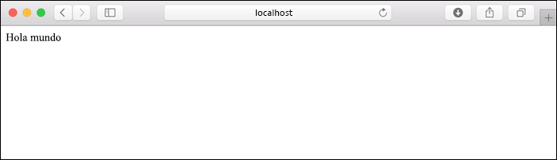
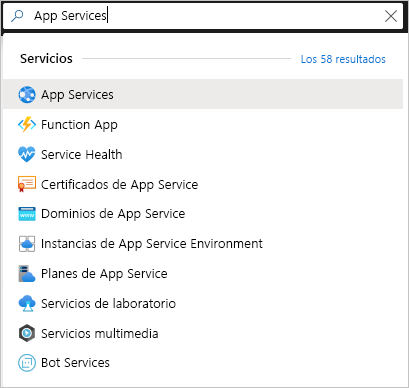
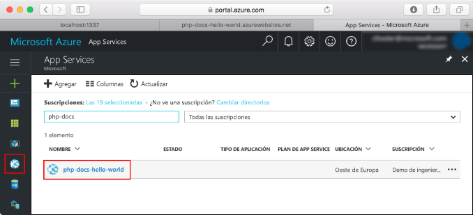
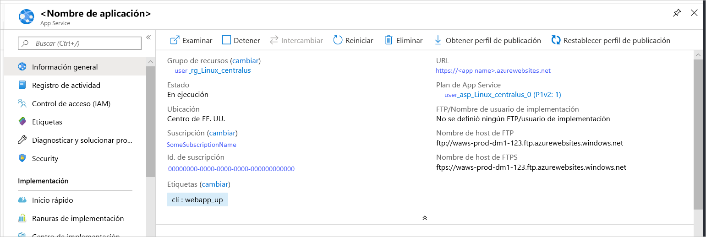

# <a name="quickstart-create-a-python-app-in-azure-app-service-on-linux"></a>Inicio rápido: Creación de una aplicación de Python en Azure App Service en Linux

En este inicio rápido se implementa una aplicación web de Python en [App Service en Linux](app-service-linux-intro.md), un servicio de Azure de hospedaje de sitios web muy escalable y con aplicación automática de revisiones. Puede usar la [interfaz de la línea de comandos (CLI) de Azure](/cli/azure/install-azure-cli) local en un equipo Mac, Linux o Windows. La aplicación web que va a configurar usa un nivel de App Service gratuito, por lo que no incurrirá en ningún gasto en el transcurso de este artículo.

Si prefiere implementar aplicaciones mediante un entorno de desarrollo integrado, consulte [Deploy Python apps to App Service from Visual Studio Code](/azure/python/tutorial-deploy-app-service-on-linux-01) (Implementación de aplicaciones de Python en App Service desde Visual Studio Code).

## <a name="prerequisites"></a>Prerrequisitos

- Una suscripción a Azure: [cree una cuenta gratuita](https://azure.microsoft.com/free/?ref=microsoft.com&utm_source=microsoft.com&utm_medium=docs&utm_campaign=visualstudio)
- <a href="https://www.python.org/downloads/" target="_blank">Python 3.7</a> (también se admite Python 3.6)
- <a href="https://git-scm.com/downloads" target="_blank">Git</a>
- <a href="https://docs.microsoft.com/cli/azure/install-azure-cli" target="_blank">CLI de Azure</a>

## <a name="download-the-sample"></a>Descarga del ejemplo

En una ventana de terminal, ejecute el siguiente comando para clonar la aplicación de ejemplo en la máquina local. 

```terminal
git clone https://github.com/Azure-Samples/python-docs-hello-world
```

A continuación, vaya a esa carpeta:

```terminal
cd python-docs-hello-world
```

El repositorio contiene un archivo *application.py*, que indica a App Service que el código contiene una aplicación de Flask. Para más información, consulte el artículo sobre [las personalizaciones y el proceso de inicio del contenedor](how-to-configure-python.md).

## <a name="run-the-sample"></a>Ejecución del ejemplo

En una ventana de terminal, use los comandos siguientes (los que sean más adecuados para su sistema operativo) para instalar las dependencias necesarias e iniciar el servidor de desarrollo integrado. 

# <a name="bash"></a>[Bash](#tab/bash)

```bash
python3 -m venv venv
source venv/bin/activate
pip install -r requirements.txt
export FLASK_APP=application.py
flask run
```

# <a name="powershell"></a>[PowerShell](#tab/powershell)

```powershell
py -3 -m venv env
env\scripts\activate
pip install -r requirements.txt
Set-Item Env:FLASK_APP ".\application.py"
flask run
```

# <a name="cmd"></a>[Cmd](#tab/cmd)

```cmd
py -3 -m venv env
env\scripts\activate
pip install -r requirements.txt
SET FLASK_APP=application.py
flask run
```

---

Abra un explorador web y vaya a la aplicación de ejemplo en `http://localhost:5000/`. La aplicación muestra el mensaje **Hola mundo**.



En la ventana de terminal, presione **Ctrl**+**C** para salir del servidor web.

## <a name="sign-in-to-azure"></a>Inicio de sesión en Azure

La CLI de Azure proporciona muchos comandos útiles que puede usar desde un terminal local para aprovisionar y administrar recursos de Azure desde la línea de comandos. Puede usar comandos para realizar las mismas tareas que llevaría a cabo en Azure Portal en un explorador. También puede usar comandos de la CLI en scripts para automatizar los procesos de administración.

Para ejecutar comandos de Azure en la CLI de Azure, primero debe iniciar sesión con el comando `az login`. Este comando abre un explorador que recopila las credenciales.

```terminal
az login
```

## <a name="deploy-the-sample"></a>Implementación del ejemplo

El comando [`az webapp up`](/cli/azure/webapp#az-webapp-up) crea la aplicación web en App Service e implementa el código.

En la carpeta *python-docs-hello-world* que contiene el código de ejemplo, ejecute el siguiente comando `az webapp up`. Reemplace `<app-name>` por un nombre de aplicación único global (*los caracteres válidos son `a-z`, `0-9` y `-`* ). Reemplace también `<location-name>` por una región de Azure, como **centralus**, **eastasia**, **westeurope**, **koreasouth**, **brazilsouth**, **centralindia**, etc. (Puede recuperar una lista de las regiones permitidas para su cuenta de Azure mediante la ejecución del comando [`az account list-locations`](/cli/azure/appservice?view=azure-cli-latest.md#az-appservice-list-locations)).


```terminal
az webapp up --sku F1 -n <app-name> -l <location-name>
```

Este comando puede tardar varios minutos en ejecutarse por completo. Durante la ejecución, muestra información similar a la del ejemplo siguiente:

```output
The behavior of this command has been altered by the following extension: webapp
Creating Resource group 'appsvc_rg_Linux_centralus' ...
Resource group creation complete
Creating App service plan 'appsvc_asp_Linux_centralus' ...
App service plan creation complete
Creating app '<app-name>' ....
Webapp creation complete
Creating zip with contents of dir /home/username/quickstart/python-docs-hello-world ...
Preparing to deploy contents to app.
All done.
{
  "app_url": "https:/<app-name>.azurewebsites.net",
  "location": "Central US",
  "name": "<app-name>",
  "os": "Linux",
  "resourcegroup": "appsvc_rg_Linux_centralus ",
  "serverfarm": "appsvc_asp_Linux_centralus",
  "sku": "BASIC",
  "src_path": "/home/username/quickstart/python-docs-hello-world ",
  "version_detected": "-",
  "version_to_create": "python|3.7"
}
```

[!INCLUDE [AZ Webapp Up Note](../../../includes/app-service-web-az-webapp-up-note.md)]

## <a name="browse-to-the-app"></a>Navegación hasta la aplicación

Vaya a la aplicación implementada mediante el explorador web en la dirección URL `http://<app-name>.azurewebsites.net`.

El código de ejemplo de Python se ejecuta en un contenedor de Linux en App Service con una imagen integrada.


**¡Enhorabuena!** Ha implementado su primera aplicación de Python en App Service en Linux.

## <a name="redeploy-updates"></a>Reimplementación de actualizaciones

En el editor de código que prefiera, abra *application.py* y cambie la instrucción `return` en la última línea para que coincida con el código siguiente. La instrucción `print` se incluye aquí para generar la salida de registro con la que trabajará en la sección siguiente. 

```python
print("Handling request to home page.")
return "Hello Azure!"
```

Guarde los cambios y salga del editor. 

Vuelva a implementar la aplicación con el siguiente comando `az webapp up`, mediante el mismo comando que usó para implementar la aplicación por primera vez, reemplazando `<app-name>` y `<location-name>` por los mismos nombres que usó antes. 

```terminal
az webapp up --sku F1 -n <app-name> -l <location-name>
```

Una vez finalizada la implementación, vuelva a la ventana del explorador abierta en `http://<app-name>.azurewebsites.net` y actualice la página; ahora debería aparecer el mensaje modificado:


> [!TIP]
> Visual Studio Code proporciona extensiones eficaces para Python y Azure App Service que simplifican el proceso de implementación de aplicaciones web de Python en App Service. Para más información, consulte [Deploy Python apps to App Service from Visual Studio Code](/azure/python/tutorial-deploy-app-service-on-linux-01) (Implementación de aplicaciones de Python en App Service desde Visual Studio Code).

## <a name="stream-logs"></a>Transmisión de registros

Puede acceder a los registros de consola generados desde dentro de la aplicación y del contenedor en que esta se ejecuta. Los registros incluyen todas las salidas generadas mediante instrucciones `print`.

En primer lugar, active el registro de contenedores ejecutando el siguiente comando en un terminal, reemplazando `<app-name>` por el nombre de la aplicación y `<resource-group-name>` por el nombre del grupo de recursos que se muestra en la salida del comando `az webapp up` que usó (por ejemplo: "appsvc_rg_Linux_centralus"):

```terminal
az webapp log config --name <app-name> --resource-group <resource-group-name> --docker-container-logging filesystem
```

Una vez que se active el registro de contenedor, ejecute el siguiente comando para mostrar el flujo del registro:

```terminal
az webapp log tail --name <app-name> --resource-group <resource-group-name>
```

Actualice la aplicación en el explorador para que se generen registros de la consola que incluyan líneas similares al texto siguiente. Si no ve la salida inmediatamente, inténtelo de nuevo en 30 segundos.

```output
2019-10-23T12:40:03.815574424Z Handling request to home page.
2019-10-23T12:40:03.815602424Z 172.16.0.1 - - [23/Oct/2019:12:40:03 +0000] "GET / HTTP/1.1" 200 12 "-" "Mozilla/5.0 (Windows NT 10.0; Win64; x64) AppleWebKit/537.36 (KHTML, like Gecko) Chrome/78.0.3904.63 Safari/537.36 Edg/78.0.276.19"
```

También puede inspeccionar los archivos de registro desde el explorador en `https://<app-name>.scm.azurewebsites.net/api/logs/docker`.

Para detener el streaming del registro en cualquier momento, escriba `Ctrl`+`C`.

## <a name="manage-the-azure-app"></a>Administración de la aplicación de Azure

Vaya a <a href="https://portal.azure.com" target="_blank">Azure Portal</a> para administrar la aplicación que ha creado. Busque y seleccione **App Services**.



Seleccione el nombre de la aplicación de Azure.



Verá la página de información general de la aplicación. En este caso, puede realizar tareas de administración básicas como examinar, detener, iniciar, reiniciar y eliminar.



El menú de App Service proporciona distintas páginas para configurar la aplicación.

## <a name="clean-up-resources"></a>Limpieza de recursos

En los pasos anteriores, creó recursos de Azure en un grupo de recursos. El grupo de recursos tiene un nombre como "appsvc_rg_Linux_CentralUS", en función de su ubicación. Si usa una SKU de App Service que sea de un nivel distinto del F1 gratuito, estos recursos incurrirán en costos continuos.

Si considera que no necesitará estos recursos en el futuro, elimine el grupo de recursos mediante el comando siguiente, reemplazando `<resource-group-name>` por el grupo de recursos que se muestra en la salida del comando `az webapp up`, como "appsvc_rg_Linux_centralus". Este comando puede tardar hasta un minuto en completarse.

```terminal
az group delete -n <resource-group-name>
```

## <a name="next-steps"></a>Pasos siguientes

> [!div class="nextstepaction"]
> [Tutorial: Aplicación web Python (Django) con PostgreSQL](tutorial-python-postgresql-app.md)

> [!div class="nextstepaction"]
> [Configuración de una aplicación de Python](how-to-configure-python.md)

> [!div class="nextstepaction"]
> [Tutorial: Ejecución de la aplicación Python en un contenedor personalizado](tutorial-custom-docker-image.md)
