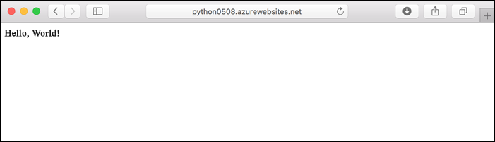
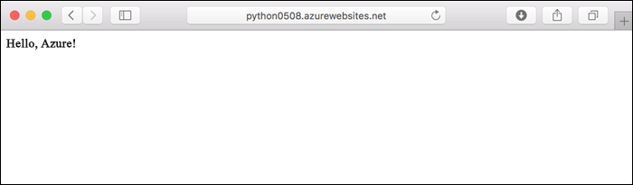
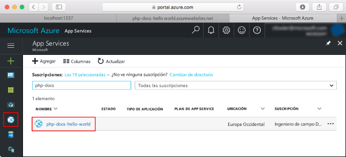
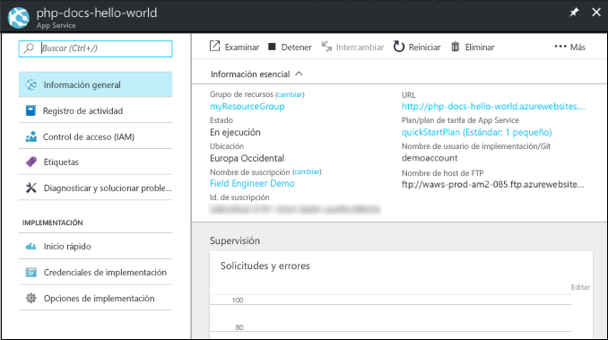

# <a name="create-a-python-app-in-azure-app-service-on-linux-preview"></a>Creación de una aplicación de Python en Azure App Service en Linux (versión preliminar)

[App Service en Linux](app-service-linux-intro.md) proporciona un servicio de hospedaje web muy escalable y con aplicación automática de revisiones utilizando el sistema operativo Linux. En este inicio rápido se muestra cómo implementar una aplicación de Python sobre la imagen integrada de Python (versión preliminar) en App Service en Linux mediante la [CLI de Azure](/cli/azure/install-azure-cli).

Estos pasos se pueden realizar en este artículo con una máquina Mac, Windows o Linux.



[!INCLUDE [quickstarts-free-trial-note](../../../includes/quickstarts-free-trial-note.md)]

## <a name="prerequisites"></a>Requisitos previos

Para completar esta guía de inicio rápido:

* <a href="https://www.python.org/downloads/" target="_blank">Instalación de Python 3.7</a>
* <a href="https://git-scm.com/" target="_blank">Instalación de Git</a>

## <a name="download-the-sample"></a>Descarga del ejemplo

En la ventana de terminal, ejecute los comandos siguientes para clonar la aplicación de ejemplo en el equipo local y desplazarse al directorio con el código de ejemplo.

```bash
git clone https://github.com/Azure-Samples/python-docs-hello-world
cd python-docs-hello-world
```

## <a name="run-the-app-locally"></a>Ejecución de la aplicación de forma local

Ejecute la aplicación localmente para ver cómo debería ser si se implementara en Azure. Abra una ventana de terminal y use los comandos siguientes para instalar las dependencias necesarias e iniciar el servidor de desarrollo integrado. 

```bash
# In Bash
python3 -m venv venv
source venv/bin/activate
pip install -r requirements.txt
FLASK_APP=application.py flask run

# In PowerShell
py -3 -m venv env
env\scripts\activate
pip install -r requirements.txt
Set-Item Env:FLASK_APP ".\application.py"
flask run
```

Abra un explorador web y vaya a la aplicación de ejemplo en `http://localhost:5000/`.

Verá el mensaje **Hola mundo** desde la aplicación de ejemplo mostrada en la página.


En la ventana de terminal, presione **Ctrl + C** para salir del servidor web.

[!INCLUDE [cloud-shell-try-it.md](../../../includes/cloud-shell-try-it.md)]

[!INCLUDE [Configure deployment user](../../../includes/configure-deployment-user.md)]

[!INCLUDE [Create resource group](../../../includes/app-service-web-create-resource-group-linux.md)]

[!INCLUDE [Create app service plan](../../../includes/app-service-web-create-app-service-plan-linux.md)]

## <a name="create-a-web-app"></a>Creación de una aplicación web

[!INCLUDE [Create web app](../../../includes/app-service-web-create-web-app-python-linux-no-h.md)]

Vaya al sitio para ver la aplicación recién creada con una imagen integrada. Reemplace _&lt;app_name>_ por el nombre de la aplicación.

```bash
http://<app_name>.azurewebsites.net
```

Este es el aspecto que debe tener su nueva aplicación:


[!INCLUDE [Push to Azure](../../../includes/app-service-web-git-push-to-azure.md)] 

```bash
Counting objects: 42, done.
Delta compression using up to 8 threads.
Compressing objects: 100% (39/39), done.
Writing objects: 100% (42/42), 9.43 KiB | 0 bytes/s, done.
Total 42 (delta 15), reused 0 (delta 0)
remote: Updating branch 'master'.
remote: Updating submodules.
remote: Preparing deployment for commit id 'c40efbb40e'.
remote: Generating deployment script.
remote: Generating deployment script for python Web Site
.
.
.
remote: Finished successfully.
remote: Running post deployment command(s)...
remote: Deployment successful.
remote: App container will begin restart within 10 seconds.
To https://user2234@cephalin-python.scm.azurewebsites.net/cephalin-python.git
 * [new branch]      master -> master
 ```

## <a name="browse-to-the-app"></a>Navegación hasta la aplicación

Vaya a la aplicación implementada mediante el explorador web.

```bash
http://<app_name>.azurewebsites.net
```

El código de ejemplo de Python se ejecuta en App Service en Linux con una imagen integrada.


**¡Enhorabuena!** Ha implementado la primera aplicación de Python en App Service en Linux.

## <a name="update-locally-and-redeploy-the-code"></a>Actualización local y nueva implementación del código

En el repositorio local, abra el archivo `application.py` y realice un pequeño cambio en el texto de la última línea:

```python
return "Hello Azure!"
```

Confirme los cambios en Git y, después, inserte los cambios de código en Azure.

```bash
git commit -am "updated output"
git push azure master
```

Una vez que la implementación haya finalizado, vuelva a la ventana del explorador que abrió en el paso **Navegación hasta la aplicación** y actualice la página.



## <a name="manage-your-new-azure-app"></a>Administración de la nueva aplicación de Azure

Vaya a <a href="https://portal.azure.com" target="_blank">Azure Portal</a> para administrar la aplicación que ha creado.

En el menú izquierdo, haga clic en **App Services** y, luego, en el nombre de la aplicación de Azure.



Verá la página de información general de la aplicación. En este caso, puede realizar tareas de administración básicas como examinar, detener, iniciar, reiniciar y eliminar.



El menú izquierdo proporciona distintas páginas para configurar la aplicación. 

[!INCLUDE [cli-samples-clean-up](../../../includes/cli-samples-clean-up.md)]

## <a name="next-steps"></a>Pasos siguientes

La imagen integrada de Python en App Service en Linux está actualmente en versión preliminar y se puede personalizar el comando que se usa para iniciar la aplicación. También se pueden crear aplicaciones Python de producción mediante un contenedor personalizado.

> [!div class="nextstepaction"]
> [Python con PostgreSQL](tutorial-python-postgresql-app.md)

> [!div class="nextstepaction"]
> [Configuración de un comando de inicio personalizado](how-to-configure-python.md#custom-startup-command)

> [!div class="nextstepaction"]
> [Solución de problemas](how-to-configure-python.md#troubleshooting)

> [!div class="nextstepaction"]
> [Uso de imágenes personalizadas](tutorial-custom-docker-image.md)
