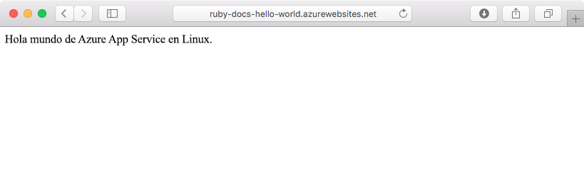
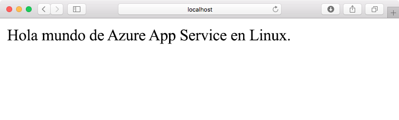
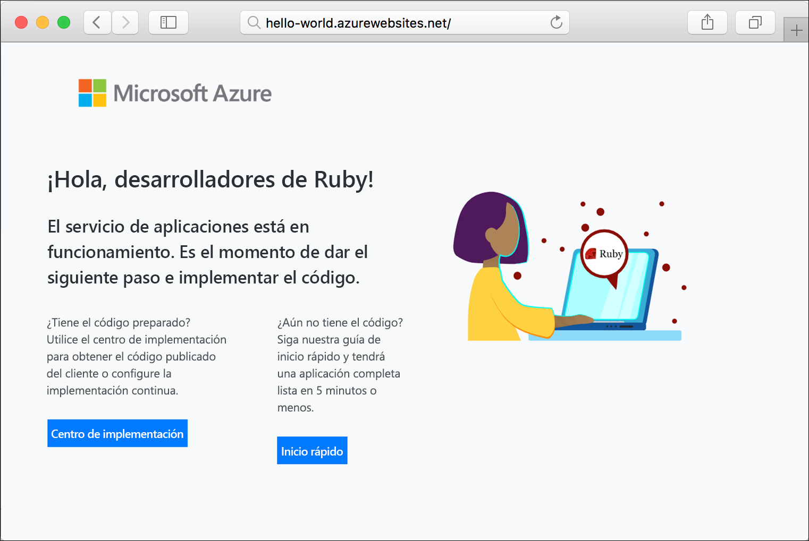

# <a name="create-a-ruby-on-rails-app-in-app-service-on-linux"></a>Crear una aplicación de Ruby on Rails en App Service en Linux

[App Service en Linux](app-service-linux-intro.md) proporciona un servicio de hospedaje web muy escalable y con aplicación automática de revisiones utilizando el sistema operativo Linux. En este tutorial de inicio rápido se explica cómo implementar una aplicación de Ruby on Rails en Azure App Service en Linux mediante [Cloud Shell](https://docs.microsoft.com/azure/cloud-shell/overview).

> [!NOTE]
> La pila de desarrollo de Ruby solo admite Ruby on Rails de momento. Si quiere usar otra plataforma, como Sinatra, o una [versión de Ruby no admitida](app-service-linux-intro.md), debe [ejecutarla en un contenedor personalizado](quickstart-docker-go.md).



[!INCLUDE [quickstarts-free-trial-note](../../../includes/quickstarts-free-trial-note.md)]

## <a name="prerequisites"></a>Prerrequisitos

* <a href="https://www.ruby-lang.org/en/documentation/installation/#rubyinstaller" target="_blank">Instalación de Ruby 2.6 o superior</a>
* <a href="https://git-scm.com/" target="_blank">Instalación de Git</a>

## <a name="download-the-sample"></a>Descarga del ejemplo

En una ventana de terminal, ejecute el siguiente comando para clonar el repositorio de la aplicación de ejemplo en el equipo local:

```bash
git clone https://github.com/Azure-Samples/ruby-docs-hello-world
```

## <a name="run-the-application-locally"></a>Ejecución de la aplicación de forma local

Ejecute la aplicación localmente para ver cómo debería ser si se implementara en Azure. Abra una ventana de terminal, cambie al directorio `hello-world` y use el comando `rails server` para iniciar el servidor.

El primer paso es instalar los archivos gem necesarios. Hay un elemento `Gemfile` incluido en el ejemplo, por lo que solo tiene que ejecutar el siguiente comando:

```bash
bundle install
```

Una vez que se han instalado los archivos gem, se usa un software que instala varios programas para iniciar la aplicación:

```bash
bundle exec rails server
```

Mediante el explorador web, vaya a `http://localhost:3000` para probar la aplicación localmente.



[!INCLUDE [Try Cloud Shell](../../../includes/cloud-shell-try-it.md)]

[!INCLUDE [Configure deployment user](../../../includes/configure-deployment-user.md)]

[!INCLUDE [Create resource group](../../../includes/app-service-web-create-resource-group-linux.md)]

[!INCLUDE [Create app service plan](../../../includes/app-service-web-create-app-service-plan-linux.md)]

## <a name="create-a-web-app"></a>Creación de una aplicación web

[!INCLUDE [Create web app](../../../includes/app-service-web-create-web-app-ruby-linux-no-h.md)] 

Vaya a la aplicación para ver la aplicación web recién creada con una imagen integrada. Reemplace _&lt;app name>_ por el nombre de la aplicación web.

```bash
http://<app_name>.azurewebsites.net
```

Este es el aspecto que debería tener su nueva aplicación web:



## <a name="deploy-your-application"></a>Implementación de aplicación

Ejecute los comandos siguientes para implementar la aplicación local en la aplicación web de Azure:

```bash
git remote add azure <Git deployment URL from above>
git push azure master
```

Confirme que las operaciones de implementación remota se han realizado correctamente. Los comandos generan una salida similar al texto siguiente:

```bash
remote: Using turbolinks 5.2.0
remote: Using uglifier 4.1.20
remote: Using web-console 3.7.0
remote: Bundle complete! 18 Gemfile dependencies, 78 gems now installed.
remote: Bundled gems are installed into `/tmp/bundle`
remote: Zipping up bundle contents
remote: .......
remote: ~/site/repository
remote: Finished successfully.
remote: Running post deployment command(s)...
remote: Deployment successful.
remote: App container will begin restart within 10 seconds.
To https://<app-name>.scm.azurewebsites.net/<app-name>.git
   a6e73a2..ae34be9  master -> master
```

Una vez finalizada la implementación, espere unos 10 segundos hasta que se reinicie la aplicación web y, a continuación, navegue a la aplicación web y compruebe los resultados.

```bash
http://<app-name>.azurewebsites.net
```


> [!NOTE]
> Mientras se reinicia la aplicación, puede que aparezca el código de estado HTTP `Error 503 Server unavailable` en el explorador o la página predeterminada `Hey, Ruby developers!`. Puede que la aplicación tarde unos minutos en reiniciarse completamente.
>

[!INCLUDE [Clean-up section](../../../includes/cli-script-clean-up.md)]

## <a name="next-steps"></a>Pasos siguientes

> [!div class="nextstepaction"]
> [Tutorial: Ruby on Rails con Postgres](tutorial-ruby-postgres-app.md)

> [!div class="nextstepaction"]
> [Configure Ruby app](configure-language-ruby.md) (Configuración de una aplicación de Ruby)
