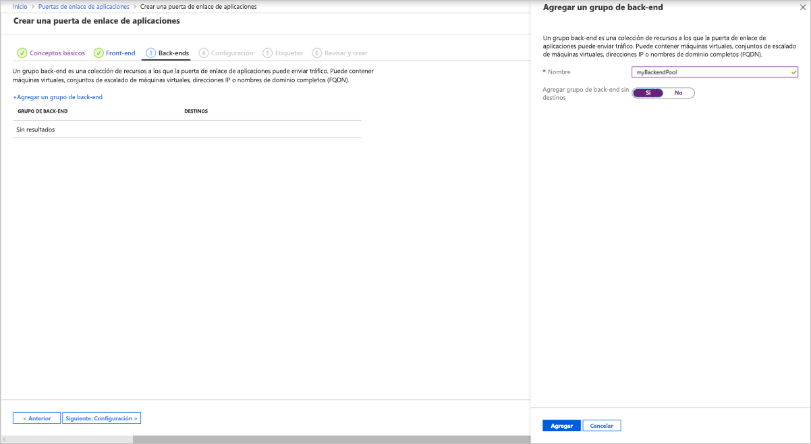
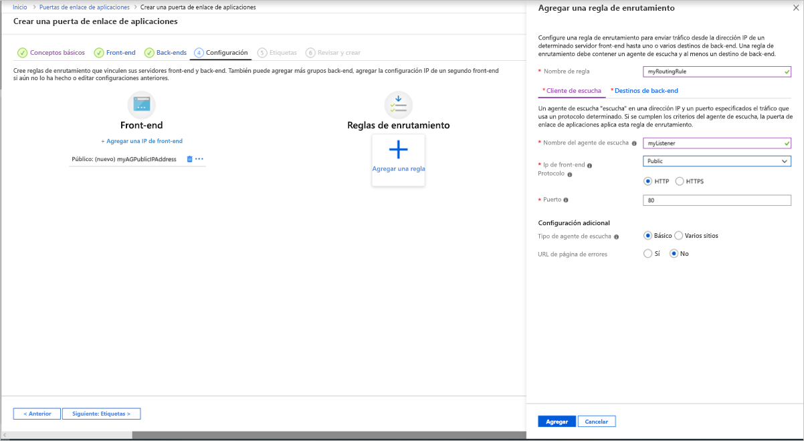
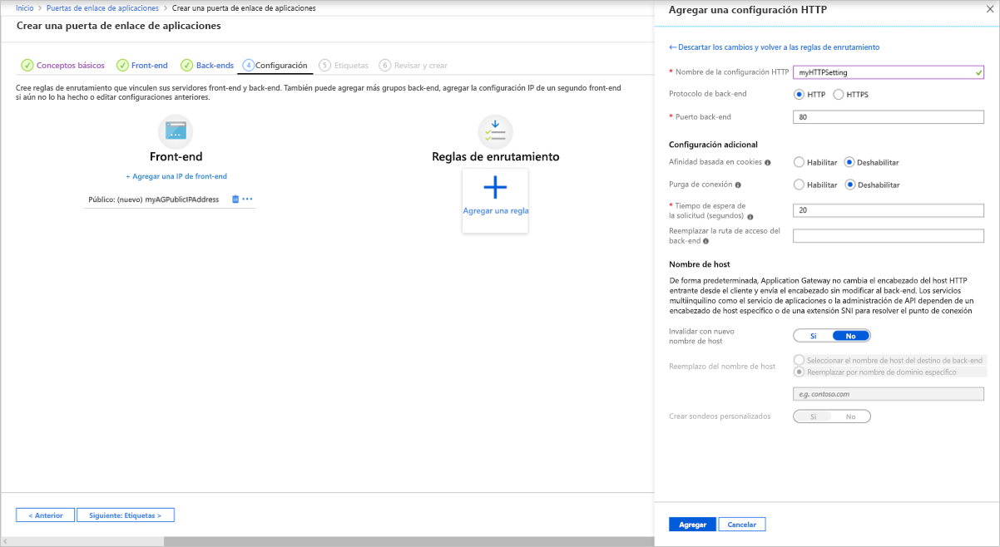
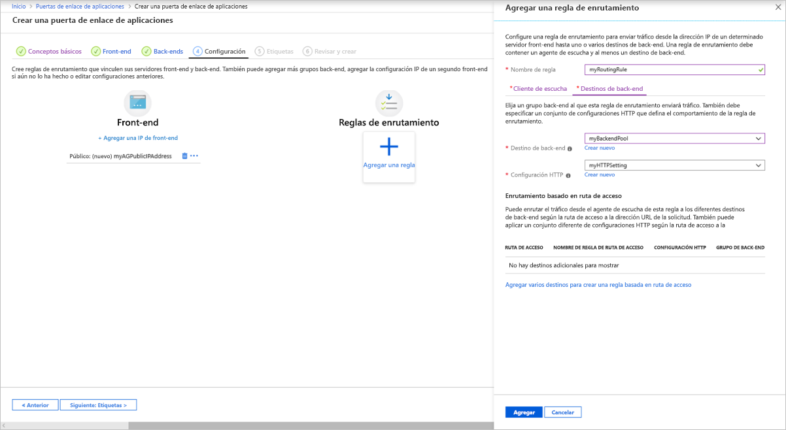

# <a name="tutorial-create-an-application-gateway-with-a-web-application-firewall-using-the-azure-portal"></a>Tutorial: Creación de una puerta de enlace de aplicaciones con un firewall de aplicaciones web mediante Azure Portal

En este tutorial se muestra cómo usar Azure Portal para crear una [puerta de enlace de aplicaciones](application-gateway-introduction.md) con un [firewall de aplicaciones web](application-gateway-web-application-firewall-overview.md) (WAF). WAF usa reglas de [OWASP](https://www.owasp.org/index.php/Category:OWASP_ModSecurity_Core_Rule_Set_Project) para proteger la aplicación. Estas reglas incluyen protección frente a ataques, como la inyección de SQL, ataques de scripts entre sitios y apropiaciones de sesión. Después de crear la puerta de enlace de aplicaciones, pruébela para asegurarse de que funciona correctamente. Con Azure Application Gateway, puede dirigir el tráfico web de la aplicación a recursos específicos mediante la asignación de agentes de escucha a los puertos, la creación de reglas y la adición de recursos a un grupo de back-end. Para simplificar, en este tutorial se usa una configuración sencilla con una dirección IP de front-end pública, un cliente de escucha básico para hospedar un único sitio en esta puerta de enlace de aplicaciones, dos máquinas virtuales que se usan con el grupo de back-end y una regla de enrutamiento de solicitudes básica.

En este tutorial, aprenderá a:

> [!div class="checklist"]
> * Crear una puerta de enlace de aplicaciones con WAF habilitado
> * Crear las máquinas virtuales que se utilizan como servidores back-end
> * Crear una cuenta de almacenamiento y configurar los diagnósticos
> * Prueba de la puerta de enlace de aplicaciones


[!INCLUDE [updated-for-az](../../includes/updated-for-az.md)]

Si lo prefiere, puede completar este tutorial con [Azure PowerShell](tutorial-restrict-web-traffic-powershell.md) o la [CLI de Azure](tutorial-restrict-web-traffic-cli.md).

Si no tiene una suscripción a Azure, cree una [cuenta gratuita](https://azure.microsoft.com/free/?WT.mc_id=A261C142F) antes de empezar.

## <a name="sign-in-to-azure"></a>Inicio de sesión en Azure

Inicie sesión en Azure Portal en [https://portal.azure.com](https://portal.azure.com).

## <a name="create-an-application-gateway"></a>Creación de una puerta de enlace de aplicaciones

Para que Azure se comunique entre los recursos, se necesita una red virtual. Puede crear una red virtual o usar una existente. En este ejemplo, creará una red virtual. Puede crear una red virtual a la vez que crea la puerta de enlace de aplicaciones. Se crean instancias de Application Gateway en subredes independientes. En este ejemplo se crean dos subredes: una para la puerta de enlace de aplicaciones y la otra para los servidores back-end.

Seleccione **Crear un recurso** en el menú de la izquierda de Azure Portal. Aparece la ventana **Nuevo**.

Seleccione **Redes** y **Application Gateway** en la lista **Destacados**.

### <a name="basics-tab"></a>Pestaña Aspectos básicos

1. En la pestaña **Aspectos básicos**, especifique estos valores para la siguiente configuración de puerta de enlace de aplicaciones:

   - **Grupo de recursos**: Seleccione **myResourceGroupAG** como grupo de recursos. Si no existe, seleccione **Crear nuevo** para crearlo.
   - **Nombre de la puerta de enlace de aplicaciones**: Escriba *myAppGateway* como nombre de la puerta de enlace de aplicaciones.
   - Como **Nivel**, seleccione **WAF V2**.

     

2.  Para que Azure se comunique entre los recursos que se crean, se necesita una red virtual. Puede crear una red virtual o usar una existente. En este ejemplo, creará una nueva red virtual a la vez que crea la puerta de enlace de aplicaciones. Se crean instancias de Application Gateway en subredes independientes. En este ejemplo se crean dos subredes: una para la puerta de enlace de aplicaciones y la otra para los servidores back-end.

    En **Configurar la red virtual**, seleccione **Crear nuevo** para crear una nueva red virtual. En la ventana **Crear red virtual** que se abre, escriba los valores siguientes para crear la red virtual y dos subredes:

    - **Nombre**: Escriba *myVnet* como nombre de la red virtual.

    - **Nombre de subred** (subred de Application Gateway): La cuadrícula **Subredes** mostrará una subred llamada *Predeterminada*. Cambie el nombre de esta subred a *myAGSubnet*.<br>La subred de la puerta de enlace de aplicaciones solo puede contener puertas de enlace de aplicaciones. No se permite ningún otro recurso.

    - **Nombre de subred** (subred de servidor de back-end): En la segunda fila de la cuadrícula **Subredes**, escriba *myBackendSubnet* en la columna **Nombre de subred**.

    - **Intervalo de direcciones** (subred de servidor de back-end): En la segunda fila de la cuadrícula **Subredes**, escriba un intervalo de direcciones que no se superponga al intervalo de direcciones de *myAGSubnet*. Por ejemplo, si el intervalo de direcciones de *myAGSubnet* es 10.0.0.0/24, escriba *10.0.1.0/24* para el intervalo de direcciones de *myBackendSubnet*.

    Seleccione **Aceptar** para cerrar la ventana **Crear red virtual** y guarde la configuración de la red virtual.

     
    
3. En la pestaña **Aspectos básicos**, acepte los valores predeterminados para las demás opciones y seleccione **Siguiente: Front-end**.

### <a name="frontends-tab"></a>Pestaña Front-end

1. En la pestaña **Front-end**, compruebe que **Tipo de dirección IP de front-end** esté establecido en **Pública**. <br>Puede configurar la dirección IP de front-end para que sea pública o privada, según el caso de uso. En este ejemplo, elegimos una IP de front-end pública.
   > [!NOTE]
   > Para la SKU de Application Gateway v2, solo puede elegir la configuración IP de front-end **pública**. La configuración de IP de front-end privada no está habilitada actualmente para este SKU v2.

2. Elija **Crear nuevo** para la **Dirección IP pública** y escriba *myAGPublicIPAddress* para el nombre de dirección IP pública y seleccione **Aceptar**. 

     

3. Seleccione **Siguiente: Back-end**.

### <a name="backends-tab"></a>Pestaña Back-end

El grupo de back-end se usa para enrutar las solicitudes a los servidores back-end, que atienden la solicitud. Los grupos de back-end pueden constar de NIC, conjuntos de escalado de máquinas virtuales, direcciones IP públicas e internas, nombres de dominio completos (FQDN) y servidores back-end multiinquilino como Azure App Service. En este ejemplo, creará un grupo de back-end vacío con la puerta de enlace de aplicaciones y, luego, agregará destinos de back-end al grupo de back-end.

1. En la pestaña **Back-end**, seleccione **+Agregar un grupo de back-end**.

2. En la ventana **Agregar un grupo de back-end**, escriba los valores siguientes para crear un grupo de back-end vacío:

    - **Nombre**: Escriba *myBackendPool* para el nombre del grupo de back-end.
    - **Agregar grupo de back-end sin destinos**: Seleccione **Sí** para crear un grupo de back-end sin destinos. Agregará destinos de back-end después de crear la puerta de enlace de aplicaciones.

3. En la ventana **Agregar un grupo de back-end**, seleccione **Agregar** para guardar la configuración del grupo de back-end y vuelva a la pestaña **Back-end**.

     

4. En la pestaña **Back-end**, seleccione **Siguiente: Configuración**.

### <a name="configuration-tab"></a>Pestaña Configuración

En la pestaña **Configuración**, conecte el grupo de front-end y back-end que ha creado con una regla de enrutamiento.

1. Seleccione **Agregar una regla** en la columna **Reglas de enrutamiento**.

2. En la ventana **Agregar una regla de enrutamiento** que se abre, escriba *myRoutingRule* para el **Nombre de regla**.

3. Una regla de enrutamiento necesita un cliente de escucha. En la pestaña **Cliente de escucha** de la ventana **Agregar una regla de enrutamiento**, escriba los valores siguientes para el cliente de escucha:

    - **Nombre del cliente de escucha**: Escriba *myListener* para el nombre del cliente de escucha.
    - **Dirección IP de front-end**: Seleccione **Pública** para elegir la dirección IP pública que ha creado para el front-end.
  
      Acepte los valores predeterminados para las demás opciones de la pestaña **Cliente de escucha** y, a continuación, seleccione la pestaña **Destinos de back-end** para configurar el resto de opciones de la regla de enrutamiento.

   

4. En la pestaña **Destinos de back-end**, seleccione **myBackendPool** para el **Destino de back-end**.

5. Para la **Configuración de HTTP**, seleccione **Crear nueva** para crear una nueva configuración de HTTP. La configuración de HTTP determinará el comportamiento de la regla de enrutamiento. En la ventana **Agregar una configuración de HTTP** que se abre, escriba *myHTTPSetting* en el **Nombre de configuración de HTTP**. Acepte los valores predeterminados para las demás opciones de la ventana **Agregar una configuración de HTTP** y, a continuación, seleccione **Agregar** para volver a la ventana **Agregar una regla de enrutamiento**. 

     

6. En la ventana **Agregar una regla de enrutamiento**, seleccione **Agregar** para guardar la regla de enrutamiento y volver a la pestaña **Configuración**.

     

7. Seleccione **Siguiente: Etiquetas** y, a continuación, **Siguiente: Review + create** (Revisar y crear).

### <a name="review--create-tab"></a>Pestaña Revisar y crear

Revise la configuración en la pestaña **Revisar y crear** y seleccione **Crear** para crear la red virtual, la dirección IP pública y la puerta de enlace de aplicaciones. Azure puede tardar varios minutos en crear la puerta de enlace de aplicaciones. 

Espere hasta que finalice la implementación correctamente antes de continuar con la siguiente sección.

## <a name="add-backend-targets"></a>Agregar destinos de back-end

En este ejemplo, se usan máquinas virtuales como back-end de destino. Pueden usarse máquinas virtuales existentes o crear otras nuevas. En este ejemplo, se crean dos máquinas virtuales que Azure usa como servidores back-end para la puerta de enlace de aplicaciones.

Para ello, necesitará lo siguiente:

1. Crear dos VM, *myVM* y *myVM2*, que se usarán como servidores back-end.
2. Instalar IIS en las máquinas virtuales para comprobar que la puerta de enlace de aplicaciones se ha creado correctamente.
3. Agregar los servidores back-end al grupo de back-end.

### <a name="create-a-virtual-machine"></a>de una máquina virtual

1. En Azure Portal, seleccione **Crear un recurso**. Aparece la ventana **Nuevo**.
2. Seleccione **Windows Server 2016 Datacenter** en la lista **Popular**. Aparecerá la página **Creación de una máquina virtual**.<br>Application Gateway puede enrutar el tráfico a cualquier tipo de máquina virtual que se use en el grupo de back-end. En este ejemplo se usa un Windows Server 2016 Datacenter.
3. Especifique estos valores en la pestaña **Datos básicos** de la siguiente configuración de máquina virtual:

    - **Grupo de recursos**: Seleccione **myResourceGroupAG** como nombre del grupo de recursos.
    - **Nombre de la máquina virtual**: Especifique *myVM* como nombre de la máquina virtual.
    - **Nombre de usuario**: Escriba *azureuser* como nombre del usuario administrador.
    - **Contraseña**: Escriba *Azure123456!* como la contraseña de administrador.
4. Acepte los valores predeterminados y haga clic en **Siguiente: Discos**.  
5. Acepte los valores predeterminados de la pestaña **Discos** y seleccione **Siguiente: Redes**.
6. En la pestaña **Redes**, compruebe que **myVNet** está seleccionada como **red virtual** y que la **subred** es **myBackendSubnet**. Acepte los valores predeterminados y haga clic en **Siguiente: Administración**.<br>Application Gateway puede comunicarse con instancias fuera de la red virtual en la que se encuentra, pero hay que comprobar que haya conectividad IP.
7. En la pestaña **Administración**, establezca **Diagnósticos de arranque** en **Desactivado**. Acepte los demás valores predeterminados y seleccione **Revisar y crear**.
8. En la pestaña **Revisar y crear**, revise la configuración, corrija los errores de validación y, después, seleccione **Crear**.
9. Espere a que se complete la creación de la máquina virtual antes de continuar.

### <a name="install-iis-for-testing"></a>Instalación de IIS para pruebas

En este ejemplo se instala IIS en las máquinas virtuales con el fin de comprobar que Azure creó correctamente la puerta de enlace de aplicaciones.

1. Abra [Azure PowerShell](https://docs.microsoft.com/azure/cloud-shell/quickstart-powershell). Para ello, seleccione **Cloud Shell** en la barra de navegación superior de Azure Portal y, a continuación, seleccione **PowerShell** en la lista desplegable. 

    

2. Ejecute el siguiente comando para instalar IIS en la máquina virtual: 

    ```azurepowershell-interactive
    Set-AzVMExtension `
      -ResourceGroupName myResourceGroupAG `
      -ExtensionName IIS `
      -VMName myVM `
      -Publisher Microsoft.Compute `
      -ExtensionType CustomScriptExtension `
      -TypeHandlerVersion 1.4 `
      -SettingString '{"commandToExecute":"powershell Add-WindowsFeature Web-Server; powershell Add-Content -Path \"C:\\inetpub\\wwwroot\\Default.htm\" -Value $($env:computername)"}' `
      -Location EastUS
    ```

3. Cree una segunda máquina virtual e instale IIS con los pasos que acaba de finalizar. Use *myVM2* como nombre de la máquina virtual y como valor de **VMName** para el cmdlet **Set-AzVMExtension**.

### <a name="add-backend-servers-to-backend-pool"></a>Incorporación de servidores back-end a un grupo de back-end

1. Seleccione **Todos los recursos** y, después, seleccione **myAppGateway**.

2. Seleccione los **grupos back-end** en el menú de la izquierda.

3. Seleccione **MyBackendPool**.

4. En **Destinos**, seleccione **Máquina virtual** de la lista desplegable.

5. En **MÁQUINA VIRTUAL** e **INTERFACES DE RED**, seleccione las máquinas virtuales **myVM** y **myVM2**, y sus interfaces de red asociadas de las listas desplegables.

    

6. Seleccione **Guardar**.

7. Espere a que la implementación se complete antes de continuar con el paso siguiente.

## <a name="create-a-storage-account-and-configure-diagnostics"></a>Crear una cuenta de almacenamiento y configurar los diagnósticos

### <a name="create-a-storage-account"></a>Crear una cuenta de almacenamiento

En este artículo, la puerta de enlace de aplicaciones usa una cuenta de almacenamiento para almacenar datos con fines de detección y prevención. También puede usar los registros de Azure Monitor o una instancia de Event Hubs para registrar los datos.

1. Seleccione **Crear un recurso** en la esquina superior izquierda de Azure Portal.
1. Seleccione **Almacenamiento** y, luego, **Cuenta de almacenamiento**.
1. En *Grupo de recursos*, seleccione **myResourceGroupAG**.
1. Escriba *myagstore1* como el nombre de la cuenta de almacenamiento.
1. Acepte los valores predeterminados de las demás opciones y seleccione **Revisar y crear**.
1. Revise la configuración y, a continuación, seleccione **Crear**.

### <a name="configure-diagnostics"></a>Configuración de diagnóstico

Configure los diagnósticos para registrar datos en los registros ApplicationGatewayAccessLog, ApplicationGatewayPerformanceLog y ApplicationGatewayFirewallLog.

1. En el menú izquierdo, seleccione **Todos los recursos** y, luego, *myAppGateway*.
2. En Supervisión, seleccione **Configuración de diagnóstico**.
3. Seleccione **Agregar configuración de diagnóstico**.
4. Escriba *myDiagnosticsSettings* como el nombre de la configuración de diagnóstico.
5. Seleccione **Archivar en una cuenta de almacenamiento** y, luego, seleccione **Configurar** para seleccionar la cuenta de almacenamiento *myagstore1* que creó anteriormente. Finalmente, seleccione **Aceptar**.
6. Seleccione los registros de la puerta de enlace de aplicaciones que se van a recopilar y conservar.
7. Seleccione **Guardar**.

    

## <a name="test-the-application-gateway"></a>Prueba de la puerta de enlace de aplicaciones

Aunque no es necesario instalar IIS para crear la puerta de enlace de aplicaciones, se instaló para comprobar que Azure la creara correctamente. Use IIS para probar la puerta de enlace de aplicaciones:

1. Busque la dirección IP pública de la puerta de enlace de aplicaciones en su página **Información general**. 

   También puede seleccionar **Todos los recursos**, escribir *myAGPublicIPAddress* en el cuadro de búsqueda y, luego, seleccionar este recurso en los resultados. Azure muestra la dirección IP pública en la página de **información general**.
1. Copie la dirección IP pública y péguela en la barra de direcciones del explorador.
1. Compruebe la respuesta. Una respuesta válida corrobora que la puerta de enlace de aplicaciones se ha creado correctamente y puede conectarse correctamente con el back-end.

   

## <a name="clean-up-resources"></a>Limpieza de recursos

Cuando ya no necesite los recursos que ha creado con la puerta de enlace de aplicaciones, elimine el grupo de recursos. Mediante la eliminación del grupo de recursos también elimina la puerta de enlace de aplicaciones y todos sus recursos relacionados. 

Para eliminar el grupo de recursos:

1. En el menú de la izquierda de Azure Portal, seleccione **Grupos de recursos**.
2. En la página **Grupos de recursos**, busque **myResourceGroupAG** en la lista y selecciónelo.
3. En la **página del grupo de recursos**, seleccione **Eliminar grupo de recursos**.
4. Escriba *myResourceGroupAG* en **ESCRIBA EL NOMBRE DEL GRUPO DE RECURSOS** y seleccione **Eliminar**.

## <a name="next-steps"></a>Pasos siguientes

> [!div class="nextstepaction"]
> [Más información sobre el firewall de aplicaciones web](waf-overview.md)
