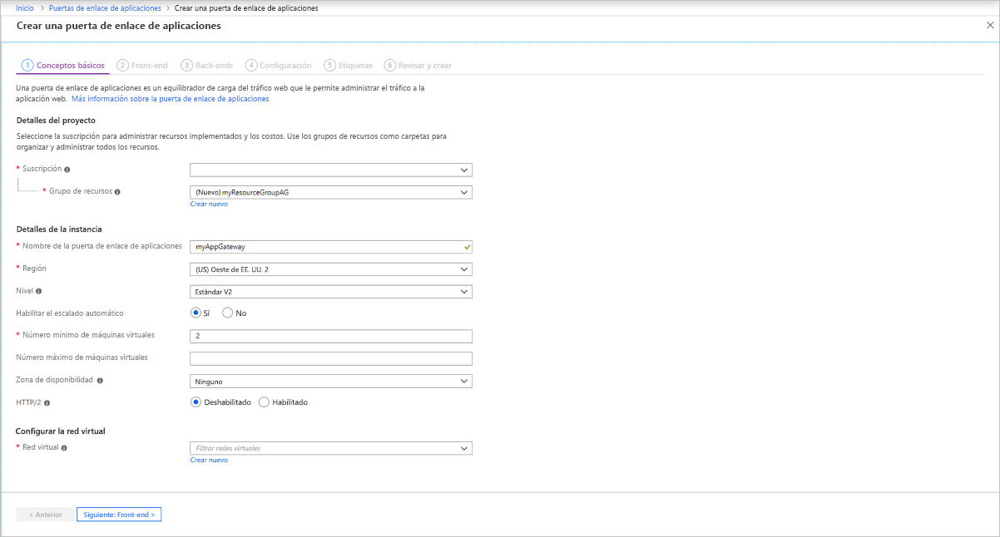

# <a name="tutorial-create-an-application-gateway-with-path-based-routing-rules-using-the-azure-portal"></a>Tutorial: Creación de una puerta de enlace de aplicaciones con reglas de enrutamiento basadas en rutas de dirección URL con Azure Portal

Puede usar Azure Portal para configurar [reglas de enrutamiento basadas en rutas de dirección URL](application-gateway-url-route-overview.md) cuando se crea una [puerta de enlace de aplicaciones](application-gateway-introduction.md). En este tutorial, creará grupos de back-end mediante el uso de máquinas virtuales. A continuación, creará reglas de enrutamiento que garanticen que el tráfico web llega a los servidores adecuados de los grupos.

En este artículo, aprenderá a:

> [!div class="checklist"]
> * Creación de una puerta de enlace de aplicaciones
> * Crear máquinas virtuales para servidores back-end
> * Crear grupos de back-end con los servidores back-end
> * Crear un agente de escucha de back-end
> * Crear una regla de enrutamiento basada en la ruta de acceso


Si no tiene una suscripción a Azure, cree una [cuenta gratuita](https://azure.microsoft.com/free/?WT.mc_id=A261C142F) antes de empezar.

[!INCLUDE [updated-for-az](../../includes/updated-for-az.md)]

## <a name="sign-in-to-azure"></a>Inicio de sesión en Azure

Inicie sesión en Azure Portal en [https://portal.azure.com](https://portal.azure.com).

## <a name="create-virtual-machines"></a>Creación de máquinas virtuales

En este ejemplo, se crean tres máquinas virtuales que se usarán como servidores back-end para la puerta de enlace de aplicaciones. También puede instalar IIS en las máquinas virtuales para comprobar que la puerta de enlace de aplicaciones funciona según lo previsto.

1. En Azure Portal, seleccione **Crear un recurso**.
2. Seleccione **Windows Server 2016 Datacenter** en la lista Populares.
3. Especifique estos valores para la máquina virtual:

    - **Grupo de recursos**, seleccione **Crear nuevo** y, a continuación, escriba *myResourceGroupAG*.
    - **Nombre de máquina virtual**: *myVM1*
    - **Región**: *(EE. UU.) Este de EE. UU.*
    - **Nombre de usuario**: *azureuser*
    - **Contraseña**: *Azure123456!*


4. Seleccione **Siguiente: Discos**.
5. Seleccione **Siguiente: redes**.
6. En **Red virtual**, seleccione **Crear nueva** y, después, especifique estos valores para la red virtual:

   - *myVNet*: como nombre de la red virtual.
   - *10.0.0.0/16*: como espacio de direcciones de la red virtual.
   - *myBackendSubnet* para el nombre de la primera subred
   - *10.0.1.0/24*: como espacio de direcciones de la subred.
   - *myAGSubnet*: para el nombre de la segunda subred.
   - *10.0.0.0/24*: como espacio de direcciones de la subred.
7. Seleccione **Aceptar**.

8. Asegúrese de que en **Interfaz de red** está seleccionado **myBackendSubnet** para la subred y, a continuación, seleccione **Siguiente: administración**.
9. Seleccione **Desactivar** para deshabilitar los diagnósticos de arranque.
10. Haga clic en **Revisar y crear**, revise la configuración en la página de resumen y, después, seleccione **Crear**.
11. Cree dos máquinas virtuales más, *myVM2* y *myVM3* y colóquelas en la red virtual *MyVNet* y la subred *myBackendSubnet*.

### <a name="install-iis"></a>Instalación de IIS

1. Abra el shell interactivo y asegúrese de que está establecido en **PowerShell**.

    

2. Ejecute el siguiente comando para instalar IIS en la máquina virtual: 

    ```azurepowershell
         $publicSettings = @{ "fileUris" = (,"https://raw.githubusercontent.com/Azure/azure-docs-powershell-samples/master/application-gateway/iis/appgatewayurl.ps1");  "commandToExecute" = "powershell -ExecutionPolicy Unrestricted -File appgatewayurl.ps1" }

        Set-AzVMExtension `
         -ResourceGroupName myResourceGroupAG `
         -Location eastus `
         -ExtensionName IIS `
         -VMName myVM1 `
         -Publisher Microsoft.Compute `
         -ExtensionType CustomScriptExtension `
         -TypeHandlerVersion 1.4 `
         -Settings $publicSettings
    ```

3. Cree dos máquinas virtuales más e instale IIS siguiendo los pasos que acaba de finalizar. Escriba los nombres de *myVM2* y *myVM3* para los nombres y los valores de VMName en Set-AzVMExtension.

## <a name="create-an-application-gateway"></a>Creación de una puerta de enlace de aplicaciones

1. Seleccione **Crear un recurso** en el menú de la izquierda de Azure Portal. Aparece la ventana **Nuevo**.

2. Seleccione **Redes** y **Application Gateway** en la lista **Destacados**.

### <a name="basics-tab"></a>Pestaña Aspectos básicos

1. En la pestaña **Aspectos básicos**, especifique estos valores para la siguiente configuración de puerta de enlace de aplicaciones:

   - **Grupo de recursos**: Seleccione **myResourceGroupAG** como grupo de recursos.
   - **Nombre de la puerta de enlace de aplicaciones**: Escriba *myAppGateway* como nombre de la puerta de enlace de aplicaciones.
   - **Región**: seleccione **(EE. UU.) Este de EE. UU.**

        

2.  En **Configurar red virtual**, seleccione **myVNet** para el nombre de la red virtual.
3. Seleccione **myAGSubnet** para la subred.
3. Acepte los valores predeterminados para las demás opciones y seleccione **Siguiente: Front-end**.

### <a name="frontends-tab"></a>Pestaña Front-end

1. En la pestaña **Front-end**, compruebe que **Tipo de dirección IP de front-end** esté establecido en **Pública**.

   > [!NOTE]
   > Para la SKU de Application Gateway v2, solo puede elegir la configuración IP de front-end **pública**. La configuración de IP de front-end privada no está habilitada actualmente para este SKU v2.

2. Elija **Crear nuevo** para la **Dirección IP pública** y escriba *myAGPublicIPAddress* para el nombre de dirección IP pública y seleccione **Aceptar**. 
3. Seleccione **Siguiente: Back-end**.

### <a name="backends-tab"></a>Pestaña Back-end

El grupo de back-end se usa para enrutar las solicitudes a los servidores back-end, que atienden la solicitud. Los grupos de back-end pueden constar de NIC, conjuntos de escalado de máquinas virtuales, direcciones IP públicas e internas, nombres de dominio completos (FQDN) y servidores back-end multiinquilino como Azure App Service.

1. En la pestaña **Back-end**, seleccione **+Agregar un grupo de back-end**.

2. En la ventana **Agregar un grupo de back-end**, escriba los valores siguientes para crear un grupo de back-end vacío:

    - **Nombre**: Escriba *myBackendPool* para el nombre del grupo de back-end.
3. En **Destinos de back-end**, **Tipo de destino**, seleccione **Máquina virtual** en la lista desplegable.

5. En **Destino**, seleccione la interfaz de red de **myVM1**.
6. Seleccione **Agregar**.
7. Repita este procedimiento para agregar un grupo de back-end llamado *Images* con *myVM2* como destino y un grupo de back-end llamado *Video* con *myVM3* como destino.
8. Seleccione **Agregar** para guardar la configuración del grupo de back-end y volver a la pestaña **Back-ends**.

4. En la pestaña **Back-end**, seleccione **Siguiente: Configuración**.

### <a name="configuration-tab"></a>Pestaña Configuración

En la pestaña **Configuración**, conecte el grupo de front-end y back-end que ha creado con una regla de enrutamiento.

1. Seleccione **Agregar una regla** en la columna **Reglas de enrutamiento**.

2. En la ventana **Agregar una regla de enrutamiento** que se abre, escriba *myRoutingRule* para el **Nombre de regla**.

3. Una regla de enrutamiento necesita un cliente de escucha. En la pestaña **Cliente de escucha** de la ventana **Agregar una regla de enrutamiento**, escriba los valores siguientes para el cliente de escucha:

    - **Nombre del cliente de escucha**: Escriba *myListener* para el nombre del cliente de escucha.
    - **Dirección IP de front-end**: Seleccione **Pública** para elegir la dirección IP pública que ha creado para el front-end.
    - **Puerto**: Escriba *8080*.
  
        Acepte los valores predeterminados para las demás opciones de la pestaña **Cliente de escucha** y, a continuación, seleccione la pestaña **Destinos de back-end** para configurar el resto de opciones de la regla de enrutamiento.

4. En la pestaña **Destinos de back-end**, seleccione **myBackendPool** para el **Destino de back-end**.

5. Para la **Configuración de HTTP**, seleccione **Crear nueva** para crear una nueva configuración de HTTP. La configuración de HTTP determinará el comportamiento de la regla de enrutamiento. 

6. En la ventana **Agregar una configuración de HTTP** que se abre, escriba *myHTTPSetting* en el **Nombre de configuración de HTTP**. Acepte los valores predeterminados para las demás opciones de la ventana **Agregar una configuración de HTTP** y, a continuación, seleccione **Agregar** para volver a la ventana **Agregar una regla de enrutamiento**.
7. En **Enrutamiento basado en ruta de acceso**, seleccione **Agregar varios destinos para crear una regla basada en ruta de acceso**.
8. En **Ruta de acceso**, escriba */images/* \*.
9. En **Nombre de la regla de ruta de acceso**, escriba *Images*.
10. En **Configuración de HTTP**, seleccione **myHTTPSetting**.
11. En **Destino de back-end**, seleccione **Images**.
12. Seleccione **Agregar** para guardar la regla de ruta de acceso y volver a la pestaña **Agregar una regla de enrutamiento**.
13. Repita este procedimiento para agregar otra regla para el vídeo.
14. Seleccione **Agregar** para agregar la regla de enrutamiento y volver a la pestaña **Configuración**.
15. Seleccione **Siguiente: Etiquetas** y, a continuación, **Siguiente: Review + create** (Revisar y crear).

> [!NOTE]
> No es necesario agregar una regla de ruta de acceso */* * personalizada para controlar los casos predeterminados. Lo controla automáticamente el grupo de back-end predeterminado.

### <a name="review--create-tab"></a>Pestaña Revisar y crear

Revise la configuración en la pestaña **Revisar y crear** y seleccione **Crear** para crear la red virtual, la dirección IP pública y la puerta de enlace de aplicaciones. Azure puede tardar varios minutos en crear la puerta de enlace de aplicaciones. Espere hasta que finalice la implementación correctamente antes de continuar con la siguiente sección.


## <a name="test-the-application-gateway"></a>Prueba de la puerta de enlace de aplicaciones

1. Seleccione **Todos los recursos** y, después, seleccione **myAppGateway**.

    

2. Copie la dirección IP pública y péguela en la barra de direcciones del explorador. Por ejemplo, http:\// 52.188.72.175:8080.

    

   El agente de escucha del puerto 8080 enruta esta solicitud al grupo de back-end predeterminado.

3. Cambie la dirección URL a *http://&lt;ip-address&gt;:8080/images/test.htm*, sustituyendo &lt;ip-address&gt; por su dirección IP y verá algo similar al ejemplo siguiente:

    

   El agente de escucha del puerto 8080 enruta esta solicitud al grupo de back-end *Images*.

4. Cambie la dirección URL a *http://&lt;ip-address&gt;:8080/video/test.htm*, sustituyendo &lt;ip-address&gt; por su dirección IP y verá algo similar al ejemplo siguiente:

    

   El agente de escucha del puerto 8080 enruta esta solicitud al grupo de back-end *Video*.


## <a name="next-steps"></a>Pasos siguientes

- [Habilitación de SSL de un extremo a otro en Azure Application Gateway](application-gateway-backend-ssl.md)
