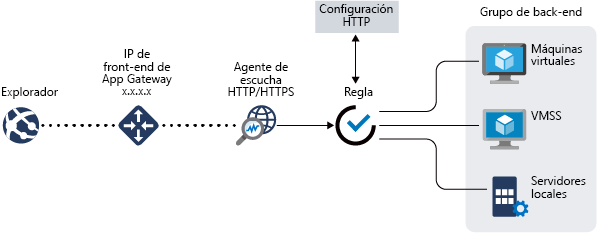
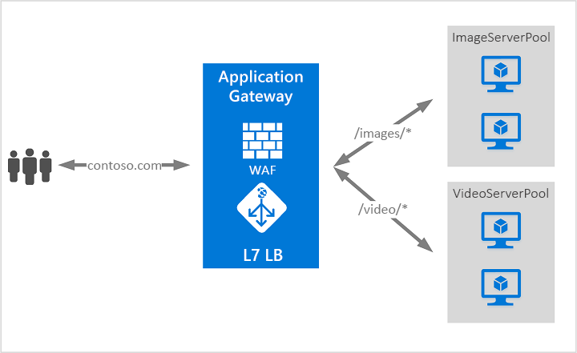

# ¿Qué es Azure Application Gateway?

Azure Application Gateway es un equilibrador de carga de tráfico web que permite administrar el tráfico a las aplicaciones web. Los equilibradores de carga tradicionales operan en la capa de transporte (OSI capa 4: TCP y UDP) y enrutan el tráfico en función de la dirección IP y puerto de origen a una dirección IP y puerto de destino.

Con Application Gateway puede tomar decisiones de enrutamiento basadas en atributos adicionales de una solicitud HTTP, como los encabezados de host o la ruta de acceso del URI. Por ejemplo, puede enrutar el tráfico en función de la dirección URL entrante. Por lo que si `/images` se encuentra en la dirección URL entrante, puede redirigir el tráfico a un conjunto específico de servidores (conocido como un grupo) configurados para imágenes. Si `/video` se encuentra en la dirección URL, el tráfico se enruta a otro grupo optimizado para vídeos.

Este tipo de enrutamiento se conoce como equilibrio de carga de capa de aplicación (OSI capa 7). Azure Application Gateway puede hacer enrutamiento basado en dirección URL y mucho más.

>[!NOTE]
> Azure ofrece un conjunto de soluciones de equilibrio de carga completamente administradas para sus escenarios. Si necesita un equilibrio de carga de la capa 4 de alto rendimiento y baja latencia, consulte [¿Qué es Azure Load Balancer?](../load-balancer/load-balancer-overview.md) Si busca el equilibrio de carga de DNS global, consulte [¿Qué es Traffic Manager?](../traffic-manager/traffic-manager-overview.md) Los escenarios de un extremo a otro pueden beneficiarse de la combinación de estas soluciones.
>
> Si desea ver una comparación de las distintas opciones de equilibrio de carga de Azure, consulte [Información general sobre las opciones de equilibrio de carga en Azure](https://docs.microsoft.com/azure/architecture/guide/technology-choices/load-balancing-overview).

Las siguientes características se incluyen con Azure Application Gateway:

## Terminación de la Capa de sockets seguros (SSL)

Application Gateway admite la terminación SSL/TLS en la puerta de enlace, tras lo cual el tráfico fluye normalmente sin cifrar a los servidores back-end. Esta característica permite a los servidores web liberarse de la costosa sobrecarga de cifrado y descifrado. Sin embargo, en algunas ocasiones, la comunicación sin cifrar con los servidores no es una opción aceptable. Esto podría deberse a los requisitos de seguridad y cumplimiento normativo, o bien a la posibilidad de que la aplicación solo acepte una conexión segura. Para estas aplicaciones, Application Gateway admite el cifrado SSL/TLS de un extremo a otro.

## Escalado automático

Las implementaciones de Application Gateway o WAF de la versión Standard_v2 o WAF_v2 del SKU admiten el escalado o la reducción verticales en función de los cambiantes patrones de la carga de tráfico. La escalabilidad automática también elimina el requisito de tener elegir un tamaño de implementación o un número de instancias durante el aprovisionamiento. Para más información sobre las características de las versiones WAF_v2 y standard_v2 de Application Gateway, consulte el artículo sobre el [Escalado automático de la versión 2 del SKU](application-gateway-autoscaling-zone-redundant.md).

## Redundancia de zona

Las implementaciones de Application Gateway o WAF de las versiones Standard_v2 o WAF_v2 del SKU pueden abarcar varias zonas de disponibilidad para ofrecer una mejor resistencia a errores y eliminar la necesidad de aprovisionar las puertas de enlace de aplicaciones independientes en cada zona.

## IP virtual estática

La puerta de enlace de aplicaciones de IP virtual de la versión Standard_v2 o WAF_v2 del SKU solo admite tipos de IP virtual estáticos. Con esto se garantiza que la IP virtual asociada a la puerta de enlace de aplicaciones no cambia durante la vigencia de Application Gateway.

## Firewall de aplicaciones web

El firewall de aplicaciones web (WAF) es un servicio que ofrece una protección centralizada de las aplicaciones web contra las vulnerabilidades de seguridad más habituales. Firewall de aplicaciones web se basa en las reglas contenidas en el [conjunto de reglas básicas de OWASP (Open Web Application Security Project)](https://www.owasp.org/index.php/Category:OWASP_ModSecurity_Core_Rule_Set_Project) 3.1 (solo WAF_v2), 3.0 y 2.2.9. 

Las aplicaciones web son cada vez más los objetivos de ataques malintencionados que aprovechan vulnerabilidades comunes conocidas, como ataques por inyección de código SQL o ataques de scripts de sitios, por nombrar unos pocos. Impedir tales ataques en el código de aplicación puede ser un verdadero desafío y requerir tareas rigurosas de mantenimiento, aplicación de revisiones y supervisión en varias capas de la topología de aplicación. Un firewall de aplicaciones web centralizado facilita enormemente la administración de la seguridad y proporciona mayor protección a los administradores de la aplicación frente a amenazas o intrusiones. Las soluciones de WAF también pueden reaccionar más rápido ante una amenaza de la seguridad aplicando revisiones que aborden una vulnerabilidad conocida en una ubicación central en lugar de proteger cada una de las aplicaciones web por separado. Las puertas de enlace de aplicaciones existentes pueden transformarse rápidamente en puertas de enlace con un firewall de aplicaciones web habilitado.

Para más información, consulte [¿Qué es el firewall de aplicaciones web?](../web-application-firewall/overview.md)

## Controlador de entrada para AKS
El controlador de entrada de Application Gateway (AGIC) le permite utilizar Application Gateway como entrada para un clúster de [Azure Kubernetes Service (AKS)](https://azure.microsoft.com/services/kubernetes-service/). 

El controlador de entrada se ejecuta como un pod en el clúster de AKS y consume [recursos de entrada de Kubernetes](https://kubernetes.io/docs/concepts/services-networking/ingress/) y los convierte en una configuración de Application Gateway que permite a la puerta de enlace equilibrar la carga de tráfico en los pods de Kubernetes. El controlador de entrada solo admite las SKU de Application Gateway Standard_v2 y WAF_v2. 

Para más información, consulte [Application Gateway Ingress Controller](ingress-controller-overview.md) (Controlador de entrada de Azure Application Gateway).

## Enrutamiento basado en dirección URL

El enrutamiento basado en URL le permite enrutar el tráfico a los grupos de servidores back-end en función de las direcciones URL de la solicitud. Uno de los escenarios podría ser enrutar las solicitudes de diferentes tipos de contenido a otro grupo diferente.

Por ejemplo, las solicitudes para `http://contoso.com/video/*` se enrutan a VideoServerPool y para `http://contoso.com/images/*` se enrutan a ImageServerPool. DefaultServerPool se selecciona si ninguno de los patrones de ruta de acceso coincide.

Para obtener más información, consulte [enrutamiento basado en la dirección URL con Application Gateway](https://docs.microsoft.com/azure/application-gateway/url-route-overview).

## Hospedaje de varios sitios

El hospedaje de varios sitios permite configurar más de un sitio web en la misma instancia de la puerta de enlace de aplicaciones. Esta característica permite configurar una topología más eficaz para las implementaciones al agregar hasta 100 sitios web a una sola puerta de enlace de aplicaciones, o 40 para WAF (para un rendimiento óptimo). Cada sitio web se puede dirigir a su propio grupo. Por ejemplo, la puerta de enlace de aplicaciones puede atender el tráfico para `contoso.com` y `fabrikam.com` desde dos grupos de servidores denominados ContosoServerPool y FabrikamServerPool.

Las solicitudes para `http://contoso.com` se enrutan a ContosoServerPool y para `http://fabrikam.com` se enrutan a FabrikamServerPool.

De forma similar, dos subdominios del mismo dominio primario pueden hospedarse en la misma implementación de la puerta de enlace de aplicaciones. Ejemplos del uso de subdominios podrían incluir `http://blog.contoso.com` y `http://app.contoso.com` hospedados en una única implementación de la puerta de enlace de aplicaciones.

Para más información, consulte [Hospedaje de varios sitios de Application Gateway](https://docs.microsoft.com/azure/application-gateway/multiple-site-overview).

## Redireccionamiento

Un escenario común para muchas aplicaciones web es admitir el redireccionamiento automático de HTTP a HTTPS para asegurarse de que toda la comunicación entre la aplicación y sus usuarios se produce a través de una ruta de acceso cifrada.

En el pasado podría haber utilizado técnicas como la creación de un grupo dedicado cuya única finalidad sería redirigir las solicitudes que recibe de HTTP a HTTPS. Application Gateway admite la posibilidad de redirigir el tráfico en la puerta de enlace de aplicaciones. Esto simplifica la configuración de la aplicación, optimiza el uso de recursos y admite nuevos escenarios de redireccionamiento que incluyen el global y el redireccionamiento basado en la ruta de acceso. La compatibilidad del redireccionamiento de Application Gateway no se limita solo al redireccionamiento de HTTP a HTTPS. Se trata de un mecanismo de redireccionamiento genérico, por lo que puede redirigir desde y hacia cualquier puerto que defina mediante reglas. También admite la redirección a un sitio externo.

La compatibilidad con la redirección de Application Gateway ofrece las siguientes funcionalidades:

- Redireccionamiento global de un puerto a otro puerto en la puerta de enlace. Permite la redirección de HTTP a HTTPS en un sitio.
- Redirección basada en la ruta de acceso. Este tipo de redireccionamiento permite el redireccionamiento de HTTP a HTTPS solamente para un área de un sitio específico, por ejemplo un área de carro de la compra que se indica mediante `/cart/*`.
- Redireccionamiento a un sitio externo

Para más información, consulte [Introducción a la redirección de Application Gateway](https://docs.microsoft.com/azure/application-gateway/redirect-overview).

## Afinidad de sesión

La característica de afinidad de sesión basada en cookies es útil cuando se quiere mantener una sesión de usuario en el mismo servidor. Mediante el uso de cookies administradas por la puerta de enlace, Application Gateway puede dirigir el tráfico posterior de una sesión de usuario hasta el mismo servidor para su procesamiento. Esto es importante en aquellos casos en los que se guarda el estado de la sesión de forma local en el servidor para una sesión de usuario.

## Tráfico de Websocket y HTTP/2

Application Gateway proporciona compatibilidad nativa con los protocolos Websocket y HTTP/2. No hay ninguna opción de configuración que permita al usuario habilitar o deshabilitar la compatibilidad con WebSocket.

Los protocolos WebSocket y HTTP/2 permiten una comunicación dúplex completa entre un servidor y un cliente a través de una conexión TCP de larga duración. Esto permite una comunicación más interactiva entre el servidor web y el cliente, que puede ser bidireccional sin necesidad de realizar sondeos como en las implementaciones basadas en HTTP. Estos protocolos tienen, a diferencia de HTTP, una sobrecarga reducida y pueden reutilizar la misma conexión TCP para varias solicitudes y respuestas, con lo que se utilizan los recursos de una manera más eficaz. Estos protocolos están diseñados para utilizarse a través de los puertos HTTP tradicionales 80 y 443.

Para más información, consulte [Compatibilidad con WebSocket
](https://docs.microsoft.com/azure/application-gateway/application-gateway-websocket) y [Compatibilidad con HTTP/2](https://docs.microsoft.com/azure/application-gateway/configuration-overview#http2-support).

## Purga de la conexión

La purga de conexión ayuda a lograr la correcta eliminación de miembros del grupo de back-end durante las actualizaciones de servicio planeadas. Esta configuración se habilita a través de la configuración de http de back-end y se puede aplicar a todos los miembros de un grupo de back-end durante la creación de reglas. Una vez habilitado, Application Gateway garantiza que las instancias de anulación de registro de un grupo de back-end no reciben solicitudes nuevas y se permite que las solicitudes existentes se completen en un límite de tiempo configurado. Esto se aplica a las dos instancias de back-end que se quitan explícitamente del grupo de back-end mediante un cambio en la configuración del usuario y las instancias de back-end que se notifican como incorrectas según determinan los sondeos de estado. La única excepción a esto son las solicitudes enlazadas para las instancias de cancelación del registro, que se han eliminado explícitamente, debido a la afinidad de la sesión administrada por la puerta de enlace y seguirán siendo procesadas por el proxy hasta las instancias de cancelación del registro.

Para más información, consulte la sección Purga de la conexión de [Introducción a la configuración de Application Gateway](https://docs.microsoft.com/azure/application-gateway/configuration-overview#connection-draining).

## Páginas de error personalizadas

Application Gateway permite crear páginas de error personalizadas, en lugar de mostrar las páginas de error predeterminadas. Mediante una página de error personalizada puede usar su propia marca y diseño.

Para obtener más información, consulte [Errores personalizados](custom-error.md).

## Reescritura de encabezados HTTP

Los encabezados HTTP permiten que el cliente y el servidor pasen información adicional con la solicitud o la respuesta. Volver a escribir estos encabezados HTTP le permitirá lograr varios escenarios importantes, como:

- Agregar campos de encabezado relacionados con la seguridad como HSTS/X-XSS-Protection.
- Quitar campos de encabezado de respuesta que pueden revelar información confidencial.
- Eliminar información del puerto desde los encabezados X-Forwarded-For.

Application Gateway admite la funcionalidad para agregar, quitar o actualizar los encabezados HTTP de solicitud y respuesta, mientras los paquetes de solicitud y respuesta se mueven entre los grupos de back-end y de cliente. También proporciona la funcionalidad para agregar condiciones a fin de asegurarse de que los encabezados especificados se vuelven a escribir solo cuando se cumplen ciertas condiciones.

Para más información, consulte el artículo sobre la [Reescritura de encabezados HTTP](rewrite-http-headers.md).

## Ajuste de tamaño

Las versiones Standard_v2 y WAF_v2 del SKU de Application Gateway se pueden configurar para las implementaciones de tamaño fijo o de escalabilidad automática. Estas SKU no ofrecen tamaños de instancia diferentes. Para más información sobre el rendimiento y los precios de v2, consulte [SKU de escalado automático v2](https://docs.microsoft.com/azure/application-gateway/application-gateway-autoscaling-zone-redundant#pricing).

Las versiones Standard y WAF del SKU de Application Gateway se ofrecen en tres tamaños: **pequeño**, **mediano** y **grande**. Tamaños pequeños de instancia están pensados para escenarios de desarrollo y pruebas.

Para ver una lista completa de los límites de la puerta de enlace de aplicaciones, consulte el tema sobre los [límites de servicio de Application Gateway](../azure-resource-manager/management/azure-subscription-service-limits.md?toc=%2fazure%2fapplication-gateway%2ftoc.json#application-gateway-limits).

En la tabla siguiente se muestra un promedio del rendimiento para cada instancia de puerta de enlace de aplicaciones v1 con descarga SSL habilitada:

| Tamaño de respuesta medio de página de back-end | Pequeña | Media | grande |
| --- | --- | --- | --- |
| 6 KB |7,5 Mbps |13 Mbps |50 Mbps |
| 100 KB |35 Mbps |100 Mbps |200 Mbps |

> [!NOTE]
> Se trata de valores aproximados para un rendimiento de puerta de enlace de aplicaciones. El rendimiento real depende de varios detalles del entorno, como el tamaño medio de página, la ubicación de las instancias de back-end y el tiempo de procesamiento para proporcionar una página. Para los números de rendimiento exactos, debe ejecutar sus propias pruebas. Estos valores solo se proporcionan para obtener instrucciones de planeamiento de capacidad.

## Pasos siguientes

Según los requisitos y el entorno, puede crear una puerta de enlace de aplicaciones de prueba mediante Azure Portal, Azure PowerShell o la CLI de Azure:

- [Inicio rápido: Dirección del tráfico web con Azure Application Gateway: Azure Portal](quick-create-portal.md)
- [Inicio rápido: Dirección del tráfico web con Azure Application Gateway: Azure PowerShell](quick-create-powershell.md)
- [Inicio rápido: Dirección del tráfico web con Azure Application Gateway: CLI de Azure](quick-create-cli.md)
